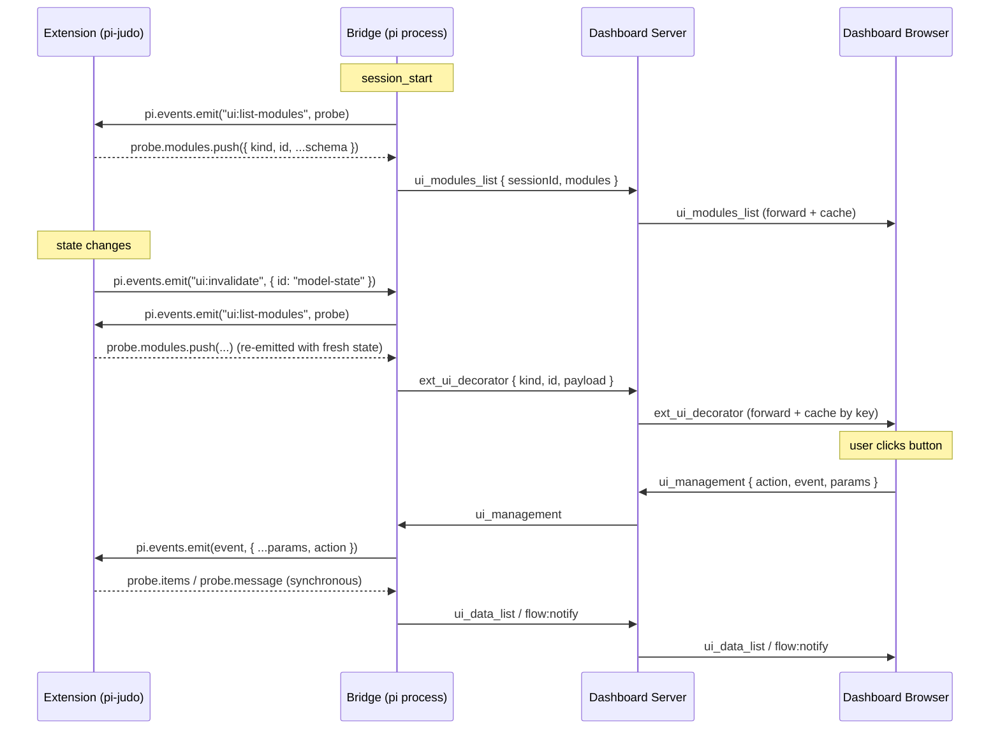

## Context

The dashboard currently surfaces extension UIs through three independent mechanisms:

| Mechanism | Where | Coverage |
|---|---|---|
| `extension_ui_request` / PromptBus | `packages/extension/src/prompt-bus.ts` | One-shot dialogs (`confirm`, `select`, `input`, `multiselect`, `editor`, `notify`) |
| `event_forward` catch-all | `packages/extension/src/bridge.ts:657` | Forwards every `pi.events.emit(channel, data)` blindly; consumers must know each channel |
| Per-extension React components | `FlowAgentCard`, `FlowDashboard`, `ChatView`, etc. | Hard-coded to specific extensions (pi-flows, ask_user) |

Pi-judo and similar extensions register additional TUI surfaces that the dashboard cannot render: `flow:register-card` (custom metric line), `flow:register-footer-segment`, `flow:register-workflow` (pipeline breadcrumb), `flow:register-gate` (flow availability), `ctx.ui.custom` (raw pi-tui overlay). Each represents a per-extension demand for a per-dashboard-spec response. As more extensions ship, the per-feature React component count grows linearly with the cross product of extensions × surface kinds.

PR #15 (`feat: implement Generalized Extension UI System (Hybrid Schema)`) prototyped a schema-driven, pull-discovered modal slot. That branch is stale (537 files / ~50k deletions vs `develop`) and bundles unrelated work (ragger integration). It is not being merged; instead, its **mechanism choices** are validated and adopted in this design, and the **slot taxonomy is extended** to cover the live-decoration use cases PR #15 does not address.

## Goals / Non-Goals

**Goals**

- Extensions describe UIs as serializable data; dashboard renders them in a bounded set of named slots.
- One discovery primitive (a probe event) covers all slot kinds.
- Extensions remain pi-runnable when no dashboard is connected; descriptors are inert in pure-pi mode.
- Adding a new slot kind is a typed payload addition, not a per-extension change.
- Existing extensions migrate with explicit, opt-in two-line additions next to existing TUI registrations.
- Server caches descriptor state and replays on browser subscribe so reconnect works.

**Non-Goals**

- Replacing the existing `interactive-ui-dialogs` / `ui-proxy` / PromptBus paths. Those continue to handle `ctx.ui.*` dialogs.
- Loading extension-authored React or JS bundles in the browser. Descriptors are data only; rendering logic ships in the dashboard.
- Replacing TUI rendering. Extensions continue to register TUI widgets via `pi-tui` / `pi-flows` directly. The new system is parallel and dashboard-only.
- Auto-mirroring `flow:register-*` channels into dashboard descriptors. Migration is explicit, not magical.
- Shipping an `@blackbelt-technology/pi-dashboard-sdk` package. Types alone in `pi-dashboard-shared` are sufficient; no runtime API.

## Architecture



```
   Phase 1 surfaces                  Phase 2 surfaces
   ─────────────────                 ─────────────────
   ┌──────────────────────┐          ┌──────────────────────┐
   │ slash command typed  │          │ session header       │ ← footer-segment
   │ ──► modal opens      │          │ flow agent card      │ ← agent-metric
   │ ──► table | form     │          │ flow dashboard top   │ ← breadcrumb
   │ ──► action click     │          │ flow launcher item   │ ← gate
   │ ──► event back       │          │ toast tray           │ ← toast
   └──────────────────────┘          └──────────────────────┘
```

## Decisions

### 1. Discovery: pull-based probe (not push-registration)

Bridge emits `ui:list-modules` on session start (and on `ui:invalidate`). Extensions listen and push their schema into the probe's `modules` array.

```ts
// inside an extension
pi.events.on("ui:list-modules", (data) => {
  data.modules.push({ kind: "management-modal", id: "judo-status", ... });
  data.modules.push({ kind: "footer-segment", id: "model-state", ... });
});
```

**Why pull, not push?**
- Reconnect handling is automatic — the bridge re-probes after every reconnect; extensions don't track bridge state.
- No package dependency — extensions only need `pi.events` (already available); they never `import` an SDK.
- Idempotent — extensions can register the same listener twice without state corruption; latest probe wins.
- Matches existing pi-events patterns (`flow:list-flows`, `flow:list-workflows`) used elsewhere.

This is the single most important decision lifted from PR #15.

### 2. Closure timing: invalidate-only

Live descriptors that depend on extension state include a `render` field that returns a string or a small object. The bridge does **not** poll. The bridge re-probes only when:

- `session_start` fires (initial state)
- The extension emits `pi.events.emit("ui:invalidate", { id })` (state changed)
- A browser reconnects and the server replays cached state (no extension involvement needed)

Extensions that forget to invalidate render stale data — same contract as `pi-tui`'s `onRegistered(invalidate)` callback. This matches established practice.

### 3. Slot taxonomy

Frozen for v0.x. Adding a kind is additive and minor. Removing a kind is a major break.

| Kind | Phase | Placement | Lifetime | Has closure? |
|---|---|---|---|---|
| `management-modal` | 1 | Modal triggered by slash command | Persistent | No (table data fetched on open) |
| `footer-segment` | 2 | Session header, right of git info | Persistent | Yes — `render() → string` |
| `agent-metric` | 2 | Below `FlowAgentCard` | Per-agent | Yes — `render() → string` |
| `breadcrumb` | 2 | Top of `FlowDashboard` | Persistent | No (snapshot, re-emit on change) |
| `gate` | 2 | Inline in `FlowLaunchDialog` items | Persistent | No (snapshot) |
| `toast` | 2 | Toast tray, top-right | One-shot | No |
| `settings-section` | 2 | Settings page, below core sections | Persistent | No (form values managed by RJSF/UiField + persisted via `plugins.<namespace>.*`) |
| `rjsf-form` | 4 | Modal (alternative to `management-modal` form view) | One-shot | N/A |

Phase 1 is the one PR #15 already implements (modulo rebase and consolidation). Phase 2 is the work this proposal motivates.

### 4. Wire protocol

**Phase 1** (compatible with PR #15 message names, kept for migration cost):

```ts
// extension → server → browser
{ type: "ui_modules_list", sessionId, modules: ExtensionUiModule[] }
{ type: "ui_data_list", sessionId, event: string, items: unknown[] }

// browser → server → extension
{ type: "ui_management", sessionId, action: "list" | string, event: string, params?: Record<string, unknown> }
```

**Phase 2** (single-union for all live decorations):

```ts
{
  type: "ext_ui_decorator",
  sessionId,
  kind: "footer-segment" | "agent-metric" | "breadcrumb" | "gate" | "toast",
  namespace: string,
  id: string,
  payload: KindPayload,  // typed per kind
  // optional, used by client to remove descriptor:
  removed?: boolean
}
```

**Why single-union for Phase 2 but per-kind for Phase 1?**

Phase 1 is largely already-implemented in PR #15 with its existing 3 message types. Rewriting them to a union for the modal slot has no functional benefit — there is exactly one client handler per message type and one was already shipped in the prototype. Phase 2 ships ≥5 kinds in one batch; making the protocol pay for that with 5 new message types is wasteful. The two protocol shapes coexist without ambiguity (different `type` values).

### 5. Server-cached replay

State is stored as fields on the `Session` record (consistent with how `commands`, `models`, `flows`, `gitBranch` already live there) so cleanup is automatic when the session is deleted:

- `session.uiModules?: ExtensionUiModule[]` (Phase 1)
- `session.uiDataMap?: Record<string, unknown[]>` keyed by `dataEvent` name (Phase 1)
- `session.uiDecorators?: Record<string, DecoratorDescriptor>` keyed by `${kind}:${namespace}:${id}` (Phase 2)

On browser subscribe, the handler replays all three before forwarding live messages. On extension-emitted `removed: true` decorator, the corresponding entry is deleted from `session.uiDecorators` and the removal is forwarded to subscribers.

The implementation should mirror the existing `replayPendingUiRequests(ws, sessionId)` hook called inside `handleSubscribe` (added by the PromptBus system); a parallel `replayUiState(ws, sessionId)` invoked at the same site, after the event-replay batches complete, applies the same pattern to module schemas and decorator descriptors. Session deletion already removes the record (and therefore the caches); no extra cleanup is required.

**Origin of this approach.** PR #15 already used `Session.uiModules` / `uiDataMap` as the storage location and `handleSubscribe` as the replay site (`packages/server/src/browser-handlers/subscription-handler.ts:73–84` in that branch). Phase 1 implementation should retain those exact field names; Phase 2 extends the model with `uiDecorators`.

### 6. Namespacing and collision

Modules carry `id`. To avoid collisions when multiple extensions push to the same probe, each module also carries a `namespace` (Phase 2; Phase 1 retains PR #15's `id`-only convention with a collision warning).

```ts
{ kind: "footer-segment", namespace: "judo", id: "model-state", ... }
```

The bridge logs a warning and last-write-wins on `(namespace, id)` collision within a single probe. Cross-extension collision on `id` alone (without namespace) is rare in practice; cross-namespace collision requires intentional coordination.

### 7. No-dashboard fallback

When no bridge is connected:

- `ui:list-modules` is never emitted (no probe). Extension listeners are dormant.
- `pi.events.emit("ui:invalidate", ...)` is a no-op (the bridge that would handle it isn't there).
- Slash commands fall back to their existing text-based behavior.
- `ctx.ui.custom` continues to work in TUI; Phase 4 RJSF forms must declare a fallback strategy (`"ctx-ui" | "defaults" | "reject"`).

The fallback is structural: nothing changes in pure-pi behavior because the SDK has no runtime presence outside the bridge probe.

### 8. RJSF: Phase 4, forms-only

Phase 4 introduces an `rjsf-form` view type within `management-modal` (and possibly elsewhere). The schema is `JSONSchema7`. The dashboard ships a Tailwind-themed RJSF renderer. RJSF is **not** used for cards, breadcrumbs, or footer segments — those use bounded descriptors with strict shapes and no schema validation. RJSF is the escape hatch for "anything richer than a fixed `UiField` form."

Bundle cost: ~150–200 KB minified. Acceptable for a dashboard target. Loaded eagerly only if any module in the active session declares `rjsf-form`; otherwise lazy-imported on demand.

### 9. Migration story

For pi-judo (external repo, separate change):

1. **Phase 1** — Convert `/judo:status` from text-output to a `management-modal`. Two-line addition next to existing TUI handler:

   ```ts
   pi.events.on("ui:list-modules", (data) => {
     data.modules.push({ kind: "management-modal", id: "judo-status", command: "/judo:status", ... });
   });
   pi.events.on("ui:get-data", (data) => {
     if (data.event === "judo:status-rows") data.items = computeStatusRows();
   });
   ```

2. **Phase 2** — Add `footer-segment` and `agent-metric` decorators alongside existing `flow:register-footer-segment` / `flow:register-card` calls. Same data, two surfaces.

3. **Phase 3** — pi-flows adopts the system. pi-judo's existing `flow:register-workflow` and `flow:register-gate` registrations are now mirrored to dashboard automatically. No additional pi-judo code needed.

4. **Phase 4** — Replace `ctx.ui.custom` save/discard gate with `rjsf-form`.

For pi-flows (external repo, separate change in Phase 3):

- pi-flows listens for `ui:list-modules` and pushes one descriptor per:
  - registered workflow → `kind: "breadcrumb"` (steps from `WorkflowDefinition`, current from `FlowState`)
  - registered gate → `kind: "gate"` (`flowId`, `available`, `reason`)
  - registered card with `renderMetric()` → `kind: "agent-metric"` (`agentId`, `render`)
- pi-flows ticks `ui:invalidate` on its existing internal change signals (`flow:rediscover`, agent state change, gate state change).

After Phase 3, every flow-using extension automatically gets dashboard rendering for these three kinds without per-extension dashboard work.

### 10. Lessons from PR #15

| PR #15 choice | Verdict | Reason |
|---|---|---|
| `ui:list-modules` pull discovery | **Adopt** | Right primitive; reconnect-friendly; no SDK dep. |
| Slash command as modal trigger | **Adopt** | Elegant, leverages existing command vocab. |
| Bespoke `UiField` schema (text/number/boolean/select/code/datetime/textarea) | **Adopt for Phase 1** | Sufficient for management UIs; RJSF deferred to Phase 4. |
| Module `id` as namespace | **Tighten in Phase 2** | Add explicit `namespace` field; warn on collision. |
| Three per-feature messages (`ui_modules_list`, `ui_data_list`, `ui_management`) | **Keep as-is** | Already shipped; no functional benefit to rewriting. |
| Single placement (modal) | **Extend** | Phase 2 adds five live-decoration slots. |
| `window.confirm()` for action confirmation | **Replace** | Phase 1 implementation should use the existing `DialogPortal`-based confirm dialog; small polish. |
| Cache state stored on `Session` record (`uiModules`, `uiDataMap`) | **Adopt** | Idiomatic — matches `commands`/`models`/`flows`/`gitBranch`. Automatic cleanup on session delete. |
| Replay site = `handleSubscribe` in `subscription-handler.ts:73–84` | **Adopt** | Same site PromptBus replay already uses; one consistent code path. |
| MDI icons via `@mdi/js` | **Adopt** | Match PR #15; constrains icon vocabulary to one set. |
| Bundling ragger consumer in same PR | **Reject** | Ragger ships as its own follow-up change after this design lands. |

## Resolved Open Questions

All review-phase questions resolved. Decisions canonical below; preserved with original numbering for traceability.

1. **Footer-segment placement.** **Resolved: `SessionHeader`, right of git info.** Symmetric with existing decorations; high visibility; one strip per session, not per workspace.

2. **Toast deduplication.** **Resolved: no dedupe; stack each toast.** Predictable; matches Slack/VS Code; extensions are responsible for their own throttling.

3. **Action confirmation polish.** **Resolved: Tailwind `ConfirmDialog` (existing `DialogPortal`-based component) ships in the same change as the modal slot.** Consistent with the rest of the dashboard; ~20 LOC delta.

4. **Icon vocabulary.** **Resolved: MDI only (`@mdi/js`).** Predictable look; no XSS surface; PR #15's choice; ~7000 icons available.

5. **Decorator dispose semantics.** **Resolved: explicit `removed: true` payload.** Discoverable in code; impossible to remove by accident; one-line API. Diffing is rejected as too magical.

6. **pi-flows adoption: which kind is the load-bearing test?** **Resolved: `breadcrumb`.** Snapshot-only (no closures); covers `flow:register-workflow`; visually distinctive validation that the pipe works end-to-end before riskier kinds (e.g. `agent-metric` with live closures) are integrated.

7. **pi-judo's save/discard gate.** **Resolved: defer to Phase 4 `rjsf-form`.** `ctx.ui.custom` keeps working in TUI until then; cleaner than a bespoke 2-button form via Phase 1; no dual maintenance window.

8. **Ragger's richer view types (`search`, `metrics`, `detail`).** **Resolved: separate follow-up change `add-extension-ui-rich-views` after Phase 1 lands.** Phase 1 stays minimal at `table | grid | form`; ragger gets workspace-CRUD immediately and richer views on a second iteration. Avoids inflating the Phase 1 surface.

## Phase-1 Coverage Validation

This section captures the result of Task 1.4 (`tasks.md` §1.4): validating that Phase 1 covers ragger's original workspace-CRUD motivator.

| Ragger feature | Phase 1 view type | Covered? |
|---|---|---|
| List workspaces | `table` with row actions (delete, configure) | ✅ |
| Add/edit workspace | `form` with text/select/textarea fields | ✅ |
| Delete with confirmation | `UiAction.confirm` field | ✅ |
| Search across chunks | `search` (NOT in Phase 1) | ❌ → follow-up |
| Workspace stats / metrics | `metrics` (NOT in Phase 1) | ❌ → follow-up |
| Workspace detail page | `detail` (NOT in Phase 1) | ❌ → follow-up |

**Conclusion:** Phase 1 fully covers ragger's *workspace-CRUD* surface. Ragger's richer views (search, metrics, detail) are beyond Phase 1's scope and tracked as Open Question §8 above.

## Versioning

- Schema types live in `@blackbelt-technology/pi-dashboard-shared`; this package's existing SemVer governs.
- Adding fields to descriptors: minor. Adding kinds: minor. Removing fields or kinds: major.
- Phase 1 ships in 0.x. We do not promise stability until at least one external extension (pi-judo) has shipped Phase 1 + Phase 2 in production.

## Out-of-Scope Explicitly

- Loading extension-authored React or JS bundles in the browser (`<iframe>`, `<script>`, or webview-style). The bounded slot taxonomy + RJSF escape hatch covers our known use cases. Webview-style extension UIs are a separate, much larger architectural step that this proposal explicitly defers.
- Mirroring TUI registrations from `pi-flows` automatically into dashboard descriptors. Migration is explicit (Phase 3 in pi-flows itself).
- Replacing the existing `tool-renderers` registry. Tool result rendering remains a separate dashboard-internal concern.
- Replacing the `interactive-ui-dialogs` capability. `ctx.ui.*` continues to flow through PromptBus; the new system handles different, complementary UIs.
