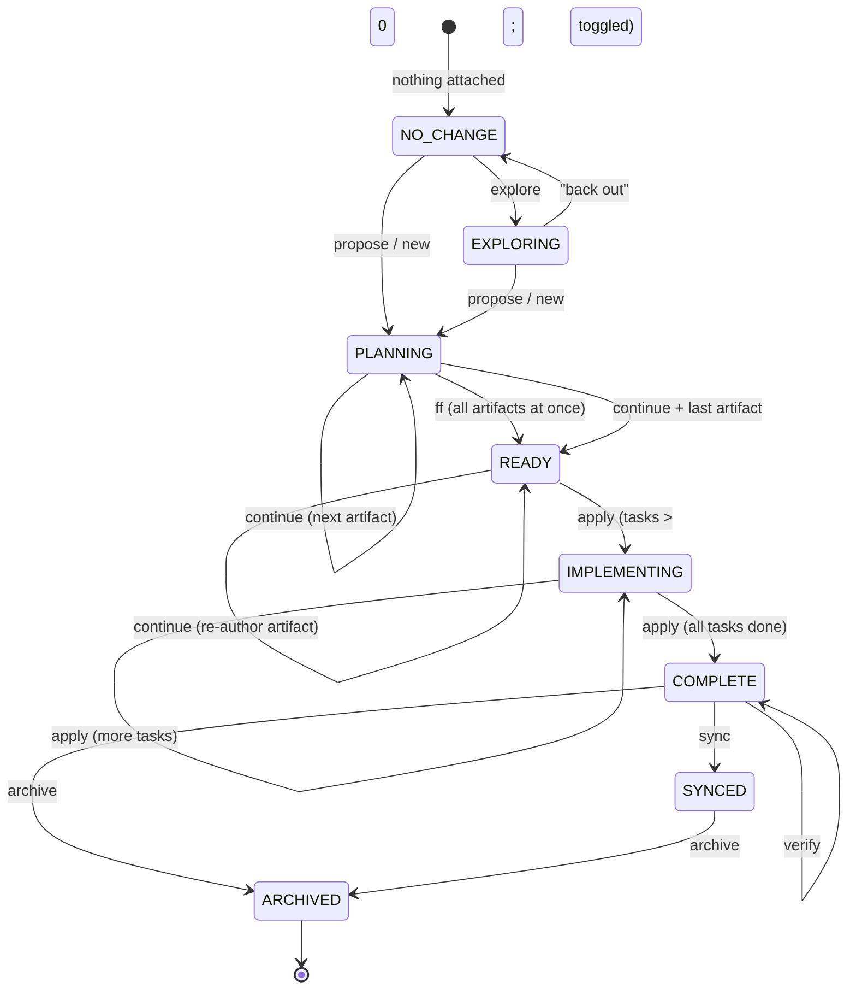

# OpenSpec workflow — state-and-action diagram

Reference for the **config-driven stepper / action-button** redesign (follow-up to `redesign-session-card-and-composer`).

Source: <https://github.com/Fission-AI/OpenSpec/blob/main/docs/workflows.md> +
`openspec config list --json` output.

## 1. Available workflow commands

`openspec config list --json` returns:

```json
{
  "profile": "core" | "expanded" | "custom",
  "delivery": "skills" | "commands" | "both",
  "workflows": [
    "propose", "explore", "new", "continue", "ff",
    "apply", "verify", "sync", "archive",
    "bulk-archive", "onboard"
  ]
}
```

The `workflows` array is the **single source of truth** — only commands listed there are enabled for this user. Default profiles:

| Profile     | Workflows                                                                                       |
| ----------- | ----------------------------------------------------------------------------------------------- |
| `core`      | `propose`, `explore`, `apply`, `sync`, `archive`                                                |
| `expanded`  | adds `new`, `continue`, `ff`, `verify`, `bulk-archive`, `onboard` on top of core                |
| `custom`    | user-picked subset                                                                              |

## 2. Command → purpose → UI surface

| Command       | Purpose                                                  | Stepper node           | Action button                |
| ------------- | -------------------------------------------------------- | ---------------------- | ---------------------------- |
| `explore`     | Think through ideas before committing                    | **Explore**            | `Explore`                    |
| `propose`     | Create change + all planning artifacts in one shot       | drives P/D/S/T → done  | `+ Change` (propose mode)    |
| `new`         | Start scaffold (empty change dir)                        | Proposal current       | `+ Change` (new mode)        |
| `continue`    | Create the next artifact step-by-step                    | drives P → D → S → T   | `Continue`                   |
| `ff`          | Create all planning artifacts at once                    | drives P/D/S → done    | `FF`                         |
| `apply`       | Implement tasks                                          | **Apply**              | `Apply`                      |
| `verify`      | Validate implementation                                  | **Verify**             | `Verify`                     |
| `sync`        | Merge delta specs into main specs                        | **Sync** (new)         | `Sync` *(currently missing)* |
| `archive`     | Complete the change                                      | **Archive**            | `Archive`                    |
| `bulk-archive`| Archive multiple completed changes at once               | n/a                    | `Bulk archive`               |
| `onboard`     | Onboarding helper                                        | n/a                    | n/a *(out of card scope)*    |

## 3. Per-change state-and-action diagram

States derive from the existing `ChangeState` enum (`PLANNING / READY / IMPLEMENTING / COMPLETE`). Edges are the workflow commands. **Edge presence is gated by `config.workflows`** — if a command isn't enabled, the edge (and its driving button) disappears.



## 4. Stepper-node visibility matrix (config-gated)

A node only renders when at least one of its enabling workflows is in `config.workflows`:

| Node      | Enabling workflows                | Always-on?           |
| --------- | --------------------------------- | -------------------- |
| Explore   | `explore`                         | no (config-gated)    |
| Proposal  | `propose`, `new`, `continue`, `ff`| yes if any present   |
| Design    | `continue`, `ff`                  | yes if any present   |
| Specs     | `continue`, `ff`                  | yes if any present   |
| Tasks     | `apply`                           | yes (always)         |
| Apply     | `apply`                           | yes                  |
| Verify    | `verify`                          | no                   |
| Sync      | `sync`                            | no                   |
| Archive   | `archive`                         | yes (terminal)       |

A `core`-profile user (no `continue` / `ff` / `verify`) therefore sees:

`Explore → Proposal → Tasks → Apply → Sync → Archive` — Design/Specs/Verify collapsed.

An `expanded` user sees the full pipeline.

## 5. Action-button visibility matrix

| Button      | Visible when (in addition to the per-state gating already coded) |
| ----------- | ---------------------------------------------------------------- |
| `Explore`   | `workflows.includes("explore")`                                  |
| `+ Change`  | `workflows.includes("new") \|\| workflows.includes("propose")`   |
| `Continue`  | `workflows.includes("continue")`                                 |
| `FF`        | `workflows.includes("ff")`                                       |
| `Apply`     | `workflows.includes("apply")`                                    |
| `Verify`    | `workflows.includes("verify")`                                   |
| `Sync`      | `workflows.includes("sync")`                                     |
| `Archive`   | `workflows.includes("archive")`                                  |
| `Bulk arch` | `workflows.includes("bulk-archive") && hasCompletedChanges`      |

## 6. Delivery mode → prompt format

`config.delivery` decides which prompt prefix the buttons send:

| Delivery     | Prompt format sent via `onSendPrompt`               |
| ------------ | --------------------------------------------------- |
| `skills`     | `/skill:openspec-<command>-change <change-name>`    |
| `commands`   | `/opsx:<command> <change-name>`                     |
| `both`       | prefer `/skill:...` (current behaviour)             |

Today we hard-code `/skill:openspec-*-change` everywhere. With `delivery: "commands"` (skills disabled), every action button silently sends an unrecognized prompt. Need to read `delivery` and pick the prefix.

## 7. Implementation outline

1. **Shared**: extend `packages/shared/src/types.ts` with
   ```ts
   export interface OpenSpecConfig {
     profile: "core" | "expanded" | "custom";
     delivery: "skills" | "commands" | "both";
     workflows: string[];
   }
   ```
2. **Server**: `GET /api/openspec/config?cwd=<cwd>` runs `openspec config list --json`, caches per process (or per cwd if project config can override global). Return as `OpenSpecConfig`.
3. **Server WS**: optionally broadcast `openspec_config` push events on `openspec_refresh` so the client doesn't have to poll.
4. **Client hook**: `useOpenSpecConfig(cwd)` — fetches once on mount, refetches on `openspec_refresh`.
5. **Client**: thread `config` down into `OpenSpecStepper` + `SessionOpenSpecActions` + `ComposerSessionActions`. Gate each node + button on the matrix above.
6. **Prompt format**: helper `buildOpenSpecPrompt(command, changeName, delivery)` shared by sidecard + composer.
7. **Fallback**: when config fetch fails or hasn't arrived yet, assume the full `expanded` set (current behaviour) so nothing disappears unexpectedly.

## 8. Out of scope

- Schema-specific artifact pipelines beyond `spec-driven` (custom schemas can redefine artifact order; treat as "show whatever the change's `artifacts` array reports" — already what the stepper does for P/D/S nodes).
- `onboard` workflow integration (not a per-change action).
- Editing config from the UI (`openspec config set …`) — out of scope for this change.
