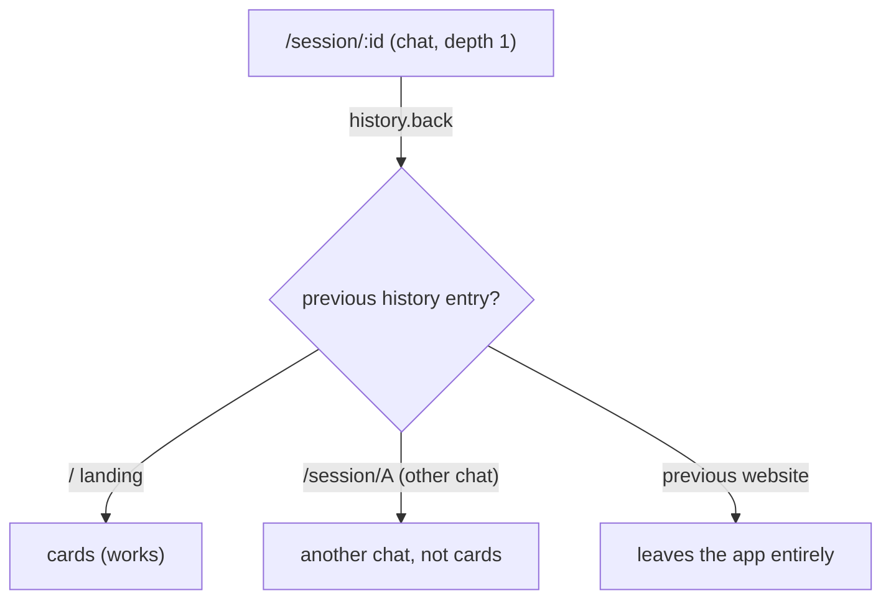

# fix-mobile-back-depth-aware

## Why

On mobile, the back-arrow and swipe-back can't return to the session-card list (depth 0) from ChatView (depth 1). Reported repro: shrink a desktop window to mobile size while a session is open, then press back — you stay in chat (or land on another chat, or leave the app) instead of reaching the cards.

Root cause: the MobileShell is **depth-based** (`getMobileDepth` derives 0=list / 1=detail / 2=overlay from the URL), but the back action is **history-based**. Both the header back-arrow (`SessionHeader`/`MobileHeader`, `App.tsx:1173 onBack={goBack}`) and swipe-back (`MobileShell` `useSwipeBack`, `App.tsx:1651`) funnel into `goBack = goBackOrHome(navigate)` → `window.history.back()`.

`window.history.back()` pops whatever URL preceded the current one — not "one depth up". On a window that has been in use, the previous entry is usually not the card list:

The `goBackOrHome` guard `window.history.length > 1` is the trap: `length > 1` does not mean the prior entry belongs to the dashboard. Classic SPA back-button bug.

## What Changes

Make mobile back **depth-aware with a hybrid history fast-path**. From the current route, compute the parent depth and return to it deterministically; use `window.history.back()` only when the entry we would land on is provably an in-app, strictly-shallower route.

### Depth-aware parent navigation (default)
- Add a pure helper `computeBackTarget(currentRoute)` that maps the active route to its parent route:
  - depth 2 (overlay: openspec preview/archive/specs, readme, pi-resources, session diff, file/url preview) → strip the overlay segment → underlying detail route (`/session/:id` or `/folder/:cwd/...`).
  - depth 1 (`/session/:id`, `/folder/:cwd/*`, `/settings`, `/tunnel-setup`) → `/` (cards).
  - depth 0 → no-op.
- `goBack` navigates to the computed parent. One back press = exactly one depth up. Never walks sibling sessions; never escapes the app.

### Hybrid history fast-path
- Browsers can't read the previous history entry's URL, so "provably in-app shallower" requires the app to track its own depth-tagged navigation stack.
- Add a lightweight in-app nav tracker: every wouter navigation appends `{ url, depth }`; a `popstate` listener keeps the stack aligned with browser back/forward.
- On back: if `stack[len-2]` exists AND its depth `<` current depth, call `window.history.back()` (preserves scroll restoration / forward entry) and pop the tracked stack; otherwise depth-navigate via `computeBackTarget`.

### Cold-load / deep-link
- When the tracked stack has no shallower predecessor (direct deep link, hard refresh), depth-navigate — same as today's `history.length===1` fallback, but now correct for every depth instead of only depth 1.

## Capabilities

### Modified Capabilities
- `url-routing`: the `Back navigation button` requirement becomes depth-aware. `goBackOrHome` replaced/extended by a depth-aware `goBack` that uses a tracked in-app nav stack to decide between a `history.back()` fast-path and explicit parent-route navigation via `computeBackTarget`. The `Mobile depth derives from route matches` requirement (route-derivation) is unchanged.

## Impact

- **Client** (`packages/client/src/`):
  - `lib/history-back.ts` — replace `goBackOrHome` with depth-aware `goBack` (or add `computeBackTarget` + keep `goBackOrHome` as the cold-load branch).
  - NEW `lib/back-target.ts` — pure `computeBackTarget(route): string | null` mapping route → parent route; unit-tested per depth.
  - NEW in-app nav tracker (hook or module): depth-tagged stack synced via wouter navigation + `popstate`.
  - `App.tsx` — `goBack` wiring at `:991` / `:1173` / `:1651` consumes the new helper; no change to the many `onBack={goBack}` call sites.
  - Tests: `computeBackTarget` per route/depth; regression for "depth 1 → cards" and "depth 2 → detail"; guard that back never lands on a sibling `/session/:id`.
- **No server / protocol / shared changes.** Pure client navigation fix.
- **Desktop unaffected**: desktop two-panel layout doesn't use `goBack` for list↔detail; only overlay back-arrows call it, and `computeBackTarget` returns their correct parent.
