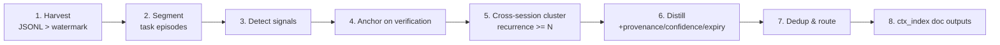

## Context

Session logs live at `~/.pi/agent/sessions/<cwd-encoded>/<ts>_<uuid>.jsonl`, one
event per line. Verified schema (sampled across 40 sessions of this project):

```
session            {type, version, id, timestamp, cwd}
model_change       {provider, modelId}
thinking_level_change {thinkingLevel}
session_info       {name}                         human-ish task label
custom             {customType, data}             e.g. web-search-results
message            {role, content[], id, parentId, timestamp}   ~94% of lines
  role=user        content: string | [text | image]
  role=assistant   content: [thinking | text | toolCall{id,name,arguments} | image]
  role=toolResult  {toolCallId, toolName, content[{type,text}], details, isError, timestamp}
```

`isError` (boolean on every toolResult) is the objective anchor. Observed tool mix
(last 40 sessions): bash 801, edit 157, read 148, write 107, browser 96,
ask_user 51, ctx_* family, web_search 16, memory 15, Agent 9, skill_manage 3.

The repo already ships the destination sinks:
- **context-mode** FTS5 KB via `ctx_index` / `ctx_search` (and real-time capture hooks).
- **memory** tool — targets user / memory / project / failure, with categories
  (failure, correction, insight, preference, convention, tool-quirk).
- **skill_manage** — procedural SKILL.md.
- **docs/** + the `faq-mine` skill pattern (subagent dispatch + dedupe + caveman style).

## Goals / Non-Goals

**Goals**
- Incremental, watermark-driven mining of this project's sessions.
- Extract five signal classes, each anchored to a verifiable outcome.
- Promote only recurring (cross-session) patterns.
- Distill into structured artifacts with provenance + confidence + expiry.
- Dedup against existing sinks; route procedures→skills, facts→memory, narratives→docs+index.

**Non-Goals**
- Honcho / Docker / pgvector / new server process (that was pi-log-miner-skill).
- Real-time tracking (context-mode hooks already do per-session capture).
- Cross-project corpus; dashboard UI.

## Signal → anchor → sink map

| Signal class | Detect | Verifiable anchor | Sink | Memory category |
|---|---|---|---|---|
| Tool-usage correction / fault | `toolResult.isError=true` → retry same tool → `isError=false` | the flip | memory | failure / tool-quirk |
| ask_user decision | `toolCall name=ask_user` + next `toolResult` | answer recorded | memory (project) | convention |
| Rule / correction | `user` msg after assistant action w/ "no/actually/don't/instead" | human correction | memory (failure) **+ patch AGENTS.md rule** | correction |
| Skill / procedure | span >5 toolCalls, one goal, verified-good end | terminal success | skill_manage | — |
| Documentation | recurring assistant summary text | cross-session frequency ≥ N | docs/ + ctx_index | — |

## Pipeline



- **Watermark**: store last-processed `max(session.timestamp)` at
  `~/.pi/agent/distill-session-knowledge/<cwd-hash>/watermark.json`. Next run filters
  `mtime`/timestamp newer than watermark. Re-runnable, idempotent.
- **Segment boundaries**: new top-level `user` message, `session_info.name` change,
  time gap > T, or detected goal shift (tool-cluster change).
- **Verification anchor**: a span is *eligible* only if it ends in a verified-good
  state — `isError` flips true→false on the same tool, OR a passing check (test/lint
  exit 0) appears, OR a user confirmation follows. Spans that never verify are dropped
  (research: unverified self-critique → rationalized false lessons).
- **Recurrence threshold N**: a distilled artifact is promoted only when its
  cluster appears in ≥ N sessions (default **N=3**; tunable). Conservative default
  favors fewer false lessons over fast learning. Clusters below threshold are held
  in a candidates file (not written), promoted automatically once a later session
  pushes the count to N.
- **Provenance/expiry**: each artifact stamps `{sessionIds, model, date, confidence}`.
  Expiry uses **confidence-decay**: confidence decreases over time / model changes unless
  the pattern keeps recurring (each fresh sighting refreshes confidence). When confidence
  decays below a floor the artifact is flagged stale for prune (no hard TTL cliff).
  Model-limitation workarounds decay fastest (lessons expire when models improve).
- **Dedup & route**: before writing, query the target sink (skill_manage view /
  memory_search / docs grep). Merge into an existing entry when matched; else create.
  Reuse the `faq-mine` subagent-dispatch + caveman-style pattern for doc writes.

## Orchestrator shape

- TypeScript, run via the skill (no dashboard dependency). Reuses the dashboard's
  existing `session-file-reader.ts` parsing if convenient, else a standalone JSONL reader.
- Stages 1–5 are deterministic code (cheap, no LLM). Stages 6–7 dispatch subagents
  (haiku-class) per cluster for distillation + dedup decision — bounded cost.
- Dry-run mode: emit a routing plan (what would be written where) without mutating
  sinks; default to dry-run, require an explicit apply flag.

## Relationship to pi-log-miner-skill

| Axis | pi-log-miner-skill (superseded) | this proposal |
|---|---|---|
| Output | per-session summaries | distilled reusable artifacts |
| Storage | new Honcho Docker + pgvector | existing skills + memory + FTS5 |
| Processing | rolling summarization, topic chunking | signal-extract + verify + recurrence |
| Cross-session | no | yes (promotion threshold) |
| Infra cost | Docker stack, model proxy | none new |
| Status | 0/75, stale 2mo | greenfield |

Retire by adding a SUPERSEDED banner to its proposal; keep the file for reference.

## Resolved decisions
- ~~Recurrence threshold default (N=2 vs N=3)?~~ **N=3** (conservative).
- ~~ask_user decision sink?~~ **project memory** (category: convention).
- ~~Expiry policy?~~ **confidence-decay** — confidence falls over time/model change,
  refreshed by fresh recurrence; below-floor artifacts flagged stale for prune.
- ~~Correction signals patch AGENTS.md?~~ **Yes, patch** the relevant AGENTS.md rule
  in addition to a `failure`/correction memory entry. Patches respect the doc protocol
  (≤200 chars/row, caveman style, delegate the docs write to a subagent) to stay within
  AGENTS.md's token budget.
