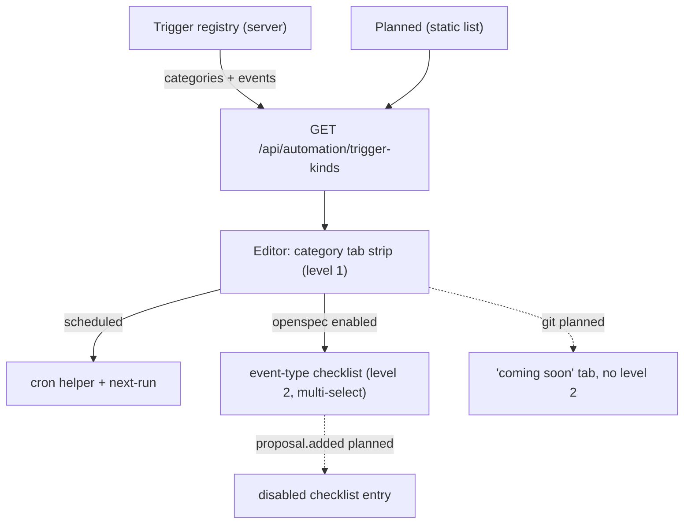

# Design — redesign-automation-editor-and-board

## Mockups (source of truth for layout)

- `design/mockup-create-dialog.html` — redesigned Create Automation editor.
- `design/mockup-content-view.html` — redesigned board / content view.

Render locally (`open <file>`); both use the dashboard dark palette so reviewers see
final look. Screenshots attach to the PR.

### Create dialog — what changed vs. current

```
CURRENT (flat 10-field column)          REDESIGN (grouped + disclosure)
────────────────────────────           ──────────────────────────────
Name                                    ┌ IDENTITY    Name · Scope(seg) ┐
Scope                                   ┌ TRIGGER     [⏰][soon][soon]   ┐
Schedule (cron)  ← raw only                          schedule helper
Action                                               + next-run preview
Prompt                                               ⌄ raw cron escape
Model  ← free text                      ┌ ACTION      Prompt|Skill seg   ┐
Mode                                                 Model = ModelSelector
Sandbox                                 ⌄ ADVANCED    Mode·Sandbox·       ┐
Concurrency                                          Concurrency·Visibility
Visibility (below fold)                              (each with hint)
```

### Board adopts the session-card design language

The board reuses the dashboard's session visual primitives so automation cards read as
siblings of session cards (`packages/client/src/lib/session-status-visuals.ts` +
`index.css` FX):

- status rail + dot palette: active/idle `green-500`, running/streaming `yellow-500`
  + pulse, error `red-500`, ended/disabled muted (`--bg-surface`);
- headless source icon (`mdiRobotOutline`) on cards — automation runs are headless spawns;
- animated barber-pole stripe overlay (`.card-stripes-fx` amber `running` variant) on a
  running card + running run row;
- neon rotating conic glow + crisp rim (`.card-glow-fx`/`.card-ring-fx`, 13s) on the
  selected card;
- all animations gated by `prefers-reduced-motion`.

The editor shares the language too: a green pulsing "armed on save" status chip in the
header and a pulsing green dot on the next-run preview (same `statusColors` green +
`animate-pulse`), so create/edit and board read as one surface.

Implementation note: reuse the existing primitives/classes rather than re-deriving colors.
The mockup inlines copies for standalone rendering; production wires the shared helpers.

### Board — what changed vs. current

```
CURRENT (two text lists)                REDESIGN (cards + nested runs)
────────────────────────               ──────────────────────────────
DEFINITIONS                             per-automation card:
  weekly-brief [folder]                   icon · name · scope · enabled
  nightly-scan [global] invalid           trigger summary · next-run · model
TRIAGE                                     last result + [view ▸]
  done   2026-…-weekly-brief               actions: Run now · Edit · Disable · ⋯
  running 2026-…-nightly-scan            RECENT RUNS table:
                                           status · runId · findings · when · link
```

## Two-level trigger taxonomy + UI seam (the key extensibility decision)

Triggers split into **event category** (level 1) → **event type(s)** (level 2, multi-select).
The on-disk format extends additively: `on.kind` = category, `on.events: string[]` =
selected types; `scheduled` keeps `on.cron` and needs no `events`. Existing
`kind: schedule` files stay valid — no migration.

```yaml
on: { kind: schedule, cron: "0 9 * * 1" }              # scheduled (unchanged)
on: { kind: openspec, events: [change.archived, change.validated] }   # multi-event
```

The picker is driven by **read-only descriptors** the server derives from the registry:

```ts
interface TriggerCategoryDescriptor {
  category: string;        // "openspec"
  label: string;           // "OpenSpec"
  status: "enabled" | "planned";
  events: TriggerEventDescriptor[];
}
interface TriggerEventDescriptor {
  event: string;           // "change.archived"
  label: string;           // "Change archived"
  status: "enabled" | "planned";
}
```



Why descriptors instead of hardcoded tabs: when a future category or event registers,
its descriptor flips to `enabled` and the picker lights up with **zero client edits** —
the seam is the descriptor, not a switch statement. Planned items render disabled so
the roadmap is visible without implying they work.

## Decisions

- **No format change.** `automation.yaml` unchanged; existing automations render as-is.
  Rollback = revert client components + descriptor route.
- **Next-run preview is client-computed** from the cron string (display only); the
  server scheduler stays the single source of truth for actual firing.
- **ModelSelector reuse.** Use the existing dashboard `ModelSelector` + `@role` dropdown
  rather than a new control (spec already promised this).
- **Advanced collapsed by default.** Mode/Sandbox/Concurrency/Visibility are expert
  knobs; collapse to reduce first-run intimidation, expand persists per session.

## Inert fields finding (mode / sandbox)

`automation-schema.ts` parses + validates `mode` (worktree|local) and `sandbox`
(read-only|workspace-write|full-access), but `SpawnLike` in `engine.ts` passes only
`cwd`/`model`/`automationRun` — so **both fields are currently inert**. This change
threads them into the spawn so selections take effect. Behavior change: prior runs
silently ran in-place with full access regardless of config; after this they honor
the fields. Worktree is gated in the editor on git capability (non-git → local).

## Risks / unknowns

- `ModelSelector` import path from the plugin package (cross-package) — confirm it is
  exported for plugin consumption before wiring.
- Cron→human + next-run needs a tiny parser; keep dependency-free (small cron lib or
  hand-rolled for the common 5-field cases) per project "minimize dependencies".
- Server spawn hook must actually support worktree create/cleanup + sandbox enforcement;
  if it does not, threading the fields is a no-op — confirm hook capability or document
  the limitation (task 4.2).
