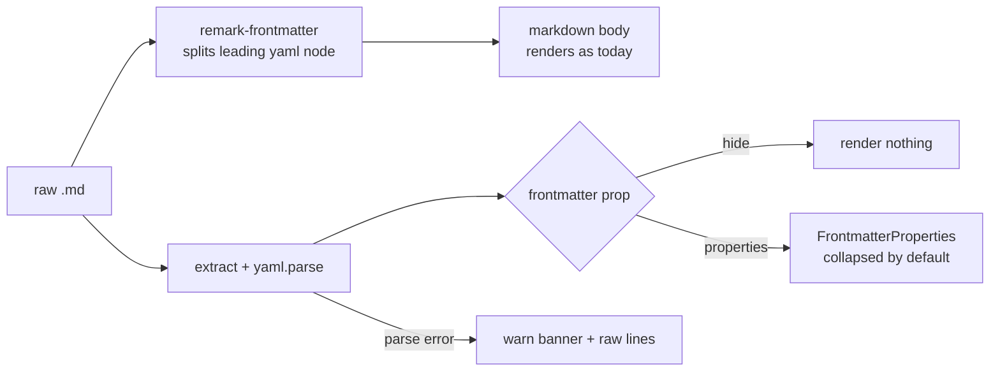

# Design — Improve frontmatter rendering

## Context

`MarkdownContent` is the single rendering chokepoint. Every `.md` surface flows through it:

```
MarkdownContent  ← fix here once
   ├─ FilePreviewOverlay   (any .md opened via a file link)
   ├─ MarkdownPreviewView  (OpenSpec proposals/specs, package READMEs)
   ├─ SpecsBrowserView · ArchiveBrowserView
   ├─ SkillInvocationCard  (SKILL.md — always has frontmatter)
   └─ ChatView             (assistant/user messages — stays hidden)
```

Today there is no frontmatter plugin, so a leading YAML block mangles into a giant heading (see proposal "Why"). The mockups in `./mockups/` are the visual source of truth for this design.

## Pipeline



Two roles for `remark-frontmatter`:
1. It removes the `---…---` block from the markdown AST so the body renders correctly — this alone fixes the bug.
2. It marks the block as a `yaml` node. We do not render the node via rehype; instead `FrontmatterProperties` parses the raw source frontmatter separately with `yaml.parse` and renders the typed panel.

Extraction: match a single leading `---\n…\n---` at the very start of `content` (mirrors `remark-frontmatter`'s own recognition rule — mid-document `---` stays a thematic break, which is correct). Feed the captured YAML text to `yaml.parse` inside try/catch.

## The `frontmatter` prop

```ts
interface Props {
  content: string;
  context?: ToolContext;
  frontmatter?: "hide" | "properties"; // default "hide"
}
```

- `"hide"` (default): frontmatter is stripped, nothing rendered. Preserves chat. Strictly better than today even for chat (no mangling).
- `"properties"`: render `FrontmatterProperties` above the body.

Decision — opt-in (default `"hide"`) rather than opt-out: chat messages are the dominant render path and almost never carry intentional frontmatter; a stray leading `---` in an assistant message should not sprout a Properties panel. File/spec surfaces, where frontmatter is intentional and useful, opt in explicitly.

## FrontmatterProperties — value typing

Inferred from the parsed JS value (not from key names, except known-key promotion):

| Parsed value | Row type | Render |
|---|---|---|
| string, short | `text` | primary-color text |
| string, long / multiline | `para` | wrapped secondary text |
| number | `num` | monospace, accent-blue |
| ISO date / `Date` | `date` | `YYYY-MM-DD · N ago` |
| array | `list` | chips |
| boolean | `bool` | green check / grey cross |
| URL string | `link` | clickable anchor (new-tab rules reuse `isExternalHref`) |
| object | `obj` | indented sub-grid |
| null / empty | `empty` | muted `—` |

Known-key promotion (by key name, case-insensitive): `status` → colored badge (`draft`/`active`/`archived` → yellow/green/grey). Kept deliberately small for v1; everything else falls back to inferred typing.

Icons: `@mdi/js` paths (already bundled) — e.g. `mdiFormatText`, `mdiPound`, `mdiCalendar`, `mdiFormatListBulleted`, `mdiCheckboxOutline`, `mdiLinkVariant`, `mdiClockOutline`. Final path map decided at implementation; the mockups use equivalent shapes.

## Collapse behavior

Collapsed by default — header pill `▸ Properties · N fields`. Click toggles. v1 keeps it stateless (resets on remount). Persisting per-surface/per-file collapse state is a deliberate non-goal.

## Failure mode

`yaml.parse` in try/catch. On throw: render the panel with a warn banner ("Invalid YAML — showing raw values") and the raw frontmatter lines as plain rows. The whole `FrontmatterProperties` render is additionally wrapped so any unexpected throw degrades to rendering just the body — never a blank screen. Matches the existing `ErrorBoundary`/`linkifyChildren` discipline in `MarkdownContent`.

## Alternatives considered

- **Strip only (no panel).** Simplest, but throws away useful metadata. Rejected per product decision (show, rich).
- **Semantic hero header** (title→H1, status→badge, tags→chips inline). Prettier for well-known schemas but needs a key-mapping convention and a generic fallback for unknown keys — i.e. it *contains* the Properties grid. Deferred; Properties panel is the foundation and can gain promotion later.
- **Hand-rolled flat YAML parser** (no dep). Frontmatter is usually shallow, but nested objects/typed scalars/arrays appear in real SKILL.md (`metadata:` blocks). A real parser is worth the small dep. `yaml` chosen over `js-yaml` (smaller, modern, maintained).

## Out of scope (v1)

- Editing frontmatter (Obsidian allows inline edit; this is read-only).
- Persisting collapse state.
- Rich rendering inside chat messages.
- Promotion beyond `status`.
