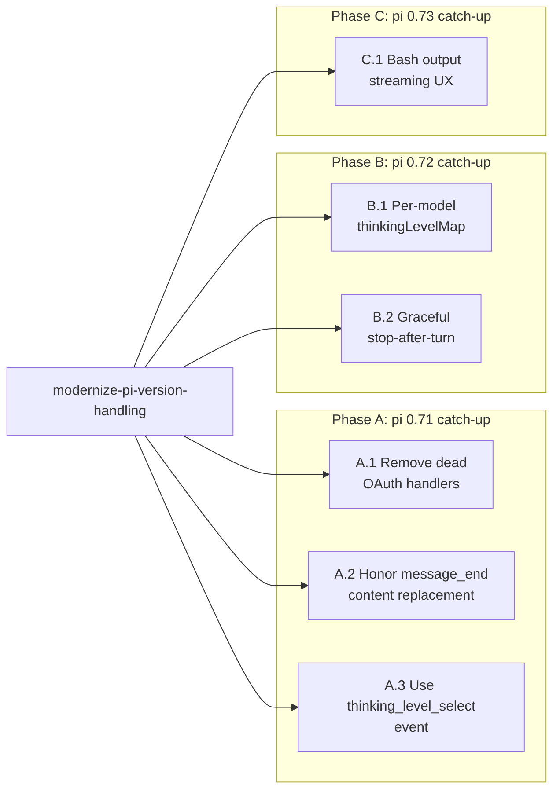

# Design — adopt-pi-071-072-073-features

## Context

The dashboard's compatibility floor lifts to pi 0.73 in the sibling `modernize-pi-version-handling` change. Once that lands, six pi-version-driven gaps become safe to close — five of them are tiny (5-25 LOC each), one is moderately larger (graceful stop-after-turn at ~50 LOC, bash streaming at ~70 LOC). They share the same theme ("catch up to upstream"), the same caller (the bridge introspects pi APIs that became available in 0.71/0.72/0.73), and the same risk profile (defensive, additive, optional fields).

This change consolidates the six into a single landing because:

1. They share a single precondition (the version bump) and the same blast radius.
2. Each one's release-note bullet reads as "we caught up with pi 0.7X feature Y" — narratively coherent.
3. Six PRs is bureaucratic overhead for changes that don't conflict.
4. The few known interactions between them (e.g. A.3 + B.1 both touch the bridge's model-tracking path; B.2 + A.3 both add bridge event listeners) are easier to reason about in one diff than across six.

## Architecture by phase



Each phase is independent within itself; ordering across phases is purely organizational (release-note sectioning).

## Touchpoints by file

| File | Phase | Change |
|---|---|---|
| `packages/server/src/provider-auth-handlers.ts` | A.1 | Delete gemini/antigravity handlers + constants. ~50 LOC removed. |
| `packages/server/src/routes/provider-auth-routes.ts` | A.1 | New `GET /handlers` route. ~10 LOC. |
| `packages/shared/src/rest-api.ts` | A.1 | New response type. ~3 LOC. |
| `packages/client/src/components/ProviderAuthSection.tsx` | A.1 | Fetch handlers once, render disabled rows for gaps. ~15 LOC. |
| `packages/client/src/lib/event-reducer.ts` | A.2 + C.1 | New `deriveEffectiveAssistantText` helper + use in `message_end`. New `truncateOutputForDisplay` helper + 3 call-site replacements. ~50 LOC. |
| `packages/extension/src/bridge.ts` | A.3 + B.2 | Add `thinking_level_select` listener. Add `stop_after_turn` handler + `turn_end` listener. ~25 LOC. |
| `packages/extension/src/model-tracker.ts` | A.3 | Verify (extend if needed) dedup gate considers thinkingLevel. ~5 LOC. |
| `packages/shared/src/types.ts` | B.1 | Add `supportedThinkingLevels?: string[]` to `ModelInfo`. 1 LOC. |
| `packages/extension/src/provider-register.ts` | B.1 | Project `thinkingLevelMap` keys into `supportedThinkingLevels`. ~10 LOC. |
| `packages/client/src/components/ThinkingLevelSelector.tsx` | B.1 | Accept `supportedLevels` prop, filter render. ~10 LOC. |
| `packages/client/src/components/StatusBar.tsx` | B.1 + B.2 | Pass `supportedThinkingLevels`. New "Stop after turn" button. ~25 LOC. |
| `packages/shared/src/browser-protocol.ts` | B.2 | New `StopAfterTurnBrowserMessage`. 3 LOC. |
| `packages/shared/src/protocol.ts` | B.2 | Server→bridge equivalent. 3 LOC. |
| `packages/server/src/browser-handlers/session-action-handler.ts` | B.2 | New `handleStopAfterTurn`. ~12 LOC. |
| `packages/server/src/browser-gateway.ts` | B.2 | Wire dispatch. ~3 LOC. |
| `packages/server/src/routes/session-routes.ts` | C.1 | New `GET /tool-result/:toolCallId` route. ~25 LOC. |
| `packages/client/src/components/ToolCallStep.tsx` | C.1 | "Show full output" button when truncation marker present. ~15 LOC. |
| `packages/client/src/components/BashOutputCard.tsx` | C.1 | Same affordance. ~10 LOC. |
| (new hook) `packages/client/src/hooks/useToolFullResult.ts` | C.1 | Fetch helper. ~15 LOC. |

## Phase-by-phase design notes

### A.1 Dead OAuth handlers

The catalogue path (`replace-hardcoded-provider-lists`) is now the source of truth. The dashboard's hand-written handler registry exists ONLY to drive the OAuth login button click → callback → token exchange flow. Catalogue rows for which no handler exists either:

1. Are pi providers we don't support yet (e.g. moonshot might not have a handler) → render disabled-with-tooltip.
2. Are extension-registered providers (`pi.registerProvider({oauth:...})`) → render disabled-with-tooltip.

Both cases produce the same UI, so the gap-detection is uniform. Sign-out (a `DELETE /api/provider-auth/credential` call) does NOT need a handler, so already-authenticated rows keep their Sign Out button enabled even when the login button is disabled.

### A.2 Message-end replacement

Three branches in `message_end`'s assistant arm:

```
1. streamingTextFlushed === true → existing flushed row, stamp entryId/nonce
2. streamingText non-empty       → push new row from streamingText
3. streamingText empty + no flushed row → replay/fork, read msg.content
```

Today branch 3 reads `msg.content` correctly; branches 1+2 read deltas. Pure helper unifies:

```ts
function deriveEffectiveAssistantText(msg: any, fallback: string): string {
  if (msg?.content) {
    if (Array.isArray(msg.content)) {
      return msg.content.filter(c => c?.type === "text").map(c => c.text).join("");
    }
    if (typeof msg.content === "string") return msg.content;
  }
  return fallback;
}
```

Branch 1 mutates the flushed row's `content` only when `effectiveContent !== current` (avoid object-identity churn). Branch 2 uses `effectiveContent` as the new row's content. Branch 3 is unchanged. Pre-0.71 pi (no `msg.content` on `message_end`) hits the `fallback` arm — identical to today.

### A.3 thinking_level_select event

Tiny. Existing `model-tracker::sendModelUpdateIfChanged` debouncer handles dedup. We just register one more event subscription that calls the existing function. Verify the dedup gate considers BOTH `model` and `thinkingLevel`:

```ts
// Today (likely):
if (model === lastModel) return; // BUG if level changed but model didn't

// After:
if (model === lastModel && level === lastLevel) return;
```

If the gate already considers level, no-op the verify task.

### B.1 Per-model thinking levels

Optional field on `ModelInfo`. Bridge projects pi 0.72+'s `thinkingLevelMap`:

```ts
// In provider-register.ts model projection:
const map = (model as any).thinkingLevelMap;
const supportedThinkingLevels = map && typeof map === "object"
  ? Object.entries(map)
      .filter(([_, v]) => v !== null)
      .map(([k]) => k)
  : undefined;
```

UI filter:

```tsx
// ThinkingLevelSelector.tsx:
const THINKING_LEVELS = ["off", "minimal", "low", "medium", "high", "xhigh"] as const;
const levelsToRender = supportedLevels?.length
  ? THINKING_LEVELS.filter(l => supportedLevels.includes(l))
  : THINKING_LEVELS;
```

Pre-0.72 pi (no map) → field undefined → fallback to all six.

### B.2 Graceful stop-after-turn

```
USER FLOW
─────────────────────────────
User clicks "Stop after turn"
  → browser sends { type: "stop_after_turn", sessionId }
  → server forwards to bridge owning that session
  → bridge sets shouldStopAfterTurn = true
  → on NEXT pi turn_end event:
      bridge calls cachedCtx.shutdown?.() ?? cachedCtx.abort?.()
      bridge clears the flag
  → session ends gracefully
```

Coexists with Abort (mid-stream interrupt) and Force Kill (SIGKILL). All three buttons live side-by-side. Idempotency: repeated `stop_after_turn` while flag set is a no-op.

Failure modes:
- `cachedCtx.shutdown` not a function (older pi or invalid state) → fall back to abort, log warning.
- Force Kill arrives while flag pending → SIGKILL preempts; flag is irrelevant after process is dead.

### C.1 Bash streaming UX

Two concerns: storage cap (avoid React state explosion on 100k-line outputs) AND user gets useful information (final summary, error, totals are at the BOTTOM of the output).

```ts
function truncateOutputForDisplay(text: string, opts?: { maxLines?: number }): string {
  const maxLines = opts?.maxLines ?? 200;
  const lines = text.split("\n");
  if (lines.length <= maxLines) return text;
  const dropped = lines.length - maxLines;
  return `«${dropped} earlier lines hidden»\n` + lines.slice(-maxLines).join("\n");
}
```

`«` is U+00AB LEFT-POINTING DOUBLE ANGLE QUOTATION MARK — visually distinct from any literal text bash might emit, makes the marker scannable as a "system message" in the rendered output.

Click "Show full output" calls the new endpoint:

```
GET /api/sessions/:sessionId/tool-result/:toolCallId
  → look up tool_execution_end event in MemoryEventStore (server already keeps it)
  → 200 { result, isError } if found
  → 404 { error: "tool call still in flight or unknown" } if still streaming or evicted
```

The button replaces the rendered `result` with the full text in-place; subsequent collapse re-shows the truncated form. Lightbox-style modal NOT used — keep it inline.

## Test plan

```
# Phase A
packages/server/src/__tests__/provider-auth-handlers.test.ts            EXTEND
  + drop gemini/antigravity assertions
packages/server/src/__tests__/provider-auth-routes.test.ts              EXTEND
  + GET /handlers returns ["anthropic","openai-codex","github-copilot"]
packages/client/src/__tests__/ProviderAuthSection.test.tsx              NEW (or extend)
  + extension-registered OAuth row renders disabled-with-tooltip when no handler
packages/client/src/lib/__tests__/event-reducer-message-end-replacement.test.ts NEW
  + already-flushed row content swap
  + streaming-row push respects msg.content
  + fallback when msg.content missing → today's behavior
packages/extension/src/__tests__/bridge-thinking-level-select.test.ts   NEW
  + thinking_level_select fires → model_update sent
  + duplicate event → no second push (debounce)

# Phase B
packages/extension/src/__tests__/provider-register-thinking-levels.test.ts NEW
  + thinkingLevelMap → supportedThinkingLevels populated
  + missing map → undefined
packages/client/src/__tests__/ThinkingLevelSelector.test.tsx            NEW
  + filters to supportedLevels
  + falls back to six when undefined
packages/extension/src/__tests__/bridge-stop-after-turn.test.ts         NEW
  + stop_after_turn sets flag
  + turn_end with flag → shutdown called once + flag cleared
  + repeated turn_end after flag clear → no further shutdown
packages/server/src/browser-handlers/__tests__/session-action-handler.test.ts EXTEND
  + handleStopAfterTurn forwards to piGateway
packages/client/src/__tests__/StopAfterTurnButton.test.tsx              NEW
  + visible only when streaming
  + click sends stop_after_turn

# Phase C
packages/client/src/lib/__tests__/event-reducer-truncation.test.ts      NEW
  + 500-line input → marker + last 200 lines kept
  + 10-line input → unchanged (no marker)
  + 1000-line input on tool_execution_end → marker + last 200
packages/server/src/__tests__/session-routes-tool-result.test.ts        NEW
  + completed tool call → 200 with full result
  + in-flight tool call → 404
  + evicted tool call → 404
```

## Risks

```
R1. event-reducer is hot, recently-tweaked
    → A.2 + C.1 both touch it. Existing tests for fix-streaming-text-vs-
      interactive-ui-order and fix-replay-duplicates-tool-and-flushed-rows
      MUST keep passing. Both changes are additive (new helpers + branch
      tweaks); no behavior change when their preconditions are absent.

R2. Bridge picks up a new event listener (thinking_level_select)
    → A.3 is purely additive. Pre-0.71 pi: pi.on() registration no-ops.

R3. Stop-after-turn might double-fire shutdown if turn_end fires twice
    → flag is cleared inside the handler before shutdown completes async.
      Defensive: handler also checks if cachedCtx.shutdown is null after
      first call. Test covers.

R4. Bash truncation increased from 30 → 200 lines
    → React state size: 200 × ~80 × 100 tool calls ≈ 1.6 MB. Acceptable.
      The single tunable is the helper's `maxLines` default — if perf
      regression observed, lower it.

R5. UI for "Show full output" needs network to work
    → 404 path renders a small "result evicted" message inline.
      Endpoint is network-guarded (same as other session routes).

R6. Stop-after-turn button next to Abort might confuse users
    → mitigation: button label is explicit ("Stop after turn"), tooltip
      explains the difference, optimistic disable + "stopping after this
      turn…" pill makes the asynchronous nature visible.
```

## Decision log

```
Q1. Bundle 6 features or split?
    Bundled. Single pi-version-modernization narrative. Saves orchestration.
    All have the same precondition (the floor bump).

Q2. A.1 — render disabled rows or hide them entirely for catalogue gaps?
    Disabled-with-tooltip. Hiding rows would silently misrepresent the
    catalogue; disabled rows make the gap discoverable.

Q3. A.2 — also stamp usage.cost?
    Out of scope. Bigger surface (ChatMessage type, persistence flow).
    Defer to a follow-up change if/when an extension actually uses it.

Q4. B.2 — graceful stop UI: same tier as Abort or separate?
    Same tier. Three buttons in the action row: Abort | Stop after turn |
    Force Kill. Visual hierarchy via icon weight (abort = red, stop =
    neutral, kill = warning). Tooltip distinguishes.

Q5. C.1 — keep last-N or implement true streaming UI?
    Keep last-N + on-demand fetch. Streaming UI (live tail) is a larger
    UX/perf project.

Q6. C.1 — N=200 or higher?
    200. Spot-check confirms storage well-bounded. Higher → more state
    pressure with little marginal value (final 200 lines almost always
    contain the summary).
```

## Migration

None. All changes are additive or replace internal-only code paths. Pre-fix sessions render unchanged. Old browser tabs ignore the new `stop_after_turn` message type and the new `supportedThinkingLevels` field.
