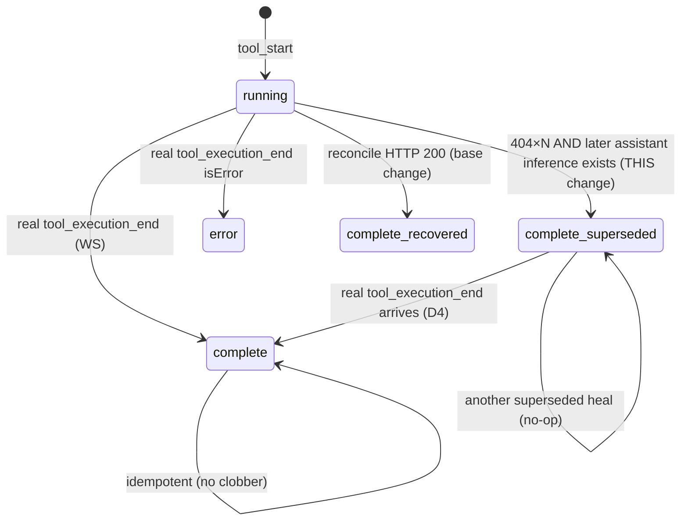

# Design

## Context

`fix-stuck-tool-card-on-dropped-event` established the transport model
(`pi → bridge → server (MemoryEventStore) → WS fanout → browser`) and a client HTTP
reconcile keyed by `toolCallId`. Its reconcile is intentionally recovery-only: HTTP 200
flips the row, HTTP 404 leaves it running and never fabricates a completion. This change
adds the missing **last-resort** heal for the case the base change documents as a known
limitation: the result is gone from the store, so no HTTP recovery is possible, yet the
transcript proves the tool finished.

## Decision D1 — Proof of completion = a later assistant *inference*, not a later *event* or coarse *turn*

The safe, false-positive-free signal is "a later assistant **inference** exists after the
assistant inference that emitted this tool call." Rationale (same as the base change's
Why): the model cannot start a new inference until all prior tool results — including
parallel ones in the same batch — have returned.

**Proof primitive — precise definition (F1).** "Inference" here is NOT the reducer's
`turnCount`/`turnIndex`. That counter increments **once per user-prompt cycle** on
`stats_update.turnUsage` and is stamped only on `role:"user"` rows
(`event-reducer.ts` ~1600–1616). One agentic user turn contains many assistant
inferences and many tool calls but advances `turnCount` **zero** times until the whole
cycle ends — so `turnCount` is far too coarse and MUST NOT be used as the proof.
The correct per-inference boundary is an assistant **`message_start`** — NOT
`message_end`. Empirical intra-inference event order (verified against
`event-reducer-streaming-text-flush.test.ts`: "tool_execution_end + message_end close the
turn") is:
`message_start(N) → text → tool_execution_start(N) → tool_execution_end(N) →
message_end(N) → message_start(N+1) → …`. So `message_end(N)` fires *after* inference N's
own tools — using it as the boundary would falsely mark a stuck tool complete the instant
its OWN inference's `message_end` arrives (the tool's end was dropped, but `message_end`
was not). The model cannot begin a *new* assistant message until every prior tool result
is in hand, so the reliable "later inference" signal is the **next assistant
`message_start`**. Proof primitive: **an assistant `message_start` later than the
inference that emitted this tool call.**

**Anchoring the tool call to its emitting inference (F2).** A raw "is there an assistant
row after this tool row's array index" scan is UNSAFE: `reorderToolCardsForAssistantMessage`
repositions a tool card to interleave with its *own* inference's assistant text, so the
tool's same-inference assistant row can sit after it and be miscounted as "later."
Instead anchor on a monotonic per-inference sequence: maintain an
`assistantInferenceSeq` (count of assistant **`message_start`** events applied so far) in
`SessionState`, stamp each running tool row with the `assistantInferenceSeq` value at its
`tool_execution_start` (its own inference's `message_start` has already fired, so the
stamp equals its own inference index), and define the proof as
`state.assistantInferenceSeq > row.emittedAtInferenceSeq`. Only the *next* inference's
`message_start` advances the counter past the stamp, so a tool's own inference can never
satisfy it. Order-robust under reorder; no array-position reasoning.

Rejected weaker signals:
- **A later `tool_start` in the same inference** — parallel tools coexist in one
  inference; a sibling starting proves nothing about *this* tool. False-positive risk.
  Rejected.
- **The coarse `turnCount`/`turnIndex`** — too coarse (see above); would never fire
  mid-turn. Rejected.
- **Wall-clock age alone** — a genuinely slow tool (long build) would be falsely
  completed. That's why the base change already refuses to synthesize on timeout.
  Rejected.

If the tool's inference is still the newest (`assistantInferenceSeq` unchanged since its
start), the fallback does NOT fire — the tool may legitimately still be running.

**Subagent-origin invariant (F3, verified).** This proof is only sound because a
subagent's *inner* inferences do NOT surface as parent-session assistant `message_end`
rows — subagent activity flows through `subagent_*` events + `details` on the parent
`Agent` tool call (`event-reducer.ts` ~1794–1841, ~1538–1591), and the parent agent is
blocked on the `Agent` tool while it runs, so no later *parent* inference can appear
while that tool is genuinely in-flight. If subagent transcripts are ever flattened into
the parent `messages[]` / counted into `assistantInferenceSeq`, this heal MUST be
re-audited — it would otherwise falsely complete a still-running `Agent` tool card.

## Decision D2 — Fire only after recovery is exhausted

The fallback must never preempt the base reconcile; the real result body is always
preferable. Gate the fallback on the base reconcile having returned HTTP 404 at least
`SUPERSEDE_MIN_404` times (default 2), i.e. the store demonstrably lacks the result.
This reuses the reconcile's existing per-row attempt bookkeeping (`lastAttemptRef` /
404 handling) rather than a second timer racing the first.

Timing: base `STALE_TOOL_MS` ≈ 25 s, re-arm ≈ 15 s ⇒ two 404s ≈ 40 s before the fallback
can fire. Conservative by construction; a slow tool that eventually returns 200 heals
via the base path first and never reaches the fallback.

## Decision D3 — Terminal representation: reuse `complete` + a detail flag, no new enum

`ToolCallStep` status is `"running" | "complete" | "error"`. Adding a fourth enum value
ripples through every renderer and status map. Instead the synthesized
`tool_execution_end` reduces to `status: "complete"` with `details.healedBy:
"superseded"` and a sentinel result string. The card renders the normal complete glyph
plus a muted "result not captured (recovered)" note — surgical, and no renderer needs a
new case beyond the optional badge.

`isError` is `false`: the tool succeeded; only its *output display* was lost. Marking it
`error` would misreport a healthy run as failed.

## Decision D4 — A real result may overwrite a superseded placeholder

The reducer is otherwise idempotent and does not re-reduce a terminal row. Carve one
exception: a genuine `tool_execution_end` (no `healedBy`, or `healedBy` absent) MAY
replace a row whose current terminal state is `healedBy: "superseded"`. This lets a late
reconcile 200, an in-app full replay, or a bridge reconnect re-sync restore the real
body. A superseded placeholder never overwrites another superseded placeholder (no-op)
and never downgrades a real completion.

## Decision D5 — Observability: every synthetic heal is counted and badged

A supersede heal masks a real result loss as a (bodyless) success. To keep that from
being silent: increment a client-side `supersedeHealCount`, and render a distinguishable
badge (mirror the existing `RetriedErrorBadge` pattern). This makes "we are losing tool
results" visible rather than cosmetically hidden.

## Reducer state machine (row status transitions)

## Deferred

- Server-side backstop (never-evict the most recent `tool_execution_end` per live tool
  call, or a bounded "terminal-event keepalive" ring). Would shrink the unrecoverable
  window at the source, but it's a store-lifecycle change with its own memory-bound
  design; gate on whether the client fallback proves insufficient in practice.
