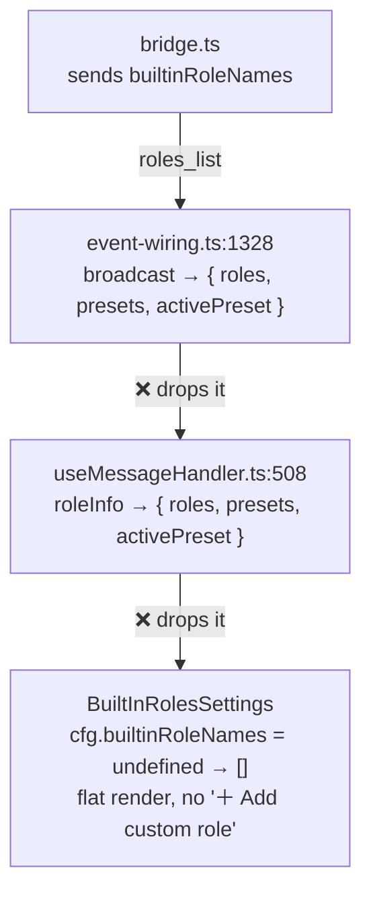

## Context

`add-custom-roles-ui` (#282) wired three of four hops for `builtinRoleNames`:

- **Bridge (sender)** — `bridge.ts` sets `builtinRoleNames: rolesData.builtinRoleNames ?? []` on every `roles_list` it emits. ✅
- **Extension→server type** — `RolesListMessage.builtinRoleNames?` exists in `protocol.ts`. ✅
- **UI (reader)** — `RolesSettingsSection.tsx` reads `cfg.builtinRoleNames` and branches the render on it. ✅
- **Server→browser relay + browser type + client handler** — MISSED. ❌

Two relay hops between the bridge and the plugin config drop the field:

## Goals / Non-Goals

- **Goal:** make `builtinRoleNames` reach the roles plugin config, so the custom-role UI renders. Conform to the existing `dashboard-roles-ownership` requirement.
- **Non-Goal:** any change to the bridge, the `roles:get-all` handler, role persistence, or the UI component. They are already correct.

## Decisions

1. **Additive optional field, no version gate.** `BrowserRolesListMessage.builtinRoleNames?: string[]` mirrors the already-optional `RolesListMessage` field. Older clients ignore it (matches the spec's "additive" clause). No back-compat shim needed.
2. **Forward, don't recompute, on the server.** The server relay copies `(msg as any).builtinRoleNames` straight through rather than re-deriving `DEFAULT_ROLE_NAMES` server-side — the bridge remains the single source of truth (spec design D2), and the server stays a dumb relay for this message.
3. **Merge into plugin config verbatim on the client.** `useMessageHandler`'s `roleInfo` gains `builtinRoleNames: msg.builtinRoleNames`; the existing `applyPluginConfigUpdate({ id: "roles", ... })` spread carries it into `usePluginConfig<BuiltinsConfig>()`. No new store, no new message.

## Risks

- **Low.** Purely additive on an optional field across one message type. The failure mode if wrong is the current already-broken flat render — no regression surface beyond roles.
- The client change requires a rebuild to deploy; the server change is jiti (restart only). A regression test at each hop guards against a future re-drop.
