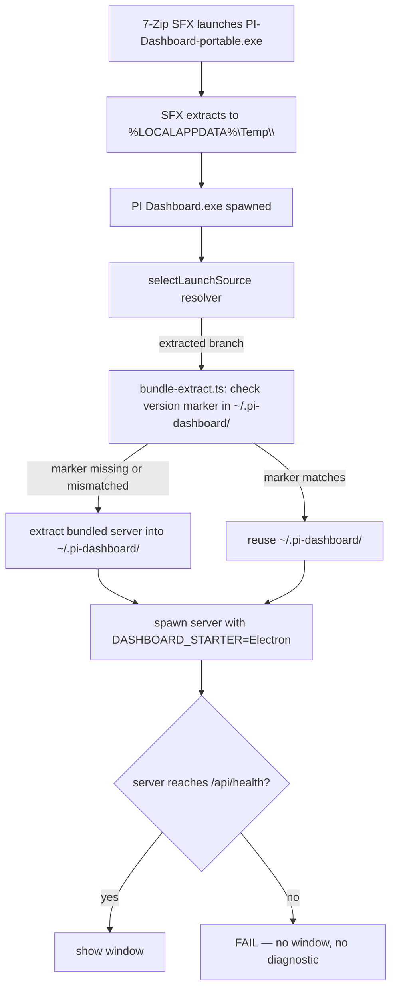

## Context

v0.5.0 was the first release to ship Windows portable `.exe` artifacts as a replacement for the dropped NSIS installer (per `simplify-electron-bootstrap-derived-state`). The portable target is produced by `electron-builder --win portable`, which wraps the Electron app in a 7-Zip SFX. At runtime the SFX self-extracts to `%LOCALAPPDATA%\Temp\<random>\` and launches `PI Dashboard.exe` from there. On exit (clean or crash) the temp dir is supposed to be cleaned up, though in practice 7-Zip SFX leaves residue on crash.

The matching ZIP target works: users extract once to a stable location and `PI Dashboard.exe` runs from there. Both targets share the same Electron main code, the same `selectLaunchSource()` resolver, and the same `bundle-extract.ts` logic for managing `~/.pi-dashboard/`. The ZIP succeeds and the portable fails, so the difference must be in how the bootstrap interacts with a transient install location.

## Architectural snapshot of the suspect code

The failure is presumed to be at the `selectLaunchSource` → `bundle-extract` boundary or in the server spawn step, but step 1 (Diagnose) must confirm.

## Hypotheses, ranked by likelihood

### H1 — Stale extracted-marker pointing at deleted temp dir (most likely)

`bundle-extract.ts` writes a version marker into `~/.pi-dashboard/` recording the source path of the bundle that was extracted. On a portable run, that source path is the SFX temp dir (e.g. `C:\Users\foo\AppData\Local\Temp\7zS1A2B\resources\server\`). After the first run, the SFX cleans up the temp dir. The second run extracts to a *different* temp dir, but `bundle-extract.ts` may compare the new bundle's marker to the old one and short-circuit, then fail when it tries to read from the now-deleted path.

**Test:** delete `~/.pi-dashboard/` between runs and see if the first portable launch works while the second fails. If yes, H1 confirmed.

**Fix sketch:** in `bundle-extract.ts`, treat any source path under `%LOCALAPPDATA%\Temp\` as never-cacheable — always re-extract and never store the temp path in the marker. Or: detect the SFX scenario via an env var electron-builder injects (e.g. `PORTABLE_EXECUTABLE_DIR`) and use that as the marker key instead of `process.resourcesPath`.

### H2 — `selectLaunchSource()` `extracted` branch can't find resources

`selectLaunchSource()` walks `attach > devMonorepo > piExtension > npmGlobal > extracted` looking for the server entrypoint. The `extracted` branch resolves relative to `process.resourcesPath`. If the SFX leaves an unexpected directory layout (e.g. `app.asar` not in the conventional spot), this branch may return `null` and the resolver falls through with no source, silently exiting.

**Test:** add a temporary diagnostic logging fallback (write to `%TEMP%\pi-dashboard-launch.log`) listing every probed source. Inspect after a failed portable launch.

**Fix sketch:** harden the `extracted` branch with explicit logging and a user-visible error dialog when no source resolves, instead of silent exit. Independent of the portable fix — would help diagnose any future bootstrap regression.

### H3 — Native modules with absolute paths

`node-pty` ships a spawn-helper binary that is referenced by absolute path resolved at install time. If electron-builder's portable target captures these paths from the build host rather than relativizing them, runtime resolution under `%LOCALAPPDATA%\Temp\<rand>\` would dangle.

**Test:** run `Get-Process` while the portable is launching and inspect any spawned child processes and their command lines.

**Fix sketch:** ensure `node-pty` is in the asar `unpack` list and resolved relative to `process.resourcesPath`. The repo already has lints (`no-hardcoded-node-modules-paths.test.ts`) but those check repo source, not the runtime asset layout.

### H4 — SmartScreen / Windows Defender blocking unsigned SFX

The portable .exe is unsigned. SmartScreen on default Windows 11 settings will warn before allowing execution; some AV engines flag unsigned SFX as suspicious and quarantine without prompting. This would manifest as "the app doesn't open at all" — same surface as H1/H2.

**Test:** check Windows Defender's protection history and SmartScreen's `Get-MpThreatDetection` after a failed launch. Try with Defender disabled.

**Fix:** out of scope here — would require Windows codesigning (separate change). If H4 is the *sole* root cause, the technical recommendation is to drop the portable target since unsigned SFX has poor UX even when it works.

## Decision (filled in during §2)

*To be filled after diagnosis. The fix-vs-drop call hinges on:*

- *If H1 or H2 is confirmed and the fix is < 50 lines + a unit test → **fix**.*
- *If H3 → likely fixable but more involved; **fix** if budget allows, otherwise **drop**.*
- *If H4 alone → **drop** (no code fix possible without codesigning, which is a separate budget).*
- *If multiple hypotheses overlap and the diagnostic effort already exceeds 1 day → **drop** and revisit when codesigning lands.*

## Risks

- **Diagnosis on Windows is slow** — every iteration requires a clean Windows host (the `qa/remote/` harness from `automate-windows-remote-qa` exists for exactly this, but adds setup overhead). Time-box §1 to 1 day; if no clear root cause emerges, default to **drop**.
- **Reintroducing portable could regress.** If §3 lands a fix, §3.4 must add a smoke test that runs on every release in CI, not just locally — otherwise the next release will silently re-break it.
- **Drop is one-way for users who already downloaded portable.** Mitigated by the existing v0.5.0 release notes notice and the README/site changes already shipped.

## Open questions

- Does electron-builder support an "extract to a stable user-writable location" mode (similar to NSIS portable mode) that would sidestep the SFX temp-dir issue entirely? If yes, that may be a third option between fix and drop.
- Is there a path to producing the portable without electron-builder, using only `@electron-forge/maker-zip` plus a custom 7-Zip SFX wrapper? Probably not worth the complexity, but worth a 30-minute look.
