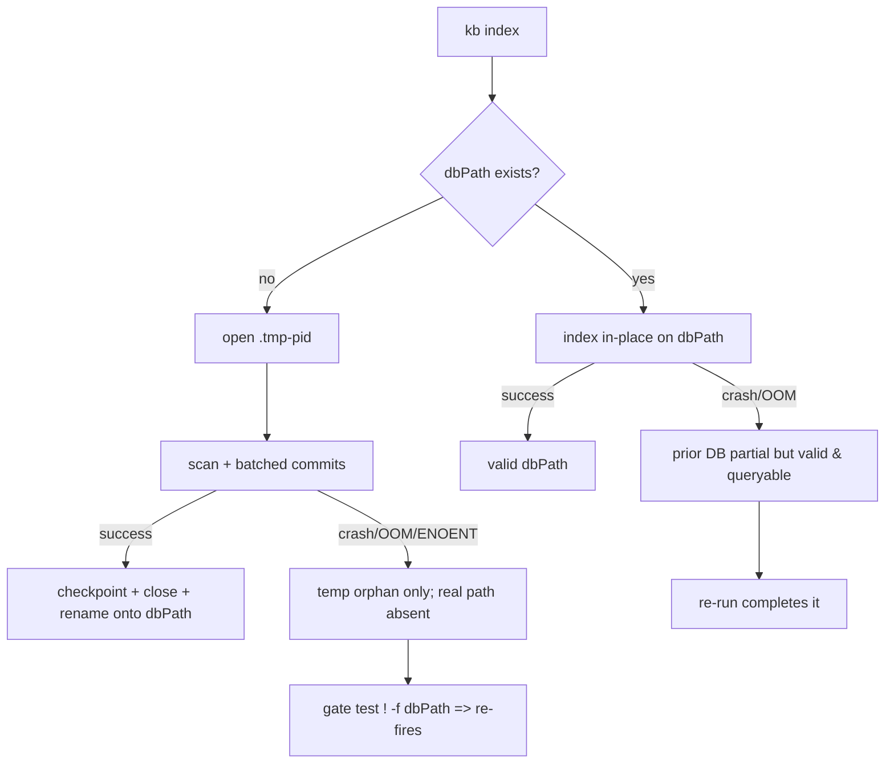

# Design — harden-kb-index-failure-atomicity

Captures the non-trivial decisions surfaced by a doubt-driven review (fresh-context
adversarial pass + single-model source-grounded analysis). Cross-architecture review was
unavailable in the harness; the fresh-context reviewer ran same-architecture and independently
reproduced D1 and D3, raising confidence they are real rather than author bias.

## Problem recap

`openStore` constructs `new DatabaseSync(dbPath)` (WAL mode) and runs the DDL, **creating the
DB file before any source is scanned**. A throw during the scan (missing dir → `ENOENT`, OOM,
Ctrl-C) leaves a committed 0-chunk husk at `dbPath`. The `worktreeInit.gate`
(`test ! -f index.db`) keys on file existence, so the husk reads as "already indexed" and
permanently suppresses re-init. Evidence: 113 orphan `.worktrees/*` dirs, each a 56K
`chunks=0` husk.

## D1 — Single atomic strategy, NOT an "OR"

The initial plan offered two interchangeable approaches. They are **not** equivalent:

| Approach | Survives OOM/SIGKILL? | Preserves incremental? |
|---|---|---|
| (a) temp path + `rename()` on success | ✅ real path never gets a husk | ❌ fresh temp DB loses `files` state |
| (b) create-track → `close()`+`unlink()` on failure | ❌ cleanup is dead code under SIGKILL | ✅ operates in place |

Approach (b) is **rejected**: `close()`+`unlink()` never runs under an uncatchable signal, so
(b) leaves exactly the husk the change exists to remove — under OOM, a trigger the proposal
itself cites.

**Decision:** branch on whether `dbPath` already exists — the husk can only form on a *first*
index (an incremental run already has a valid, non-empty file):

- **First index (no `dbPath`)** → open on `<dbPath>.tmp-<pid>`, `rename()` onto `dbPath` only
  after the run resolves. Crash leaves a temp orphan; the real path stays absent → gate
  correctly re-fires. Nothing to preserve (empty anyway).
- **Incremental (valid `dbPath` exists)** → index **in-place**. A mid-run failure leaves the
  prior DB non-empty and valid (partial committed batches); a re-run completes it. No temp
  copy → the in-DB `files` mtime/sha256 state is preserved.

This resolves the (a)-vs-(b) tension without a costly per-run copy of the 15k-chunk DB.

## D2 — Gate stays file-existence; do NOT probe emptiness

With D1, `test ! -f index.db` is trustworthy again (file present ⟺ a successful index ran).

**Rejected:** hardening the gate to reject an *empty* index. A source set with no markdown
produces a **valid 0-chunk DB** — legitimate, fully initialized. An "empty = needsInit" probe
would re-fire init forever on such a repo (N2). Atomicity, not content-probing, is the
coherence fix. Keeps the gate a cheap shell `test` (no per-poll node spawn).

## D3 — Missing source: survivability ≠ silent semantics

Making the walk *survive* a missing dir (no husk) is required. Converting **all** missing dirs
to a silent `console.warn` is a separate, unstated behavior change that hides typos:
`kb index --source typo/` today errors; a blanket warn exits 0 with an empty index and the
user never notices.

**Decision:** split by source provenance.

- **Config-declared source** absent → `console.warn` + skip (may be a legitimately optional
  mount). Degrade only when ≥1 source is present.
- **Explicit `--source <dir>` arg** absent → still error (exit non-zero). A missing explicit
  path is a user typo.
- **All configured sources absent** → exit non-zero (nothing indexable = misconfig), and D1
  guarantees no husk.

## WAL ordering (implementation note for 2.2)

The store opens `PRAGMA journal_mode=WAL`. Renaming only the main file while `-wal` holds
committed-but-uncheckpointed pages yields a truncated DB. Required order:
`wal_checkpoint(TRUNCATE)` + `close()` **before** `rename`, then move the single main file
(sidecars empty/removed on a clean close) — or rename all three. Verify against `node:sqlite`;
do not assume `close()` checkpoints.

## Orphan temp files (2.5)

Under SIGKILL the first-index path leaves `<dbPath>.tmp-<pid>` (+ sidecars). It does not poison
the gate (real path absent) but accumulates. A cheap startup sweep (`unlink <dbPath>.tmp-*`)
closes the gap. Distinct from the Non-Goal teardown-litter cleanup (that is `git worktree
remove` not sweeping `.pi/`); this is the in-run orphan.

## Out of scope

- Pruning the 113 existing husks in removed worktrees (Non-Goal).
- The worktree-init feedback UI (`friendlier-worktree-init`).
- Concurrent `kb index` on one `dbPath`: temp-per-pid naming (first index) and `busy_timeout`
  (in-place) make this benign; last successful `rename` wins. Not hardened further here.
