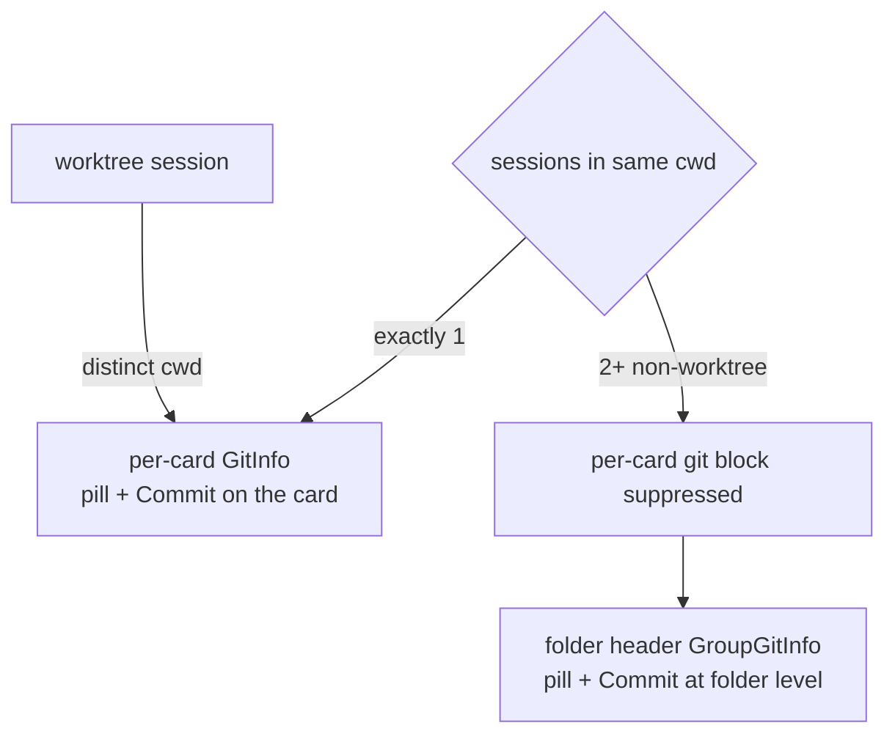
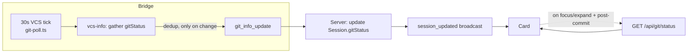
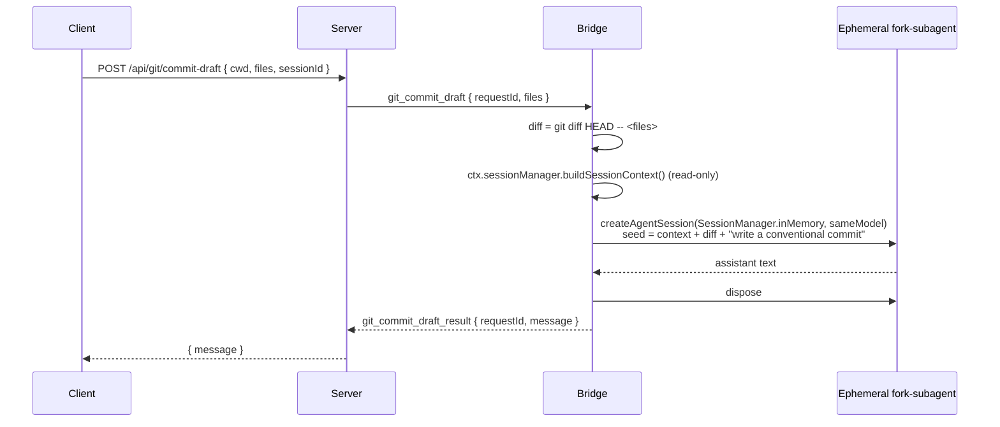

# Design

## 1. Data shape

Add to `DashboardSession` (`packages/shared/src/types.ts`):

```ts
gitStatus?: {
  dirtyCount: number;   // staged + unstaged + untracked (files, not hunks)
  staged: number;
  unstaged: number;
  untracked: number;
  ahead: number;        // commits ahead of upstream (0 when no upstream)
  behind: number;       // commits behind upstream
};
```

One `git status --porcelain=v2 --branch` call yields both the per-file states and the `# branch.ab +A -B` ahead/behind line — no second git invocation. Absent field = legacy bridge / probe inconclusive; the pill renders nothing.

## 1a. Placement — follow the existing git surface

The shell already decides where git lives per group: `showGitInfo={group.sessions.length === 1}` (`SessionList.tsx`). The indicator + commit MUST attach to that same surface, never duplicated:



| Case | Host | Status source | Commit acts on |
|---|---|---|---|
| 1 session / folder | `GitInfo` (card) | that session's `gitStatus` | the cwd |
| **2+ non-worktree, same cwd** | **`GroupGitInfo`** (folder header) | folder-head poll (`folderGitMap`) | the shared cwd (one tree, one commit) |
| worktree session | `GitInfo` (card) | that session's `gitStatus` | the worktree cwd |

**Commit semantics for grouped sessions.** One cwd = one working tree = one commit. The dialog is opened from the folder header; the file picker lists every changed file in the shared tree (which may include edits from sibling sessions) and stages only the chosen subset. A per-card Commit is intentionally **not** offered in the grouped case — it would imply independent commits when all cards share the same pooled changes. `CommitDialog` is placement-agnostic: it takes a `cwd` + the file list and does not care whether it was launched from a card or a folder header.

## 2. Data delivery — hybrid (user-confirmed)



- **Broadcast (solo/worktree cards)**: extend the existing `git_info_update` path (`vcs-info.ts` → `session-sync.ts`/`model-tracker.ts` dedup) with `gitStatus`. No new timer; reuses the 30 s cadence. Cost = one extra `git status` per tick per session (cheap; already running git in the tick).
- **Folder header (grouped sessions)**: read the count from the existing server-side folder-head poll that already feeds `GroupGitInfo.folderBranch` (`folderGitMap`). This poll runs once per cwd, so N same-cwd sessions do **not** each carry a redundant `gitStatus`. Extend that poll's payload with the same status counts.
- **On-demand (both)**: `GET /api/git/status?cwd=` → `getGitStatus(cwd)` for a fresh read when a card/folder is focused/expanded and right after a commit (so the pill updates without waiting up to 30 s). Client caches per-cwd like `branchCache`. Keyed by **cwd**, so the folder header and a solo card at the same path share one cache entry.

Trade-off accepted: up to 30 s staleness in the passive broadcast, erased by the on-demand refresh on interaction.

## 3. Commit flow

`POST /api/git/commit` `{ cwd, message, files: string[] }`:

1. Validate `cwd` (existing `validateCwd`), confirm it is a git repo.
2. `commitFiles({ cwd, message, files })` in `git-operations.ts`:
   - Stage the selected paths: `execFile("git", ["add", "--", ...files], { cwd })` — argv array, **no shell**, path-guarded to `cwd`.
   - Commit: `execFile("git", ["commit", "-F", "-"], { cwd, input: message })` — message via **stdin**, never interpolated into a command string (kills injection + handles multi-line body natively).
   - Return `{ commitHash, subject }` (`git rev-parse HEAD` + first line).
3. Route triggers a fresh `getGitStatus` broadcast so every client's pill updates.

Failure modes surfaced to the dialog: nothing staged, pre-commit hook rejects, not a repo, detached/no-identity. Return `{ success:false, code, error }`.

## 4. AI-drafted message — fork-subagent (primary)

The message is drafted by an **ephemeral in-process AgentSession** that inherits the live session's full, uncompressed context and is then discarded. The visible conversation is never appended to.



Mechanism notes (verified against `sdk.md`):
- `createAgentSession({ sessionManager: SessionManager.inMemory(cwd), model, ... })` + `await session.prompt(...)`; capture the assistant text off the event/message stream.
- Model = the live session's model (`getCurrentModelString`, `bridge-context.ts`).
- Context = `ctx.sessionManager.buildSessionContext()` (already called at `bridge.ts:2262`).
- Bounded: cap the seeded context + diff size; enforce a draft timeout (e.g. 30 s) → return a fallback stub message on timeout so the dialog never hangs.

### Fallback ladder (documented, in priority order)

| # | Mechanism | When used |
|---|---|---|
| 1 | **Fork-subagent** (above) — full context | Default |
| 2 | Stock subagent producer, **compressed** `inheritContext` | If instantiating a 2nd AgentSession in-process is unstable |
| 3 | Raw **diff-only one-shot** (no session context) | If no in-process agent path works |
| 4 | Manual entry only (AI-draft button disabled) | Model unavailable / draft errors |

Open verification (implementation task): confirm a second `AgentSession` can run inside the bridge's extension-host process without disturbing the primary session (event isolation, no shared mutable session manager state). This is the one real unknown; the ladder guarantees the feature still ships if it fails.

## 5. UI

- **Pill** (rendered by BOTH `GitInfo` and `GroupGitInfo`): `● N` (amber, `--status-*` token) when `dirtyCount > 0`; `↑A`/`↓B` chips when ahead/behind non-zero. Whole pill is a `<button>` → opens `CommitDialog` for that cwd. Tooltip: `N uncommitted · ↑A ↓B`. Extracted into a shared `GitDirtyPill` so both hosts render identically.
- **Commit button** — in `GitSubcard` (solo/worktree card) and in the `GroupGitInfo` folder-header action row (grouped sessions). Both call the same `openCommitDialog(cwd)`.
- **`CommitDialog`**: file list (checkbox + path + `+adds −dels` from `getGitStatus`), select-all/none, message textarea (subject line + body, char count on subject), **AI draft** button (idle → `Drafting…` spinner → fills editable textarea; re-draftable), Commit (disabled until ≥1 file + non-empty subject) / Cancel. Post-commit: toast `Committed <shortHash>`, close, refresh status.
- **Mobile**: pill shown inline; Commit opens a bottom-sheet variant of the dialog.

## 6. Plugin-ready boundaries

Every new artifact is self-contained for a clean `git mv` into `packages/git-plugin/` later: `CommitDialog.tsx`, `git-operations` additions (`getGitStatus`, `commitFiles`), `commit-draft.ts` (bridge), the three routes. No new coupling into `App.tsx`/`SessionList.tsx` beyond what `GitInfo` already has. `extract-git-as-plugin` gets a cross-reference note that its extraction must carry these.
