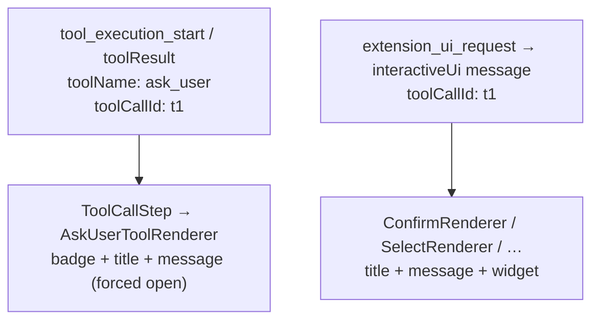

## Context

`ask_user` produces two chat messages that both describe the same question:



Both B and D render title + message ⇒ visible duplication while pending.

Two lifecycles constrain the fix:

- **Live session:** both messages present. Duplication happens here.
- **History reload:** the server replays only *pending* prompts. An already-answered
  `ask_user` has **no** `interactiveUi` message — only the `toolResult`. Here the tool
  card (with its batch/response reconstruction) is the **only** record and must keep
  rendering.

## Decision — conditional suppression keyed by `toolCallId`

The reducer already stamps `toolCallId` on the `interactiveUi` message (spec:
`event-reducer` → "interactiveUi ChatMessage carries toolCallId"). Use it as the join
key.

In `ChatView`, before rendering the `toolResult` branch, build a set of
`toolCallId`s owned by live `interactiveUi` messages in the current list:

```
const interactiveToolCallIds = new Set(
  messages
    .filter(m => m.role === "interactiveUi")
    .map(m => (m.args as { toolCallId?: string })?.toolCallId ?? (m.args as {...})?.requestId)
    .filter(Boolean)
);
```

Then in the `toolResult` branch:

```
if (msg.toolName === "ask_user"
    && interactiveToolCallIds.has(msg.toolCallId ?? msg.id)) {
  return null; // interactive card is the single render
}
```

- **Pending + live-answered (interactiveUi still in list):** tool card suppressed,
  interactive card is the only card. ✅ no duplication.
- **History reload (no interactiveUi):** set is empty → tool card renders as today. ✅
  record preserved.

Precedent: `ChatView` already suppresses widget-bar-placed `interactiveUi` messages
(`isWidgetBarPrompt`) — conditional suppression in this component is an established
pattern.

### Why not drop the interactive card instead

The interactive card owns the answer widget and the live/resolved answer state; the
tool card is a passive summary. Keep the interactive card; drop the redundant tool
card.

## Decision — resolved renderers render `message`

Today the resolved states of `ConfirmRenderer` / `SelectRenderer` /
`MultiselectRenderer` / `InputRenderer` omit `params.message`. With the tool card
suppressed, the description would vanish after answering. Add the same
`{message && <MarkdownContent content={message} />}` body already used in each
renderer's pending branch to its resolved branch (below the title, above the answer
summary). `cancelled` / `dismissed` compact states stay message-free (they are
intentionally terse).

This is additive and matches the existing `interactive-renderers` message-body
pattern; it only extends the state in which the body shows.

## Risks

- **Blast radius:** localized to `ChatView` + four renderers. No reducer, protocol, or
  server change — deliberately avoids the heavily test-guarded `event-reducer`
  ordering path.
- **toolCallId absence:** if a `toolResult`/`interactiveUi` pair ever lacks a shared
  `toolCallId`, the set misses and the tool card renders (falls back to today's
  behavior — duplication, not data loss). Covered by a test asserting the join key is
  present for a live `ask_user`.
