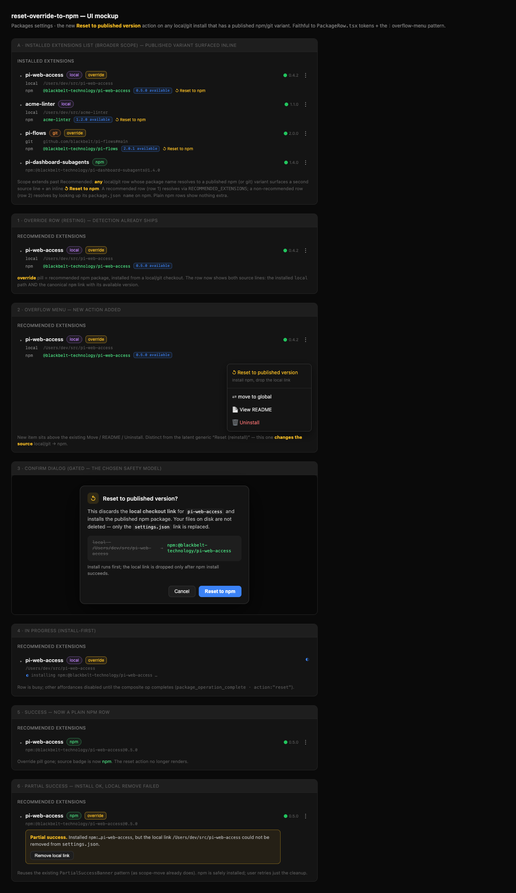

## Why

The Packages settings UI already **detects** source overrides: a recommended
extension declared as npm (`RECOMMENDED_EXTENSIONS[].source = "npm:<name>"`)
but actually installed from a local checkout or git URL renders an
informational **`override`** pill (`isSourceOverride(pkg)`, shipped in
`flag-package-source-overrides`).

The problem: **detection is dead-end.** A user who wants the canonical
published version has no in-UI path back. They must manually edit
`settings.json#packages[]` to drop the local/git entry, then re-install the
npm spec via the CLI (the `switch-extension-source` skill workflow). The pill
tells them they are on an override but offers no way to leave it.

This change adds the missing **action**: a per-row affordance that resets a
local/git install back to its published npm (or git) variant. Scope extends
past recommended overrides to **any** installed extension whose package name
resolves to a published variant.

## What Changes

- **New atomic "reset to npm" operation.** A **Reset to published version**
  action installs the canonical `npm:<name>` spec and then drops the local/git
  `settings.json#packages[]` entry — **install-first, remove-second**, so a
  failed npm install never leaves the user with neither source. Modeled on the
  existing `/api/packages/move` route, which already does atomic install-new +
  remove-old. Offered in the `⋮` menu AND inline in the row (see dual source
  lines below).

- **Dual source-line display.** A local/git-installed row with a resolvable
  published variant renders TWO source lines: the installed `local`/`git` path
  AND the canonical `npm`/`git` link with its available version
  (`0.5.0 available`). The published link makes the reset target visible
  without opening a menu, and carries an inline **↺ Reset to npm** affordance.

- **Extended detection scope.** Detection is no longer limited to
  `RECOMMENDED_EXTENSIONS` overrides. Any local/git install whose package name
  resolves to a published variant surfaces the second source line + reset
  action. Two resolution paths: recommended rows resolve via
  `RECOMMENDED_EXTENSIONS`; non-recommended local rows resolve by looking up
  their `package.json name` against the npm registry (see design.md — network,
  caching, name-collision, and "no published variant" handling).

- **Confirm dialog.** The action is gated behind a confirm dialog
  ("This discards your local checkout link and installs the published npm
  version") because an override is frequently *intentional* (a developer
  running a live local checkout). The action must read as deliberate opt-out,
  never as "you should fix this".

- **Canonical npm spec resolution.** The row's `source` is the local/git path,
  not `npm:<name>`. The server enricher SHALL expose the resolved published
  source on the wire (new optional `InstalledPackage.publishedVariantSource`,
  e.g. `npm:@scope/name`, plus its available version) so the client can render
  the second line and target the install. `isRecommended` alone (a boolean) is
  insufficient.

## Mockup

Interactive: [`mockup/index.html`](mockup/index.html) (dark-theme, faithful to
`PackageRow.tsx` tokens + the `⋮` overflow-menu pattern). Static capture:

States shown: (A) the broader **Installed Extensions** list where any
local/git row with a resolvable published variant surfaces a second source line
+ inline **↺ Reset to npm** (recommended row via `RECOMMENDED_EXTENSIONS`,
non-recommended `acme-linter` via npm-name lookup, a `git` override, and a
plain npm row with nothing extra); (1) resting override row with dual source
lines; (2) the new **Reset to published version** item in the `⋮` menu; (3)
the confirm dialog with the local→npm swap and "install runs first" note; (4)
install-first progress; (5) success collapsing to a plain npm row (override
pill gone); (6) partial success reusing `PartialSuccessBanner` when the local
remove fails after a good install.

## Capabilities

### New Capabilities

(none — extends existing capabilities only)

### Modified Capabilities

- `pi-core-version-ui`: any local/git row with a resolvable published variant
  gains a second source line (published link + available version) and a
  **Reset to published version** action (confirm-gated). No change to
  Update/Uninstall/Move behavior; plain npm rows are unchanged.
- `package-management`: a new atomic composite reset operation (install
  `npm:<name>` → remove local/git entry) alongside the existing scope-to-scope
  `move` op, reusing the `package_operation_complete` protocol.

## Impact

**Code**:
- `packages/shared/src/rest-api.ts` — add optional
  `InstalledPackage.publishedVariantSource?: string` +
  `publishedVariantVersion?: string`.
- `packages/server/src/routes/package-routes.ts` — new
  `POST /api/packages/reset-to-npm { source, scope }` (or extend the move
  handler) performing atomic install-first / remove-second, emitting a
  `package_operation_complete` with a `reset` action + PartialSuccess semantics
  on the remove step failing after a successful install.
- `packages/server/src/package-manager-wrapper.ts` — add `"reset"` to
  `PackageAction`; enricher populates `publishedVariantSource` via
  `matchRecommendedEntry()` (recommended) or an npm-registry name lookup
  (non-recommended local rows), with caching.
- `packages/client/src/lib/package-queue.ts` — add `reset` action to the queue.
- `packages/client/src/components/PackageRow.tsx` — on `isOverride`, render a
  **Reset to published version** control that opens a confirm dialog; render
  the second source line (published link + available version) + inline reset.
- `packages/client/src/components/InstalledPackagesList.tsx` /
  `UnifiedPackagesSection.tsx` — wire the reset handler + pass
  `publishedVariantSource`; apply beyond the Recommended group.

**APIs**: one new (or extended) REST route; one new `InstalledPackage` field;
one new `PackageAction` value. WS `package_operation_complete` gains a `reset`
action value.

**Docs**: AGENTS.md rows for the touched files; a `switch-extension-source`
skill cross-reference (this is its GUI equivalent).

**Prior art / alignment**: `/api/packages/move` (atomic install+remove),
`PartialSuccessBanner` (partial-failure UX), `switch-extension-source` skill
(CLI npm↔local switch — keep semantics aligned).
