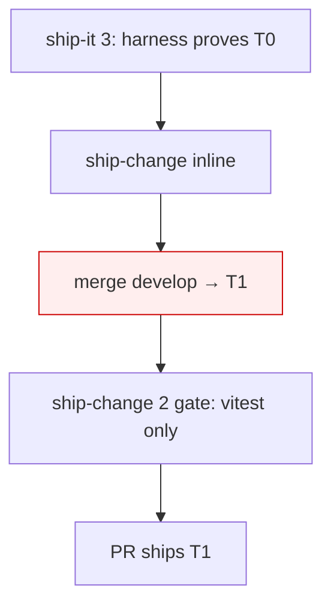

## Context

Explore-mode finding (session `019f627c`): `ship-change` step 5 opens a PR with
no `develop`-integration step. The PR can carry a tree no local gate validated.
The naive fix ("merge before the PR") is insufficient under `ship-it` because the
gate that matters there — the e2e harness — runs *before* `ship-change`.

## The ordering problem

Two gates exist, of unequal strength:

| Gate | Where | Strength |
|---|---|---|
| docker e2e harness | `ship-it` step 3 | strong (e2e) |
| vitest + build | `ship-change` step 2 | weak (unit) |

Under `ship-it`, the harness proves tree `T0`, then `ship-change` runs. If the
`develop` merge lands *inside* `ship-change` (e.g. a late pre-PR step), the PR
ships `T1 = T0 + merge` — validated only by the weak vitest gate. Anything
e2e-only slips through.



**Principle:** the merge must sit upstream of the *strongest gate that will run*.

## Decision

Two integration points, layered:

- **`ship-it` step 2.5 — primary.** Merge `origin/develop` *before* the harness
  (step 3). Harness now validates `T1`. This is the real gate for the ship-it
  path.
- **`ship-change` step 1.5 — backstop.** Merge `origin/develop` *before* the
  verify gate (step 2). No-op when ship-it already merged; the genuine
  integration point for **standalone** `ship-change`; catches the narrow race
  where `develop` advanced during the harness run (then the weak gate re-checks
  and, if ship-it re-runs, re-harnesses).

```
ship-it: 1 orient → 2 apply → 2.5 merge develop → 3 harness → 4 fix → 6 ship-change
ship-change: 1 defer → 1.5 merge develop → 2 gate → 3 archive → 4 commit → 5 PR
```

## Rejected: rebase

`git rebase develop` rewrites F,G,H → F',G',H' and **requires a force-push**.
`ship-change` pitfalls explicitly warn "never force-push a misaligned branch" and
document worktree non-ff misalignment. Step 9 (`gh pr merge --squash`) collapses
the branch to one commit, so rebase's only advantage (linear history) is erased.
Merge keeps history honest and needs no force-push. **Merge, not rebase.**

## Rejected: merge on every push in the CodeRabbit loop

Re-merging `develop` on each push (steps 6–8) triggers the documented "worktree
carries develop merges but MISSES the PR feature commit" non-ff misalignment.
Discipline: merge **once** before the PR; re-merge in the loop **only** when CI
reports `mergeStateStatus=DIRTY` (existing reactive pitfall, unchanged).

## Mechanics (both sites)

- `git fetch origin develop` then `git merge --no-edit origin/develop` — the
  **remote ref**. Never `git merge develop`: local `develop` is checked out in
  the parent repo → worktree branch-collision pitfall.
- Idempotent: up-to-date → "Already up to date", no merge commit, safe to always
  run.
- Conflicts → existing recipes: `AGENTS.md` union-keep
  (`git checkout origin/develop -- <path>/AGENTS.md`, re-apply own rows);
  `package-lock.json` → `git checkout --theirs` + `npm install --package-lock-only`.
- On unresolved conflict the merge **aborts and STOPs** (report), never proceeds
  to a red gate.

## Open questions

- **develop-moved-during-harness race:** ship-change 1.5 re-merges but only the
  weak gate re-runs; a full re-harness would need a loop back to ship-it 3. Is
  the weak-gate backstop acceptable, or worth a re-run guard? (Deferred; low
  probability — harness runs are minutes.)
