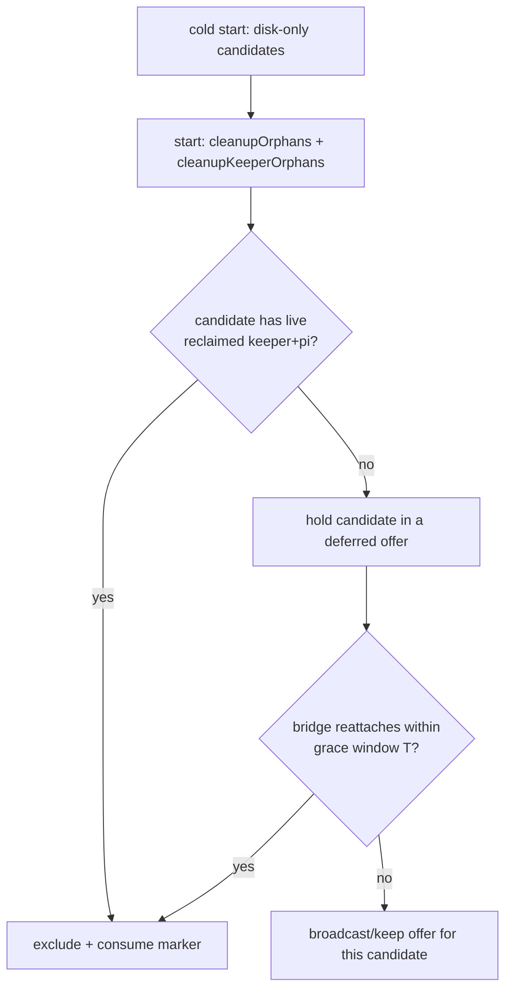

## Context

Cold-start recovery has two independent startup passes that never talk:

- **Classification** (`createServer()`, server.ts ~303) — pure function of `.meta.json` (`live`, `status`, `closedReason`, `kind`). Builds `recoveryCandidates`, normalizes all to `ended`.
- **Process reclaim** (`start()`): `cleanupOrphans()` (headless PID file, server.ts:1607) then `cleanupKeeperOrphans()` (keeper socket scan, server.ts:1617) — both determine which sessions' pi processes survived. Runs BEFORE the offer broadcast (server.ts:2074).

The offer is broadcast from the disk-only candidate list and never subtracts what reclaim just proved alive. Bridges (tmux/TUI/mDNS) reattach even later, in the ended→alive branch (server.ts:365), which also does not retract the offer.

Ordering is favorable: `1617 (keeper reclaim) < 2074 (offer)`, so the keeper signal is already available at broadcast time. The bridge signal is not — it arrives asynchronously after 2074.

## Goals / Non-Goals

- **Goal:** Offer reopen ⟺ no process-carrier proves the session alive (keeper reclaim OR bridge reattach within a grace window).
- **Goal:** Preserve the offer for genuine losses (crash / full PC reboot).
- **Goal:** Eliminate the double-spawn "can't send messages" symptom as a consequence.
- **Non-Goal:** Changing `/api/restart` semantics — keeper durability already makes restart transparent; the defect is offer gating, not restart.
- **Non-Goal:** New user-facing setting or migration.

## Decisions

### Decision 1: Two-channel liveness gate (sync keeper + async bridge)

- **Class 1 (keeper):** at/after 1617, correlate each candidate `sessionId` to the reclaimed live keeper set (`discoverExistingKeepers` returns `{sessionId, keeperPid, sockPath}`) and/or `headlessPidRegistry` alive pi by cwd/token. Exclude matches from `recoveryCandidates` before broadcast; consume their markers.
- **Class 2 (bridge):** defer the broadcast by a grace window `T` after `start()`; any candidate whose bridge re-registers (`registerReason:"reattach"`) in `T` is dropped + marker consumed. After `T`, broadcast the survivors. Also retract in the ended→alive branch for late reattaches (belt-and-suspenders / replay path).

**Alternative rejected:** clear `live:false` inside `/api/restart` before exit. Insufficient — it only covers the dashboard-initiated restart, not a supervisor/OS kill of the server, and races the exit; the liveness gate is the general fix.

### Decision 2: Grace-window duration `T`

Must exceed typical bridge reattach latency (mDNS discovery + WS reconnect backoff) but not delay a legitimate crash offer noticeably. Start at ~1500–2500 ms (tunable, mirror `RESTART_QUIESCE_MS`-class constants). The offer is sticky/non-timed once shown, so a slightly late offer is acceptable; a premature offer is the bug. Validate against the spike + a reattach-latency measurement.

### Decision 3: Marker consumption on retract

A retracted candidate consumes its on-disk liveness marker (`setLiveness {live:false}`), identical to dismiss and clean stop — so a subsequent cold boot with no new unclean shutdown does not re-offer it. This mirrors the existing "shown once per dirty boot" invariant.

### Decision 4 (optional, defense-in-depth): resume liveness re-check

`handleResumeSession` `continue` currently guards only on in-memory `status !== "ended"`. Add a keeper/bridge liveness re-check so that even if a stale offer slips through, Reopen refuses to double-spawn a session whose process is alive (returns `resume.already_active`). Cheap and closes the race permanently.

## Risks / Trade-offs

- **Grace-window tuning:** too short → phantom offers persist for slow reattaches; too long → real-crash offer feels laggy. Mitigate with a measured default + the spike's control case (dead session still offered).
- **Correlation key:** cwd is ambiguous (two sessions share a cwd); prefer sessionId via keeper `sockPath` (precise) and fall back to registry pid/token links. Document the chosen key.
- **Auto mode:** `auto` resumes candidates without prompting — it must ALSO subtract keeper-alive/reattached sessions, or it will double-spawn silently. The gate applies to `auto` as well as `ask`.

## Migration Plan

None. Pure server-side offer-gating change; no schema, no setting, no client protocol change required (bridge reattach + keeper reclaim already exist). Client `RecoveryOfferHost` unchanged.

## Open Questions

- Exact correlation key for Class 1 (sessionId-via-sockpath vs headless-registry cwd/token) — pick the most precise available at broadcast time.
- Should the deferred-offer window be per-candidate (drop individually as bridges reattach) or a single batched delay? Per-candidate is more correct for mixed fleets.
