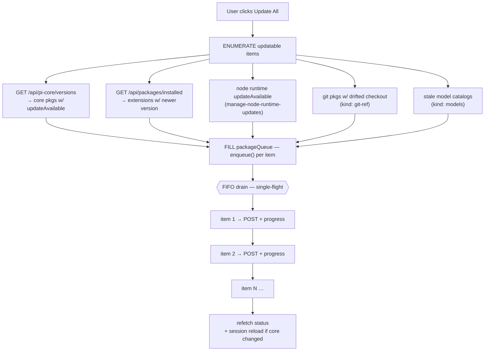

# Design: unify-pi-core-into-package-queue

## Context

The dashboard tracks three kinds of long-running package operations:

| Kind | Server endpoint | Server class | Client state owner today | Rides `packageQueue`? | Retries 409? | Survives unmount? |
|---|---|---|---|---|---|---|
| Extension install/remove/update | `POST /api/packages/{install,remove,update}` | `PackageManagerWrapper.run` | `packageQueue` (module singleton) | ✓ | ✓ once | ✓ |
| Move | `POST /api/packages/move` | `PackageManagerWrapper.move` | `moveTracker` (`lib/nav/move-tracker.ts`) | ✗ | ✗ **never** | ✓ |
| Reset-to-npm | `POST /api/packages/reset-to-npm` | `PackageManagerWrapper.reset` | `moveTracker` (`kind: "reset"`) | ✗ | ✗ **never** | ✓ |
| Pi-core update | `POST /api/pi-core/update` | `PiCoreUpdater.update` | **`UnifiedPackagesSection` `useState`** | ✗ | ✗ **never** | ✗ |

All four share the same server-side busy lock: `PackageManagerWrapper.busy` is checked by `run` (extension, `:275`), `move` (`:305`), `reset` (`:348`), and `runExclusive` (pi-core, `:258`). The lock is global and source-agnostic. Two ops cannot run concurrently regardless of kind; the loser gets `PackageOperationInProgressError` (`:810`) → HTTP 409.

**Only one of the four op classes both queues and retries.** The other three POST immediately and surface a raw 409 to the user. This change fixes the pi-core row of that table; move and reset are addressed by a follow-up (see Non-goals) but are recorded here because they are the *same defect*, not a separate one.

The asymmetry is purely on the client. Pi-core was added before the queue existed and the state ended up in component-local `useState`. The screenshot bug — *"button reverts to enabled with red 409 error after navigating away and back"* — is the direct consequence: unmount discards `useState`, the queue/server stays busy, and the next click 409s.

A narrower fix (a parallel `pi-core-update-tracker.ts` mirroring `move-tracker.ts`) would address the screenshot bug without addressing the cross-domain 409 class (extension install during pi-core update → 409 → confusing red error on the wrong-looking row, and vice versa). This change addresses the screenshot bug by routing pi-core through `packageQueue`, and the cross-domain class by disabling lock-taking controls while any operation runs (D9). Routing pi-core through the queue is *not on its own* sufficient for the cross-domain case — it stops the Core group from initiating a conflict, but every extension row can still fire one.

## Goals / Non-goals

### Goals

1. The screenshot reproduction disappears.
2. Pi-core update state survives `UnifiedPackagesSection` unmount/remount.
3. Cross-domain 409s are eliminated: an extension install enqueued while pi-core is updating is automatically queued, not POSTed-then-409'd.
4. There is exactly **one** module-level state machine for "single-flight package operations" on the client.
5. The change is reversible — pure client refactor with no protocol or server changes.
6. **No enabled click is silently lost.** Every row control stays clickable while an operation runs; a click enqueues and the row visibly reports `queued` → `running` → result. The defect was never "a button was enabled" — it was "the button silently failed". Disabling controls trades a silent failure for an inert one and answers the wrong question. Only controls that genuinely *cannot* be queued (move / reset-to-npm, see D9) are disabled, and they say why. (D9)

### Non-goals

- **Bringing `moveTracker` (move + reset-to-npm) into the queue.** Deferred, but *not* for lack of justification — an earlier draft of this design claimed "there's no bug-fix justification for the refactor" and that claim is **false**. `move` and `reset-to-npm` bypass `packageQueue` entirely (`packages-api.ts:56` / `:113`, invoked directly by `usePackageOperations.move` / `.resetToNpm`), take the same busy lock, and have **no 409 retry whatsoever** — strictly worse than extension ops and failing in exactly the way pi-core does. They register into `moveTracker` only on a successful POST; a 409 leaves no queued work behind at all.

  The real reason to defer is scope and shape, not absence of a bug: moves are `moveId`-keyed, multi-phase, and carry partial-success semantics (install OK / remove failed), so they do not fit the source-keyed `statusFor(source)` contract without a second identity axis. Folding them in alongside the pi-core migration would roughly double this change's surface and couple two independent refactors.

  **Mitigation in the interim**: Goal 6 / D9 disables move and reset controls while any operation is running — and *only* those two — so the *user-visible* 409 disappears for all four op classes even though only pi-core is migrated. Every queueable control stays clickable. A follow-up change should complete the unification and let these two be queued like the rest.
- Making the queue durable across a hard page reload or shared across browser clients. See the multi-client note under R5.
- Server-side reload debouncing. With "Update All" splitting into N enqueues, each pi-core update triggers its own session reload. Documented as a trade-off; if it becomes a UX issue, a follow-up change can add a debounce window inside `PackageManagerWrapper`.
- Resuming "is updating?" state after a hard page reload. Same rationale as the previous design draft — the queue is in-memory and rehydration would require a new server endpoint we're not adding.
- Unifying the WebSocket dispatch channels (`pi-core-event` and `pi-package-event`). The two event shapes are different; the channel boundary acts as a useful pre-filter at the message-handler routing layer.
- **A global "Update All" button that updates core + extensions + Node + git refs + model catalogs in one action.** This change is the *prerequisite* for it (see "Forward design: Update All as a queue fill" below) but does not ship it. D3's "Update All" is scoped to the Core sub-group only, which is existing behaviour being migrated — not a new feature.
- **Migrating `moveTracker` far enough to queue move / reset-to-npm.** D9 disables those two controls while any operation runs precisely because they cannot yet be queued. Making them queueable needs a second identity axis in the queue (`moveId` alongside `source`) plus partial-success state — a separate change.
- Adding `kind: "git-ref"` or `kind: "models"` arms. This change introduces the discriminator with exactly two values. The extension points are designed for (D7) but not built.

## Decisions

### D1. Add a `kind: "extension" | "pi-core"` discriminator to the queue's op record

**Decision**: Extend `RunningOp` and `EnqueueRequest` with `kind`. Default value `"extension"` for every existing call site. `postOperation` switches on `kind` to choose the endpoint and completion strategy.

**Why a `kind` field instead of source-prefix-only**: source strings already carry too much meaning (package names, URLs, file paths). Reusing the same string slot to encode the operation kind via a `pi-core:` prefix is fragile — a future user could legitimately install an npm package literally named `pi-core` and the prefix collides. Explicit `kind` keeps dispatch deterministic. The `pi-core:` source prefix is kept as a self-documenting convention but is not the dispatch key.

```ts
interface RunningOp {
  operationId: string | null;
  source: string;
  kind: "extension" | "pi-core";   // NEW
  action: PackageAction;
  scope: PackageScope;
  cwd?: string;
  message: string;
  retries: number;
}
```

### D2. Pi-core completion is signalled by the POST response, not by a WebSocket event

**Decision**: For `kind: "pi-core"`, `postOperation` calls `completeRunning(success, message)` directly when the `fetch` resolves. The `pi_core_update_complete` WebSocket event is a no-op for the queue.

**Why this is correct**: the pi-core endpoint is *synchronous* from the client's perspective — `await piCoreUpdater.update(...)` only resolves when every npm update finishes, and the HTTP response carries the full results. There is no async ack pattern. Waiting for a WS event would be redundant and would re-introduce a race (POST resolved → WS hasn't arrived yet → queue thinks op is done when it actually is).

**Important ordering note**: server-side, the WS broadcast happens *before* the HTTP response returns (`packages/server/src/routes/pi-core-routes.ts:124-130` — `onUpdateComplete(out)` runs before `return { success: true, data: out }`). So in practice the WS event will *typically* arrive at the client before the POST `fetch()` resolves — it is the **common case**, not an edge case. The queue's "ignore the WS event" rule is what makes this work; without it, the queue would prematurely transition based on a WS event that arrived a few milliseconds before the HTTP response, then receive a contradictory completion when the response did arrive.

The extension flow is genuinely async (`run()` returns `operationId` immediately, executes in the background, completion arrives via WS). The two flows have different completion semantics and the queue must handle them differently. The discriminator is `kind`.

```
   Extension flow                 Pi-core flow
   ─────────────────────           ────────────────────────────────
   POST → 202 + operationId        POST → blocks 5–30 s on server
   running.message updates         running.message updates
     via package_progress             via pi_core_update_progress
   final state:                    final state:
     package_operation_complete       POST resolves with results
                                      (WS pi_core_update_complete also
                                       arrives but is ignored by the queue)
```

### D3. Pi-core "Update All" splits client-side into N single-name enqueues

**Decision**: When the user clicks "Update All" in the Core sub-group, the client iterates over `updatableCore` and calls `operations.coreUpdate(name)` for each. Each enqueue produces a single-name POST to `/api/pi-core/update` with `{packages: [name]}`. The queue serializes them via FIFO.

**Why not a single batch enqueue**: a batch source key (`pi-core-batch:pi+pi-dashboard+pi-model-proxy`) would force every Core row's render path to do a substring/contains match against `running.source` to decide its own busy state. That's a meaningful discriminator surface in the hot path — every render of every Core row becomes a string-search.

Splitting into N single ops keeps the source-key contract simple (`statusFor(s)` is still strict equality) and gives the user nicer feedback (per-package progress in the queue rather than an opaque "updating 3 packages…").

**Trade-off**: N session reloads instead of 1. Acceptable for typical N = 2-3. Documented as a trade-off; can be addressed later by a server-side reload debouncer that's orthogonal to this change.

**Why not preserve the batch endpoint shape and keep the client-side batch model**: that's effectively the same as the dropped "batch source key" option — same render-path issue.

### D4. The queue subscribes to both `pi-core-event` and `pi-package-event`

**Decision**: The `PackageQueue` constructor attaches **two** `addEventListener` calls: one to `pi-package-event` (existing) and one to `pi-core-event` (new). The handlers are separate methods (`onWindowEvent` for extension events, `onPiCoreEvent` for pi-core events) to keep the type-narrowing readable.

**Why not a single channel**: the two event payloads have meaningfully different shapes (`{source, action, type, message}` vs `{name, phase, message?}`). Routing both through one channel would require unconditional shape detection in every consumer, including future ones. Better to keep the channel as a pre-filter and accept two `addEventListener` calls.

**Why not a third "package-operation-event" channel that merges both**: that's the same kind of shape-erasure but with extra moving parts. The current two-channel routing in `useMessageHandler.ts` is fine; we just teach the queue to listen to both.

### D5. The hook surface gets a typed helper, not a polymorphic `enqueue`

**Decision**: `usePackageOperations` adds `coreUpdate(name: string): void` that constructs the right `EnqueueRequest`. The `name` is the full scoped npm name (e.g. `@mariozechner/pi-coding-agent`), matching `PiCorePackage.name` from `GET /api/pi-core/versions`. Existing methods (`install`, `remove`, `update`, `move`) are preserved unchanged.

**Scope semantics for pi-core ops**: `EnqueueRequest.scope` is set to `"global"` as a non-meaningful placeholder. The `/api/pi-core/update` endpoint does not read `scope`; per-package install location is determined server-side from `PiCorePackage.installSource` (npm-global vs `~/.pi-dashboard/`). Picking `"global"` satisfies the `EnqueueRequest.scope: PackageScope` type without introducing a third enum value or making the field optional. The placeholder is invisible to all consumers — no UI or hook reads `running.scope` for pi-core ops.

**Why not expose `enqueue` directly with a `kind` parameter**: the type-safety win from a dedicated helper is small but the discoverability win is substantial. `coreUpdate` clearly signals that pi-core is a different kind of operation. Future maintainers can grep for the helper and understand the dispatch surface; a polymorphic `enqueue({source, kind, action, ...})` blends pi-core into a sea of every other call.

The same pattern is already used by `move`, which has its own typed helper (`move(entry, args)`) instead of being shoehorned through the queue.

### D6. Component-level error attribution stays the same shape

**Decision**: The Core sub-group rows continue to show `error` text directly under the row when `statusFor("pi-core:" + name) === "error"`. The error message is read from `messageFor(...)`, which the queue populates the same way it populates extension error messages.

**Why preserve the per-row error display**: it's the existing UX pattern, established for extension rows. Migrating pi-core onto the same hook automatically gives pi-core the same error rendering. No new design surface.

### D7. `kind` is an open union, deliberately sized for future operation classes

**Decision**: `kind` is introduced with two values (`"extension" | "pi-core"`), but `postOperation`'s dispatch is written as an exhaustive `switch` on `kind` rather than an `if (kind === "pi-core")` special-case. Adding a third operation class is then a new `case` plus a new endpoint — no restructuring.

**Why this matters now**: three further operation classes are already specified or identified elsewhere, and all of them share the same server busy lock, meaning all of them *must* eventually ride this queue or they will reproduce exactly the 409 bug this change fixes:

| Future `kind` | Endpoint | Source of the requirement |
|---|---|---|
| `"node"` | `POST /api/pi-core/update-node` | change: `manage-node-runtime-updates` |
| `"git-ref"` | *(none yet)* — reconcile a pinned git package's checkout | gap vs `pi update --extensions`; see D8 |
| `"models"` | *(none yet)* — refresh model catalogs | gap vs `pi update --models`; see D8 |

**Why not add them in this change**: two of the three have no server endpoint yet, and `"node"` belongs to a separate in-flight change. Introducing unused union members would be speculative. The `switch` shape is the entire forward investment — it costs nothing and prevents the next author from bolting on a second special-case.

### D8. The dashboard does NOT delegate to the pi CLI's `pi update --all`

**Decision**: The dashboard keeps updating packages by invoking `npm install <pkg>@latest` at a *specific resolved install location* (`packages/server/src/pi/pi-core-updater.ts`). It does not shell out to `pi update --all` / `--extensions` / `--models`, even though that command family exists and nominally covers more ground.

**Why this is recorded here**: this queue is the dashboard's update engine. Anyone extending it (especially for the `"git-ref"` and `"models"` arms in D7, which are *precisely* the capabilities `pi update --all` already has) will ask "why not just call the CLI?" The answer is structural, not incidental.

**Why not**: `pi update --all` acts on whichever `pi` binary is invoked. There is no single canonical `pi` on a given machine — `ToolRegistry` (`packages/shared/src/tool-registry/definitions.ts`) resolves `pi` through an ordered chain, and the doctor skill's `pi-resolution` module exists specifically because a machine routinely has several installs at once (override, bundled server `node_modules`, `~/.pi-dashboard` managed, npm-global, nvm-global, `PATH`, bundled-Electron resources).

Three concrete consequences:

1. **Ambiguous target.** `--all` updates the install belonging to the binary that ran. That is not necessarily the install a given pi *session* is running. The user would see "updated" while their session's bytes are untouched.
2. **Not always a runnable CLI.** Several resolution strategies (`bareImportCliStrategy`, `managedModuleStrategy`) yield a *module directory*, not a `pi` executable. Invoking the CLI means reconstructing `[node, <dir>/dist/index.js, update, --all]` — and `--all` then reconciles against *that* install's settings scope, not a scope the dashboard chose.
3. **Loss of determinism.** The current updater knows exactly which bytes it replaces because it targets a resolved location explicitly. `--all` delegates that decision to the invoked pi's own settings resolution, which the dashboard cannot observe or constrain.

The dashboard's job is to manage *all* of a machine's pi installs coherently; `pi update --all` is inherently single-install. The capability gaps it would have covered (git-ref reconciliation, model-catalog refresh) are therefore closed **natively, per-location**, as new `kind` arms per D7 — not by delegation.

**Verified against pi 0.83 (installed)**: `pi update` still exposes **no** `--prefix` or any other target-location argument. It therefore updates whichever install the invoked binary belongs to — the ambiguous-target problem above is unchanged — and `--all` additionally reconciles extensions, model catalogs and pinned git refs, i.e. a broader blast radius than the dashboard is asking for. Both objections stand at 0.83; the location-targeted updater stays.

**Reversibility**: this is a design stance, not code. If pi ever exposes a location-targeted update (`pi update --all --prefix <dir>` or equivalent), the `"git-ref"`/`"models"` arms could be reimplemented as CLI invocations behind the same `kind` dispatch, with no change to the queue contract.

### D9. The queue is visible; buttons stay clickable

**Decision**: Row controls stay **enabled** while another operation runs. A click **enqueues**, and the row renders `queued` → `running` → result. The queue drains FIFO, one at a time, exactly as `packageQueue` already does. Only `moveTracker`-backed controls (Move, Reset-to-npm) are disabled while any operation runs.

**This reverses an earlier draft of this decision**, which said "disable every lock-taking control while any operation is running". That draft misidentified the defect. The reported bug is not *"a button was enabled"* — it is *"the button silently failed"*: the click produced a 409 the user could not have predicted and could not act on. Disabling the control removes the 409 but replaces it with a different unexplained dead end: the user clicks nothing, learns nothing, and a long core update freezes the entire packages UI for minutes. **Both failures are the same class — the UI not telling the truth about what it did with the click.** Making the queue visible is the answer that actually holds: the click is accepted, its consequence is stated, and the work happens in a predictable order.

**Concretely**:

| Control | While another op runs | Rationale |
|---|---|---|
| Core row Update | **enabled** → enqueues, renders `queued` | rides `packageQueue`, source-keyed |
| Extension row Update / Install / Remove | **enabled** → enqueues, renders `queued` | same |
| Core group "Update All" | **enabled** → fills the queue, one entry per detected core package | dedupe makes repeat clicks idempotent |
| **Move** | **disabled**, with reason in a tooltip | bypasses the queue — see below |
| **Reset-to-npm** | **disabled**, with reason in a tooltip | bypasses the queue — see below |

**Why Move and Reset-to-npm are the sole exceptions.** They do not ride `packageQueue`; they register into `moveTracker` (`lib/nav/move-tracker.ts`) and POST directly (`packages-api.ts`). Their identity is `moveId`, not `source`, and they carry partial-success semantics (install at destination succeeded, remove at origin failed) that the source-keyed `statusFor(source)` contract cannot express without a second identity axis. Because they are not queued, they take the server busy lock directly **and have no 409 retry at all** — strictly worse than the queued paths. So for these two, and only these two, disabling is the honest option: the operation genuinely cannot be accepted right now, and the tooltip says so. Migrating them into the queue is recorded as a Non-goal.

**Signals**: three separate props, deliberately not conflated —

- `busy` (own-source running) → spinner + progress text.
- `queued` (own-source queued) → `queued` pill + "Queued" action label; the row's own button is disabled because the work is *already registered and visible*, which is the opposite of losing the click.
- `locked` (`isAnyRunning`) → disables **only** Move / Reset-to-npm, with `lockedReason` as the tooltip.

Conflating `busy` with `locked` would either spin every row at once or disable the whole panel.

**Dedupe is what makes leaving buttons enabled safe.** `enqueue` dedupes on the **(source, action)** pair rather than on `source` alone. An exact repeat (double-click, or "Update All" clicked twice) is dropped, so nothing stacks; but `remove npm:foo` is still distinct work from `update npm:foo` and is no longer swallowed just because the other is pending. Note the dropped duplicate is not a lost click either — the row is already showing `queued` for that exact work.

**Trade-off**: the queue can grow deep enough that the tail waits a long time behind several core updates (each ~5-30 s plus a session reload). That is honest and legible — the depth is visible per row — and strictly better than either a silent 409 or a frozen panel. What it does *not* fix is the multi-client case (R5): a second browser tab's FIFO cannot see this one's, so cross-client 409s remain possible.

### D10. Pi-core completion must clear only the packages it completed

**Decision**: pi-core completion handling clears per-package state keyed by name, never the whole collection.

**The latent defect**: today the WS handler does

```ts
} else if (msg?.type === "pi_core_update_complete") {
    setCoreUpdating(new Set());     // :119 — clears ALL
    setCoreProgress(new Map());     // :120 — clears ALL
```

This is *currently correct by accident*: `doCoreUpdate(packages)` sends one batch POST for every selected package, so exactly one `pi_core_update_complete` arrives carrying `results[]` for all of them. Clearing everything is right when there is only ever one in-flight batch.

**D3 breaks that assumption.** Splitting "Update All" into N single-name enqueues means N sequential POSTs and N completion events. Under the current handler, the *first* completion would wipe the spinner and progress state for the packages still queued or running — rows would look idle while work continued, which is the same false-idle illusion as the original screenshot bug.

Routing pi-core through `packageQueue` fixes this structurally, because the queue keys state per source (`pi-core:<name>`) and `completeRunning` only transitions the running op. The requirement is recorded as an explicit decision so the migration is not implemented in a way that reintroduces collection-wide clearing, and so the accompanying test asserts it: with two core packages enqueued, the first completion must leave the second's row busy.

**Also**: `setCoreErrors(errs)` replaces the error map wholesale on every completion, so an error from package 1 vanishes when package 2 completes. Per-source error state in the queue resolves this for free.

## Risks / Trade-offs

### R1. N session reloads on "Update All"

**Mitigation**: documented above (D3 trade-off). For typical N = 2-3, total reload overhead is ~3-6 s on top of npm-update time. Not catastrophic; not invisible.

**Future**: a server-side reload debouncer (`PackageManagerWrapper.scheduleReload(deferMs)` that coalesces requests within a window) would address this for all package operation kinds, not just pi-core. Out of scope for this change.

### R2. `statusFor("pi-core:" + name)` collides with a hypothetical extension named `pi-core`

**Mitigation**: vanishingly unlikely (`pi-core` is not a real npm package), and the `kind` field makes dispatch deterministic regardless of source-string collisions. The prefix is convention, not contract.

**Detection**: if it ever happens, the colliding extension would be visible in the queue's per-source state alongside any pi-core update of the matching name. Easy to spot in the UI and quick to fix by namespacing the prefix more aggressively (e.g. `__pi-core__:pi`).

### R3. Pi-core POST is slow; the queue's running op has a long lifespan

**Mitigation**: this is already true today — `doCoreUpdate` awaits the same fetch. The queue is a singleton that retains the in-flight Promise via the `postPiCoreUpdate` closure. Component unmount during the wait is harmless because the closure outlives the component.

### R4. The `pi_core_update_complete` WS event arrives at the client *before* the POST response in the common case

**Context**: server-side, `onUpdateComplete(out)` is invoked before `return { success: true, data: out }` (see `pi-core-routes.ts:124-130`). The WebSocket broadcast is dispatched synchronously to the gateway and travels on a different socket than the HTTP response. In practice, the WS event nearly always arrives at the client first — the HTTP response trails by milliseconds.

**Mitigation**: this is the case D2 explicitly handles. The queue ignores `pi_core_update_complete` for its own state; only the POST response transitions the running op. Without this rule, the queue would transition based on the WS event, then have to reconcile with the POST response that arrives moments later. With the rule, the WS event is harmless background noise as far as queue tracking is concerned.

The `usePiCoreVersions` hook independently consumes the same WS event for its own purpose (version-list refetch). Both listeners on the same `pi-core-event` channel see the same events. There's no contention because they read different state.

**Test coverage**: tasks 2.8 and 5.1 explicitly assert that a `pi_core_update_complete` arriving while the POST is still pending does NOT prematurely complete the queue's running op.

### R5. The 409-retry-once policy might fire in pi-core scenarios where it's surprising

**Mitigation**: same retry semantics as extension ops. If a pi-core POST returns 409 (because something else holds the busy lock — e.g. an extension install just started), the queue waits 500 ms and retries. If the second POST also 409s, the user sees the existing error UI. Same code path; same UX.

This is actually less surprising than today: today the pi-core component never retries, so a transient 409 always surfaces as an error. After this change, transient 409s may auto-recover.

**Note on retry sizing**: `RETRY_BACKOFF_MS` (500 ms) with `retries < 1` is sized for a *millisecond-scale* race between two nearly-simultaneous POSTs. It is **not** sized to outwait a real operation. A pi-core `npm install` holds the busy lock for 5–30 s, so an extension op enqueued during one exhausts its single retry long before the lock frees. This is why the current bug manifests as a hard failure rather than a delay — and why the fix must be *serialization in one FIFO*, not a longer retry. Once every operation class rides the queue (D7), two concurrent POSTs become impossible **from within a single client**, and the retry policy degrades to a safety net for the cases the client FIFO cannot see.

**Multi-client caveat — the FIFO is per-client, the lock is global.** `PackageManagerWrapper.busy` is a plain boolean that *rejects* rather than *queues* (`:258`). `packageQueue` is a browser-module singleton, so two dashboard clients — two browser tabs, or a browser tab plus the Electron window — each run an independent FIFO with no knowledge of the other. They will still 409 each other, and the retry-once policy remains the only mitigation (and remains undersized against a multi-minute core update). Serializing across clients would require the queue to live server-side, which this change does not do. So the accurate claim is: **this change eliminates self-inflicted 409s, not all 409s.** D9 narrows the remaining window further by disabling controls while any op is running, but cannot close it — client B has no way to know client A started an operation until its own POST is rejected.

## Forward design: "Update All" as a queue fill

This change does not implement a global Update All (see Non-goals), but it determines the shape of the one that follows, so the layering is recorded here.

Once every operation class rides `packageQueue` (D7), a global "Update All" is **not a new execution engine**. It is a *producer*: enumerate what is updatable, `enqueue()` one op per item, and let the existing FIFO drain them serially under the single server busy lock.



**Why this change is a hard prerequisite**: filling the queue today would 409 on every core item, because pi-core bypasses the queue entirely (`UnifiedPackagesSection.tsx` — raw `fetch` to `/api/pi-core/update`). The fill only becomes safe once dispatch is unified. Ordering is therefore forced: unify first (this change), then fill, then add the `"git-ref"`/`"models"` arms.

**Ordering hazard the follow-up must resolve**: a successful pi-core update triggers a session reload. If the client holding the in-memory queue is itself reloaded mid-drain, every remaining queued item is silently orphaned — a strictly worse failure than today's visible 409. Two candidate resolutions, to be decided by the follow-up:

1. **Order core/node last** in the fill, so a reload can only orphan an empty tail. Cheap, entirely client-side, but fragile — it encodes a correctness requirement as an array sort order.
2. **Move the queue server-side.** Removes the reload hazard and the "state lost on unmount" class of bug at its root, at the cost of a new endpoint plus a queue-state WS projection. Note this change already fixes unmount-survival via the module singleton; a reload-survival requirement is what would justify going further.

**Enumeration freshness** is the other open axis: a fill-time snapshot can go stale mid-drain (e.g. a core bump changes an extension's acceptable peer range). Re-checking per item before its POST is more correct but makes the queue depth a moving target in the UI.

## Migration plan

1. **Extend `packageQueue` with `kind` + `pi-core` dispatch**. All existing tests pass with `kind` defaulted to `"extension"`. New unit tests cover the pi-core dispatch arm.
2. **Add `coreUpdate` to `usePackageOperations`**. New hook test covers the path.
3. **Refactor `UnifiedPackagesSection`**. Snapshot the rendered output before/after to confirm no visual regression. Add a component-level integration test that simulates "click Update → unmount → remount → row still busy". Delete the collection-wide clearing in the `pi_core_update_complete` handler per D10.
4. **Wire D9's three signals**. `busy` (own-source running → spinner), `queued` (own-source queued → `queued` pill + "Queued" label), `locked` (`isAnyRunning` → disables Move / Reset-to-npm only, with `lockedReason` tooltip). Switch `enqueue` dedupe to the (source, action) pair. Un-gate the Core "Update All" button.
5. **Manual verification of the screenshot reproduction**, plus the visible-queue case: start a pi-core update, then click another core row and an extension row mid-flight and confirm both render `queued` and then run in order — no 409 reaches the user.

Total implementation surface: ~150 LoC added to `packageQueue` + hook, ~80 LoC removed from `UnifiedPackagesSection`, ~60 LoC of signal wiring for D9. Net: smaller component, larger queue, simpler overall architecture.

Note that D9 disables move/reset even though they are not migrated into the queue — that is deliberate (see Non-goals): it removes the user-visible 409 for those paths without refactoring their state ownership, and it is the *only* place D9 disables anything.

No protocol changes. No settings file migrations. Reversible by `git revert`.

## Open questions

- **Should `coreUpdate` accept a `scope` parameter?** Pi-core packages always live in a single scope (either npm-global or `~/.pi-dashboard/`), determined server-side from `pkg.installSource`. The client never picks a scope for pi-core updates. Decision: **no** — `coreUpdate(name)` takes only the name; scope is implicit (`"global"`).
- **Should the existing `usePackageOperations(scope, cwd, onComplete)` signature be extended for pi-core?** No. Pi-core has no per-cwd notion. The existing hook signature works as-is; we just add a method.
- **Should `isAnyRunning()` be exposed on the queue's public API as part of this change?** Yes. Decision: **add it, and consume it** — D9 uses it as the `locked` signal for the two `moveTracker`-backed controls. (An earlier draft added it with no consumer; the D9 rewrite gives it exactly one narrow job.) The follow-up that disables every package button while any op is running can land separately, gated by this primitive.
- **Should the global "Update All" fill live in the client or the server?** Deferred to the follow-up. The reload hazard (see "Forward design") is the deciding factor: client-side fill is simpler and reuses everything this change builds, but cannot survive the session reload that a core update triggers. Recording the question here so the follow-up does not default to the client fill without confronting it.
- **Do `"git-ref"` and `"models"` ops need per-row UI, or are they invisible maintenance steps?** Unknown. They have no natural "row" in `UnifiedPackagesSection` the way a package does — a git-ref reconcile targets an existing package row, while a model-catalog refresh targets nothing visible. If they surface in the queue's per-source state without a row to render them, `statusFor` gains keys no component reads. Worth settling before the arms are added, not now.
- **Does closing the git-ref/models gaps require new server endpoints, or can they extend existing ones?** Open. D8 commits to implementing them natively rather than via `pi update`, but not to their surface shape. Both are plausibly `POST /api/packages/reconcile` and `POST /api/models/refresh`; neither exists today.
