# Design — Break the 17 module import cycles

## Context

`npx biome lint --only=lint/suspicious/noImportCycles . --max-diagnostics=20000`
reports **17 warnings**. The proposal treated these as up to 17 chains and left
three open questions. Direct inspection of the diagnostic output answers all
three, and materially reshapes the change.

### The 17 diagnostics are edges in 4 strongly-connected components

`noImportCycles` emits one diagnostic **per participating import edge**, not per
cycle. Grouping the 17 by the module set they close over yields four disjoint
SCCs:

```mermaid
flowchart TB
  subgraph D ["SCC D — server (2 diags)"]
    LG["auth/localhost-guard.ts"] -->|blockEvents| TBE["tunnel/tunnel-block-events.ts"]
    TBE -->|isLoopback| LG
  end
  subgraph C ["SCC C — flows-plugin (2 diags)"]
    FAC["client/FlowAgentCard.tsx"] -->|FlowAgentDetail| FAD["client/FlowAgentDetail.tsx"]
    FAD -->|formatCost| FAC
  end
  subgraph A ["SCC A — editor-pane/diff (5 diags)"]
    CV["editor-pane/CappedViewer.tsx"] --> VR["editor-pane/viewer-registry.tsx"]
    VR --> DV["editor-pane/DiffViewer.tsx"]
    DV --> DP["diff/DiffPanel.tsx"]
    DP --> DFP["diff/DiffFilePreview.tsx"]
    DFP --> CV
  end
  subgraph B ["SCC B — preview/tool-renderers (8 diags)"]
    MC["preview/MarkdownContent.tsx"] -->|extractFrontmatter| FP["preview/FrontmatterProperties.tsx"]
    FP -->|isExternalHref| MC
    MC -->|FileLink| FL["tool-renderers/FileLink.tsx"]
    FL -->|fallback overlay| FPO["preview/FilePreviewOverlay.tsx"]
    FL --> UFOR["tool-renderers/useFileOpenRouting.ts"]
    UFOR -->|context object| FPC["preview/FilePreviewContext.tsx"]
    FPC -->|FilePreviewHost| FPO
    FPO -->|renders .md| MC
  end
```



| SCC | Package | Modules | Diagnostics |
|---|---|---|---|
| A | `packages/client` | 5 | 5 |
| B | `packages/client` | 6 | 8 |
| C | `packages/flows-plugin` | 2 | 2 |
| D | `packages/server` | 2 | 2 |
| | | **15 modules** | **17** |

**This is the answer to the proposal's headline open question.** The client
"13 cycles" are **two** SCCs, not 13 independent defects and not one cluster.
The change is small: **four cuts**, one per SCC.

### No cycled module reads another cycled module's binding at import time

Several of the 15 modules **do** execute code at module scope:
`MarkdownContent.tsx:75` and `FilePreviewContext.tsx:27` call `createContext`;
`FilePreviewOverlay.tsx:28-29` and `localhost-guard.ts:9-13` build `new Set([...])`.
So the set is *not* declaration-only.

The property that actually matters is narrower — and it holds for SCC B, C and D,
but **not** for SCC A. In B/C/D every module-scope initializer closes over
literals or `react` imports only; all cross-SCC bindings are consumed inside
component/hook bodies, i.e. at render time, long after every module has
evaluated. (Verified at module scope for `FlowAgentCard`, `FlowAgentDetail`,
`tunnel-block-events`, `localhost-guard`.)

**Exception — SCC A reads an SCC binding at import time.**
`viewer-registry.tsx:87-105` builds `export const viewerRegistry: Record<
ViewerKind, …> = { …, diff: DiffViewer, … }` — a module-scope object literal that
reads the imported binding `DiffViewer`, itself an SCC-A member, at evaluation
time. This is safe *today* only because `viewer-registry` is the cycle entry, so
its imports complete before its own body runs.

**Consequence for D3:** D3 restructures precisely this module, and moves the
entry point (`EditorPane` imports both halves, so it becomes the entry). The
pre-existing safety argument does not transfer. Each new half MUST keep the same
shape — a module-scope `Record` reading only viewer components that are *not* in
its own import cycle — and after the split neither half may be reachable from the
other. Re-verify with the probe plus a render of every kind (E5/E6), not by
assumption.

For SCC B/C/D the proposal's second open question ("which cycled modules have
import-time side effects?") resolves to: *side effects exist, but none is
order-sensitive across a cycle edge* — no per-module test-first obligation
follows. For SCC A the obligation is the D3 verification above. This is a weaker
guarantee than "no side effects at all" — see Risks.

### Constraints

- `tsconfig.base.json`: `isolatedModules: true`, `moduleResolution: bundler`.
  Any extraction re-exporting a type MUST use `export type`.
- **`noImportCycles` traverses dynamic `import()` edges.** Verified empirically
  against the installed Biome 2.5.1 with a two-file fixture: a cycle closed by
  `() => import("./b.js")` is reported exactly like a static one. The rule skips
  only `node_modules` and `JsImportPhase::Type`; `register_dynamic_import_path`
  registers dynamic specifiers as `JsImportPhase::Default`, so `ignoreTypes`
  cannot skip them.

  **Consequence: `React.lazy` / dynamic `import()` is NOT a cycle-breaking
  technique for this rule.** Every cut below must be a true edge *removal*. This
  invalidates the obvious one-line fix for SCC A and the obvious one-line
  alternative for SCC B; both were in the first draft of this design.
- Type-only edges *are* ignored, which is why four other repo SCCs
  (`protocol↔types`, `slot-props↔slot-types`, `provider-auth-*`,
  `SessionCard↔SessionList`) produce no diagnostics and are out of scope.
- This rung has **no escape hatch**: `add-typeaware-lint-gate` blocks on it
  reaching zero.

## Goals / Non-Goals

**Goals:**

- `noImportCycles` reports **zero** at repo-root scope.
- Each cut is justified as an extraction, an inversion, or a genuine code-split —
  never as an indirection layer added solely to satisfy the linter.
- No behaviour change on any affected surface.

**Non-Goals:**

- Rewriting `preview` / `editor-pane` / `tool-renderers` architecture beyond the
  cut each SCC requires.
- Removing the `hostManaged` dual-mode preview fallback in `useFileOpenRouting`.
  It is load-bearing (documented behaviour from `fix-file-preview-survives-message-churn`)
  and out of scope.
- Flipping `noImportCycles` to `error` — `add-typeaware-lint-gate` owns that.
- Extracting the other pure utilities that happen to live in `MarkdownContent.tsx`
  (`tableToMarkdown`, `tableToTsv`, `isFencedBlockComplete`). Only the util that
  closes a cycle moves.

## Decisions

### D1 — SCC D (server): extract `isLoopback`

`localhost-guard.ts` imports `blockEvents`; `tunnel-block-events.ts` imports
`isLoopback` back. `isLoopback` is a pure predicate over an address string with
no dependency on either module's concerns.

**Decision:** extract `isLoopback` (and the `LOOPBACK_ADDRESSES` set it closes
over) into a new leaf module under `packages/server/src/auth/`. Both modules
import it; neither imports the other for it.

`packages/server/src/__tests__/localhost-guard.test.ts:2` imports `isLoopback`
from `../auth/localhost-guard.js` directly; its import path moves with the
extraction (or `localhost-guard` re-exports it — prefer moving the test import,
since a re-export keeps a needless edge).

*Alternative rejected:* moving `blockEvents` instead — `blockEvents` is stateful
tunnel-domain behaviour, not a shared primitive; relocating it into `auth/`
would misfile the concept.

### D2 — SCC C (flows-plugin): extract `formatCost`

`FlowAgentDetail` imports `formatCost` from `FlowAgentCard`; `FlowAgentCard`
imports the `FlowAgentDetail` component. A currency formatter living in a card
component is incidental placement.

**Decision:** extract `formatCost` into a leaf module under
`packages/flows-plugin/src/client/`. Both components import it.

*Alternative rejected:* lazy-importing `FlowAgentDetail` — these are two small
sibling components with no code-split value; a `lazy()` here is pure indirection.

### D3 — SCC A (editor-pane/diff): split `viewerRegistry` by open-path

The 5-cycle closes because `viewer-registry` statically imports every viewer
including `DiffViewer`, and `DiffViewer → DiffPanel → DiffFilePreview →
CappedViewer` returns to the registry.

Verified facts that shape the cut:

- `CappedViewer` is the **only** production importer of `viewerRegistry`.
- `DiffFilePreview` only ever passes `fileKind(path).viewer`, and `fileKind()`
  **never** returns `diff`, `terminal`, `url`, or `live-server`. Those four are
  reachable only by an explicit open. The registry's own comments already say
  so (`url`: "Opened explicitly under a virtual `url:<url>` path (never from
  `fileKind()`)"), as does `ViewerKind` in `packages/shared/src/file-kind.ts`.
- **But `CappedViewer` today resolves pseudo-tab kinds too.** `EditorPane.tsx`
  imports no registry (its line-3 comment claiming otherwise is stale); the
  entire dispatch is `<CappedViewer viewer={activeTab.viewer} …/>` at
  `EditorPane.tsx:147-156`, and `SplitWorkspaceContext.tsx:191/206/213-218` opens
  tabs with `viewer: "live-server" | "url" | "diff"`. `CappedViewer`'s prop is
  the full **18**-member `ViewerKind` union (`CappedViewer.tsx:24`).

**Exact partition (verified — do not re-derive from memory).** `ViewerKind` has
**18** members; `fileKind()` returns **14** distinct viewers; the 4 pseudo-tab
kinds are the exact complement. 14 + 4 = 18, total and disjoint:

- **half (a), 14 `fileKind()`-returnable:** `asciidoc`, `audio`, `binary-warn`,
  `docx`, `email`, `html`, `image`, `markdown`, `mermaid`, `monaco`, `pdf`,
  `pptx`, `spreadsheet`, `video`.
- **half (b), 4 pseudo-tab:** `diff`, `terminal`, `url`, `live-server`.

`binary-warn` and `monaco` are the two most easily dropped — both ARE
`fileKind()`-returnable and belong in half (a). An earlier draft of this design
said "16" and "12"; those numbers were wrong and would leave both kinds
unregistered.

**Decision:** split `viewerRegistry` along the line the code already documents —
(a) viewers `fileKind()` can return, and (b) explicitly-opened pseudo-tab viewers
(`diff`, `terminal`, `url`, `live-server`). Only (b) imports `DiffViewer`.

**The split alone is not the change.** Because `CappedViewer` cannot import both
halves (importing (b) re-forms the cycle) and must not import only (a) while
still receiving pseudo-tab kinds (`viewerRegistry_a["diff"]` is `undefined` →
React throws on every diff/url/live-server/terminal tab), D3 **requires a new
discrimination in `EditorPane`** that does not exist today:

1. `EditorPane` gains the kind discrimination: pseudo-tab kinds render registry
   (b) directly; everything else goes to `CappedViewer` as now.

   **The discriminator MUST be `activeTab.viewer ∈ {diff, terminal, url,
   live-server}` — not `fileKind(...)`, and not a path-prefix test.**
   `EditorPane.tsx:146` already calls `fileKind(absOf(cwd, activeTab.path))` for
   *every* tab including pseudo-tab paths, where it returns wrong-but-currently
   -harmless results (`diff:src/foo.ts` → `viewer: "monaco"`); only
   `.kind`/`.mimeType` are consumed, never `.viewer`. An implementer who reaches
   for `fileKind().viewer` as the discriminator will route every pseudo-tab to
   the wrong half. `activeTab.viewer` is the only discriminator that is correct
   and checkable against the closed `ViewerKind` union.
2. Only *then* narrow `CappedViewer`'s `viewer` prop from `ViewerKind` to
   registry (a)'s key subset. **Order matters** — narrowing first is what makes
   `tsc` able to catch a mis-routed kind; narrowing without step 1 just moves
   the failure to a runtime `undefined`.

   **This narrowing REQUIRES an explicit type guard — it does not fall out of
   the discrimination.** Two call sites pass the full union and neither narrows
   on its own:
   - `EditorPane` passes `activeTab.viewer` (`ViewerKind`). TypeScript does not
     narrow a string-literal union through a `Set.has(...)` test, so the
     `else` branch stays `ViewerKind` unless the discriminator is a real guard.
   - `DiffFilePreview` passes `fileKind(...).viewer`, whose type is `ViewerKind`
     declared in `packages/shared` — **out of scope to narrow** (Non-Goals +
     scope limit). It cannot be fixed at the source.

   Therefore define these client-side in a **new neutral leaf module**
   (`editor-pane/viewer-kinds.ts`) that imports **no viewer components at all**:

   ```ts
   export const PSEUDO_TAB_VIEWERS = ["diff", "terminal", "url", "live-server"] as const;
   export const OPEN_PATH_VIEWERS = [
     "asciidoc", "audio", "binary-warn", "docx", "email", "html", "image",
     "markdown", "mermaid", "monaco", "pdf", "pptx", "spreadsheet", "video",
   ] as const;
   export type PseudoTabViewer = (typeof PSEUDO_TAB_VIEWERS)[number];
   export type OpenPathViewer = Exclude<ViewerKind, PseudoTabViewer>;
   export function isPseudoTabViewer(v: ViewerKind): v is PseudoTabViewer {
     return (PSEUDO_TAB_VIEWERS as readonly string[]).includes(v);
   }
   // Compile-time totality + disjointness. MUST use the _AssertNever constraint
   // form: `const x: T[] = []` is VACUOUS, because [] is assignable to every
   // array type including never[]. Empirically confirmed against this repo's tsc.
   type _AssertNever<T extends never> = T;
   type _Uncovered = _AssertNever<
     Exclude<ViewerKind, (typeof OPEN_PATH_VIEWERS)[number] | (typeof PSEUDO_TAB_VIEWERS)[number]>
   >;
   type _NoExtraOpen = _AssertNever<Exclude<(typeof OPEN_PATH_VIEWERS)[number], ViewerKind>>;
   type _NoExtraPseudo = _AssertNever<Exclude<(typeof PSEUDO_TAB_VIEWERS)[number], ViewerKind>>;
   type _NoOverlap = _AssertNever<
     Extract<(typeof OPEN_PATH_VIEWERS)[number], (typeof PSEUDO_TAB_VIEWERS)[number]>
   >;
   ```

   **Do NOT write these as `const _x: SomeType[] = []`.** That form was in an
   earlier draft and is dead code: an empty array literal is assignable to *any*
   array type, so it compiles whether or not the arrays cover the union. Verified
   by running this repo's `tsc` on a missing member, a spurious member, and an
   overlapping member — all three exited 0. The `_AssertNever<T extends never>`
   form fails closed on all four properties (verified: `TS2344 Type '"monaco"'
   does not satisfy the constraint 'never'`).

   Note the four checks are separate on purpose: coverage (`_Uncovered`), no
   stray member in either array (`_NoExtraOpen`, `_NoExtraPseudo`), and
   disjointness (`_NoOverlap`). Coverage alone does not catch a kind listed in
   **both** halves — which is exactly what E5's "intersection empty" asserts.

   **Scope limit — what these checks do NOT prove.** They establish that the two
   arrays *partition* `ViewerKind` (total + disjoint), but not that each kind is
   in the **correct** half: moving `audio` from `OPEN_PATH_VIEWERS` to
   `PSEUDO_TAB_VIEWERS` still partitions the union and compiles clean, while
   silently mis-routing every audio file. Correct-half assignment is proven only
   by the runtime decision-table test (E6). Do not let the compile-time guarantee
   crowd E6 out of the plan. (`noUnusedLocals` is unset and Biome does not flag
   unused *type* aliases, so the checks survive `biome check --write`; an unused
   `const` would not — another reason for the `type` form.)

   **The leaf placement is load-bearing, not stylistic.** `CappedViewer` needs
   `OpenPathViewer`, `DiffFilePreview` needs the guard, and both halves need the
   key lists. If these primitives are put in half **(b)** — tempting, since (b)
   *is* the pseudo-tab half — then `CappedViewer → (b) → DiffViewer → DiffPanel →
   DiffFilePreview → CappedViewer` is a live cycle and the gate stays nonzero. A
   component-free leaf is the only safe home.

   **Why the const arrays exist at all:** `ViewerKind` is a *type* (a string
   literal union at `packages/shared/src/file-kind.ts:13`) with **no runtime
   representation**, and `packages/shared` is out of scope to modify. A test
   therefore cannot enumerate the union at runtime. `OPEN_PATH_VIEWERS` /
   `PSEUDO_TAB_VIEWERS` are the runtime witness, and the `_Uncovered` /
   `_NoExtra` checks are what make them provably equal to the union — so a test
   may enumerate the arrays without the hand-typed-list false-pass hazard.

   **`EditorPane` already hardcodes this same set** at `EditorPane.tsx:120-126`
   for `tabActionTarget`. Unify it onto `isPseudoTabViewer` in the same edit;
   two copies of the pseudo-tab set will diverge the next time a kind is added.

   **But `tabActionTarget` is NOT uniform over the four kinds — unify carefully.**
   It has three branches: `url` → `{ kind: "url", url }`, `live-server`/`diff`/
   `terminal` → `null`, everything else → `{ kind: "file", … }`. A literal
   collapse to `isPseudoTabViewer(v) ? null : {kind:"file"}` **silently drops the
   system-open action for `url:` tabs** — no type error. The `url` branch must be
   tested *before* the guard:
   ```ts
   activeTab.viewer === "url" ? { kind: "url", url: activeTab.path.replace(/^url:/, "") }
     : isPseudoTabViewer(activeTab.viewer) ? null
     : { kind: "file", cwd, path: activeTab.path }
   ```
   The `.replace(/^url:/, "")` is load-bearing (`EditorPane.tsx:123`) — writing
   `url: activeTab.path` ships the `url:` prefix inside the field, silently.
   `EditorPane` branches on `isPseudoTabViewer(activeTab.viewer)`; the `else`
   branch is then `OpenPathViewer` and typechecks against the narrowed prop.
   `DiffFilePreview` uses the same guard to discharge `ViewerKind` →
   `OpenPathViewer`, rendering the existing not-found/fallback path on the
   branch `fileKind()` provably never produces.

   **Do NOT reach for `as` to silence this.** `DiffFilePreview` already carries a
   `kind={meta.kind as never}` cast; adding a second cast here would erase the
   compile-time guarantee that is D3's entire justification and hand the failure
   back to runtime as `<undefined/>`.
3. Make each half's `Record` total over its own subset of the closed `ViewerKind`
   union, so adding a kind without registering it is a compile error.

`EditorPane` can import both halves without a cycle because it is the pane's
composition root — nothing in the SCC imports `EditorPane`.

The *split* is an extraction (it names a distinction already asserted in two
files' comments and in the `ViewerKind` union). The *dispatch* is the price of
it, and is the bulk of D3's actual work — not a detail.

**Owned behaviour change — C1 RESOLVED: this is a NO-OP.** Implementation
verified that `/api/file` resolves `path` via `path.resolve(cwd, decoded)`
(`file-routes.ts:91`), so a `diff:<rel>` pseudo-path resolves to a file that
never exists → the probe always missed → `CappedViewer` fell back to `size = 0`
→ the `MAX_PREVIEW_BYTES` gate never fired for a pseudo-tab. Routing these kinds
around `CappedViewer` therefore changes no user-visible behaviour; it only stops
issuing a spurious always-404 request. Scenario E8 is retired accordingly.
The original (overstated) framing is kept below for the record.

`CappedViewer.tsx:33-37` currently issues a
`GET /api/file?cwd&path=` size probe for every non-`monaco` tab — including
pseudo-tab paths like `diff:<rel>`, `url:<url>`, `live:<url>`, where the probe is
meaningless. Routing pseudo-tabs around `CappedViewer` **removes those probes and
relocates the `Suspense` boundary** for those four kinds. This is a real
deviation from the "no behaviour change" goal. It is accepted as an improvement
(the probes are spurious today), but it must be verified rather than assumed: the
four pseudo-tab kinds each need a render check, and the removal of the probe is
an observable network-level change.

**Known test breakage.** `editor-pane/__tests__/viewer-registry.test.tsx:53-62`
asserts `Object.keys(viewerRegistry).sort()` equals the full **18**-key list and
iterates every kind. The split necessarily breaks it; updating that test to
cover both halves (and to keep asserting the union is fully covered *across* the
two) is part of D3, not incidental fallout.

*Alternative rejected (lazy `DiffViewer`):* mechanically ineffective — Biome
traverses dynamic import edges (see Constraints). It would leave all 5 SCC-A
diagnostics standing.

*Alternative rejected (A2):* inverting `CappedViewer`'s registry lookup so the
caller passes the resolved component. Mechanically valid and small, but it pushes
viewer resolution into every caller and dissolves the registry's stated purpose
("adding a viewer is a registry insertion").

*Alternative rejected (A9):* cutting `DiffFilePreview → CappedViewer` by
injecting the renderer from the editor-pane side. Also valid, but it threads a
prop through `DiffPanel` (473 lines) — the most invasive of the three.

### D4 — SCC B (preview/tool-renderers): extract `isExternalHref`, then invert `MarkdownContent → FileLink`

SCC B interlocks three loops over 6 modules. Enumerating its edges:

| # | Edge | Reason | Cut? |
|---|---|---|---|
| 1 | `MarkdownContent → FrontmatterProperties` | renders frontmatter | keep |
| 2 | `FrontmatterProperties → MarkdownContent` | `isExternalHref` (pure util) | **CUT (D4a)** |
| 3 | `MarkdownContent → FileLink` | linkifies file mentions (one of FileLink's **two** production importers — see note below) | **CUT (D4b)** |
| 4 | `FileLink → FilePreviewOverlay` | `hostManaged` fallback overlay | keep (non-goal) |
| 5 | `FileLink → useFileOpenRouting` | routing hook | keep |
| 6 | `useFileOpenRouting → FilePreviewContext` | context object + type | keep |
| 7 | `FilePreviewContext → FilePreviewOverlay` | `FilePreviewHost` render | keep |
| 8 | `FilePreviewOverlay → MarkdownContent` | renders `.md` previews | keep |

Loops: `(1,2)`, `(3,4,8)`, `(3,5,6,7,8)`. Cutting edge 2 kills the first;
**one** further cut on edge 3 or edge 8 kills both remaining loops.

**`FileLink` has TWO production importers, not one.** `MarkdownContent.tsx:24`
(edge 3, cut here) and `LinkifiedText.tsx:5` (**not** in SCC B — `LinkifiedText`
is imported by neither SCC member, so it forms no cycle and keeps importing
`FileLink` directly). D4b must therefore **not** assume it is relocating
`FileLink`'s sole consumer: `LinkifiedText` keeps its static import unchanged,
and the trigger change (`context` present → `context.fileLink` present) applies
only to `MarkdownContent`. Verify `LinkifiedText`'s own linkification is
untouched by the inversion.

**D4a:** extract `isExternalHref` from `MarkdownContent.tsx` into a leaf module
under `preview/`. Both modules import it. It is a pure `(string|undefined) =>
boolean` predicate with one external consumer — a textbook extraction.

**D4b:** cut edge 3 by **dependency inversion**. `MarkdownContent` is a generic
markdown renderer; importing a concrete `tool-renderers` component to satisfy its
optional `context?: ToolContext` linkification path is an upward dependency. The
link renderer is injected instead of imported — carried on `ToolContext`, so
`MarkdownContent` depends on the contract, not the component.

*Alternative rejected (B2):* `FilePreviewOverlay` lazy-imports `MarkdownContent`
(edge 8). Mechanically ineffective for the same reason as the SCC-A lazy option —
Biome traverses dynamic edges, so a dynamic edge 8 leaves loops `(3,4,8)` and
`(3,5,6,7,8)` intact. It was also the weaker option on merit: `MarkdownContent`
has 21 static importers and is already in the main chunk, so the `lazy()` would
defer nothing.

**Blast-radius + correctness note — the injection must not silently drop
linkification.** Three verified constraints bound D4b:

1. There are **two** production `ToolContext` builders, not one:
   `App.tsx:1126` (`{ cwd, sessionId, session, send }`) and `main.tsx:112`
   (`{ sessionId }`, cwd-less, inside `ToolCallStepPrimitive`). **Both** must
   attach the renderer. Missing the second is the concrete way this change
   silently regresses — today that context is truthy, so `MarkdownContent`
   linkifies for it; after the inversion it would render plain text instead.
2. A renderer *registry* module is **not** an acceptable shape: it cannot itself
   import `FileLink` without recreating the cycle
   (`MarkdownContent → registry → FileLink → FilePreviewOverlay → MarkdownContent`),
   so it would have to be a module-level mutable singleton populated by the
   shell — introducing attach-before-render ordering that nothing enforces.
   Carry the renderer on `ToolContext` instead, where it is passed explicitly.
3. Today `MarkdownContent` renders `FileLink` unconditionally whenever `context`
   is present. After the inversion, **any context built without the renderer
   silently loses file-token linkification** — with no type error to catch it.

   A blanket "make the field required" does not work: every field on
   `ToolContext` (`types.ts:5-12`) is deliberately optional "for backward-compat
   / tests", and `MarkdownContent`'s own `context?` prop is optional too, so
   there is no distinct type to hang a required field on, and requiring it would
   break every test fixture and plugin constructor at once.

   **Resolution:** keep the field optional on `ToolContext`, move the
   linkification trigger from "`context` present" to "`context.fileLink`
   present", attach it at **both** production builders, and add a regression test
   that renders `MarkdownContent` with each production context shape and asserts
   a `FileLink` is produced. That converts a silent runtime drop into a test
   failure.

4. **`ToolContext` is a published surface.** `chat-embed/index.ts:78`
   re-exports it (`export type { ToolContext }`) for external embedders, and its
   doc-comment at `chat-embed/index.ts:39-40` is already stale (it documents an
   `editors` field that does not exist). An external embedder constructing a
   `ToolContext` by hand would not attach `fileLink` and would silently lose
   linkification. Optional-field is the right call because requiring it would be
   a breaking change to this published surface.

   **Decision:** the default `fileLink` is merged in **`ChatView`**, not in
   `chat-embed/index.ts`.

   **`chat-embed/index.ts` CANNOT attach anything — it is a pure re-export
   barrel** (`export` / `export type` only; it constructs no `ToolContext` at
   runtime). An earlier draft of this design specified the attachment there; that
   was unimplementable, and following it literally would produce dead code in the
   barrel while the embedder regression shipped.

   `ChatView` is the correct locus: it *receives* `toolContext` as a prop
   (`ChatView.tsx:51`) and is the single component every embedder must render to
   get a transcript. It merges a default before passing the context down to
   `MarkdownContent` (`ChatView.tsx:1140` and the other `context={toolContext}`
   sites), so a bare embedder context keeps linkification with no code change.

   **Cycle-safety (verified):** nothing in SCC B imports `ChatView` — the only
   `ChatView` occurrences under `preview/` and `tool-renderers/` are comments.
   `ChatView → FileLink` therefore closes no loop, because no path leads from
   `FileLink` back to `ChatView`.

   The field stays optional on the type; the merge closes the regression without
   a breaking change. The stale `chat-embed/index.ts:39-40` doc-comment is
   corrected in the same edit. Covered by test-plan scenarios F3 and X4.

   **Residual risk — the headless embedder path bypasses `ChatView`.**
   `chat-embed` also exports the headless half (`useSessionState`,
   `createSessionAccumulator`, `applySessionMessage` at `index.ts:83-86`), so an
   embedder can build its own transcript and render `MarkdownContent` directly,
   never mounting `ChatView`. That context carries no `fileLink`, is merged by
   nothing, and silently loses linkification with no type error. The `ChatView`
   merge does **not** close this path.

   **Accepted as a documented trade-off, not a fix.** Closing it would need
   `fileLink` required (breaking the published surface — rejected above) or a
   mutable singleton (rejected in note 2). Instead the `chat-embed/index.ts`
   doc-comment MUST document `fileLink` as an optional field that headless
   embedders should attach to keep file-mention linkification. The `ChatView`
   merge covers every embedder on the documented `ChatView` path, which is the
   primary one.

   *(Note, not a regression: `main.tsx:112`'s context has no `cwd`, so its
   `FileLink`s take `FileLink.tsx:59`'s `openViaFallback()` path and never
   server-resolve — an asymmetry with `App.tsx` that exists today and is
   unchanged by D4b.)*

### D5 — `specs/` delta (SUPERSEDED: there IS one)

**Corrected during implementation.** The original text below claimed no spec
delta. That is wrong: `specs/code-quality-loop/spec.md` carries three ADDED
requirements that generalise beyond this cleanup and are the reason the rule can
graduate — (1) a cycle is broken only by removing an edge, never by `React.lazy`
/ dynamic `import()` (Biome traverses dynamic edges); (2) a cycle fix must
preserve import-time evaluation semantics, characterising any cross-edge
import-time read before altering the edge, and must be verified against a
production bundle build rather than `tsc --noEmit` alone; (3) this change claims
all 17 repo-root sites, so nothing is handed off.

Those requirements are durable knowledge (two independent designs picked the
ineffective `lazy()` fix before the mechanism was checked), so they belong in the
spec rather than in this change's design. `openspec archive` syncs them.

*(Original, now-inaccurate text: "No spec in `openspec/specs/` mentions*
*`noImportCycles`, and no requirement's behaviour changes … this change carries*
*`design.md`, `tasks.md`, and `test-plan.md` only.")*

### D6 — Verification oracle

The proposal correctly states the default oracle is insufficient: `tsc --noEmit`
does not fail on cycles, and vitest exercises the test entry point, not the
production bundle entry point. The oracle for this change is therefore:

1. `npx biome lint --only=lint/suspicious/noImportCycles .` → **0 warnings**
   (the terminal gate — `add-typeaware-lint-gate` depends on it).
2. `npm run build` — a production bundle build, which is where an
   evaluation-order defect would surface.
3. Existing vitest suites for the touched modules (`FilePreviewOverlay.test.tsx`,
   `escape-stack-integration.test.tsx`, `image-base-callsites.test.tsx` already
   cover SCC B members).
4. E2E smoke through the affected surfaces (`tests/e2e/`) — the diff viewer,
   the file-preview overlay, and markdown file-mention links.

**The E2E layer is REQUIRED for this change, not optional.** Repo default is
`npm run test:e2e` opt-in, but items 1–3 provably cannot observe the two failure
modes this change actually risks:

- `npm run build` is `vite build` — it *compiles* the bundle, it does not
  *execute* it, so it cannot surface an `undefined`-binding render error.
- `tsc --noEmit` and vitest are stated insufficient above.

So a D3 mis-route (renders nothing) or a D4b silent linkification drop would be
caught only by F1/F2/F5, which are L3. **This change does not merge on a green
default CI alone — `npm run test:e2e` must be run and green.** If X3 is to be a
real boot check rather than a build check, it must load the built bundle in the
harness browser; otherwise treat X3 as a compile gate only and rely on F1/F2.

Scenario coverage is derived in `test-plan.md`, not here.

## Risks / Trade-offs

- **D4b can silently disable file-mention linkification** → the highest-value
  risk in the change, because the renderer field is optional (it must be — D4b
  note 4), so a builder that forgets to attach it is invisible to `tsc` and
  invisible to the cycle probe entirely. Mitigate by attaching at **all three**
  loci — the **two** builder sites (`App.tsx`, `main.tsx`, both via the extracted
  builder) plus the **one** merge site (`ChatView`, for embedder-supplied
  contexts). Note `ChatView` does *not* construct a `ToolContext`; it receives one
  as a prop and merges a default into it. Calling the builder inside `ChatView`
  would shadow the embedder's own context — and by a
  test that asserts against the **real production builders**, not hand-built
  fixtures — a fixture carrying `fileLink` proves only that `MarkdownContent`
  honours the field, never that production actually sets it.

  **Making that testable requires a small extraction.** `App.tsx:1126`'s context
  is a `useMemo` inside `App`'s body and `main.tsx:112`'s is an inline literal
  inside `ToolCallStepPrimitive`; neither is reachable from an L1 test without
  mounting the whole app shell and its 7+ providers. So D4b also extracts the
  construction into an exported builder in its **own module**
  (`tool-renderers/make-tool-context.tsx` — NOT `tool-renderers/types.ts`. Every
  SCC-B consumer of `types.ts` imports it with `import type` today
  (`MarkdownContent.tsx:25`, `FileLink.tsx:7`, `useFileOpenRouting.ts:3`), so
  putting the builder there would not re-form the cycle *today*; the separate
  module is defence-in-depth, keeping `types.ts` value-free so a future
  non-`import type` consumer cannot close the loop). The builder must be
  a **pure function taking its dependencies as arguments** — if it closes over
  module scope instead, F3 exercises a different path than production. Both
  production sites call it and F3 unit-tests it directly.
  Without it F3 is either infeasible at L1 or degenerates into the fixture test
  it explicitly forbids — leaving the change's highest-value risk with no oracle.

  **Three linkification trigger sites, not one.** `MarkdownContent` gates on
  `context` in the `p`/`li` overrides **and** in the `code` override
  (`MarkdownContent.tsx:540`); `renderInlineString` and `linkifyChildren` render
  `<FileLink>` directly. All of them move to `context.fileLink`. Missing the
  `code` override silently drops linkification inside inline code spans.
- **D3 introduces a viewer dispatch that does not exist today** → the largest
  hidden cost in the change, and the one most likely to be under-scoped by an
  implementer reading only the "split the registry" headline. A pseudo-tab kind
  routed to the wrong half renders nothing or throws (`<undefined/>`). Mitigate
  by the strict ordering in D3 (dispatch first, then narrow the prop, then make
  each `Record` total) — narrowing without the dispatch converts a compile-time
  guarantee into a runtime crash.
- **D3 removes the spurious `/api/file` size probe for pseudo-tab kinds** →
  accepted as an improvement, but it is an observable change; verify each of the
  four kinds still renders rather than assuming.
- **A dynamic `import()` looks like a fix but is not** → verified: Biome reports
  dynamic-edge cycles identically. Do not reach for `lazy()` when a cut is
  awkward; it will appear to work locally and still fail the gate.
- **Extractions can silently become type-only re-exports** → `isolatedModules:
  true` makes a value-position re-export of a type a hard compile error, so
  `tsc --noEmit` catches this class immediately. Use `export type`.
- **Biome counts edges, not cycles** → a partial fix can reduce the warning count
  without breaking a cycle. Only **zero** is a pass; an intermediate count is not
  evidence of progress.
- **Cutting one edge can expose a previously-masked cycle** → SCCs are computed
  over the whole graph, so re-run the probe after *each* SCC's cut rather than
  once at the end.
- **The partition rests on a `packages/shared` invariant this change cannot
  enforce** → half (a) vs half (b) is correct only while `fileKind()` never
  returns `diff`/`terminal`/`url`/`live-server`. That is asserted in comments in
  `file-kind.ts`, not in types or tests, and `packages/shared` is out of scope
  (contract 8). If a future change gives `fileKind()` a pseudo-tab return path,
  `DiffFilePreview` would take the guard's pseudo-tab branch and render the
  not-found fallback instead of the real viewer, and `EditorPane` would route a
  non-prefixed path into half (b). Both are silent. Out of scope to fix here;
  recorded so the next change touching `fileKind()` knows the coupling exists.
- **D3 adds a maintenance touch-point** → adding a `ViewerKind` today means
  updating the union, `fileKind()`, and the registry (3 places). After the split
  it means updating the union, `fileKind()`, the correct half's subset type, and
  that half's `Record` (4). Accepted: the totality constraint makes the 4th a
  compile error rather than a silent gap.
- **Module-scope side effects exist, and SCC A DOES read a same-SCC binding at
  import time** → `viewer-registry.tsx:87-105` reads `DiffViewer` in a
  module-scope `Record` (see Context). It is safe today only by evaluation
  order, and D3 changes both the module and the entry point. Re-verify per the
  D3 obligation in Context rather than inheriting the old argument. For SCC
  B/C/D the "no cross-edge binding read at import time" guarantee holds. If a
  cut relocates a `createContext` or a `new Set` into a module that a cycle
  member reads at import time, the guarantee lapses — keep extracted leaves free
  of imports from their former home.

## Migration Plan

Order is unconstrained (the four SCCs are disjoint), but ascending risk is
cheapest to debug: **D1/D2** (mechanical extractions) → **D4a** (extraction) →
**D3** (registry split + `EditorPane` dispatch) → **D4b** (inversion, largest).

Re-run the probe after each cut — the expected drop is D1: −2, D2: −2, D4a: −2,
D3: −5, D4b: −6, ending at 0. (Removing one edge of a 2-cycle clears both of its
edge diagnostics, which is why D1/D2/D4a each drop 2.) A cut that does not move
the count by its predicted amount did not do what it claimed; stop and
re-diagnose rather than stacking the next cut on top.

Rollback is per-cut: every cut is an independent commit touching disjoint files.

## Open Questions

*(The proposal's three open questions are all closed by the SCC analysis above:
the client cluster is two SCCs requiring two cuts; no cycled module has
import-time side effects; and no cycle requires a decomposition beyond this
change's scope — so no blocking split-out change is needed.)*

*(The D4b shape question — `ToolContext` field vs sibling renderer registry — is
now closed in favour of the `ToolContext` field: a registry cannot import
`FileLink` without recreating the cycle. See D4b note 2.)*

**C1 — RESOLVED (task 1.2): the probe always missed, so the gate never fired and
the removal is a no-op; E8 retired.** Original statement follows.

**~~One outstanding: C1~~** (tracked in `test-plan.md`, blocked scenario E8, resolved
by task 1.2). D3 routes the four pseudo-tab kinds around `CappedViewer`, removing
their `/api/file` size probe. What an *oversized* pseudo-tab SHALL do is not yet
established, because what `GET /api/file?cwd&path=diff:<rel>` returns today is
not yet established. The likely answer is a miss → `size` 0 → the gate never
fires → the removal is a **no-op**, in which case D3's "Owned behaviour change"
above overstates the deviation and E8 has no observable to assert. Confirm
empirically before authoring E8; do not assume either way.
