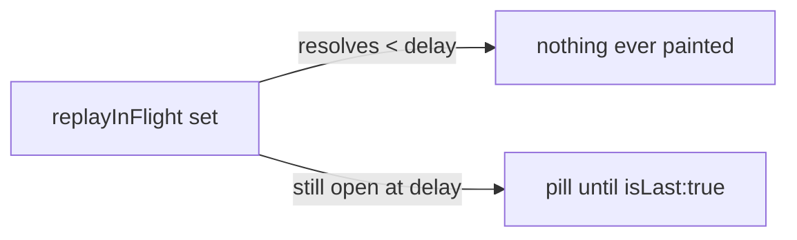

## Context

Session history reaches the browser as a sequence of `event_replay` batches
(`REPLAY_BATCH_SIZE = 200`, `browser-handlers/subscription-handler.ts:68-95`).
Only the final batch carries `isLast: true`. Between batches the sender parks on
socket backpressure — when `ws.bufferedAmount > BACKPRESSURE_THRESHOLD` it polls
every 50ms until the socket drains — so on a remote link the interval between
first and last batch is seconds.

The client already owns a per-session flag for this area, added by
`show-chat-history-loading-indicator` and hardened by
`fix-history-loading-false-empty-flash`:

- state + timers live in `App.tsx:591-592`
- `beginLoadingHistory` arms a short `SUBSCRIBE_ACK_MS` (15s) window at the
  subscribe sites (`App.tsx:912`, `:1570`, `:1592`)
- the cold-hydration start marker and server heartbeats re-arm the longer
  `HYDRATE_CEILING_MS` (90s) window via `rearmLoadingHistory`
- the flag clears in `useMessageHandler.ts:692` on
  `msg.events.length > 0 || msg.isLast === true`
- `ChatView.tsx:1352-1374` renders a skeleton when set, "No messages yet" when
  not — both gated on `state.messages.length === 0`

That clear condition is the whole problem. The flag is a *first-content* signal,
so it resolves on batch 1 of N and the view then presents a partially-replayed
session as complete. Because replay is ordered oldest → newest and the chat is
bottom-anchored, the missing content is the **tail**: the user sees a plausible
conversation that merely ended too early, not an obviously-truncated one.

Two constraints shape the solution space, both established during exploration:

1. **No client-side denominator exists.** `lastSeq` appears only on
   `SubscribeMessage` (`browser-protocol.ts:960`) — the client's own cursor going
   up. `eventCount` (`protocol.ts:54`) is bridge→server only and counts
   conversation entries, not dashboard events. Neither reaches the browser as a
   total.
2. **Batch counts are small.** `/api/health` hydration samples show 294–554
   events per session, i.e. 2–3 batches, with disk parse at 8–135ms.
3. **A subscribe does not always terminate.** `sendEventBatches`
   (`subscription-handler.ts:55-97`) loops `for (i = 0; i < compacted.length; ...)`,
   so an **empty** payload emits no message whatsoever — no `isLast: true`. The
   warm branch calls it with `[]` when the delta is empty (`:272`), and the cold
   success branch calls it with `[]` for a genuinely-empty session. Only the
   *failure* branches send `{ events: [], isLast: true }`. Any flag whose sole
   clear edge is `isLast` therefore hangs on both of those ordinary paths. See
   Decision 6.
4. **Heartbeats guard the parse, not the transfer.** The hydration heartbeat
   `setInterval` lives in the cold branch and emits `{ events: [], isLast: false }`
   only while the disk parse is in flight; it is stopped before batching begins.
   Between content batches — including a backpressure stall — the server emits
   nothing at all, and the warm path has no heartbeats whatsoever. See Decision 7.

## Goals / Non-Goals

**Goals:**

- The chat view never presents a partially-replayed session as complete.
- The signal resolves on the terminal `event_replay { isLast: true }`, not on
  first content.
- The existing empty-vs-loading behaviour is preserved, with one deliberate
  improvement: on an empty session the terminal batch from Decision 6 now clears
  `loadingHistory` immediately, where today the skeleton stays up until the
  hydration ceiling elapses. The flag's *transitions* are unchanged — it already
  clears on `isLast: true`; it simply now receives that message. Any test pinning
  the old skeleton-on-empty timing is expected to change.
- No wire-schema change, no new message type; the server change is confined to
  emitting an already-defined field on a path that currently emits nothing.
- No visible artefact on the *fast* path — any replay resolving inside the delay
  threshold, which is the warm cache-hit case in normal conditions. A warm delta
  large or stalled enough to exceed the threshold will paint the pill, correctly:
  the guarantee is about latency, not about the cache.
- The flag stays set for as long as replay is genuinely in flight — the dual of
  "can never stick", and equally load-bearing (see Decision 7).

**Non-Goals:**

- Determinate progress (percentage, counts, or a bar). See Decision 3.
- Arming the flag for a server-initiated re-replay. The client's `shouldReset`
  rule (`useMessageHandler.ts:626`) can start a fresh multi-batch sweep with no
  client `subscribe`; the indicator is specified as subscribe-scoped and stays
  off for it.
- Changing scroll anchoring, including suppressing the tail auto-scroll until
  `isLast`. Deferred to its own change.
- Instrumenting the transfer phase in `hydration-metrics.ts`.
- Surfacing the `markReplaying` live-event suppression window.
- Any change to `REPLAY_BATCH_SIZE`, `BACKPRESSURE_THRESHOLD`, the server
  hydration heartbeats, or the replay cache.

## Decisions

### Decision 1 — A second flag, not a redefinition of the existing one

`replayInFlight` is added alongside `loadingHistory`; `loadingHistory` keeps its
current set/clear semantics unchanged.

*Why not widen the existing flag?* Because the two flags answer different
questions and have different clear edges:

| | `loadingHistory` | `replayInFlight` |
|---|---|---|
| question | is this session empty, or is content coming? | has replay finished? |
| clears on | first content **or** `isLast` | `isLast` **only** |
| renders | centre spinner **instead of** "No messages yet" | bottom pill **alongside** content |

Merging them would force one flag to serve two clear conditions, and would
regress the empty-session case: a session whose only batch is
`{ events: [], isLast: true }` must show "No messages yet" immediately, which is
exactly what the existing flag already gets right.

*Alternative considered — derive it from state instead of tracking it.* There is
no derivable predicate: after batch 1 the client cannot distinguish "more coming"
from "that was everything" without `isLast`. Tracking is unavoidable.

### Decision 2 — Reuse the two-stage safety-net shape, with a wider re-arm edge

`replayInFlight` gets the same timer discipline as `loadingHistory`: armed on
subscribe with `SUBSCRIBE_ACK_MS`, re-armed to `HYDRATE_CEILING_MS`, torn down
with the flag. It differs in **what re-arms it** — see Decision 7.

This matters because a flag that clears *only* on `isLast` is strictly more
prone to sticking than one that clears on first content — a dropped terminal
batch would pin the pill forever. The ceiling already exists; reusing it costs
nothing and removes the stuck-indicator class.

`clearLoadingHistory` and `rearmLoadingHistory` are parameterised over
`(setter, timersRef, id)` and serve a second flag map as-is. **The arming
function is not:** `beginLoadingHistory` is a `useCallback` in `App.tsx:728-740`
with `setLoadingHistory` and `loadingHistoryTimersRef` hard-coded. Arming a
second flag requires parameterising it (or adding a sibling) — a fourth edit
site, not the zero the "reused as-is" framing would imply.

### Decision 3 — Indeterminate, not determinate

The pill shows an indeterminate "still loading" affordance with no count and no
percentage.

*Why not add `total` / `sent` to `EventReplayMessage`?* It is additive and
backward-compatible, so the objection is not compatibility — it is that the
measurements make it useless. At 294–554 events a session is 2–3 batches, so a
determinate bar renders `33% → 66% → 100%`: three lurches, then done. It would
add a protocol field, a server change, and a rendering path to communicate three
discrete states. Indeterminate is the honest fidelity for this data, not a
compromise.

*Revisit trigger:* if transfer-phase instrumentation later shows real-world
sessions an order of magnitude larger (tens of batches), the determinate option
becomes worth its cost. Recorded in the proposal as an explicit deferral.

### Decision 4 — A show-delay, not a cold-path gate

The pill is armed on subscribe but rendered only after a delay
(`REPLAY_PILL_DELAY_MS = 300`) with replay still in flight. Tests reference the
named constant and drive it with fake timers rather than hard-coding `300`, so
retuning it after transfer-phase metrics land causes no test churn.

The problem it solves: on a warm cache-hit, `rehydrateSession` paints the cached
tail and `subscribe` carries `lastSeq`, so the server delta-replays a handful of
events. `replayInFlight` would be true for a frame or two — flicker, not
information.

*Alternative considered — gate on cache-miss.* Rejected: it couples the
indicator to replay-cache internals, so every future change to caching or
delta-replay has to reason about the indicator too. It also fails the case it is
supposed to catch — a *cold* replay that happens to be fast would still flash.

The delay is a property of the observed latency, not of the cache, so it
generalises: anything that resolves quickly paints nothing, regardless of *why*
it was quick.

*Known weakness:* 300ms is a judgement call, not a measurement — the transfer
phase is not instrumented today (see Risks).

**The show-delay is a third timer, with its own lifecycle.** It is *not* the
safety-net timer and must not share its slot — `beginLoadingHistory` keeps one
timer per id in `timersRef` and overwrites it. Contract:

- **arm** when `replayInFlight` becomes true,
- **cancel** if the flag clears before it fires — load-bearing: a replay that
  resolves at 250ms otherwise leaves a pending 300ms timer that flips the pill on
  for an already-finished session, which is precisely the stuck-on failure the
  delay exists to prevent,
- **fire** → set a visible bit, which is torn down with the flag.

Housed in `ChatView` as local state — which does **not** reset itself on session
change. `<ChatView>` is rendered without a `key` (`App.tsx:1720`) and is
`React.memo`'d specifically so switching sessions reuses the instance rather than
remounting the transcript. So both the pending timer and the visible bit would
otherwise leak from session A into session B. The reset is therefore explicit: a
`useEffect` keyed on `sessionId` that cancels any pending timer and clears the
visible bit. Adding `key={selectedId}` would also work but would force a full
transcript remount on every switch, defeating the existing memoization.

The **visible bit** is torn down on the same edges as the timer: session change,
and the flag clearing. Cancelling the timer alone is not sufficient — once it has
fired, the bit is what keeps the pill on screen.

### Decision 6 — The server terminates every subscribe

`sendEventBatches` emits one `{ events: [], isLast: true }` when there is nothing
to batch.

Today an empty payload emits nothing (Context 3), so a flag cleared only by
`isLast` would hang until the ceiling on the two most ordinary paths: a warm
reload of an unchanged session, and a genuinely-empty session. On the warm path
that means the pill paints at 300ms and stays ~15s — the exact opposite of this
change's goal, on the happy path.

*Why change the server when the proposal wanted client-only?* Because the
alternatives are worse, not because the constraint was unimportant. Inferring
termination from a following non-replay message (`replayUiState`,
`replayPendingUiRequests`) couples the flag to unrelated message ordering that no
one maintains as a contract. Accepting the hang is a visible regression. The
chosen fix makes the invariant the spec already assumes — *every subscribe
terminates* — actually true, which is the smallest honest change: no new field,
no new message type, no schema edit, and an old client is unaffected (it already
clears on `isLast: true`).

### Decision 7 — Every non-terminal batch re-arms the ceiling

`replayInFlight` re-arms its safety-net timer on **every** non-terminal
`event_replay` — content batches included, not only the empty hydration markers
that re-arm `loadingHistory`.

Without this the ceiling is counted from the *last pre-content marker* and runs
down through the entire transfer (Context 4). A genuinely slow transfer — the
case this change exists for — would hit the ceiling and clear the flag while the
tail was still missing, restoring the deception. The warm path is worse still: no
heartbeats at all, so its only window is the 15s `SUBSCRIBE_ACK_MS`.

There is also a one-way trap in the existing helper: `rearmLoadingHistory`
early-returns when no timer is armed (timer presence is its proxy for "flag
set"). So once a ceiling fires the flag is stuck **false** with no path back to
true — silently disabling the indicator for the slowest sessions, the ones that
need it most. Re-arming on each batch keeps the timer alive for as long as the
wire is alive, which closes both directions.

A batch arriving *is* the liveness signal. "Still receiving, therefore still in
flight" needs no new mechanism, no server heartbeat during backpressure, and no
guessed constant — which is why it is preferred over both a server-side
stall-heartbeat and simply raising the ceiling.

*Scope of the fix, stated precisely:* this prevents the ceiling from firing
**during** an active transfer. It does not make the flag recoverable **after** a
ceiling has already fired — `rearmLoadingHistory` early-returns when no timer is
armed, so a batch resuming after a >90s silence finds the flag false and cannot
re-set it. Accepted: that requires a stall longer than the ceiling, the pill's
absence is a false negative rather than a false claim of completeness, and
re-arming a torn-down flag would mean giving the helper a second way to *set*
state — a bigger change to shared machinery than this indicator justifies.

### Decision 5 — Bottom-anchored placement

The pill renders above the composer, at the bottom of the message list.

Replay is oldest → newest, so the absent content is the tail. An indicator at the
top of the pane would point away from the gap it describes. Bottom placement also
sidesteps layout disruption: it floats over the list rather than inserting into
it, so it cannot perturb scroll anchoring — which keeps this change disjoint from
the deferred auto-scroll work.

"Floats over the list" is the operative constraint: the pill is an overlay
anchored to the bottom of the scroll container, not a row appended to the list.
It therefore satisfies "must not displace or reflow" and sits *visually* where
the pending events will land, without occupying their in-flow position.

**The pill and the loading skeleton are mutually exclusive.** The skeleton branch
(`ChatView.tsx:1352`) is gated on `state.messages.length === 0`; on a slow cold
load, first content can arrive after the 300ms delay, so both would otherwise
paint at once — two loading affordances for one load. The pill is therefore
additionally gated on content being present; while the list is empty the existing
skeleton is the sole indicator and its behaviour is unchanged.

*Alternative considered — skeleton bubbles at the tail.* Rejected: skeletons
imply a *shape* for the remainder (how many? how long?) that the client provably
does not know, and they occupy list space, which does interact with scroll
anchoring.

## Risks / Trade-offs

- **The 300ms delay is unmeasured** → It is a rendering-threshold guess made
  while the transfer phase has no instrumentation. Mitigation: it is a single
  named constant with no behavioural coupling — only the moment of paint. Tests
  drive it with fake timers rather than hard-coding the value, so retuning it
  after transfer-phase metrics land is a one-line change with no test churn.

- **The pill labels the deception without removing it** → The view still
  auto-scrolls to a false end-of-conversation; the pill only tells the user it is
  false. Mitigation: accepted deliberately for scope. The scroll-anchoring fix
  (S4) is recorded as an explicit deferral in the proposal, and the floating
  placement in Decision 5 is chosen so that change lands cleanly on top of this
  one.

- **A dropped terminal batch pins the pill** → Clearing only on `isLast` is more
  stick-prone than clearing on first content. Mitigation: Decision 2 — the
  existing `HYDRATE_CEILING_MS` net clears it. This is the primary reason the
  safety-net is reused rather than skipped as "not needed for a pill".

- **Re-arming on every batch weakens the ceiling** → Decision 7 keeps the timer
  alive for as long as batches keep arriving, so a pathological server that
  streams non-terminal batches forever would hold the pill indefinitely.
  Accepted: that state *is* replay-in-flight, and the pill would be telling the
  truth. The ceiling's job is catching a **silent** wire, and it still does — it
  fires `HYDRATE_CEILING_MS` after the last message of any kind.

- **A cancelled load sends no terminator** → the `"cancelled"` branch
  (`subscription-handler.ts:372-376`) deliberately sends neither `isLast` nor
  `dataUnavailable`. Mitigation: a cancel happens because a fresh subscribe
  superseded it, and that subscribe re-arms the flag; the ceiling covers the
  race. Left as-is rather than adding a second server edit.

- **`event_replay { isLast: true }` has other emitters** → the bridge
  `replay_complete` / safety-timeout / catch-up paths (`event-wiring.ts:1083`,
  `:1125`; `pairing/browser-gateway.ts:619`) also send terminal batches. One
  landing before the subscribe response's own terminal would clear
  `replayInFlight` early, and later non-terminal batches cannot re-set it (same
  one-way property as above). Accepted: the failure mode is a missing pill, not a
  false completeness claim, and these emitters are out of scope for this change.

- **Two flags in the same area can drift** → A future edit could update one
  clear site and miss the other. Mitigation: both flags are set at the same
  subscribe call sites and cleared in the same `event_replay` / failure cases, so
  the sites are adjacent and reviewable together; tests assert the two flags'
  *divergent* transitions on the same message sequence, which fails loudly if
  they are collapsed.

- **The measurement basis is thin** → n=3 hydration samples, local instance, cold
  path only. Mitigation: the design does not depend on the absolute numbers, only
  on the ratio (parse ≈ 0, transfer ≈ everything) and on batch counts being
  small. Both would have to be wrong by an order of magnitude to change
  Decision 3, and that case is already written down as its revisit trigger.

## Migration Plan

No persisted state, no wire-schema change. The pill appears on the next page
load. Both mixed pairings are safe: an **old client + new server** receives one
extra `{ events: [], isLast: true }` on the empty path, which it already handles
(it clears `loadingHistory` on `isLast`); a **new client + old server** never
receives that terminator on the empty path, so `replayInFlight` clears at the
safety-net ceiling instead — degraded, not broken, and self-correcting once the
server is updated. Rollback is a revert — no data or schema to unwind.

## Open Questions

- **What is the real transfer-phase distribution on a pushback-heavy remote
  link?** `hydration-metrics.ts` records parse only. The answer sets the honest
  value for `REPLAY_PILL_DELAY_MS` and is the sole input that could reopen
  Decision 3. Deferred, not blocking — the design is correct for any value.
- **Should the pill also cover the `markReplaying` live-event suppression
  window?** Same symptom (activity invisible to the user), different mechanism.
  Deferred; if adopted later it likely reuses this same flag rather than adding a
  third.
