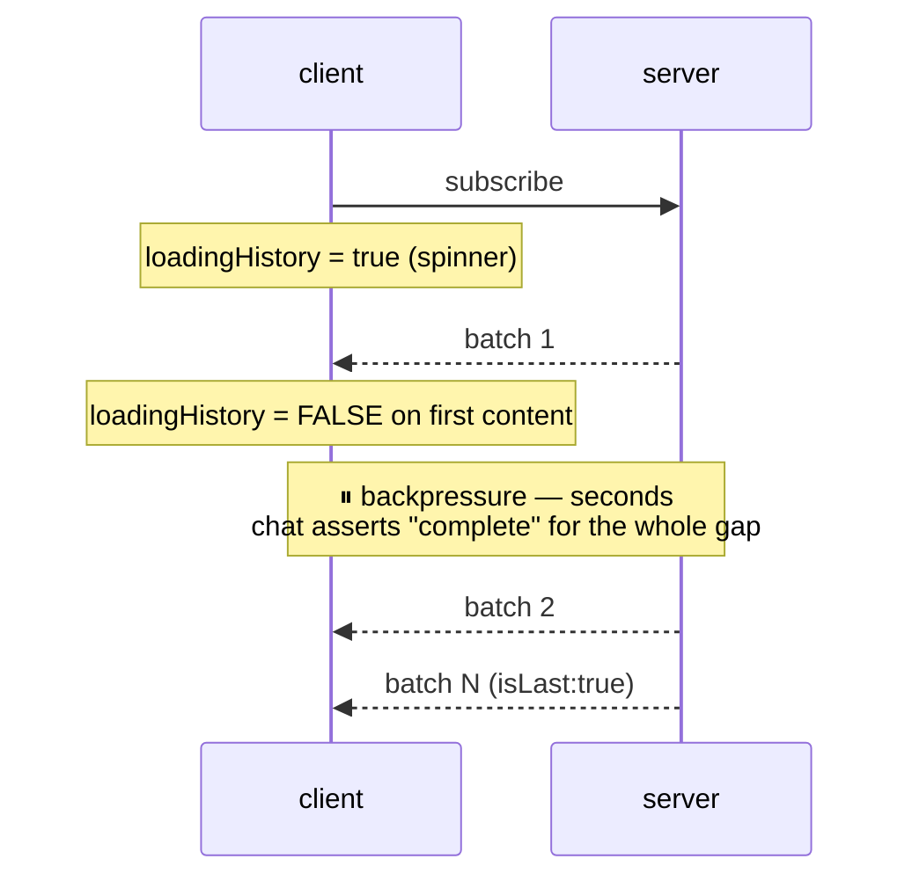
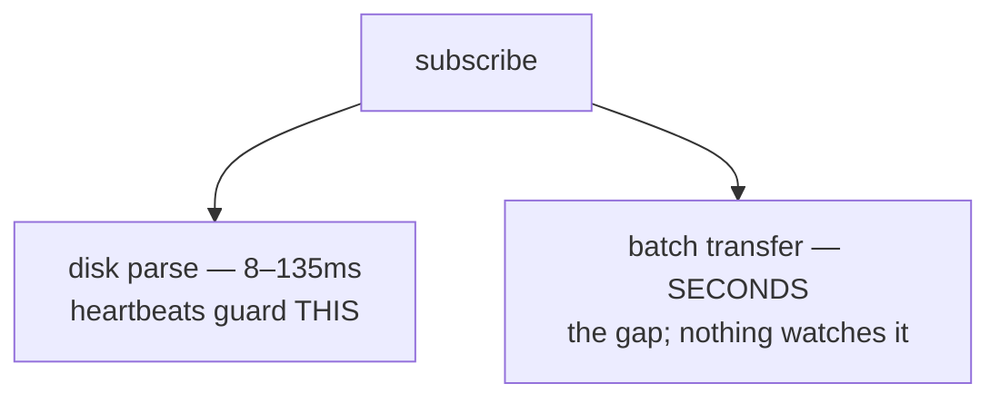

## Why

The chat view **tells the user history has finished loading when it has not**.

`show-chat-history-loading-indicator` added a per-session `loadingHistory` flag
to distinguish "still loading" from "genuinely empty". Its clear condition
(`useMessageHandler.ts:692`) is:

```ts
if (msg.events.length > 0 || msg.isLast === true) {
  clearLoadingHistory(...)
}
```

That flag answers *"is this session empty, or is history coming?"* — it is **not**
a replay-completion signal. It dies on the **first** `event_replay` batch of N.
Batches 2..N arrive with no indication at all.

Replay is chunked at `REPLAY_BATCH_SIZE = 200` and pauses on socket backpressure
(`browser-handlers/subscription-handler.ts:68-95`): when
`ws.bufferedAmount > BACKPRESSURE_THRESHOLD` the sender polls every 50ms until
the socket drains. Over a remote link that gap is seconds.



**The gap is worse than a blank screen.** Replay is ordered oldest → newest, so
during the gap the *tail* is missing — and the view is bottom-anchored. The user
is not looking at an obviously-truncated list; they are looking at what appears
to be a **complete conversation that simply ended earlier than it did**.
Compounding it, `markReplaying` suppresses live events to that socket for the
duration, so genuinely new activity is invisible too.

### Measured: the existing indicator guards the wrong phase

`/api/health` `hydration` samples (`metrics/hydration-metrics.ts`) on a local
instance:

| wallMs | events | fileBytes | batches |
|--------|--------|-----------|---------|
| 135ms  | 294    | 1.0MB     | 2       |
| 20ms   | 554    | 1.8MB     | 3       |
| 8ms    | 360    | 0.3MB     | 2       |

The **disk parse is 8–135ms**. The hydration-heartbeat machinery added by
`fix-history-loading-false-empty-flash` (`HYDRATE_CEILING_MS = 90000`, server-side
periodic empty markers) guards that ~0.1s phase. The phase that costs seconds —
batch transfer under backpressure — has **no indicator and no instrumentation**.



Caveat: n=3, local instance, and `hydration` records cold loads only. A
heavy-pushback remote link may hold much larger sessions. The *ratio* argument
survives regardless — parse ≈ 0, transfer ≈ everything.

## What Changes

- **A second, distinct flag: `replayInFlight`.** Set per session when `subscribe`
  is sent; cleared **only** on terminal `event_replay { isLast: true }`, on a
  failure signal, or via the safety-net ceiling. The existing
  `loadingHistory` flag keeps its transitions — it keeps answering
  empty-vs-loading and keeps clearing on first content. Two questions, two flags.
  (One knock-on: the terminal marker below reaches `loadingHistory` too, so an
  empty session drops its skeleton immediately instead of waiting out the
  hydration ceiling. Same transition, message now actually delivered.)
- **Every non-terminal batch re-arms the ceiling.** A batch on the wire is proof
  of liveness, so `replayInFlight` re-arms its safety-net timer on **every**
  non-terminal `event_replay` — content batches included, not just the empty
  hydration markers. Without this the ceiling expires *during* the transfer and
  clears the flag while the tail is still missing, which is the exact deception
  this change exists to remove. This is a deliberate divergence from
  `loadingHistory`, which clears on first content and re-arms only on empty
  markers; that flag's transitions are unchanged.
- **The server emits a terminal marker when it has nothing to send.**
  `sendEventBatches` currently loops over the batch array, so an **empty** payload
  emits *no message at all* — no `isLast: true`. Two ordinary paths hit it: a warm
  subscribe whose delta is empty (every reload of an unchanged session) and a
  cold load of a genuinely-empty session. A flag cleared only by `isLast: true`
  would hang on both until the ceiling fired. So `sendEventBatches` now sends one
  `{ events: [], isLast: true }` when there is nothing to batch. Every existing
  consumer of that message already no-ops on an empty batch — `maxSeq` tracking
  and the replay persister are guarded on `events.length > 0`, and `shouldReset`
  does not fire without a `firstSeq`.
- **A bottom-anchored, indeterminate pill in `ChatView`**, rendered above the
  composer while `replayInFlight` is true — where the missing content actually is.
  Indeterminate text (e.g. "loading remaining history…"), no count, no percentage.
- **A show-delay so the pill never flickers.** Arm on `subscribe`, but render only
  once ~300ms have elapsed without `isLast: true`. On the warm cache-hit path
  (`rehydrateSession` → `subscribe { lastSeq }` → small delta) replay resolves
  well inside that window, so nothing paints. This keeps the simple rule — *show
  whenever replay is in flight* — without coupling the indicator to replay-cache
  internals.

```
   replayInFlight ─┬─ resolves < 300ms ──▶ nothing ever painted
                   └─ still open at 300ms ─▶ pill shows until isLast:true
```

- **No protocol change, no new message type — but a 2-line server change.** The
  change reads the already-defined `event_replay.isLast` field; the wire *schema*
  is untouched and an old client is unaffected (it already clears on
  `isLast: true`). The server change is confined to emitting that existing field
  on the empty path, described above.

### Explicitly deferred

**Determinate progress (`total` / `sent` fields on `EventReplayMessage`)** is
**not** in this change. It was the obvious "real progress bar" option and the
measurements killed it: at 294–554 events a session is 2–3 batches, so a bar
would render `33% → 66% → 100%` — three lurches and done. There is no meaningful
percentage at this granularity. Indeterminate is not the cheap compromise here;
it is the correct fidelity for the data. Revisit only if transfer-phase
measurement shows real-world sessions an order of magnitude larger.

**Client-derived progress from a seq high-water mark** is not possible today and
is not being made possible here. `lastSeq` exists only on `SubscribeMessage`
(`browser-protocol.ts:960`) — the client's own cursor going *up*, not the
server's total coming *down*. `eventCount` (`protocol.ts:54`) is bridge→server
only and counts conversation entries, not dashboard events. The client has no
honest denominator without a server change.

**Suppressing the tail auto-scroll until `isLast: true`** is deferred. It
addresses the same deception at its source — the view would stop confidently
parking the user at a false end-of-conversation, rather than labelling it. It is
a scroll-anchoring change with its own risk surface and belongs in its own
change.

**Transfer-phase timing in `hydration-metrics.ts`** is deferred. The measurement
gap above is real (parse is instrumented, transfer is not), but instrumenting it
is a separate idea from surfacing the state to the user.

**Signalling the `markReplaying` live-event suppression window** is deferred.
Same user-visible symptom, but a distinct mechanism.

**Arming the flag on a server-initiated re-replay** is deferred. The client's
`shouldReset` rule (`useMessageHandler.ts:626`, `firstSeq === 1 || firstSeq <=
maxSeq`) can begin a fresh multi-batch sweep with no client `subscribe` — so the
flag, armed only at `subscribe` sites, stays off for it. Accepted: the indicator
is specified as a *subscribe-scoped* affordance, and widening it means finding a
reliable "a sweep started" signal that does not exist on the wire today.

## Capabilities

### New Capabilities

_None._

### Modified Capabilities

- `chat-history-loading-indicator`: currently specifies a single flag whose
  contract is *cleared when content arrives*. This adds a **replay-completion**
  requirement alongside it: the chat view SHALL indicate that a session's replay
  is still in flight until the terminal `isLast: true` batch, and SHALL NOT
  present a partially-replayed session as complete. The capability today states
  no requirement about the interval *between* the first batch and the last.

## Impact

- `packages/server/src/browser-handlers/subscription-handler.ts` — in
  `sendEventBatches` (`:55-97`), emit one `{ events: [], isLast: true }` when
  `compacted.length === 0`, so every subscribe terminates. Check
  `subscription-handler.test.ts` for any assertion counting `event_replay` frames
  on an empty path — that is the break risk, not the existing "empty delta
  resolves" case, which asserts `clearReplaying` rather than message count.
- `packages/client/src/lib/replay/loading-history.ts` — `clearLoadingHistory` and
  `rearmLoadingHistory` are already parameterised over `(setter, timersRef, id)`
  and serve a second flag map as-is. **`beginLoadingHistory` is not** — it lives
  in `App.tsx:728-740` as a `useCallback` with `setLoadingHistory` and
  `loadingHistoryTimersRef` hard-coded, so arming a second flag needs it
  parameterised (or a sibling). Add the show-delay constant here too.
- `packages/client/src/App.tsx` — own `replayInFlight` state + its timers ref
  (alongside `loadingHistory` at `App.tsx:591-592`); parameterise/duplicate
  `beginLoadingHistory` (`:728-740`) and arm at the same call sites (`App.tsx:912`,
  `1570`, `1592`); pass the selected session's value to `<ChatView>`
  (`App.tsx:1720`).
- `packages/client/src/hooks/useMessageHandler.ts` — in the `event_replay` case
  (`:626`, clear site `:692`) clear `replayInFlight` on `isLast: true` **only**,
  and re-arm it on **every** non-terminal batch (content or empty); clear on the
  `dataUnavailable` failure edge (`:324`). The existing `loadingHistory`
  transitions at those sites are unchanged.
- `packages/client/src/components/chat/ChatView.tsx` — new prop; render the pill
  above the composer, gated so it cannot paint while the loading skeleton is up.
  Own the show-delay timer + visible bit here, **with a `useEffect` reset keyed on
  `sessionId`**: `<ChatView>` has no `key` (`App.tsx:1720`) and is `React.memo`'d
  to avoid remounting on session switch, so without an explicit reset the timer
  and visible bit leak from one session to the next. The existing
  `loadingHistory` skeleton / "No messages yet" branch (`:1352-1374`) is
  unchanged.
- Tests: vitest alongside
  `hooks/__tests__/useMessageHandler.loading-history.test.tsx`.
- **Not changed:** `SUBSCRIBE_ACK_MS`, `HYDRATE_CEILING_MS`, the server-side
  hydration heartbeats, `REPLAY_BATCH_SIZE`, `BACKPRESSURE_THRESHOLD`, and the
  `event_replay` wire **schema** all keep current semantics. The `"cancelled"`
  load branch (`subscription-handler.ts:372-376`) deliberately stays silent — a
  cancelled load is superseded by a fresh subscribe that re-arms the flag, and
  the ceiling covers the race.

## Discipline Skills

`scenario-design` (the `test-plan.md` manifest — 30 scenarios; notably the
batch-size boundaries that catch a double-terminating server, a stalled transfer
spanning the ceiling, the show-delay leaking across a session switch, and both
mixed old/new client-server pairings) · `doubt-driven-review` (run during
planning; it falsified the original "every subscribe terminates" and "heartbeats
guard the transfer" premises) · `review-code` (before commit, once vitest is
green).
