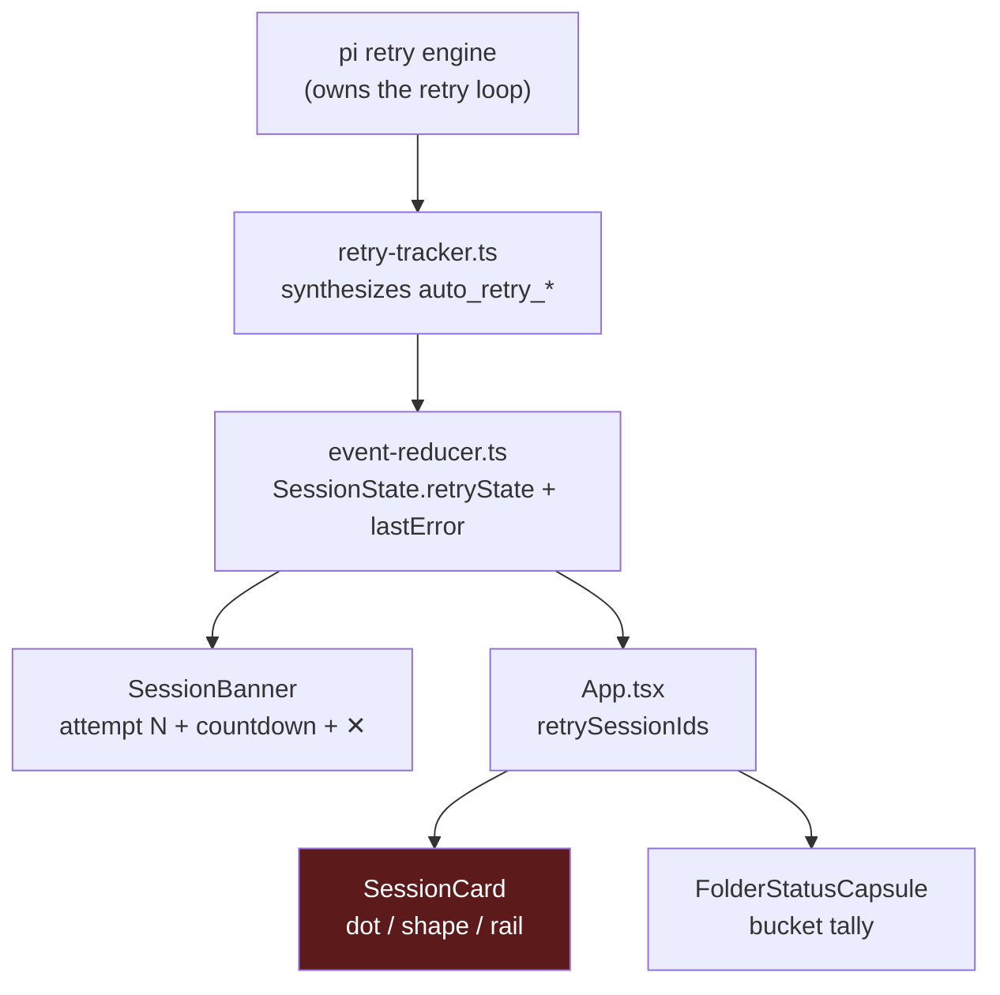

# Design — unify retry visibility

## Context

Retry state has two producers and three consumers:



The banner consumes the **whole** `retryState` object. The card consumes a
lossy projection of it — a `Set<string>` of ids. Every defect in this change is
either a mis-read of the *producer* side (defects 1–2) or information lost in
that projection (defect 4).

## D1 — Mirror pi's own "did this turn fail?" predicate

**Decision.** Both `retry-tracker.ts` and `event-reducer.ts` locate the last
message with `role === "assistant"` by scanning backward, rather than reading
`messages[length - 1]`.

**Why.** pi's `_willRetryAfterAgentEnd` — the function that actually decides
whether a retry happens — uses exactly this predicate. Any dashboard-side
predicate that disagrees will drift out of sync with reality, which is precisely
what happened: pi retried, the dashboard did not believe it had.

**Alternatives rejected.**

| Option | Rejected because |
|---|---|
| Match on error text in the last message | Violates the standing constraint *"never grep and detect change text use json"*. Provider error copy is unstable. |
| Trust `agent_end` to always terminate with the assistant message | Empirically false — trailing `toolResult` entries are common and are the whole bug. |
| Read only `messages[0]` of the failed turn | The turn can contain several assistant messages; only the last carries the terminal `stopReason`. |

**Consequence.** The two reducer call sites now share one module-private helper,
`lastAssistantMessage()`, so they cannot drift apart a third time. The tracker
lives in a different package (`packages/extension`) and keeps its own inline
scan; the two copies are kept in step by their shared, tested contract rather
than by a shared import.

Neither copy falls back to the final array element when no entry carries an
assistant role: both return "no disposition". A fallback would let a trailing
`toolResult` decide the turn — synthesizing an error, or clearing a live one,
off a message pi never consulted — and would reintroduce exactly the divergence
this decision exists to remove. Pinned by the *No assistant message present*
scenario in `specs/provider-retry-state/spec.md` and by the tracker's
*arms nothing* test.

## D2 — The ✕ is clear-only, never an abort

**Decision.** `SessionBanner` renders the ✕ in **every** state. Pressing it
clears the surface. It does not, and cannot, stop the retry.

**Why.** pi owns the retry loop; the dashboard has no abort channel for it, and
the "Stop retrying" control in the original mock was cut for exactly that
reason. But a user faced with a persistent error card still needs to dismiss it.
Clear-only resolves both: the card goes away, the retry continues, and the next
attempt's waiting signal re-opens the surface carrying the fresh attempt number.

**Consequence.** Dismissal is *transient*, not sticky. This is deliberate — a
sticky dismissal would hide an escalating failure. Success clears it permanently
via D1.

## D3 — A new branch in `ActivityIndicator`, not a new affordance

**Decision.** The retry indicator is one additional case in the existing
`ActivityIndicator` precedence chain (`SessionCard.tsx:61`), rendering
`↻ Retry N`. The existing dot colour, shape marker and rail tint are **not**
touched.

**Why not a floating badge.** The first draft of this design invented a pill
badge on line 2 of the card. That was wrong: the card *already has a slot for
exactly this* — the one that prints "Thinking…", "Needs you", a tool name or
"Idle". A retry is a session-activity state like every other entry in that
chain. Adding a parallel affordance would mean two competing activity channels
on one row.

The new branch reuses the `currentTool` branch's shape verbatim — the same
wrapper classes, the same `size={0.5}` leading icon, `mdiFlash` swapped for
`mdiRefresh`:

```tsx
<span className="text-[var(--severity-warning-fg)] truncate inline-flex items-center gap-0.5">
  <Icon path={mdiRefresh} size={0.5} /> Retry {attempt}
</span>
```

**Placement in the chain.** After `ask_user`, before `currentTool`:
`resuming → ended → ask_user → retry → currentTool → streaming → idle`.
Blocked-on-you stays the most urgent signal. Retry outranks `currentTool` and
`streaming` because during a retry no tool is actually executing — printing
"Thinking…" while pi sits in a backoff is precisely the lie this change removes.

**Why the status channels stay untouched.** "Errored" and "retrying" are
orthogonal facts and the user needs both. The dot/shape/rail channels are
already saturated expressing the first. Every one of the four consumers checks
`hasError` **first**:

| Consumer | Line | `hasError` precedence |
|---|---|---|
| `deriveDotColorWithFlags` | `session-status-visuals.ts:105` | first |
| `deriveStatusShape` | `session-status-visuals.ts:150` | first |
| `deriveRailBgColor` | `session-status-visuals.ts:374` | first |
| `capsuleBucketFor` | `session-status-visuals.ts:289` | first |

So dropping the `!lastError` gate in `App.tsx` is **visually inert** for all four
— the error branch still wins everywhere. That is what makes this change safe:
the gate removal cannot regress any state that ships today, because no consumer
can observe the difference. The activity label is the only changed pixel.

**Alternative rejected.** Promote `isRetrying` above `hasError` so the dot turns
amber during a retry. This would *destroy* information — the user would lose the
"this errored" signal, which is the more urgent of the two. Rejected.

## D4 — Reuse `--severity-warning-*`, do not invent a token

**Decision.** The retry label takes `--severity-warning-fg`.

**Why.** The obvious choice, raw `--status-working`, is `--accent-yellow`
(`#eab308`) — a dark-mode-tuned value. Measured against the light-mode card
surface it is **1.68:1**, far below the 3:1 floor and illegible, reproducing the
exact defect that untokenised error surfaces already exhibit.

The `--severity-*` triples are `color-mix()`-derived against the *theme's own*
`--text-primary` / `--bg-tertiary`, so they track every theme automatically:

| | fg on bg | verdict |
|---|---|---|
| `--severity-warning-*` dark | **7.75:1** | passes AA (4.5) |
| `--severity-warning-*` light | **6.13:1** | passes AA (4.5) |
| raw `--status-working` dark | 8.69:1 | passes |
| raw `--status-working` light | **1.68:1** | fails the 3:1 floor |

`warning` rather than `error` is also the semantically correct tier: a retry in
flight is not a terminal failure.

**Consequence.** No new token, and the label inherits the existing
`tests/e2e/severity-contrast.spec.ts` gate across 9 themes × 2 modes for free.

Note the sibling branches use raw status tokens (`--status-working`,
`--status-needs-you`) directly as *text* on the card surface. Those predate the
severity system. This change does not migrate them — that is `U2`'s scope — but
it does not add a seventh instance of the problem either.

## D5 — Attempt number crosses the boundary as a map, not a widened Set

**Decision.** `App.tsx` publishes `retryAttemptMap: Map<string, number>`
alongside the existing `retrySessionIds: Set<string>`.

**Why.** `retrySessionIds` has four consumers (card, list, folder capsule,
status visuals); three of them only ever ask "is this session retrying?".
Widening the Set's element type would force all four to change. A parallel map
leaves the membership question untouched and gives the one consumer that needs
the number a direct lookup.

**Consequence.** `SessionCard` gains one optional prop, `retryAttempt?: number`,
forwarded to `ActivityIndicator`. When absent (folder pills, and any caller that
does not track retries) the retry branch is simply not taken and the chain falls
through to its existing behavior — no undefined-state to handle.

## D6 — Lineage for the overlapping `event-reducer.ts` edit

**Decision.** This change's lineage wins: `event-reducer.ts` as of `develop`
(`816a0bc3`, 2389 lines) plus the `lastAssistantMessage()` extraction.

**Why.** The competing uncommitted edit lives in worktree
`os/fix-error-anchor-backoff-persistence`, whose base predates `develop` by 204
lines (2185). It does **not** contain the last-assistant fix at all — both
`extractAgentEndError` and `isCleanAgentEnd` there still read
`messages[messages.length - 1]`. Adopting that lineage would mean reverting 204
lines of already-merged work to re-apply this fix on top.

**Consequence.** `os/fix-error-anchor-backoff-persistence` must rebase onto
`develop` after this change lands, and re-apply its error-anchor edits against
the shared `lastAssistantMessage()` helper rather than a raw last-element read.

## Open question

**Q1 — countdown on the card?** The banner shows `next attempt in 12s`. The card
could too, but a per-second re-render across every visible card is a real cost
and the activity slot is a single truncating line shared with the model name.
This change ships the attempt number only; the countdown stays banner-only.
Revisit if the number alone proves insufficient.
