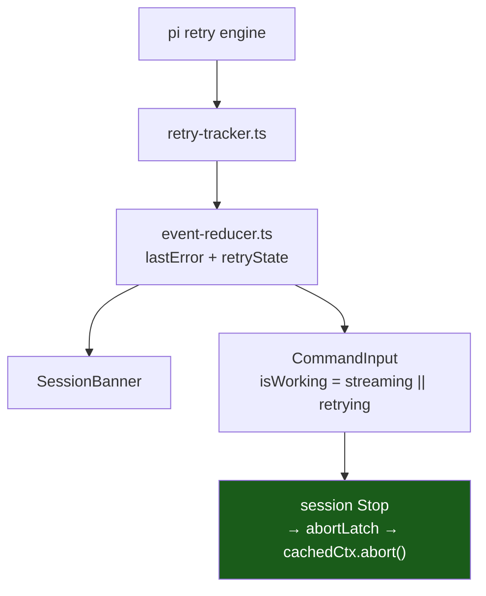

# Design — raw error rendering and retry authority

## Context

`retryState` has **two** consumers, not one. `SessionBanner` renders it, and
`CommandInput` derives `isWorking` from it to decide whether Stop mounts.
Clearing `retryState` to dismiss a *card* therefore silently removes a
*control* — the coupling that produced the defect.

## D1 — Collapse is component-local; `retryState` is never written to dismiss

**Decision.** While a retry is pending, the trailing control collapses the card
via component-local `useState`. It does not call `onDismiss` and no session
state is mutated.

**Why.** The card is a view. `retryState` is the fact that a retry is running,
and `CommandInput` depends on it. A view-level "I don't want to look at this"
must never mutate a model-level "this is running". Keeping collapse local makes
the authority bug structurally impossible rather than merely fixed.

**Consequence.** `onDismiss` is only ever invoked on a settled error, so
`App.tsx`'s handler cannot clear `retryState` even by accident.

**Alternative rejected.** A `dismissedAtAttempt` marker in session state
(considered first). It keeps `retryState` alive, but still routes a purely
visual concern through the model and leaves the surface fully hidden — the user
loses the attempt counter and the countdown for no benefit.

## D2 — The icon states the action

**Decision.** Three affordances, each with its own icon, label and testid:

| Phase | Icon | Label | testid |
|---|---|---|---|
| retrying · expanded | `mdiChevronUp` | Collapse | `error-banner-collapse` |
| retrying · collapsed | `mdiChevronDown` | Show error | `error-banner-expand` |
| settled | `mdiClose` | Dismiss | `error-banner-dismiss` |

**Why.** An ✕ that does not close is a false promise: the user presses it
expecting the card gone, gets a one-line row, and stops trusting the control.
Distinct testids also let tests assert *which* affordance is offered per phase —
the exact class of bug that produced the original stale-gate defect, where the
wrong control survived a refactor and nothing caught it.

**Consequence.** `InlineMessage` gains two additive optional props
(`dismissIcon`, `dismissLabel`). No second component, no fork of the primitive.

## D3 — Collapse resets when retrying stops

**Decision.** When `retry` transitions to absent while collapsed, the card
re-expands.

**Why.** Collapsed exists to protect the Stop handle during a live loop. Once
nothing is running there is no handle to protect, and the error has become
actionable (closable). Leaving it collapsed would hide a terminal failure
behind a row whose spinner has stopped — the worst of both states.

## D4 — Print the string, delete the humanizer

**Decision.** `humanizeProviderError` is deleted. All three call sites pass the
raw `errorMessage` through. The existing printer is untouched.

**Why.** pi types `errorMessage` as a bare string and populates it from
`String(error)`. There is no schema to rely on. The humanizer assumed one, and:

| Payload (from pi's docs) | Humanizer's effect |
|---|---|
| `529 {"type":"error",…}` | **none** — `startsWith("{")` is false |
| `529 overloaded_error: Overloaded` | none |
| `terminated` | none |
| pure `{"error":{"message":…}}` | flattens, discards everything else |
| `{"error":{"type":"x"}}` (no message) | **renders raw JSON as the headline** |

It fires on one shape, is destructive when it fires, and produces its ugliest
output exactly where its assumption fails.

**Why no replacement extraction.** Reading `error.message` for display is a
field lookup rather than a text match, so it is defensible — but it is still an
assumed schema (Google has no `error.type`; `error.code` is a number there and
a string at OpenAI). Printing verbatim assumes nothing, and `Show more` already
reveals the whole string.

**Consequence.** `error-detection`'s `humanizeProviderError` requirement is
REMOVED, not modified. Blast radius is three call sites in one file — no other
package, plugin, barrel or e2e test imports it; its only external consumer was
its own test.

## D5 — Spinner carries in-flight; text carries the number

**Decision.** `mdiLoading` + `animate-spin` in `--severity-warning-fg`, with
`Retry N · 12s` (waiting) and `Retry N` (in flight).

**Why.** The previous line spent words on what motion conveys better
("retrying now…", "attempt", "next attempt in"). The spinner is the in-flight
signal; the text carries only what motion cannot — which attempt, and how long.

**Accessibility.** Motion is not the sole channel: the attempt number is text,
and the countdown remains text. Under `prefers-reduced-motion` the label still
states the attempt.

**Token.** `--severity-warning-fg`, matching the card's retry label — raw
`--status-working` measures 1.68:1 on the light card surface.

## Open question

**Q1 — should collapse be sticky across attempts?** It is today: collapsing at
attempt 2 stays collapsed through attempt 3, with the number updating in place.
Re-expanding on every attempt would defeat the purpose. Revisit only if users
report losing track of the error text.
