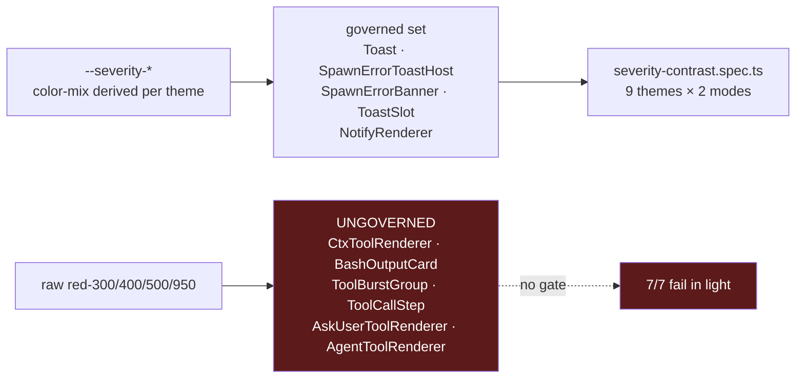

# Design — tokenize the tool-result error surfaces

## Context



The token system, the contrast gate and the no-raw-literals rule all already
exist. The only thing missing is that these six components were never enrolled.
So this change is an **enrolment**, not a new mechanism — the same shape as the
earlier `NotifyRenderer` extension.

## D1 — Extend the governed set; do not create a parallel one

**Decision.** Add the seven surfaces to the existing
`message-severity-tokens` no-raw-literals requirement and to the existing e2e
contrast spec.

**Why.** A second, tool-renderer-specific token set or gate would immediately
drift from the first. The failure being fixed is *literally* the failure mode of
having colour decisions outside one governed set.

**Alternative rejected.** Add a `--tool-error-*` triple. It would need its own
derivation, its own gate, and its own review discipline, to express exactly what
`--severity-error-*` already expresses.

## D2 — Severity on the chrome, neutral on the content

**Decision.** For an error surface with a **multi-line body** (a log dump, a
transcript, a stack trace), severity tokens style the border, fill and label. The
body uses `--text-secondary` on `--bg-code`.

For **badges and bare status icons** the whole element takes
`--severity-error-fg`; there is no content/chrome split to make.

For an **icon-plus-message** surface (`AskUserToolRenderer`,
`AgentToolRenderer`) the accent goes on the icon / `Error:` marker only and the
message takes `--text-secondary`. Reviewed and confirmed during apply: the
alternative — giving those two surfaces a container fill + border so the
"three redundant channels" argument holds literally — was **rejected**. Only the
error tool *cards* are restructured; a one-line subagent error is not promoted
to a card. The redundancy there is the icon plus the message's own wording.

**Why.** Contrast and legibility are different problems. The ctx card's body
measures 10.23:1 in dark mode and is *still* hard to read, because every token in
a shell transcript is rendered the same hue. Colour is being used to signal a
state, and state is a property of the *card*, not of each character of program
output. Tinting the container says "this failed" once; tinting the text says it
several hundred times and destroys the structure of what is being read.

**Precedent.** `CtxToolRenderer.tsx:194` already does exactly this for its
`receivedArgs` block. The bug is that the primary body — the part users actually
read — didn't get the same treatment.

**Consequence.** The error signal is carried by fill + border + an uppercase
label. That is three redundant channels, so removing colour from the body does
not weaken the signal. It also means the body can later carry real syntax
highlighting without fighting an inherited colour.

**Alternative rejected.** Keep the body red but swap `red-300` →
`--severity-error-fg`. This fixes the measurable defect and leaves the reported
one ("completely red and unreadable") in place.

## D2b — Render the error body's structure, do not just recolour it

**Decision.** Parse the ctx runtime error into `command` / `language` /
`exitCode` / `stdout` / `stderr` and render the command through the existing
`CodeBlock` (syntax-highlighted), with each stream as its own labelled section —
the same machinery the success path uses.

**Why.** The reported follow-up — *"Split into sections, is the markdown there
generated?"* — is a real third defect, not a cosmetic ask. The error body is a
context-mode execution result: a fenced ` ```shell ` block, an exit code, and
two streams. It is rendered through `LinkifiedText`, which linkifies URLs and
paths only, so the fence markers and the `Exit code:` / `stdout:` / `stderr:`
structure appear as literal text. Meanwhile the **success** path of the same
component (`CtxToolRenderer.tsx:239`, `splitHeadingBlocks`) renders fenced code
through `CodeBlock` → `SyntaxHighlighter` and splits headings into sections. The
error path is inconsistent with its own success path, on the card users read
most carefully.

**Why in the parser, not the renderer.** `parse-ctx-result.ts` is already the
pure, React-free grammar layer for every ctx result kind, and the success kinds
(`execute`, `batch`, `search`) already emit structured fields there. Structuring
the runtime error the same way keeps the renderer a dumb switch and makes the
extraction unit-testable without a DOM — which is where the existing ctx-parser
scenarios live.

**Fallback is mandatory.** A runtime error whose body is a plain sentence (no
fence, no exit line) must degrade to the flat `message` on `--bg-code`, never
throw, and never drop text. The parser leaves the fields undefined; the renderer
falls back. This mirrors the parser's existing `{ kind: "raw" }` degrade rule.

**Alternative rejected.** A generic markdown renderer for the error body. It
would pull a full markdown pipeline into a card that only ever contains this one
shape, and it would diverge from the `CodeBlock`/section presentation the
success path already establishes. Reusing the existing components keeps the two
paths identical.

## D3 — Cover the surfaces in the existing gate, not a new one

**Decision.** Extend `tests/e2e/severity-contrast.spec.ts` with probes for these
surfaces.

**Why.** That spec already resolves `color-mix()` in a real browser across 18
theme·mode combos — jsdom cannot. A unit test asserting "the class string
contains `--severity-error-fg`" would pass while the rendered result was
illegible, which is precisely how the current bug survived.

**Consequence.** These surfaces inherit the documented exceptions and the
relative-gate rationale already recorded in `message-severity-tokens`, including
the tokyo-night/light carve-out. No new exception is introduced.

## D4 — A static guard, because review demonstrably does not catch this

**Decision.** Add a check that fails when a raw `red-[0-9]{3}` literal appears in
a governed error surface.

**Why.** This bug reached production *after* the severity system shipped, and the
`receivedArgs` line six rows below the defect proves the author knew the rule.
Human review is not a reliable gate for "did you use the token here too".

**Scope.** The guard covers the governed file list only. A repo-wide ban would
fire on ~40 legitimate uses (destructive buttons, preview panes) and would be
turned off within a week.

**Q1 — resolved: a vitest guard, `scripts/__tests__/severity-literal-guard.test.mjs`.**
Neither of the two candidates on the table. `check-conventions.mjs` caps itself
at four rules in its own header ("growth pressure here is a signal to write a
different script") and, decisively, it runs **only** in ship-it step 4.4 — not in
CI. A vitest guard runs in `npm test`, which is what `ci.yml`, `publish.yml` and
`npm run quality:changed` all invoke, so it gates strictly more paths at zero
wiring cost. Biome was rejected for the reason already recorded: the class
strings are template literals at some call sites.

The shape has precedent: `scripts/__tests__/repo-hygiene.test.mjs` is the same
thing — tree-absolute regression guards with zero current violations, living as
vitest tests rather than as `check-conventions.mjs` rules.

**Exemption mechanism.** The allowlist is file-scoped, but one governed file
(`ToolCallStep.tsx`) legitimately carries a raw red literal for its **stop**
button — a destructive-action control, explicitly out of scope. Rather than
narrow the guard to line numbers (which rot on the first edit above them), a
literal may be exempted with a `severity-exempt: <reason>` marker on its own or
the preceding line. Exemptions are therefore explicit, greppable, and reviewed.

Measured red state before the fix: 10 hits across the six files (9 in scope + the
now-exempted stop button).

## Non-goal

The ~40 other raw red literals outside error surfaces. Some are correct
(a destructive-action button *should* be a saturated red, and it sits on its own
opaque fill, not on a theme-derived surface). Sweeping them is a separate,
lower-value change with a much larger blast radius.
