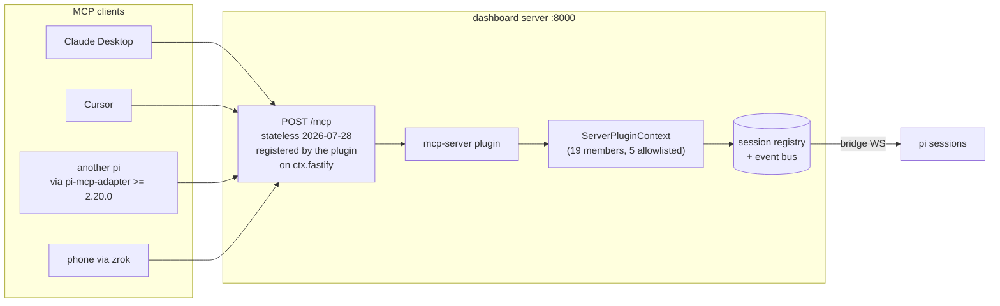

# Design — add-dashboard-mcp-server

## Context

Protocol revision `2026-07-28` is **Current** per
<https://modelcontextprotocol.io/specification/versioning>. Conformance rules
for a server on this revision, quoted verbatim from the transport page:

> - HTTP GET or DELETE to the MCP endpoint: respond with `405 Method Not Allowed`.
> - An `Mcp-Session-Id` header on a request: ignore it, and do not mint or echo session IDs.
> - A `Last-Event-ID` header: ignore it; streams are not resumable.

The changelog entries this change depends on, also verbatim:

> 1. Remove protocol-level sessions and the `Mcp-Session-Id` header … Servers
>    that need cross-call state use explicit, server-minted handles passed as
>    ordinary tool arguments (SEP-2567).
> 2. Make MCP stateless: remove the `initialize`/`notifications/initialized`
>    handshake … (SEP-2575).
> 3. Add `server/discover`: servers **MUST** implement this RPC …
> 4. Replace the HTTP GET endpoint and `resources/subscribe`/`resources/unsubscribe`
>    with `subscriptions/listen`: a single long-lived POST-response stream …

Example request shape:

```http
POST /mcp HTTP/1.1
MCP-Protocol-Version: 2026-07-28
Mcp-Method: tools/call
Mcp-Name: send_prompt
Authorization: Bearer <per-session MCP token>

{"jsonrpc":"2.0","id":1,"method":"tools/call","params":{
  "name":"send_prompt",
  "arguments":{"sessionId":"…","text":"run the tests"},
  "_meta":{
    "io.modelcontextprotocol/protocolVersion":"2026-07-28",
    "io.modelcontextprotocol/clientInfo":{"name":"…","version":"…"},
    "io.modelcontextprotocol/clientCapabilities":{}
  }}}
```

## Architecture



## Decision 1 — Substrate: a curated allowlist over `ServerPluginContext`

**Chosen.** Of three candidate substrates, `ServerPluginContext` is the
plugin-facing API and the right layer. The tier split in the `pi-dashboard`
skill already rules out REST for command verbs ("REST remains a supported
compatibility shell"), and `GENERATED_VERBS` (**73** entries) is far too wide —
most are UI-shaped (`reorder_pinned_dirs`, `set_session_process_drawer`) or
transport plumbing (`subscribe`, `watch_files`, `worktree_init_subscribe`).

**Correction from cycle 1:** an earlier draft claimed this choice "dissolves the
curation problem." It does not. `ServerPluginContext` exposes **19** members
(`server-context.ts:191-247`), so selecting a subset **is** a hand-maintained
allowlist — it is simply a far smaller and better-typed one than 73 verbs. The
completeness test is therefore **required**, not avoided.

Proposed allowlist:

| `ServerPluginContext` member | MCP tool | Note |
|---|---|---|
| `sessionManager.listAll()` | `list_sessions` | read |
| `sendToSession(sessionId, text)` | `send_prompt` | `/`-prefix routes to extension-command dispatch |
| `spawnSession(opts)` | `spawn_session` | first-party trust gate |
| `abortSession(sessionId)` | `abort` | **corrected** — the general primitive |
| `abortSpawnedRun({…})` | *not exposed* | hard-kills *plugin-spawned* runs only; wrong shape for a general tool |
| `onEvent(handler)` | `subscriptions/listen` | delivers **all** sessions' events — the plugin MUST filter per subscription |

Allowlisted (**5** of 19): `sessionManager`, `sendToSession`, `spawnSession`,
`abortSession`, `onEvent`.

Deliberately excluded (**14** of 19): `broadcastToSubscribers`,
`registerPiHandler`, `registerBrowserHandler`, `emitEventToSession`,
`provide`/`consume`/`consumeAll`, `eventStore`, `fastify`, `onSessionEnded`,
`abortSpawnedRun`, and — added by task 2.2 — `getPluginConfig`,
`updatePluginConfig`, `logger`.

| Excluded member | Why it must never be an MCP tool |
|---|---|
| `getPluginConfig` | Reads this plugin's own config; exposing it leaks server-side configuration to any token holder. |
| `updatePluginConfig` | Write access to plugin configuration — a privilege-escalation primitive, not a session-control verb. |
| `logger` | Not a verb. Exposing it lets a caller forge server log lines, defeating the G5 refusal-observability requirement. |

5 allowlisted + 14 denied = 19. The completeness check (E22/E23) asserts the
sum, so a future context member cannot be silently unclassified.

**Trust-gate caveat.** `spawnSession` / `abortSession` are gated to
*first-party plugins* — that is **plugin-registration** trust, not per-request
authorization. Once this in-repo plugin passes the gate, any valid token holder
reaches those verbs. This is not a scope increase over today's REST surface, but
it must not be described as a per-request security property.

## Decision 2 — Route ownership: the plugin registers its own route (RESOLVED)

**Cycle 1 overturned this decision.** The earlier draft asserted that plugins
cannot mount HTTP routes and that the runtime's convention is "core owns routes,
plugins contribute data." **Both claims are false.**

- `packages/dashboard-plugin-runtime/src/server/server-context.ts:192` —
  `fastify: FastifyInstance` is a first-class member of `ServerPluginContext`,
  handed to every plugin.
- **Seven** plugins already register routes on it: `automation-plugin` (12),
  `kb-plugin` (4, via `kb-routes.ts` `mountKbRoutes`), `blackhole-plugin` (2),
  `hermes-memory-plugin` (2), `apple-tools` (1), `flows-plugin` (1),
  `flows-anthropic-bridge-plugin` (1).

  *(Cycle-2 correction, task 2.1. The task directed "nine → eight"; the measured
  count is **seven**. Two separate over-counts: (a) `subagents-plugin` registers
  no custom REST route — its server entry calls only
  `ctx.fastify.addHook("onResponse", …)`, and a hook is not a route precedent;
  (b) the original prose said "nine" while naming only eight. Enumeration:
  `rg -l 'fastify\.(get|post|put|delete|patch|all|route)[<(]' packages/*/src`
  excluding `packages/server` (core, not a plugin) and `dashboard-plugin-skill`
  (a scaffold template, not a live plugin).)*

The original grep searched `dashboard-plugin-runtime/src/server/*.ts` for a
*registration implementation* (`registerRoute`, `httpRoute`, `app.get`) and
concluded absence. The actual API is simply **handing over the Fastify
instance** — invisible to that pattern. Lesson recorded: absence-of-grep-hit is
not absence-of-capability.

**Consequence:** no new `SlotId` and no `slot-types.ts` change. The plugin
registers `POST /mcp` in its server entry like every other plugin. This is
strictly simpler than either option previously considered.

### Cycle-2 amendment — one additive `dashboard-plugin-runtime` change IS needed

The claim above originally read "no `dashboard-plugin-runtime` change, and no
public-API risk." **Implementation disproved the first half.** Decision 6 mints a
token attributed to "the sessionId the socket is keyed under, never the message
body" — but the seam could not deliver it:

```ts
// server-context.ts, before
export type RegisterPiHandlerFn = (type: string, handler: (msg: unknown) => void) => void;
//                                                          ^^^ msg only
```

`piGateway.onEvent` *has* the sessionId, but `event-wiring.ts` dropped it:
`dispatchPluginPiMessage?.(msg.messageType, msg)`. A plugin could therefore only
read the caller's session out of `msg` — bridge-supplied content, i.e. exactly
the spoofable source M3/M4 exist to forbid. Taking it would have returned the
self-target guard to the theatre that cycle 1 already overturned once.

**Resolution:** the handler signature becomes `(msg, sessionId)` and the gateway
passes its own socket key through. The change is **additive** — a handler
declared `(msg) => …` still type-checks and still works — and there was exactly
one in-repo production caller, so real-world blast radius is nil. Public-API
risk is therefore *low*, not *absent*: the type is exported and a third-party
plugin declaring its own `RegisterPiHandlerFn`-typed variable would see the
widened signature.

Lesson recorded, twinned with the cycle-1 one: *absence-of-grep-hit is not
absence-of-capability, and presence-of-capability is not presence-of-the-**data**
that capability needs.*

### Route-level 405 conformance is not automatic

The spec's 405 MUST needs explicit handling. Fastify's router falls through an
unmatched method to `setNotFoundHandler` (`packages/server/src/server.ts:1733`),
which in `--dev` proxies to Vite and returns **200 with SPA HTML** — a silent
conformance failure that looks like success. `GET`/`DELETE` on `/mcp` MUST be
registered explicitly to return 405.

## Decision 3 — Collision avoidance with `pi-mcp-adapter` (RESOLVED)

| Surface | Collides | Mitigation |
|---|---|---|
| `/mcp` HTTP path on :8000 | **No** | The adapter's `/mcp` is a **pi slash-command** (`index.ts:500,511,515`; `commands.ts:528,588` — `Usage: /mcp ${subcommand}`, `createMcpPanel`), not an HTTP route. *(Cycle-1 correction: an earlier draft cited `config.ts`, whose `/mcp` tokens are remote-server URL suffixes and `.pi/mcp.json` filenames — wrong file, wrong count.)* |
| `command-route` claim `"/mcp"` | **Conditional** | The adapter registers no dashboard `command-route` claim, so there is no live claimant today. Still avoid `command: "/mcp"` — the pi-side command name is user-visible and the collision would be confusing. Use `/mcp-server`. |
| OAuth callback port | **Avoided** | The adapter binds its own callback server (`getConfiguredOAuthCallbackPort`). Avoided entirely by **not implementing OAuth**. |
| `~/.pi/agent/mcp.json` | **Yes — now in scope** | `apple-tools` already writes `mcpServers.iMCP`. Our entry MUST use a distinct name and reuse the merge-only + atomic-rename + refuse-unparseable discipline of `packages/apple-tools/src/mcp-config.ts`. |

**Narrowed rule of thumb** (the earlier "do not name anything `mcp`" was
overbroad and self-violated by `/mcp` and `mcp-server-plugin`): *do not claim the
`/mcp` **slash command**, and do not bind an OAuth callback port.*

## Decision 4 — Reentrancy: mint a per-session MCP token (RESOLVED)

**Cycle 1 overturned the original guard.** It specified "refuse when the caller's
own `sessionId` equals the target," premised on "a per-session bearer supplies
[caller identity]." No such credential existed:

- `packages/server/src/pairing/paired-devices.ts` — `PairedDevice` is
  `{id, label, tokenHash, createdAt, lastSeen}`. **Device-scoped, no session
  binding.**
- `packages/server/src/auth/bearer-auth.ts:41-44` — the hook sets only
  `request.isAuthenticated = true`, discarding even the device id.

So the server could not know a caller's session, and self-reported identity is
spoofable — the same objection that ruled out hop-count.

**Resolution: mint a per-session MCP token.** Session-scoped credentials make the
caller's originating session **server-known and unspoofable**, which is the only
basis on which self-target refusal is a real guard rather than theatre. This adds
a credential type but not OAuth, so the no-OAuth constraint holds.

| Property | Paired-device bearer | Per-session MCP token |
|---|---|---|
| Scope | device | session |
| Caller identity derivable | no | **yes** |
| Revocation | row delete | row delete + session end |
| Self-target refusal possible | no | **yes** |

**Scope limit — direct self-targeting only (task 8.4).** The guard refuses a call
whose target equals the caller's own resolved session. It does **not** detect an
indirect loop, where a caller resolving to A drives B while a caller resolving to
B drives A. That is **out of scope for this change**, deliberately:

- Detecting it needs call-graph state across requests, which a stateless endpoint
  does not have and would have to invent.
- Breaking such a loop needs a depth limit or a force-kill ladder, and Decision 13
  gives MCP neither.

The permission is asserted by test G6, so narrowing it later is a deliberate spec
edit rather than an accident.

**Client without a session.** Claude Desktop and Cursor are not pi sessions and
have no originating session id. Such callers authenticate with a device-scoped
token, can never collide with a target, and are unaffected by the guard. The
guard binds only session-originated callers — i.e. exactly the loop hazard.

Aggravating factor that makes this worth the cost: `sendToSession` routes
`/`-prefixed text to **extension-command dispatch**, so an unbounded loop drives
commands, not just chat.

## Decision 5 — `mcp.json` provisioning (IN SCOPE) + the version-floor gap

`~/.pi/agent/mcp.json` writes are **in scope** for this change (cycle-1
resolution of a scope contradiction: the spec bound the writes while the proposal
deferred them). The dashboard provisions its own entry so a local pi session can
reach `/mcp`.

The trap worth recording:

> **Legacy remains the default.** — `pi-mcp-adapter` 2.20.0 CHANGELOG

An entry written without `protocolVersion` gets the *legacy* handshake
(`initialize` + `Mcp-Session-Id`) against a `2026-07-28` server spec-bound to
ignore both. Our entry MUST set `protocolVersion: "auto"` (negotiate with
conservative fallback) or pin `"2026-07-28"` (fail loudly, never degrade).

**Version floor gap.** `packages/shared/src/recommended-extensions.ts:478`
declares `requires: { piExtensions: ["pi-mcp-adapter"] }` with **no version
floor**, and `PluginRequirements` (`manifest-types.ts:90-105`) has only
`piExtensions` / `binaries` / `services` / `paths` — no field expresses one. The
locally installed adapter is **2.19.0**, below the `>= 2.20.0` this change needs.
Either extend `PluginRequirements`, or surface the floor as a documented
prerequisite and a runtime probe. This gap likely affects other plugins.

## Decision 4a — The two token kinds (task 1.1, RESOLVED)

The "session token dies with its session" and "device token has no identity"
statements are **not** contradictory. They describe two token *kinds* sharing one
verification path. The verifier resolves a presented bearer to:

```ts
type McpCaller =
  | { kind: "session"; sessionId: string }   // minted per session, see C1
  | { kind: "device"; deviceId: string };    // existing PairedDeviceRegistry
```

| | `kind: "session"` | `kind: "device"` |
|---|---|---|
| Registry | new in-memory MCP token registry | existing `paired-devices.json` |
| `originatingSession` | the bound session id | `null` |
| Lifetime | its session's lifetime | until row delete |
| Self-target guard | **binds** | does not apply |

The self-target guard (Req 6) fires **only** for `kind: "session"`. A device-token
caller — Claude Desktop, Cursor, a phone over zrok — has no originating session,
so it can never collide with a target and is structurally unaffected (G4).

## Decision 6 — Token minting channel (test-plan C1, task 1.2, RESOLVED)

**Chosen: the bridge WebSocket, and nothing else.** The extension sends an
`mcp/mint-token` message over its already-registered bridge socket. The server
attributes the mint to the session **that connection registered as**
(`currentSessionId` in `pi-gateway.ts`) — never from a field in the message body.

### Cycle-3 correction — the gateway had to be fixed for this to be true

The first implementation asserted this property but did not have it. `plugin_pi_message.sessionId`
is a **required** field on the envelope (`protocol.ts:593`), and the gateway
preferred it over the connection:

```ts
// pi-gateway.ts, before
const eventSessionId = "sessionId" in msg ? (msg as any).sessionId : undefined;
onEvent?.(eventSessionId ?? currentSessionId ?? "", msg);
```

So the body field was *always* present and *always* won. Session A could send
`{sessionId:"B", messageType:"mcp/mint-token"}` and receive a token bound to B —
then self-target A while the guard saw a caller of B. The guard was theatre, and
the test asserting otherwise exercised a hand-written stand-in rather than the
real dispatch path, so it passed regardless.

`plugin_pi_message` is now attributed to `currentSessionId`. Every other message
type keeps its previous precedence.

**The guarantee, stated exactly:** the id is *the session this connection
registered as*. It is not spoofable per-message, which is what the self-target
guard needs. It is **not** a claim about the pi gateway port's own
authentication — `currentSessionId` is itself set from the first `register`
message, so a process that can reach the gateway port can still register as a
session id of its choosing. That is the dashboard's pre-existing bridge trust
model and is out of scope here; it is recorded so the property is not overread.

This is the only channel in the system that proves session identity server-side,
which is exactly what Decision 4 requires for the guard to be real rather than
theatre. The consequence is strong: **M4 ("minting for a foreign session is
refused") becomes structurally true** — there is no field on the wire to spoof,
so the test asserts the absence of an attribution input, not a rejection branch.

Rejected alternatives:

| Channel | Why rejected |
|---|---|
| REST endpoint authenticated by a device token | A device token proves *a* trusted device, never *which session* is asking. Reintroduces the exact spoofability Decision 4 overturned. |
| The spawn path | Only covers sessions this server spawned; every pre-existing and externally-started session would be unmintable. |
| Client-asserted `sessionId` on the mint request | The spoof M3 exists to forbid. |

## Decision 7 — Token format, expiry, persistence (test-plan C2, task 1.3, RESOLVED)

Mirrors `paired-devices.ts` for the **cryptography**, deliberately diverges on
**persistence**.

| Property | Value | Rationale |
|---|---|---|
| Format | opaque 32-byte (256-bit) random, `mcp_` prefix | same as `TOKEN_BYTES = 32`; opaque, not a JWT, so revocation is a row delete with no denylist |
| At rest | SHA-256 hex only | a leaked registry cannot be replayed |
| Plaintext | returned once at mint, never stored | same discipline as `PairedDeviceRegistry` |
| Comparison | `crypto.timingSafeEqual` over equal-length hex | X10 |
| Independent expiry | **none** | lifetime == session lifetime; a second expiry axis adds a failure mode with no threat it closes |
| Persistence | **in-memory only — no disk file** | see below |

**No disk persistence** is the load-bearing divergence. All session tokens die on
server restart. This satisfies X9 ("all survive or all die, never partially
valid") by construction rather than by careful writing, and it is safe because a
restart tears down and re-establishes every bridge WebSocket — each session
simply re-mints. It also means there is no `mcp-tokens.json` to leak, chmod, or
corrupt.

## Decision 8 — Revocation (test-plan C3, task 1.4, RESOLVED)

Three paths, all of them a row delete from the in-memory registry:

1. **Automatic on session end** — `ServerPluginContext.onSessionEnded`, plus
   `pi-gateway`'s `onDisconnect(sessionId)`. This is the primary path (M6).
2. **Explicit** — an `mcp/revoke-token` message over the same bridge socket,
   attributed identically to the mint (Decision 6).
3. **Process exit** — implied by Decision 7's in-memory registry (X8: a plugin
   load failure leaves no stale token, because the registry lives with the
   plugin).

**No Settings UI in this change.** Session tokens are not user-managed objects;
they are lifecycle-bound. Adding a management surface would be the L3 trigger the
test plan already anticipates, and is deliberately deferred.

**S9 — revocation against a live stream.** An open `subscriptions/listen` stream
**re-verifies its caller on every event dispatch**, not only at open. A revoked
token **terminates the stream** with a JSON-RPC error frame. Rejected: silently
draining (the caller cannot tell access ended) and letting the stream run to
completion (revocation would not actually revoke).

## Decision 9 — `subscriptions/listen` filter shape (test-plan C4, task 1.5, RESOLVED)

```jsonc
{"jsonrpc":"2.0","id":1,"method":"subscriptions/listen",
 "params":{"sessionIds":["<id>","<id>"],
           "_meta":{"io.modelcontextprotocol/protocolVersion":"2026-07-28"}}}
```

- Param name **`sessionIds`**, an array of session-id strings. A custom extension,
  as the base `2026-07-28` `notifications` filter has no session notion.
- **Absent, empty, or non-array `sessionIds` → JSON-RPC `-32602` invalid-params.**
  S3's "dangerous partition" is closed **by construction**: there is no input that
  means "every session." Fan-out-everything is not a default we chose against — it
  is unreachable.
- **No wildcard** in this change. A future `"*"` would be a deliberate spec edit.
- An id in `sessionIds` that does not exist → `-32602`, so a typo is loud rather
  than a silently-empty stream.

## Decision 10 — Legacy protocol revisions (test-plan C5, task 1.6, RESOLVED)

**`2026-07-28` only.** `server/discover` advertises exactly one supported version.
`2025-06-18` and `2025-11-25` receive `UnsupportedProtocolVersionError` (E11).

Serving a legacy revision would reintroduce the `initialize` handshake and
`Mcp-Session-Id` — the two mechanisms this entire design is built to refuse. A
server that must ignore session ids on one revision and honour them on another is
not stateless; it is stateful with a flag. The cost is borne by clients pinned
below `2026-07-28`, which is why the `pi-mcp-adapter >= 2.20.0` floor is a
hard prerequisite rather than a nicety.

## Decision 11 — Reserved `mcpServers` key (test-plan C6, task 1.7, RESOLVED)

The key is **`"pi-dashboard"`** — namespaced by product name, collision-safe
against `apple-tools`' `iMCP` and against future provisioners.

Collision behaviour (J6), decided explicitly so "documented outcome" is concrete:

| Existing value at `mcpServers["pi-dashboard"]` | Writer behaviour |
|---|---|
| absent | create |
| present, carries a `url` (our HTTP-server shape) | **overwrite** — we own this key, and the url/port may legitimately have changed |
| present, any other shape (e.g. a stdio `command` entry) | **refuse the whole write and surface an error**, file left unmodified — a foreign entry squatting our key is never silently clobbered |

## Decision 12 — Performance thresholds (test-plan C7, task 1.8, RESOLVED)

| id | workload | metric | threshold |
|---|---|---|---|
| P1 | sustained authenticated `tools/call` | p95 added latency of token verification | **≤ 1 ms** — the work is one SHA-256 over 32 bytes plus a `Map` lookup |
| P2 | repeated `tools/list` | p95 response time | **≤ 50 ms** — the tool table is static and built once |
| P3 | **N = 50** concurrent `subscriptions/listen` streams, steady events | delivery p95 / dropped events | **≤ 250 ms** / **0 dropped** |
| P4 | long-running streams under continuous events | RSS growth / listener count | **≤ 25 MB** over a **10-minute** window / back to baseline **±0** |

P4's listener-count-±0 is the same assertion as S4/S5/S6 measured over time; it is
the leak canary for Decision 9's per-request subscription lifetime.

## Decision 13 — No force-kill path (task 1.9, RESOLVED)

**MCP gets no force-kill.** `abortSession` is soft-only, and `abortSpawnedRun` —
which holds the only kill ladder — stays excluded for the reason Decision 1 gave:
it hard-kills *plugin-spawned* runs specifically and is the wrong shape for a
general tool. Exposing it would let any token holder hard-kill runs it did not
spawn.

Consequence for **X4**, stated so the test is not written against a wish: `abort`
on a session whose bridge is disconnected returns **`false`**, and the MCP caller
is told the abort **did not take effect**. A false success is the failure mode
being forbidden. If a kill ladder is later needed, it is a deliberate spec edit
that must re-argue this exclusion.

## Statelessness vs. `subscriptions/listen`

These are reconciled, not contradictory. `2026-07-28` is stateless at the
**protocol** layer — no session id, no handshake, no cross-request server memory
required to interpret a request. `subscriptions/listen` is a single long-lived
**response stream scoped to one request**; its subscription lives for exactly
that request and dies with it. No state is shared *between* requests, and no
request depends on a prior one. The spec deltas state this explicitly so the two
requirements do not read as conflicting.

## Auth boundary

`createNetworkGuard` (`packages/server/src/auth/localhost-guard.ts`) allows any
`isGenuinelyLocal` request **with no credential**. That is incompatible with
"credential required per request" for a tunnel-reachable tool endpoint.

**Resolution (reworded per task 2.3):** `createNetworkGuard` is applied
**per-route**, so `/mcp` does not "opt out of" a global guard — it simply **sits
outside** it, and therefore **must self-guard**. The `/mcp` handler performs its
own credential verification inline, reading the `Authorization` header directly
and never consulting `request.isAuthenticated` (which the global hooks in
`auth-plugin.ts` and `bearer-auth.ts` set for cookies and device tokens alike).
`createNetworkGuard` is unchanged for every other route. The earlier phrasing
"keep localhost-guard intact" was imprecise and is corrected: the guard is
retained *elsewhere*; `/mcp` is deliberately stricter, and its strictness is a
property of its own handler, not of a guard it declined.

## Risks

| Risk | Mitigation |
|---|---|
| New credential type expands the auth surface | `security-hardening` pass; reuse the opaque + SHA-256-at-rest + revocation-by-row-delete pattern already proven in `paired-devices.ts` |
| 405 conformance silently passes as 200 SPA HTML in dev | Explicit `GET`/`DELETE` registration + a spec scenario asserting 405 in **both** dev and production modes |
| Allowlist drifts from the 19-member context | Completeness test asserting every advertised tool resolves to a handler (the `denylist.ts` lesson: naive codegen "would emit a WS helper that **silently fails**") |
| `onEvent` leaks all sessions to any subscriber | Per-subscription filtering is a spec requirement, not an implementation detail |
| Local adapter is 2.19.0 | Documented prerequisite + runtime probe; version floor per Decision 5 |
| Ecosystem clients still speak 2025-06-18 / 2025-11-25 | RESOLVED by Decision 10 — serve `2026-07-28` only. Legacy would reintroduce `initialize` + `Mcp-Session-Id`, so the adapter `>= 2.20.0` floor is a hard prerequisite rather than a nicety. |

## References

- Changelog <https://modelcontextprotocol.io/specification/2026-07-28/changelog> — SEP-2567, SEP-2575, `server/discover`, `subscriptions/listen`
- Transport <https://modelcontextprotocol.io/specification/2026-07-28/basic/transports/streamable-http>
- Versioning <https://modelcontextprotocol.io/specification/versioning> — `2026-07-28` is Current
- `pi-mcp-adapter` CHANGELOG 2.20.0 / 2.21.0 — <https://github.com/nicobailon/pi-mcp-adapter>
