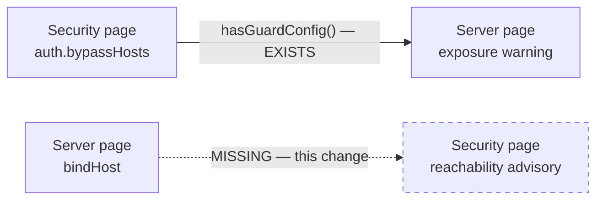

## Context

Two settings govern whether a LAN device can reach the dashboard, and they live on different Settings pages:

| Control | Config key | Page (`CONFIG_FIELD_PAGE`) | Restart? |
|---|---|---|---|
| Listen Interface picker | `bindHost` (default `127.0.0.1`) | Server | yes |
| Trusted Networks | `auth.bypassHosts` | Security | no (live re-read) |

The coupling is already acknowledged in one direction. `SettingsPanel.tsx:1078` passes `hasGuardConfig(config)` — which reads `auth.providers`, `trustedNetworks`, and `auth.bypassHosts` — into `ListenInterfaceField`, so the **Server** page reads **Security** state to warn "you are exposed" when `0.0.0.0` is selected without a guard. The return edge does not exist.

Enumerating the two axes shows one silent quadrant:

| `bindHost` | trusted entry | reachable? | today |
|---|---|---|---|
| `0.0.0.0` | `192.168.1.0/24` | yes | exposure warning suppressed (guard present) — correct |
| `0.0.0.0` | *(none)* | yes | exposure warning shown — correct |
| `127.0.0.1` | `192.168.1.0/24` | **no** | **silent** |
| `10.0.0.5` | `192.168.1.0/24` | **no** | **silent** |
| `127.0.0.1` | `127.0.0.1` | yes | must stay silent |

The affordance that would normally rescue the silent cases cannot fire there. `blockEvents.record()` is called at `packages/server/src/auth/localhost-guard.ts:122`, **inside** the Fastify request handler. A loopback-bound socket refuses the connection at the TCP layer, so no request handler runs, no block event is recorded, and `BlockEventTrustBanner` early-returns `null` at `SettingsPanel.tsx:2018`. The user sees a Trusted Networks section that is permanently, silently blank.

Constraints in force:
- `bindHost` is restart-required; `auth.bypassHosts` is live-reloaded via the mtime-gated config snapshot thunk.
- `settings-panel` forbids rendering a field on a page other than its top-level key's page, with a stated rationale about the dirty-page chip.
- `docker/compose.yml:38` sets `PI_DASHBOARD_HOST: "${PI_DASHBOARD_HOST:-0.0.0.0}"` — a **default**, operator-overridable, not a forced value. `docker/entrypoint.sh` seeds only `spawnStrategy` into config.json and never writes `bindHost`.
- The effective bind host resolves `--host` → `PI_DASHBOARD_HOST` → `config.bindHost` → default (`server.ts:143`, `cli.ts:159`), and `fastify.listen()` receives it **unvalidated** — `::` or a hostname are reachable values.
- No client-side CIDR containment helper exists. `gateway-config-ops.ts` exports `addTrustedNetwork`, `removeTrustedNetwork`, `suggestTrustEntries`; `isBypassedHost` is server-side only.

## Goals / Non-Goals

**Goals:**
- Make the silent quadrants visible at the moment and place the user is configuring trust.
- Cover the specific-NIC case, not just loopback — it is the same defect in a different shape.
- Offer remediation without forcing the user to know that `bindHost` exists or which page owns it.
- Cover operators who never open Settings (`config.json`, `--host`, `PI_DASHBOARD_HOST`).
- Keep the existing exposure warning intact and unweakened.

**Non-Goals:**
- No change to guard behavior. Nothing is allowed or denied differently.
- No modal or push-based approval prompt when an unknown host connects (see Decision 5).
- No auto-widening of the bind host without explicit user action.
- No fix for the unrelated staleness of `getBlockEvents()` (mount-only, no polling) — separate concern.
- No change to the pairing flow or `BlockEventBuffer`.

## Decisions

### Decision 1 — General reachability predicate, not a loopback check

**Chosen:** the predicate asks "can the resolved bind host serve this trusted entry?", answered as: reachable iff `bindHost === "0.0.0.0"` or the entry's range contains `bindHost`.

**Alternative rejected:** `bindHostToMode(bindHost) === "local"`. Cheaper — reuses the existing helper at `SettingsPanel.tsx:2257`, no new logic — but misses `bindHost = 10.0.0.5` with a trusted `192.168.1.0/24`, which is exactly as broken and exactly as silent. Shipping the narrow version would leave a defect of the same class in place, and the general form is a strict superset with one small pure function as its whole cost.

The union of `auth.bypassHosts` and top-level `trustedNetworks` is evaluated, mirroring `hasGuardConfig()` and the runtime guard, both of which honour both sources.

### Decision 10 — The predicate's input is the RESOLVED bind host, never `config.bindHost`

The first draft had the client compute the predicate from `config.bindHost`. That is wrong wherever the bind host is set by flag or environment: the container seeds no `bindHost` key, so `config.bindHost` reads as the `127.0.0.1` default while the server actually binds `0.0.0.0` from `PI_DASHBOARD_HOST`. The client would then show the advisory in **every** container that has a trusted network — the exact deployment this design claimed to exempt, and the one the E2E harness exercises. The server-side scenario passed while the client was wrong, because it asserted only the log and health surfaces.

**Chosen:** the server publishes its resolved bind host; the client evaluates against that. When the user has an unsaved listen-interface edit, the draft value governs instead, since that is what the next restart applies.

This makes contract "both sides agree" real rather than nominal — previously the two sides agreed on the *algorithm* while disagreeing on the *input*, which is the harder bug to see.

**Alternative rejected — client keeps using `config.bindHost` and the docker image seeds it:** fixes one deployment and leaves `--host` and any other `PI_DASHBOARD_HOST` user broken; also makes a UI correctness property depend on an entrypoint script.

### Decision 11 — The two banners are independent, not mutually exclusive

The first draft asserted the advisory and `BlockEventTrustBanner` were "mutually exclusive by construction". **That is false**, and it fails on this design's own flagship example. With `bindHost=10.0.0.5` and trusted `192.168.1.0/24`, the advisory shows — and a peer at `10.0.0.9` is *accepted* by that NIC, denied by the guard, and recorded. Both banners render.

The original rationale conflated two different statements: "a loopback bind records no block events" (true) with "whenever the advisory shows, no block events are recorded" (false). The exclusivity holds only for `0.0.0.0` and loopback binds — precisely not the general case Decision 1 exists to cover.

**Chosen:** the two are independent and may coexist. When both are present the advisory renders first, because it explains why block events may be *missing* for the unreachable range. Hard-coding suppression would have hidden a useful banner in exactly the configuration where the operator most needs it.

### Decision 12 — Deduplication belongs to the dropdown, not the endpoint

`/api/network-interfaces` has **two** consumers. `TrustedNetworksSection` wants one offer per range; `ListenInterfaceField` (`SettingsPanel.tsx:2281-2300`) renders one option per *address* (`key={iface.address}`, `value={iface.address}`), and the existing `server-bind-host` requirement already mandates that the picker's specific-interface options come from this endpoint.

Deduplicating server-side would delete `en7` (`192.168.10.224`) from the payload and make that bind address unselectable — breaking an existing consumer, and violating the additive contract, to serve the other one.

**Chosen:** the endpoint returns every address; the dropdown dedupes at render time, keyed on the suggestion **`value`** rather than the `cidr`. Keying on `value` also fixes a case `cidr` dedupe misses: two point-to-point interfaces (two tailnets, or Tailscale plus WireGuard) have different `/32` cidrs but both offer `100.64.0.0/10`, and would otherwise still produce duplicate rows — the very noise this change claims to remove.

### Decision 2 — Containment logic is needed only for the predicate

Because Decision 4 fixes the remediation target at `0.0.0.0`, no "find the NIC that covers this range" search is required. The new helper answers one question — *does range R contain address A?* — over the three formats the Trusted Networks section already accepts (exact, wildcard, CIDR). It is pure, dependency-free, and exported for tests, in the same shape as `suggestTrustEntries`.

**Alternative rejected:** import or share the server's `isBypassedHost`. It lives behind server-only imports; lifting it into `shared/` is a larger refactor than this change needs and would drag the guard's semantics into a UI advisory, coupling two things that should be free to diverge.

### Decision 3 — Both remediation affordances, mirroring the existing banner idiom

The advisory renders in the same slot and amber treatment as `BlockEventTrustBanner`, carrying an inline one-click write **and** a link to the Server page.

**Alternative rejected — link only:** spec-clean but makes the common case a three-step detour (navigate, find picker, select radio) for a decision the user has already effectively made.

**Alternative rejected — inline only:** hides the existence of the listen-interface setting, leaving the user unable to choose a narrower specific-NIC bind. The link preserves the escape hatch to the full value space.

### Decision 4 — Propose `0.0.0.0` only

**Chosen:** the inline control writes the single value `0.0.0.0`.

**Alternative rejected:** offer the specific NIC covering the trusted range as a green "narrow" option with `0.0.0.0` as the amber "wide" one, mirroring `suggestTrustEntries`' risk-tiering. Attractive on least-privilege grounds, but it introduces a NIC-selection search, a multi-button advisory, and an ambiguous case when several NICs match or none does. Determinism is also what makes the `settings-panel` exception defensible (Decision 6): a control that writes one fixed value is categorically not an editor. Users wanting the narrower bind take the link.

**Consequence accepted:** the one-click path is wider than strictly necessary. Mitigated by the advisory only appearing when a trusted network is already configured — i.e. a guard is in place, which is precisely the condition under which the existing exposure warning stays silent.

### Decision 5 — No connect-time approval dialog

Broadcasting a "trust this host?" modal on denial was considered. `broadcastToAll()` (`pairing/browser-gateway.ts:98`) and a pending→approve→poll state machine (`pairing/pairing.ts`) both already exist, so it is mechanically small. Rejected on two grounds:

1. **It inverts initiation.** Device pairing is safe because the *operator* starts it and the device proves possession by echoing a confirm code. A denial-triggered modal lets an unauthenticated remote party raise a dialog in the operator's browser on demand — a remote UI interrupt, with only an IP to identify the requester, open to timing races against the operator's own connection attempt and to consent fatigue.
2. **It cannot fire here anyway.** Under a loopback bind the connection is refused at the TCP layer, so no denial is recorded — the same reason `BlockEventTrustBanner` is blank. It does not address this problem.

If it is ever wanted, the defensible form is an operator-armed window ("allow new devices for 5 minutes"), which restores operator-initiated ordering. That belongs in its own change.

### Decision 6 — Make the `settings-panel` exception explicit

The inline control writes `bindHost`, a Server-page key, from the Security page. The existing rule forbids this, with the rationale that the dirty chip would name the wrong page.

**Chosen:** amend the requirement with a bounded exception rather than violate it silently. The exception is gated on four conditions — the control belongs to an advisory; the condition is only observable on the rendering page; the advisory names the setting and its owning page; navigation to the owner is offered — and it explicitly does **not** re-attribute the dirty chip. The chip still says **Server**, which is now correct rather than confusing, because the advisory told the user it was changing a Server setting.

**Alternative rejected — move the picker to the Security page:** would need `CONFIG_FIELD_PAGE.bindHost` remapped, breaking the Server page's Ports section and the existing exposure warning's home.

**Alternative rejected — leave the spec alone and ship the button:** a silent contradiction that the next reader has to litigate.

The exception is gated on the conditions enumerated in the `settings-panel` delta — that spec text, not this summary, is normative.

### Decision 8 — The dropdown and the block-event banner share one suggestion engine

`+ Add Local Network` computes offers by netmask arithmetic alone (`system-routes.ts:718-738`). Measured on a live macOS host with Tailscale:

| Interface | Address | Netmask | Offered | Verdict |
|---|---|---|---|---|
| `en0` | 192.168.10.123 | 255.255.255.0 | `192.168.10.0/24` | correct |
| `en7` | 192.168.10.224 | 255.255.255.0 | `192.168.10.0/24` | duplicate of `en0` |
| `utun4` | 100.97.246.31 | **255.255.255.255** | **`100.97.246.31/32`** | matches one address — the host itself |

Tailscale gives every node its own `/32` from `100.64.0.0/10`, so the offered entry trusts nobody new; the host is already loopback-exempt. Any point-to-point device (WireGuard, `utun`, `wg`, `ppp`) behaves identically.

`suggestTrustEntries` (`gateway-config-ops.ts:95-111`) already carries the correct knowledge — an explicit `a === 100 && b >= 64 && b <= 127 → "100.64.0.0/10", "tailnet CGNAT range"` branch — but only the block-event path calls it. Two routes to the same decision give contradictory advice (H4 Consistency & standards).

**Chosen:** the endpoint returns `suggestions` using the same semantics, and the dropdown renders them with the same green-narrow / amber-wide risk coding.

**Adaptation required.** `suggestTrustEntries(ip)` is written for a *remote peer* IP from a block event, so its first entry is always the exact host. Here the address is *our own*, making an exact-host offer meaningless. The mapping is therefore:

| Interface kind | Narrow (green) | Wide (amber) |
|---|---|---|
| broadcast (`/24`, `/16`, …) | its netmask-derived CIDR | none |
| point-to-point (`/32`) in a known range | none exists | the containing range |
| point-to-point outside any known range | none | none — shown unofferable |

The third row matters: inventing a range for an unrecognised `/32` would be a guess, and a wrong trust entry is worse than no entry.

**Alternative rejected — shell out to `tailscale status --json`:** yields the true tailnet rather than the whole CGNAT block, but adds an exec path, a binary dependency, a failure mode, and helps only one vendor. The wide-with-warning offer is honest and vendor-neutral.

**Alternative rejected — hide `/32` interfaces:** the user has a Tailscale device and legitimately wants it trusted; silently omitting the interface reproduces the original complaint in a new place.

**Tiering is contextual, not absolute.** Unifying the engine does NOT make the same range carry the same tier in both paths, and pretending otherwise would be a lie the UI tells. A block event supplies an exact peer address, so a derived `/24` is wide *relative to that*; an interface supplies no truthful narrower option than its own network, so the same `/24` is narrow *relative to that*. Both are correct. Because the tier is therefore ambiguous across contexts, every offer states its range in the label — colour is a hint, the range is the fact.

**Security note.** `100.64.0.0/10` is the entire CGNAT space, shared across tailnets and some ISP carrier-grade NAT, and the guard matches on source IP alone. The wide chip already ships the copy "Grants unauthenticated access to the whole {range} range", so adopting this idiom carries the warning for free. The real mitigation is the bind host: binding to the Tailscale NIC means only packets arriving on that interface can match — which is exactly the configuration the reachability predicate (Decision 1) scores as reachable, so the two features reinforce each other.

### Decision 9 — Label by meaning

(Deduplication moved to Decision 12 — it is a dropdown-render concern keyed on the suggestion `value`, not an endpoint concern keyed on `cidr`. Two NICs on one subnet currently produce the same offer twice, which is noise at a security decision point, H8.)

Raw device names carry no information for the person deciding whom to trust: `utun4` does not say "Tailscale". The endpoint returns a `label`; the UI renders it (H2 match between system and the real world).

Explicitly **not** in scope, having been considered: demoting VM/container bridges (`bridge100`, `feth*`) and adding separate CGNAT-breadth copy. The former needs a heuristic that would misfire on legitimate bridged setups; the latter is already carried by the wide-chip idiom.

### Decision 7 — Headless surface is additive, failure-isolated, and NOT on `/api/health`

The first draft put the condition on `/api/health`, reasoning by analogy with `eventLoopDelay`, `storeTrim`, and `notifyLog`. The analogy is wrong. `fastify.get("/api/health", ...)` at `system-routes.ts:448` has **no `preHandler`**, while `/api/config` at `:184`/`:243` carries `networkGuard`. Those existing telemetry fields describe the *server's own health*; the resolved bind host plus the unreachable trusted entries describe the *operator's private network topology*. Publishing them unguarded hands any peer that can reach the port a map of the internal subnets — and in the flagship configuration (`bindHost=10.0.0.5`, trusted `192.168.1.0/24`) that peer is exactly the untrusted host on `10.0.0.x` the guard just denied.

**Chosen:** the startup log line (server-local, no exposure) plus an additive field on the **guarded** config surface, which already returns redacted config to permitted callers only.

This also removes a client problem the first draft carried: the settings panel already fetches the config surface, so the resolved bind host rides along with data the panel loads anyway — no second fetch, no separate refresh strategy, and it re-reads whenever the panel reloads config. The health-field version would have needed its own key, type, and re-read policy, none of which were specified.

**Alternative rejected — keep it on `/api/health` but reduce it to a boolean:** a boolean still leaks that this host has an unreachable trusted network, and the client would still need the resolved host from somewhere guarded. Two surfaces for one fact, for no gain.

## Risks / Trade-offs

- **Advisory fires where the user genuinely wants loopback-only** (e.g. trusted entries staged ahead of a planned exposure) → the advisory is dismissible-by-irrelevance: it is advisory-only, blocks nothing, and disappears once the config is coherent. No nagging modal, no gating of Save.
- **One-click `0.0.0.0` is wider than the trusted range requires** → only offered when a guard is already configured; the link preserves the narrower specific-NIC path; the existing exposure warning remains the counterweight in the opposite direction.
- **Cross-page write surprises the user via the Server dirty chip** → the advisory names the setting and its owning page before the write, and the spec exception fixes that copy as a requirement rather than leaving it to implementation taste.
- **A wide suggestion is one click from unauthenticated access to a large range** → the offer is marked wide, styled distinctly, and carries the existing explanatory copy; it is only ever offered when no truthful narrow alternative exists.
- **`/32` in an unrecognised range yields no offer, which may read as a bug** → the interface is shown as unofferable *with an explanation* rather than omitted, so the absence is legible; manual entry remains available.
- **New containment helper drifts from the server's `isBypassedHost` semantics, or the client and server copies drift from each other** → the helper is scoped to the documented entry formats and covered by a shared truth-table test that BOTH implementations must satisfy; the task list names the server-side home explicitly. A divergence surfaces as a wrong advisory, never as a wrong allow/deny, because the guard does not consult it.
- **The same click now writes a wider range than before** — a Tailscale user who previously added `<self>/32` (admitting nobody) now adds `100.64.0.0/10` (admitting the CGNAT range) → guard *code* is untouched, so contract "no request allowed or denied differently" holds for the code; what changes is the config the user explicitly chooses to write. Accepted deliberately: the old entry was silently useless, and the new one is marked wide, styled distinctly, and carries the "whole range" warning. The bind host remains the real mitigation.
- **The predicate can FALSE-POSITIVE, not only false-negative** — bind `192.168.1.42`, trust `10.0.0.0/8`: a peer at `10.0.0.5` whose network routes to `192.168.1.42` does reach the bound address, and the guard matches its SOURCE ip against the entry, so it is admitted. The advisory nonetheless calls the entry unreachable. This is the mirror image of the row below and follows from the same "address test, not routing test" limitation; it matters more because a false positive pushes the operator to widen the bind. Accepted: the advisory blocks nothing, names the entries rather than asserting a verdict, and the alternative (a real routing probe) is far out of proportion to a UI hint.
- **Containment is an address test, not a routing test** — a trusted `10.0.0.0/8` scores reachable for a bind of `10.0.0.5` even with no route to the wider network → acceptable for an advisory; the spec states this explicitly so the predicate is never read as a reachability guarantee.
- **Restart-required confusion** — the user widens the bind, saves, and the LAN device still fails until restart → the advisory states the restart requirement, and the Settings header already carries a Restart button.
- **False positives in containers** → `docker/compose.yml:38` pins `PI_DASHBOARD_HOST` to `0.0.0.0`, so the predicate is false by construction; asserted as a spec scenario so a compose change that breaks it fails a test rather than the harness.

## Migration Plan

Purely additive: new pure helper, new advisory render path, new log line, new additive health field. No config schema change, no persisted state, no data migration.

**Rollback:** revert the commit. No config written by this change needs unwinding — any `bindHost` the user set through the advisory is an ordinary value the picker already supported.

## Open Questions

- Should the advisory list every unreachable entry, or collapse to a count once past a threshold? Deferred to implementation; the spec requires only that unreachable entries be named.
- Does the doctor skill want to consume the new guarded-config field as a derived check? Additive and out of scope here, but the field is shaped to allow it. The doctor already reads a guarded endpoint over loopback without a JWT, so the guard is not an obstacle.
- **RESOLVED (task 1.4)** — both live in `packages/shared/src/bind-reachability.ts`.
  Neither side keeps a copy: the client imports the predicate through
  `gateway-config-ops.ts` (which re-exports it), and the server imports it in
  `auth/bind-reachability-service.ts` + `routes/network-interfaces.ts`. There is
  therefore no truth table to run twice — there is one implementation, so
  divergence is structurally impossible rather than test-detected. The
  block-event path (`suggestTrustEntries`) was rewritten onto the same range
  table, which is what #E29 pins.
- Where does the server-side copy of the predicate and the well-known-range table live — lifted into `packages/shared/` or duplicated with a shared test? Both the containment predicate AND the suggestion range table now need agreement across the package boundary; whichever route is taken, one truth-table fixture must be executed by both implementations. Named in tasks rather than settled here.
