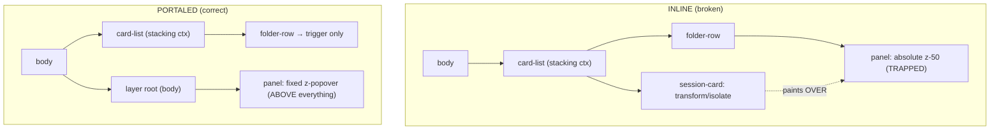

# Design — overlay-layering system

## Context

The dashboard client has no z-index discipline. A survey of `packages/client/src` (excluding tests)
finds **13 distinct z-values** spread over **28 overlay components**. The observable failure is
*underlap*: the desktop folder-actions flyout paints behind neighbouring session cards. The mobile form
of the same component is correct, which isolates the cause precisely.

## Root cause (verified, not assumed)

`FolderActionsMenu` renders two forms:

- **mobile**: `DialogPortal` → panel appended near `<body>`, `z-50`. Correct.
- **desktop**: inline `
` inside a ``.

`z-50` orders siblings only inside the nearest ancestor **stacking context**. A session card that sets
`transform`, `will-change`, `opacity < 1`, or its own `z-*` creates a new stacking context; the inline
desktop panel is trapped inside the folder row's context and cannot rise above a sibling card's context
no matter the number. The portal escapes all ancestor contexts, so the mobile path works. Therefore the
fix is **portaling**, and the number is only a within-layer tiebreak.

## Decisions

### D1 — Token scale over per-component numbers
Expose CSS custom properties (`--z-base:0; --z-raised:10; --z-sidebar:20; --z-overlay:30; --z-popover:40;
--z-dialog:50; --z-toast:60; --z-lightbox:70;` — spacing left for future insertion) plus Tailwind
utilities so authors write an ordinal role, not a magic number. Numbers are collapsed onto 8 named
layers; the exact integers are an implementation detail behind the token.

### D2 — Portal-or-perish as the invariant, token as the tiebreak
The spec's load-bearing rule is *portal every box-escaping overlay*. The token only orders portaled
layers against each other. This keeps the mental model simple: "does it leave its box? → portal it →
pick its layer role."

### D3 — Single shared layer root
Reuse the existing `DialogPortal` mechanism (already used by the correct mobile path and other dialogs)
as the top-level layer root rather than inventing a second portal target. Open question below on whether
one root or per-layer roots.

### D4 — Lint guard so the rule self-enforces
A lint rule rejects raw `z-[NNNN]` and ad-hoc numeric z utilities on portaled overlays, so the spec is
enforced mechanically and not only by reviewer memory. In-flow local `z-*` on non-portaled decorations
is allowlisted.

### D5 — kb discoverability is a first-class goal
The spec text front-loads the trigger vocabulary (z-index, layering, stacking context, underlap,
overlay, popover, dropdown, portal) and the client-components `AGENTS.md` rows gain the same keywords, so
`kb_search` routes a future author to this spec *before* they add an overlay. This is the mechanism by
which "this session never messes up the z-index again."

## Resolved decisions (apply phase)

1. **One shared layer root.** A single `#layer-root` element mounted once near `<body>`, with a
   non-scroll-locking `LayerPortal` (distinct from `DialogPortal`, which locks body scroll and is right
   only for full-screen modals). Portaled children order among themselves by the `--z-*` token. Chosen
   over per-layer roots for simplicity; the token gives a total order without needing DOM-insertion tricks.
2. **Phased blast radius.** The 28 overlays split into **Tier A** (already portaled/`fixed` → mechanical
   token swap, ~15) and **Tier B** (inline `absolute` popovers → need a fixed-coordinate positioning
   rewrite, ~12). This change lands Tier A + the concrete `FolderActionsMenu` fix; Tier B is deferred to a
   follow-up (`portal-inline-popovers`) and allowlisted in the lint guard until then.
3. **`popover-pane-boundary-provisioning` untouched.** Only `FolderActionsMenu` changes positioning here,
   and it does not consume a `boundaryRef`. `usePopoverFlip` gains an **additive** `triggerRect` return
   field; existing boundary-aware consumers ignore it, so the boundary-measurement path is unaffected.

### Tier A (this change) vs Tier B (follow-up)

- **Tier A — token swap:** ImageLightbox, ToastSlot, Toast, DiagnosticsSection, SpawnErrorToastHost,
  OpenSpecBoardView, ResourceTrustDialog, FirstLaunchDisplayModal,
  GenericExtensionDialog, SettingsPanel (modal), TasksPopover, MobileActionMenu, MobileOverlay,
  WorktreeInitStack, RecoveryOfferHost, usePluginToggle.
- **Tier B — deferred (allowlisted):** FolderActionsMenu is the exception (fixed now); the rest —
  ModelSelector, ThinkingLevelSelector, WorktreeActionsMenu, ChatViewMenu, AddToWorkspaceMenu,
  WorkspaceHeader, ServerSelector, OpenSpecGroupPicker, SessionHeader, BranchCombobox, PrCombobox,
  ThemePicker, TagEditor, EditorFileTree — stay inline until `portal-inline-popovers`.
- **FilePreviewOverlay — deferred from Tier A (ordering caveat).** It uses `z-[70]` to sit ABOVE the
  dialog layer `z-[60]` on purpose ("a preview opened from a dialog renders in front of it"). Naively
  collapsing both to the `dialog` token would erase that guaranteed inter-layer ordering, so it is
  allowlisted and gets a proper layer decision in the follow-up rather than a lossy swap now.

### Ordering rationale (finding 3b) — toast above dialog is intentional

The scale is `… dialog(50) < toast(60) < lightbox(70)`. This PRESERVES the existing raw order, where
toasts already outrank dialogs (`ToastSlot z-[100]`, `DiagnosticsSection z-[80]` vs dialog `z-[60]`) and
the lightbox tops all (`z-[9999]`). A toast must remain visible over an open modal, so toast>dialog is
deliberate, not an inversion.

### Scroll tracking (finding 2)

The portaled FolderActionsMenu panel is `position: fixed`, positioned from `usePopoverFlip`'s (new,
additive) `triggerRect`. `usePopoverFlip` already re-measures on a **capture-phase** window `scroll`
listener (`{ capture: true }`), which observes scroll events from inner scrollers (the sidebar list) even
though scroll does not bubble — so the panel re-positions and tracks its trigger on sidebar scroll. No new
listener is needed; this is the same mechanism `client-utils/Popover` uses.

### Lint guard = frozen baseline ratchet (finding 4)

A regex cannot distinguish a portaled overlay's z from an in-flow decoration's, so the guard does not try:
it captures the current raw-z occurrences as a frozen baseline and fails only on NEW additions outside
the token utilities (mirrors `scripts/knip-ratchet.mjs`). The baseline may only shrink; it doubles as the
Tier-B / FilePreviewOverlay migration backlog.
- **In-flow decorations (never migrated):** `SessionCard` `z-20` drag bead, sticky headers,
  `SessionList` scrollbar shim `z-[1]`, ChatView/CommandInput in-flow `z-10/z-20`.

## Non-goals

- Changing the escape-dismiss contract (`modal-escape-dismiss`).
- Changing popover height/boundary behaviour (`popover-pane-boundary-provisioning`).
- Touching in-flow, non-escaping `z-*` decorations.
