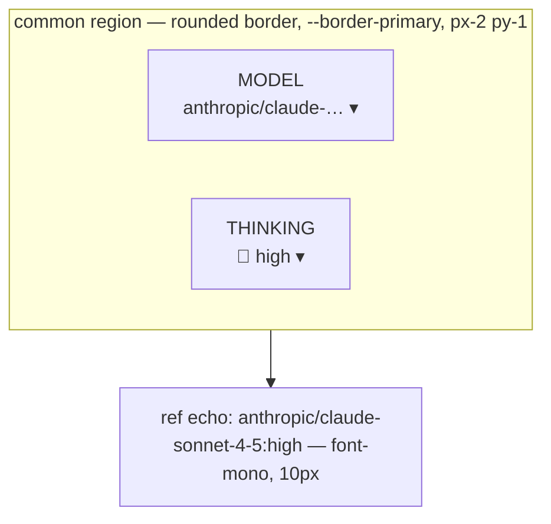

# UI plan — model+level pairing

Change: `add-default-thinking-level`. Surfaces → tokens → states.
Mockup: `index.html` (serve via `serve_mockup`; dark + light in-page toggle).

## Ground

Authoritative sources read before designing (no invented styling):

| Source | Taken from it |
|---|---|
| `packages/client/src/components/settings/ThinkingLevelSelector.tsx` | trigger `text-xs px-2 py-0.5 rounded`, `mdiHeadLightbulb` at `size={0.5}`, level order `off minimal low medium high xhigh max`, popover `w-32 bg-[--bg-secondary] border-[--border-secondary] rounded-lg shadow-lg`, rows `min-h-[44px] md:min-h-0`, current row `text-[--accent] font-bold` |
| `packages/client/src/components/settings/ModelSelector.tsx` | trigger `flex items-center gap-1 text-xs px-2 py-0.5 rounded`, `font-mono truncate max-w-[200px]`, `mdiChevronDown` `size={0.5}` |
| `packages/client/src/components/settings/SettingsPanel.tsx:1368` | Default Model callout `rounded border px-3 py-2.5 bg-[--severity-info-bg] border-[--severity-info-border]`, label `text-sm font-medium text-[--severity-info-fg]`, control cluster `flex items-center gap-2` |
| `packages/roles-plugin/src/RolesSettingsSection.tsx:669` | picker block `border border-[--border-primary] rounded p-2`, caption `text-[11px] text-[--text-muted] mb-1`, role token `font-semibold text-[--accent-blue]`, dirty dot `w-1.5 h-1.5 rounded-full bg-[--accent-warning]` |
| `packages/automation-plugin/src/client/CreateAutomationDialog.tsx:795` | `Field` label `block text-xs text-[--text-secondary]` + `mb-0.5`, mode toggle pills `px-2 py-0.5 text-[10px] rounded border`, ref echo `text-[10px] text-[--text-muted] font-mono mt-1` |
| `packages/client/src/index.css` | every token below; `[data-theme="light"]` overrides |

## Tokens used (no raw hex anywhere)

Surface: `--bg-primary` `--bg-secondary` `--bg-tertiary` `--bg-hover`.
Text: `--text-primary` `--text-secondary` `--text-tertiary` `--text-muted`.
Line: `--border-primary` `--border-secondary`.
Accent: `--accent-blue` `--accent-yellow` (dirty marker), `--link`.
Callout: `--severity-info-bg` `--severity-info-fg` `--severity-info-border`,
`--severity-warning-bg` `--severity-warning-fg` `--severity-warning-border`.
Focus: `--focus-ring` via the existing `.focus-ring` utility.

No new token is required. If the pair container ever needs its own tint, it goes
into the theme layer first — not into a component.

## The shared pattern: `ModelLevelPair`

One decision, two controls. Every run-configuring surface renders the same
thing, in the same order, with the same captions.

Rules:

1. **Model always left, level always right.** Consistency & standards
   (NN/g heuristic #4) + Similarity — the composer already reads model→level in
   that order, so the three new surfaces inherit it rather than inventing one.
2. **Both controls sit in ONE bordered container.** Gestalt common region +
   proximity: the level is a property OF the model, not a sibling setting. This
   is the visual claim that backs the `:<level>` ref encoding.
3. **Persistent 10px uppercase captions** (`MODEL`, `THINKING`) on the two
   controls in form context. Rubric #13 — every input carries a persistent
   label, never icon-only. The composer keeps its icon-only trigger (dense
   chrome, adjacent context); forms do not.
4. **The written value is echoed verbatim in mono** under the pair. Heuristic
   #1 visibility of system status: the user must be able to see that they
   produced `provider/model:high` and not two hidden fields.
5. **Every trigger ≥24×24px** (`min-height: 24px`). WCAG 2.2 SC 2.5.8 target
   size (AA). The shipped `py-0.5` trigger is ~20px — the pair wrapper sets the
   floor without touching the composer.
6. **Disabled/locked ≠ colour only.** The locked state carries an explicit text
   reason, not just a muted tint. WCAG 1.4.1 + heuristic #1.

## Surfaces & states

### S1 · Settings → Sessions → Default Model *(implemented; this plan adds the caption + locked reason)*

| state | render |
|---|---|
| model selected | pair inside the existing `--severity-info-*` callout, right-aligned; level filtered to `supportedThinkingLevels` |
| **no model selected** | level control shows `off` and is locked; a `--text-tertiary` line reads **"Pick a default model to choose a thinking level."** |

Locked-state rationale: a disabled control with no explanation is heuristic #1's
canonical failure. The spec already forbids persisting `off` here, so the UI must
say *why* rather than let the operator conclude the control is broken.

### S2 · Roles → assign model to `@role`

| state | render |
|---|---|
| picker open | caption row `Assign model to @planning` unchanged; pair below it; dirty dot on the role pill the moment EITHER control changes |
| level dropped | inline `--severity-warning-*` line: **"`xhigh` isn't supported by `<model>` — level cleared."** |
| no-override | level shows `off`; ref echo drops the suffix, proving nothing extra was written |

The drop notice exists because the staged value silently changes underneath the
user (spec scenario R6). Heuristic #1 + #9 (help users recognise and recover):
a silent mutation of a value you are about to save is the worst kind.

### S3 · Automation → create → Model field

| state | render |
|---|---|
| `specific model` branch | mode pills unchanged; pair below; ref echo replaces today's bare `modelValue` line |
| `@role` branch | **no level control**; a `--text-tertiary` hint reads **"Thinking level comes from `@planning`."** |

Hint rationale: an absent control reads as a missing feature. Naming the owner
converts absence into an explanation (Tesler's Law — the system absorbs the
complexity), and it matches D9's one-owner-per-value rule.

### Not touched — Model Proxy

`ModelProxySection` preferred-models and alias→model selectors render **no**
level control and get no pair container. They list/map refs, they do not
configure a run (design D6). Adding the pattern there would imply a level is
applied when nothing reads it — heuristic #2 violation (system/real-world
mismatch).

## Responsive

- ≥768px: pair is a single row, controls side by side.
- <768px: pair wraps to two stacked rows, captions retained; forms stay
  single-column (rubric #14). The level popover keeps its `min-h-[44px]` rows —
  the existing component already does this; the mockup must not regress it.

## Rubric — what this must pass

Accessibility floor (gate): contrast ≥4.5:1 text / ≥3:1 UI in BOTH themes ·
triggers ≥24×24 · visible focus ring on every trigger · locked + dropped states
carry text, not colour alone.

Heuristics: one dominant action per view · consistent pattern across all three
surfaces · within-pair spacing tighter than between-field spacing · every
control labelled · state changes visible within one frame.

## Score — measured, not eyeballed

Run against `index.html` at 375 / 768 / 1440, both themes. Contrast and target
size were computed in code (Playwright + WCAG relative-luminance, alpha
compositing through the parent chain), not judged from a screenshot.

| criterion | result | evidence |
|---|---|---|
| Contrast AA — dark | PASS | 0 text nodes below 4.5:1 (3:1 large) |
| Contrast AA — light | PASS | 0 text nodes below 4.5:1 |
| Target size | PASS | 0 controls under 24px at ≥768px; 0 under 44px at 375px |
| Horizontal overflow | PASS | `scrollWidth - clientWidth === 0` at 375 / 768 / 1440 |
| Visible focus | PASS | every trigger/pill/mode/select has `:focus-visible` → 2px `--focus-ring`, 2px offset |
| State not colour-only | PASS | locked → text reason; dropped level → icon + sentence; dirty → dot + `:suffix` text |
| Pattern consistency | PASS | one `.pair` shape in all 5 paired states, both breakpoints |
| Token fidelity | PASS | every value is `var(--token)`; the only literals are the token definitions copied from `index.css` |
| Console | PASS | clean at 375 and 1440 |

## Defects found and fixed in the loop

| # | sev | defect | fix |
|---|---|---|---|
| 1 | 2 | The pair wrapped to two rows in the locked state but stayed one row when a model was selected — the same pattern rendering two different shapes (NN/g #4). | `flex-wrap: nowrap` ≥768px; deterministic single column <768px. |
| 2 | 2 | **Selected role pill fails AA — pre-existing.** The shipped `bg-[color-mix(--accent-blue 25%)]` + accent text is **2.66:1 dark / 3.58:1 light**. Adding the `:level` chip in the same accent widened the failure. | Selected pill promotes ALL its text to `--text-primary` (10.6:1 dark); the accent survives as the 2px outline (non-text, ≥3:1). **Carry this into the implementation.** |
| 3 | 2 | 2-column role-pill grid truncated model names at 375px once the `:level` chip was added. | Single column <640px. |
| 4 | 3 | Placeholder `select model…` rendered in `--text-muted` (2.34:1). | Uses the trigger's own `--text-secondary`, matching the shipped `ModelSelector`. |
| 5 | 3 | 24px triggers at phone width — above the WCAG 2.5.8 floor but below the comfortable-touch figure. | 44px min-height <768px for every control the pattern owns. |
| 6 | 1 | The callout label and the pair shared a squeezed row at 375px. | Label stacks above the control, full width. |

## Findings NOT fixed here (out of scope, worth filing)

- Light `--text-tertiary` (`#777777`) is **4.29:1** on `--bg-secondary` — below AA
  for the 10–11px strings the settings surfaces use it for. This mockup routes
  every essential small string to `--text-secondary` instead of patching the
  token, because the token is global and the fix belongs in the theme layer with
  its own change. Same story for `--text-muted` on `--bg-tertiary` (3.9:1).
- Defect #2 is a **shipped** roles-plugin bug, not one this change introduces.
  It is fixed in the mockup because this change makes the affected pill denser;
  landing the pair without it would ship a knowingly-failing contrast.

## Cited rules

- NN/g 10 Usability Heuristics — #1 visibility of system status, #2 match
  system/real world, #4 consistency & standards, #9 recognise & recover.
  https://www.nngroup.com/articles/ten-usability-heuristics/
- Laws of UX — Tesler's Law, Jakob's Law, Von Restorff.
  https://lawsofux.com/
- Gestalt — proximity, common region, similarity.
- WCAG 2.2 — SC 1.4.3 contrast, SC 1.4.1 use of colour, SC 2.4.7 focus visible,
  SC 2.5.8 target size (minimum).
