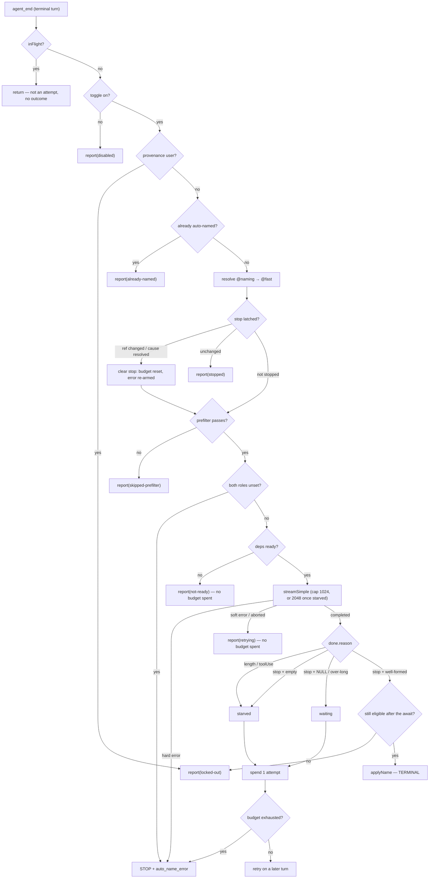

# Design — Fix auto session naming (token starvation + loud failure + `@naming` role)

## Context

`createAutoNamer` (`packages/extension/src/auto-session-namer.ts`) is a per-session state
machine driven from `agent_end` (`bridge.ts:1620`). Its terminal states are applied
(`hasAutoName`), locked out (`nameSource === "user"`), or hard-stopped. Every other outcome is
"wait and retry next terminal turn".

The measured failure: a reasoning model exhausts the 16-token output cap on reasoning tokens,
the stream ends truncated with no text, and *empty* maps onto **wait** — a non-terminal state.
The machine never converges and never reports.

## Goals / Non-Goals

**Goals**
- A reasoning model in the naming slot either produces a title, or the system stops after a
  bounded number of attempts with an actionable message.
- Truncation is distinguished from "no topic yet" and from transient failure.
- Per-session naming cost is bounded.
- The naming model is selectable without disturbing `@fast`; the selector sits next to the toggle.
- Every attempt outcome is observable at runtime without reading `server.log`.
- The stop survives reload and clears when the operator's fix actually changes resolution.
- A successful auto-name stays `auto` across reload.

**Non-Goals**
- Request-level reasoning suppression (not expressible — D2).
- Backfilling the 2239 historical unnamed sessions.
- Changing the external-rename lockout semantics.
- A model-capability registry.

## Design decisions

### D1 — Naming model = a `naming` ROLE, not a new preference

| | R: `naming` role | P: `autoNameModel` preference |
|---|---|---|
| Persistence | existing `providers.json#roles` | new `preferences.json` field |
| REST / wire | none | new GET+PATCH route, new broadcast field |
| UI | role row exists already | new `ModelSelector` wiring |
| Presets | free (`rolePresets`) | none |
| Agent-settable | free (`update_roles`) | new tool surface |

**Decision: the role**, reusing `roles:get-all` / `roles:set`.

**AMENDED during implementation (2026-08-21).** This section originally placed the single
`naming` row **inline beneath the auto-name toggle**. That is not achievable, and the
constraint was not known when D1 was written:

- `SettingsPanel.tsx:298-301` — since `plugin-settings-pages`, **`claim.tab` is inert**;
  every `settings-section` claim renders on `/settings/plugins/<id>`. The auto-name toggle
  lives on the *sessions* settings page, so a roles-plugin claim cannot reach it.
- `plugin-context.tsx:212-220` — `usePluginConfig` **throws** outside a plugin slot
  ("if you need a plugin's config from outside, use server-side getPluginConfig"), so a
  plain client component beneath the toggle cannot read the roles map either.

Exactly one of "inline beneath the toggle" and "driven by the existing roles handlers"
can hold. **Resolution: keep the roles handlers, move the row.** The `naming` row renders
in the existing Roles panel (`/settings/plugins/roles`) — which it already does for free,
because `naming` joined `DEFAULT_ROLE_NAMES` — and the sessions page carries a static
pointer beneath the toggle naming where the naming model is configured.

Rejected alternatives: adding a client-side accessor for another plugin's config (new
plumbing this design explicitly wanted to avoid, and a second reader across the plugin
boundary); restoring `claim.tab` as a real slot dimension (re-opens a contract
`plugin-settings-pages` deliberately closed, blast radius across every plugin).

Consequences accepted (surfaced in review):
- **Presets are a second write path.** `roles:preset-load` replaces the roles map wholesale and
  can silently drop a `naming` assignment, reverting to the `@fast` fallback. The fallback keeps
  it a degradation, and `roles_list` broadcasts on every write so the row reflects it.
- **The row needs a connected session.** `request_roles` / `role_set` travel over a
  session's bridge, so with zero connected sessions the row degrades to unavailable —
  behaviour the Roles panel already implements for every role.
- **A pre-existing custom role named `naming` becomes built-in.** Its assignment is preserved
  and now drives naming; it also becomes non-removable (`roles:remove` rejects built-ins).
  Rare but real; specified rather than left to chance.

### D2 — Request-level reasoning suppression is NOT available

`SimpleStreamOptions.reasoning` is typed `ThinkingLevel = "minimal"|"low"|"medium"|"high"|"xhigh"`;
`"off"` exists only on `ModelThinkingLevel`, which `streamSimple` does not accept
(`types.d.ts:12-13,132`). Passing `"off"` would be a type violation, and `clampThinkingLevel`
can silently *elevate* an unsupported level to the nearest supported one — turning "disabled"
into "low" and starving the budget again.

**Decision: do not attempt suppression.** Give the call headroom (D3) and treat starvation as a
first-class bounded outcome (D5).

### D3 — Budget headroom, with the explicit admission that no cap is sufficient

Measured on `deepseek/deepseek-v4-flash`, identical prompt:

| cap | stop reason | content | reasoning tokens |
|---|---|---|---|
| 16 / 64 / 256 / 512 | `length` | `''` | fully consumed |
| 1024 | `stop` | `NULL` | 24 |
| 2048 | `stop` | `Bridge Auto-Namer Fix` | 724 |

Reasoning consumption is **nondeterministic and unbounded** — 512 starved while 1024 used only
24, and a success at 2048 consumed 724. Raising the cap **reduces** starvation but cannot
eliminate it.

**Decision: an ADAPTIVE cap — 1024 on the first attempt, 2048 after a `starved` verdict.** A
flat 1024 leaves only ~29% margin over the observed 724-token success and would stop sessions
under an unlucky draw; a flat 2048 pays nothing extra in practice but is a larger blast radius
if a model ever runs away. Escalating only on proven starvation targets the headroom precisely
at the sessions that need it. The cap is normative (not "large enough"), so a 64-token
implementation cannot satisfy the letter of a spec its own evidence table contradicts.

`max_tokens` is a ceiling, not a charge: the successful call billed 724 + 5 tokens; a
non-reasoning model bills ~2.

**Corrected assumption:** the larger budget was first rejected on cost grounds. That confused a
ceiling with a spend.

### D4 — Key on the stream's stop `reason`, not on emptiness

pi-ai carries the normalized stop reason as **`reason`** on the `done` event
(`{ type:"done", reason: "stop"|"length"|"toolUse", message }`, `types.d.ts:296`); `aborted` and
`error` arrive on the `error` event instead. The field is `reason`, **not** `stopReason` — and
`generateTitle` currently returns `{ ok, text }`, so it must be widened to carry the reason.
Both are load-bearing implementation details an earlier draft got wrong.

| Stream result | Verdict | Action |
|---|---|---|
| `done.reason: "length"` (regardless of text) | `starved` | never applied; spends an attempt |
| `done.reason: "toolUse"` | `starved` | never applied; spends an attempt |
| `done.reason: "stop"` + `""`/whitespace | `starved` | spends an attempt |
| `done.reason: "stop"` + `NULL` sentinel | `waiting` | spends an attempt |
| `done.reason: "stop"` + > 40 chars or > 6 words | `waiting` | spends an attempt |
| `done.reason: "stop"` + well-formed | `title` | apply once, terminal |
| `error` event (`aborted` / `error`) | soft | retry, spends NOTHING |

**Truncated text is never applied.** With headroom a truncation can carry a plausible fragment
("Working on") that passes the length and word guards; keying on the stop reason rejects it
before parsing. A user abort must not be mistaken for starvation, which is why `aborted` stays
on the soft path.

The 40-char / 6-word guards are **load-bearing and become more so**: with a larger budget an
uncooperative model can emit a long chat reply instead of a title (observed: 900 characters).

`stop` + `""` is counted as `starved` even though it could also be a content-filter refusal.
The remedy is identical (change the model) and the attempt budget bounds the damage.

### D5 — ONE bounded attempt budget per session, shared by `starved` and `waiting`

An earlier draft bounded only *consecutive starved* attempts. Two problems, both real:

1. "Consecutive" was not achieved — resetting only on success meant a `NULL` between two
   starved attempts neither counted nor reset, so starvation accumulated across unrelated turns.
2. `waiting` was left unbounded while the ceiling rose 16 → 2048, so a no-topic session would
   burn up to 2048 tokens **per terminal turn, forever** — a cost regression the proposal had
   claimed was an improvement.

**Decision: a single total attempt budget per session, normatively 3.** Any verdict that
consumed a completion (`starved` or `waiting`) spends one. Exhaustion stops naming permanently
with one actionable `auto_name_error`. Transient errors and aborts spend nothing. A successful
apply is terminal, so no reset rule is needed.

Simpler than two counters, guarantees termination, and makes per-session cost provably bounded.

**The remedy must match the cause.** Exhaustion by `starved` means the model could not emit
under the cap — change the model. Exhaustion by `waiting` means a well-behaved model kept
saying "no topic yet" — telling that operator to change their model is wrong advice, and with
2239 unnamed sessions it would generate a wave of misleading errors. The error text branches on
the dominant verdict.

### D6 — Advancing transcript window

`extractFirstMessage` / `extractFirstAssistantReply` always return the **first** user message
and **first** assistant reply, so every retry re-sends a byte-identical request — a near-vacuous
loop varying only by model nondeterminism.

**Decision: build the window from the latest turn.** The pre-filter must read the **same**
advancing window; otherwise a session that opens with "hi" is skipped forever even once it
becomes substantive — an incongruity the frozen window hid.

Security property preserved **exactly as today**: at most two slices, user truncated to **200**
characters and assistant to **2000** (`bridge-context.ts:198,217`). An earlier draft wrote
"2000 each", which would have widened the user slice 10×. Only *which* turn is sent changes.

### D7 — Durable stop + clear by re-resolution (not by a roles event)

`hardStopped` / `errorEmitted` live in closure state on a lazily-created module-level
`autoNamer` (`bridge.ts:291`) which — unlike `cachedModelRegistry` / `cachedCtx` (293-295) — is
**not** carried across reload via `prev`. The stop therefore re-fires and re-emits on reload.

**Decision:**
- Carry an explicitly enumerated **state set**, not the namer object (carrying the object would
  retain stale closures over the old `connection`, `sessionId`, and `ctx`):
  `hardStopped`, `errorEmitted`, `attemptsUsed`, `stoppedModelRef`, `nameSource`, `hasAutoName`,
  `lastSelfApplied`.
- **Reset by re-resolution, not by a roles listener.** `role_set` is routed to ONE session's
  bridge, so a `roles:set` listener would clear the stop only on the bridge that happened to
  handle the write; every other stopped session would stay stopped forever. Instead, at the next
  attempt the namer re-resolves the naming reference and compares it to `stoppedModelRef`;
  a change clears the stop. `lookupRole` re-reads disk on every call, so this works across every
  bridge with no new plumbing.
- **Assigning the same model that was already resolving does NOT clear the stop** — correct,
  because nothing about the failing configuration changed.
- **Clearing MUST also reset the spent budget and re-arm error emission.** Cycle-3 review caught
  that clearing the flag alone makes the documented remedy a no-op: the session retries once,
  instantly re-exhausts the already-spent budget, and re-stops with NO error because the
  one-shot flag is still latched. Clear ⇒ fresh budget ⇒ a new error if it fails again.
- **Non-reference causes must clear too.** A stop caused by unresolvable credentials or a model
  missing from the registry leaves the resolved reference unchanged, so a pure ref-comparison
  would strand it forever. Resolving the blocking cause clears the stop.
- **Durability spans a PROCESS RESTART, not just a reload.** `prev`-carried state lives on the
  process, so a cold start would re-spend a full budget, re-emit the error, and leave the stop
  not actually permanent. This requires **persisting the stop state** — an explicit, narrowly
  scoped exception to this change's "no new persisted field" rule, taken deliberately because
  the alternative is a guarantee the change cannot honour. The state lives in the session's
  `.meta.json` alongside `nameSource` — same lifecycle, already server-owned. The naming MODEL
  stays role-only.

The re-resolution check must run **before** the `hardStopped` early return, or the stop can
never clear.

### D8 — In-flight clobber and the re-entrancy race

Two defects on the attempt path this change rewrites:

- **Clobber.** After `await generateTitle`, the apply block runs unconditionally. A rename that
  lands mid-stream latches `nameSource: "user"`, and the completion then overwrites both the
  provenance and the user's chosen name. Eligibility must be **re-checked after the await**.
- **Race.** `inFlight = true` is set *after* an await, so two adjacent `agent_end` events can
  both pass the guard, both call the model, and both spend budget. The guard must be latched
  before the first await.

Both are pre-existing, but the change makes them worse (budget accounting depends on "one
attempt = one spend"), so they are in scope.

### D8b — The auto→`user` relabel is a SEPARATE investigation

`seed()` exists but is **never called in production** (only in tests), and `lastSelfApplied` is
closure state that is not carried. After a reload, `onObservedName(pi.getSessionName())` sees
the bridge's own auto-name, `classifyNameChange` finds no matching `lastSelfApplied`, and the
name is latched as an **external rename** → `nameSource: "user"` + permanent lockout +
a persisted `session_name_update{nameSource:"user"}`.

It has a different root cause from token starvation, needs its own measurement (how much of the
174 `user` population it manufactured), and its fix requires a seeding transport that does not
exist today — nothing delivers persisted provenance to the bridge on connect.

**Decision: out of scope here, tracked separately.** Recorded as a **verification hazard**: a
session named by this change will be relabelled `user` on the next reload, so live verification
must check provenance *after* a reload or it will misread this change as broken.

### D9 — Diagnostics: complete taxonomy, bounded+protected retention, named transport

- **Complete taxonomy.** Every attempt reports exactly one outcome: `applied`, `waiting`,
  `starved`, `skipped-prefilter`, `locked-out`, `disabled`, `already-named`, `not-ready`,
  `retrying` (soft error), `stopped`. Soft errors must NOT report `waiting` — conflating a
  transient failure with "no topic yet" destroys both signals.
- **Deduplicated on the wire.** `already-named`, `locked-out`, and `disabled` recur on every
  terminal turn for a session's whole life. Reporting each one would bound the model cost while
  making the wire and retention cost unbounded — a poor trade. An outcome is sent only when it
  or its reason differs from the last one sent for that session.
  - The `disabled` outcome requires restructuring: `runAutoNameOnTurnEnd` returns on
    `!autoNameSessions` *before* the namer is consulted (`bridge.ts:1496`), so today that path
    cannot report. The toggle check moves inside the namer.
  - The `inFlight` guard is **not an attempt** and is explicitly exempt from the taxonomy.
- **Bounded, but `stopped` is protected — with a tie-break.** Plain LRU is not enough: a
  `stopped` entry from an idle session would be evicted by routine churn before an operator
  looks. But "bounded" and "protected" collide when stopped sessions ALONE exceed the bound —
  which is exactly what a misconfigured naming model produces. Resolution: the bound is
  absolute, protection is a preference ORDER (non-`stopped` evicted first), and among `stopped`
  entries the oldest goes. Bound is normative at 500.
- **Named transport.** The retained map is fetched when the diagnostics surface mounts.
  A doctor check is rejected as the carrier because it is global and point-in-time while
  this failure is per-session and repeats.

  **AMENDED during implementation (2026-08-21).** This originally specified the
  browser-protocol request/response channel. `SettingsPanel` / `DiagnosticsSection` have
  **no send capability** — `SettingsPanel`'s `onMessage` prop is a *subscribe* function
  (`App.tsx:2221`, `SettingsPanel.tsx:344`), and the surface is REST-driven throughout
  (`fetchDoctorReport`, `fetchAutoNameSessionsPref`). Routing a WS request from it would
  need the same new client plumbing D1 rejected. **Resolution: a read-only REST route,**
  `GET /api/auto-name-outcomes`, congruent with `/api/doctor` beside it. The live
  `auto_name_outcome` broadcast is retained for a mounted client; the route exists so a
  LATE-mounting client still sees a stop reported before it connected (test-plan #F8).

### D10 — The `user`-provenance lockout is unchanged

Spawn-named sessions are locked out at the first `agent_end` by design. Out of scope.
Consequence stated plainly: **auto-naming only ever fires on sessions that start unnamed.**
Clearing a hard stop (D7) must not clear a `user` lockout.

## Rejected after investigation

**The anthropic `max_tokens: NaN` path.** An earlier draft asserted the naming call computes
`baseMaxTokens + budgets[undefined] = NaN` for anthropic-compat models, and scoped a fix for it.
**Falsified:** `adjustMaxTokensForThinking` is reached only when `options.reasoning` is truthy
(`anthropic.js:556` returns early with `thinkingEnabled:false` otherwise), and the naming call
passes no `reasoning` (`auto-session-namer.ts:212`). The bug is unreachable. Recorded here
because the claim was accepted for one review cycle before being checked — the failure was
verifying that `budgets` lacked the key without verifying the function was ever called.

### D11 — Spec-suite coherence

`openspec/specs/session-rename/spec.md` independently pins the pre-change semantics: "attempt
... after each terminal turn", a first-message enough-info gate, and "NULL, empty, or over-long
→ retry on a later turn" (empty and NULL conflated — the original bug, written into a second
spec). Three requirements INSIDE `bridge-auto-session-namer` do the same: the terminal-turn
trigger, the first-message eligibility gate, and failure tolerance's "soft errors stay silent".

Leaving them would ship a self-contradictory spec suite that `openspec validate` cannot detect,
because validation checks a change's deltas, not cross-spec agreement.

**Decision: delta all of them** — `session-rename` as a sibling delta, the three in-spec
requirements as MODIFIED blocks. The MODIFIED block for the generation requirement also
restores the original "Model invocation" scenario, which an earlier draft silently dropped —
exactly the archive-sync trap this repo has a skill about.

## Risks / Open questions

- **No cap guarantees a title.** D3 + D5 make this survivable, not solved: a model that always
  starves stops the session with a clear message. "Auto-naming works" remains model-dependent.
- **Attempt budget size is a judgement call** — too small stops a nondeterministic model that
  would have succeeded; too large costs more before giving up.
- **`stop` + `""` counted as starvation** may mis-attribute a content-filter refusal (D4).
- **A removed `naming` role** (removal marker in effect) leaves the inline row with no slot to
  render; the row must handle "removed", not only "unassigned". Note also that `roles:set` from
  the UI does not clear a removal marker while the `update_roles` tool's `set_role` does, so an
  inline assignment onto a removed role could be used by the namer yet invisible in both UIs.
- **"Latest turn" is defined** as the most recent user entry carrying non-empty text (skipping
  tool-result-only entries) paired with that turn's assistant reply. Turns with no new user
  message therefore reuse the previous selection rather than producing an empty window.
- **Verification hazard (D8b).** A session named by this change is relabelled `user` on the next
  reload by a separate bug. Live verification must check provenance after a reload, or it will
  misread success as failure.
- **Spec deltas must cover both pinned copies** of the default role-name set:
  `dashboard-roles-ownership` and `model-selector`.
