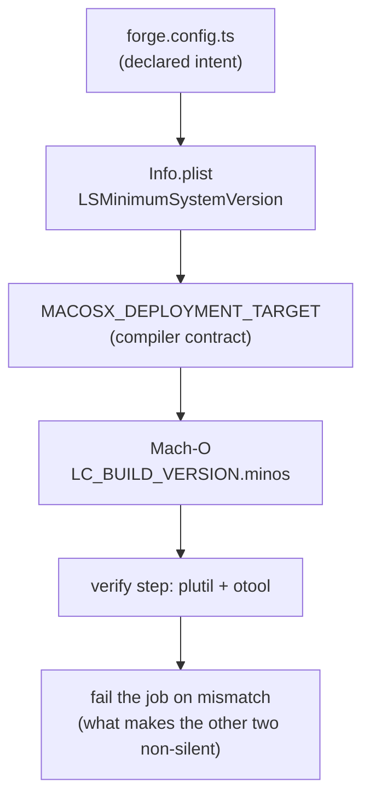
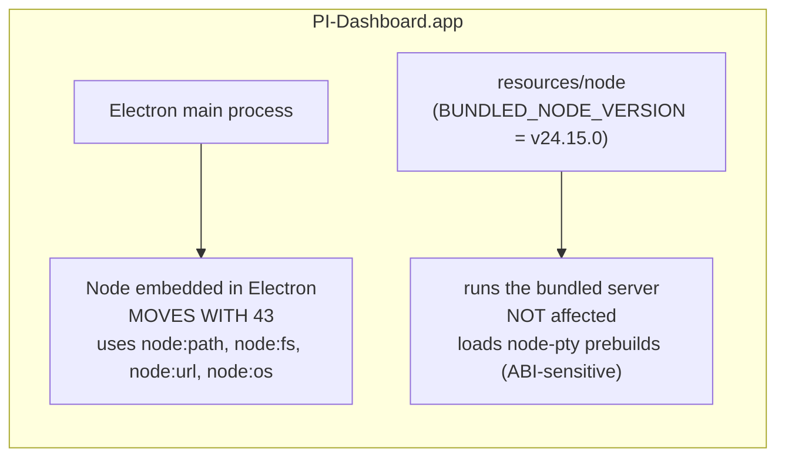
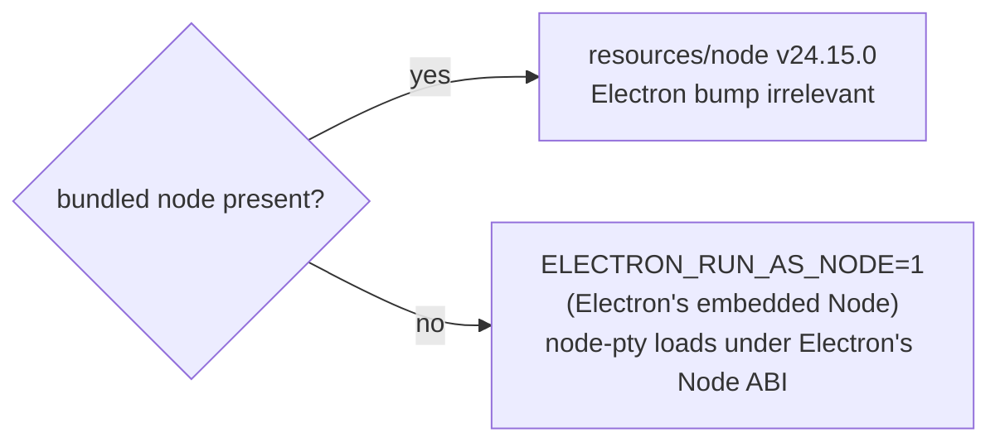

# Design — upgrade-electron-runtime

## Decision 1: target 43.4.1, not a stepped 33→37→41 walk

**Chosen**: jump directly to `43.4.1`.

The instinct from #529 was *"step to a supported line rather than jumping blind"*. That
instinct is right when each major carries independent migration cost. Here it does not:

| Target | macOS floor | Support runway | Migration cost vs 32 |
|---|---|---|---|
| 33–37 | 11 Big Sur | **none — already EOL** | floor move + API scan |
| 41.10.6 | 12 Monterey | shortest of the three | floor move + API scan |
| 42.9.3 | 12 Monterey | middle | floor move + API scan |
| **43.4.1** | 12 Monterey | **longest** | floor move + API scan |

Every *supported* target requires macOS 12. The cost is dominated by the one-time floor
move, which is identical across 41/42/43. Landing anywhere below 41 puts us back on an
unsupported line immediately, which defeats the purpose of the change.

**Fallback if a smoke test goes red**: bisect *reactively* by major (43 → 41 → 38 → 33)
to isolate the offending release, rather than paying for a stepped walk up front. Record
the finding; do not land below 41.

## Decision 2: keep the three-gate macOS floor enforcement

The floor is asserted at three independent points:



### The otool leg is upward-only today, and that becomes a hole at 12.0

The two halves of the verify step are **not** symmetric:

| check | current comparison | catches too-high | catches too-low |
|---|---|---|---|
| plist `LSMinimumSystemVersion` | `!= "10.15"` → fail (`:490`) | yes | yes |
| Mach-O `minos` major | `-gt $EXPECTED_MAJOR` → fail (`:536`) | yes | **no** |

Under the 10.15 target the gap was unreachable: x64 expected major `10`, already the
lowest expressible value, and arm64 expected `11`, the lowest an arm64 slice can declare.
"Below floor" could not happen, so `-gt` sufficed. At a 12.0 floor it becomes reachable,
so the change converts the otool leg to an **equality** check. Deleting the `arm64 → 11`
branch alone does NOT close this: that changes the constant, not the operator. Both edits
are required, which is why they are one task (4.4).

### What the otool leg actually measures (not what the old comment says)

The existing wiring implies `MACOSX_DEPLOYMENT_TARGET → minos` for the checked binary.
**That causal story is false**, and the plan must not inherit it.

The binary the step otools is `Contents/MacOS/pi-dashboard` (`_electron-build.yml:500`) —
the **renamed Electron prebuilt**. Its `LC_BUILD_VERSION.minos` is baked by the Electron
release build and copied verbatim by forge. Verified locally against the currently
installed 32.3.3 prebuilt:

```
$ otool -l node_modules/electron/dist/Electron.app/Contents/MacOS/Electron
      cmd LC_BUILD_VERSION
    minos 10.15          ← upstream, NOT from our env var
      sdk 14.0
```

So today's passing `x64 → 10` expectation comes entirely from upstream Electron, and an
env-var regression **cannot** produce the "slice declaring 11" failure the naive story
predicts. `MACOSX_DEPLOYMENT_TARGET` still matters — it governs any Mach-O the build
itself compiles — but it does not govern *this* binary.

What the equality check really is: an **upstream-floor tripwire**. It fails the job when a
future Electron raises its own macOS floor (e.g. Electron 46 → 13) without us noticing.
That is a genuinely useful gate — arguably more useful than the one the comment describes
— but its real input is the Electron prebuilt, so the check's expected value is an
assertion about **Electron 43.4.1's declared floor**, which task 5.1 establishes
empirically before task 4.4 hardcodes it.

Consequence for task 4.4: the step's error remediation text ("Verify
`MACOSX_DEPLOYMENT_TARGET` is set on the make step", `:537`) is a **misdiagnosis** for the
binary being checked and must be rewritten, not carried forward.

### The extractor is slice-blind, and only single-arch legs hide it

The awk at `:509-513` does `print $2; exit` — it reads the **first** `minos` and stops. A
universal (fat) Mach-O prints one load-command set **per slice**, so on a fat binary the
second architecture's floor would never be checked.

This is currently safe only by accident. `forge.config.ts:85` declares
`arch: "universal"`, but that config is **dead**: `@electron-forge/core`'s package API
spreads `packagerConfig` and then sets `arch` from the CLI argument *after* the spread, so
the explicit `--arch=arm64` / `--arch=x64` in `_electron-build.yml:412` always wins and
each leg produces a single-arch binary. One `--arch universal` invocation — or someone
"fixing" the dead config — would silently halve this gate's coverage while still passing.

Task 4.4 therefore makes the extractor multi-slice-safe rather than relying on that
accident.

It would be simpler to delete the verify step. That is exactly the wrong move: the gate
exists because *"a future runner-image upgrade or source-built native module cannot
silently raise it"* (`forge.config.ts` comment, `add-darwin-x64-build`). Raising the
floor to 12 does not weaken that reasoning — a macOS 15 runner SDK leaking into the
binary would push us to 15 and break Monterey users just as invisibly as it once would
have broken Catalina users. **Move the constant, keep the mechanism.**

### The per-arch `minos` asymmetry collapses

Today the check is asymmetric:

| arch | expected `minos` major (old) | reason |
|---|---|---|
| x64 | `10` | 10.15 target honoured literally |
| arm64 | `11` | Apple Silicon hardware never existed below Big Sur; arm64 slices cannot declare lower |

At a 12.0 floor **both arches expect `12`**. The asymmetry was a Catalina artefact, not a
platform rule, and the special case should be removed rather than carried forward — a
lingering `arm64 → 11` branch would silently accept a slice below the new floor.

## Decision 3: the bundled Node is untouched — on the packaged path

Two Node runtimes exist in this app and they are frequently confused:



`node-pty` — the one genuinely ABI-sensitive dependency in the product — is loaded by the
**bundled server**, under `resources/node`, whose version is pinned independently in
`packages/electron/scripts/_node-version.sh` (currently `v24.15.0`) and gated by the
existing prebuild GO/NO-GO in `bundle-server.mjs`.

### The separation is conditional, not absolute

The clean split above describes the **packaged, intact** install. It is not the only
path. `packages/electron/src/lib/pick-node.ts:56-63` defines an `execpath-fallback`: when
the bundled Node binary is missing — a corrupted install, or a local
`electron-forge start` without a downloaded `resources/node` — the server is launched
under **Electron's own binary** with `ELECTRON_RUN_AS_NODE=1`.



In that mode the categorical claim "the Electron bump has no effect on node-pty" is
**false** — the embedded Node major moves across 11 Electron majors. The practical reason
it is expected to survive is that `node-pty@1.2.0-beta.13` ships **N-API** prebuilds,
which are ABI-stable across Node majors by construction. That is the actual load-bearing
argument, and it was missing from the first draft of this design.

Task 5.6 exercises the fallback path explicitly rather than leaving it as an inference.

The main process's own Node usage is limited to stable `node:` core modules
(`node:path`, `node:fs`, `node:url`, `node:os`), so the embedded-Node bump is not
expected to surface there. This is the single most likely place for a wrong assumption,
so the tasks verify it empirically (packaged-app boot) rather than by inspection.

## Decision 4: toolchain floats, does not get pinned defensively

`@electron-forge/*` is `^7.6.0` (resolves `7.11.2`) and `electron-builder` is `^26.8.1`
(resolves `26.15.3`) — both current and both supporting Electron 43. Pre-emptively
pinning them upward would add churn and reduce future flexibility for no proven benefit.

**Falsifiable position**: if `electron-forge package` or `electron-builder --prepackaged`
fails on 43 with the currently-resolved versions, raise the floor of the affected range
*then*, and record the failing version in this design. Do not bump on suspicion.

## Decision 5: gate the update stream — and do not trust the obvious wiring

The first draft asserted that dropped-OS users "stay on the last 32.x release". That was
an assumption about a mechanism that did not exist in the plan.

`electron-updater` does not gate on OS by default. A 32.x client on Catalina reads the
same `latest-mac.yml`, sees the new version, downloads it, and hands it to Squirrel.Mac.
The installed app declares `LSMinimumSystemVersion 12.0`, launchd refuses it, and the
`electron-auto-update` recurring check retries — **forever**. That is not "stranded on
32.x"; it is a repeating failed-install loop, strictly worse than doing nothing.

A gate exists, but **both** of its obvious implementations are wrong. Each was checked
against the installed toolchain, not the upstream README.

### Trap 0 — the gate exists in the field (settled, not assumed)

The shipped client must implement `checkIfUpdateSupported` or none of this reaches anyone.
That is knowable from the repo, not a matter for speculation: `git show v0.7.0:pnpm-lock.yaml`
resolves `electron-updater@6.8.9`, which implements **and invokes** the gate. So the
mechanism does reach shipped installs, and the residual-limitation branch below is a
contingency, not the expected case.

### Trap 1 — the comparator is strict `semver.lt`, so the value must be a full triple

Installed `electron-updater/out/AppUpdater.js:364-379`:

```js
const currentOSVersion = release()            // macOS → DARWIN kernel version
if (minimumSystemVersion) {
  try {
    if (semver.lt(currentOSVersion, minimumSystemVersion)) return false
  } catch (e) {
    this._logger.warn(`Failed to compare …`)   // ← falls through
  }
}
return true                                    // ← DEFAULT: update IS supported
```

Note the failure direction: a throw is caught, warned, and **falls through to
"supported"**. A malformed value does not fail loudly — it disables the gate.

`semver.lt` is the strict npm parser (no `loose`). Measured against the installed semver:

| value | `lt("19.6.0", v)` — Catalina | `lt("21.6.0", v)` — Monterey | net effect |
|---|---|---|---|
| `"12.0"` (marketing) | **throws** | **throws** | gate inert — everyone updates |
| `"21"` (Darwin major) | **throws** | **throws** | gate inert — everyone updates |
| `"21.0.0"` (Darwin triple) | `true` → blocked | `false` → allowed | **correct** |

So the value MUST be `21.0.0`. Both intuitive spellings — the marketing version *and* the
bare Darwin major — produce an inert gate that logs a warning nobody reads.

The macOS ↔ Darwin mapping, since `os.release()` returns the kernel version:

| macOS | marketing | `os.release()` | → gate value |
|---|---|---|---|
| Big Sur | 11 | `20.x` | blocked |
| Monterey | 12 | `21.x` | **`21.0.0`** = floor |
| Sonoma | 14 | `23.x` | allowed |

### Trap 2 — `electron-builder.yml mac:` does NOT propagate to `latest-mac.yml`

The natural assumption is that setting `mac.minimumSystemVersion` in
`electron-builder.yml` flows into the generated update metadata. It does not:

- `app-builder-lib/out/publish/updateInfoBuilder.js` — **zero** occurrences of
  `minimumSystemVersion`. The generated update info carries `version`, `files`, `path`,
  `sha512`, `releaseDate` only.
- The only consumer is `macPackager.js`, which writes Info.plist `LSMinimumSystemVersion`
  during the **pack** phase — and this repo's mac build runs
  `electron-builder --prepackaged` (`_electron-build.yml:428`), which skips `doPack`
  entirely (`macPackager.js:155-157`).

So the config key would change **nothing at all** here. The field has to be injected into
`latest-mac.yml` as an explicit post-build step, between the electron-builder step
(`_electron-build.yml:402-431`, emitting to `out/make`) and the artifact upload (`:633`).

The arm64+x64 merge at `publish.yml:576-597` does **not** drop unknown fields — it seeds
`merged = dict(first_file)` and overwrites only `files` / `path` / `sha512`, so an injected
root key is carried through. The real fragility is subtler: the merged output inherits root
keys from **whichever file the `find electron-darwin-*` glob yields first** (the arm64 leg).
If one leg injects and the other does not, the result depends on glob order rather than on
intent. Task 4.9 asserts **both** legs inject.

This is why the ADDED spec requirement is written against the **observable metadata**
("`latest-mac.yml` SHALL carry…") rather than against a config key: the config key is a
plausible-looking no-op.

### Trap 3 — the gate has no platform guard, so a mis-scoped injection fails CLOSED

`checkIfUpdateSupported` reads `os.release()` on **every** platform — there is no `darwin`
check. Injecting `minimumSystemVersion: 21.0.0` into `latest-linux.yml` or `latest.yml`
would compare a Linux kernel (`6.5.0`) or a Windows version (`10.0.19045`) against
`21.0.0`, making `lt(...)` **true** for every client and silently stopping updates on
those platforms entirely.

Note the asymmetry with Traps 1 and 2: those fail **open** (everyone updates, gate does
nothing). This one fails **closed** (nobody updates), which is the more damaging
direction and would surface only as a slow, silent stall in update adoption. The
injection MUST be macOS-only.

### Residual limitation

Per Trap 0 the shipped client does implement the gate, so this is a contingency only: if a
release older than the ones checked is still in the field without
`checkIfUpdateSupported`, no change made now can retrofit it. Task 4.6 confirms the
version before 4.7 wires the value.

## Accepted trade-off: the "supported line" requirement is only partly machine-checkable

The renamed requirement replaces a concrete, verifiable clause (`SHALL use Electron 32.x`)
with a rolling policy (`one of the latest three stable majors`). No CI step can check EOL
status — that fact lives upstream and changes without any commit here.

Rather than drop the policy or pretend it is enforced, the requirement carries **both**:
the unenforceable intent, plus a concrete `>= 43` floor that a textual test *can* pin. The
floor prevents the specific failure this change exists to correct — a future edit quietly
re-pinning to an old major — while the prose keeps the intent legible. Accepted as a
partial guarantee, deliberately, rather than an implied-total one.

## Risk register

| Risk | Likelihood | Detection | Response |
|---|---|---|---|
| A shipped user is on macOS 10.15/11 | unknown — **open question** | none today (no telemetry) | update gate (Decision 5) + release-notes callout |
| `minimumSystemVersion` written as `"12.0"` or `"21"` | **high** — both intuitive spellings are wrong | none automatic; `semver.lt` throws → caught → gate passes | spec scenario + task 4.7 mandate `21.0.0`; task 4.8 asserts behaviourally |
| Field set in `electron-builder.yml` and assumed to work | **high** — it is a plausible no-op under `--prepackaged` | inspect the emitted `latest-mac.yml`, not the config | Decision 5 Trap 2; task 4.7 injects post-build |
| Injected field dropped by the arm64+x64 merge | medium | task 6.4 inspects the merged file | preserve unknown fields in `publish.yml:567` merge |
| Shipped 32.x `electron-updater` predates the gate | unknown | task 4.6 | record as accepted, unfixable-in-retrospect |
| A future updater switches to marketing-version comparison | low | task 4.9 | `21.0.0` would then block Monterey — revisit on updater bump |
| `getElectronVersionFromInstalled` regression on Windows NSIS | low | Windows CI leg | already spec'd: keep literal semver, no range |
| Runner SDK leaks a wrong `minos` (either direction) | low | verify step — **after** the `-gt` → equality fix (Decision 2) | fix `MACOSX_DEPLOYMENT_TARGET` wiring |
| Universal-binary packaging changes across 11 majors | low | **no CI gate on darwin** — `dmg-build-launch` is darwin-skipped, e2e matrix is ubuntu+windows | explicit local darwin verification, group 5 |
| Linux glibc floor moved by 11 majors | low | current-Ubuntu smoke would NOT catch it | task 6.2 probes the requirement |
| node-pty under `execpath-fallback` | low (N-API prebuilds) | task 5.6 | acknowledged in Decision 3, no longer claimed impossible |
| Newer major changes a `webPreferences` default | low | `harden-electron-renderer-boundary` overlaps here | explicit assertion that `contextIsolation`/`nodeIntegration` are unchanged |
| Conflict with the two open electron changes | **high if delayed** | — | land this first (proposal, What Changes) |

## Open question — RESOLVED at implementation time

**Do we have any evidence of installed users on macOS 10.15 or 11?**

**Answer: no, and no such evidence can exist.** Checked at implementation time, not
assumed:

- The dashboard ships **no telemetry**. There is no install-base reporting, no crash
  reporter, and no update-check analytics anywhere in `packages/electron` — so the
  population on any given macOS version is unobservable by construction.
- The only artefact that would reveal it (GitHub Release asset download counts) is
  per-asset, not per-OS-version, and the macOS DMGs are split by ARCH (arm64/x64), not by
  OS. An x64 download is equally consistent with a Monterey Intel Mac and a Catalina one.

So the honest position is not "there are no such users" but "we cannot know, and we are
dropping them anyway". The trade-off stands as written: an EOL-Chromium hole affecting
*all* users outweighs continued support for two macOS versions Apple itself stopped
patching (Catalina EOL 2022-09, Big Sur EOL 2023-09).

What that unknowability changes is the WEIGHT of the update-stream gate (Decision 5).
Because we cannot rule the population out, the gate is not a nice-to-have that could be
deferred to a follow-up — it is the only thing standing between an unknown number of
users and a permanent failed-install retry loop. It is treated as **blocking** for this
change, and the release notes must state the drop explicitly rather than leaving it
implicit.

See change: upgrade-electron-runtime (tasks 2.1 / 2.2).
