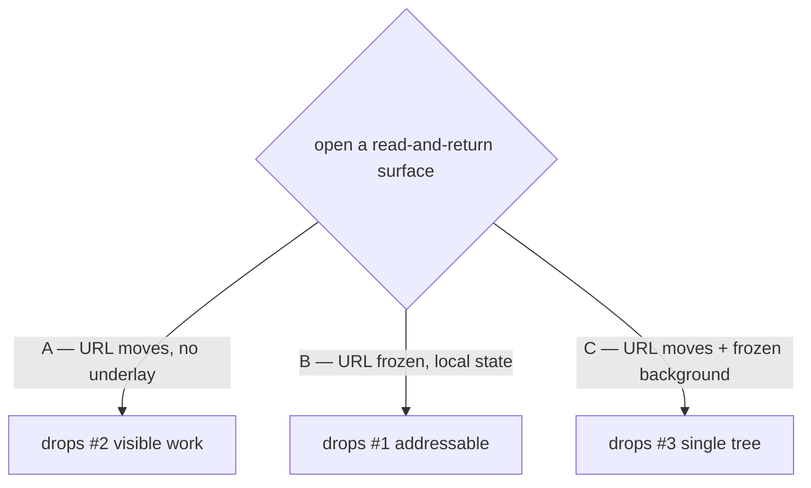

# D1 revision proposal — container model A vs B vs C

Status: **ADOPTED (option C)**. `design.md` D1, `proposal.md`, and the four
affected spec deltas were rewritten to match. This document is retained as the
decision record — it is why D1 changed, and it states plainly what C costs.

Correction to this document's own accounting: it claimed "2 lines in 2 specs".
The real blast radius was **four** spec deltas (`shell-overlay-route`,
`url-routing`, `settings-panel`, `file-and-url-preview`) plus three passages in
`proposal.md`. The understatement was found while applying the edits.

Written because ship-it stopped at the escape hatch (`SHIP_IT_BLOCKED.md`): the
user selected **B**, which replaces D1 rather than refining it, and option **C**
was never evaluated in the original doubt-review.

## The question

When a read-and-return surface (settings, previews, tunnel-setup, plugin
overlays) is open, three things are in tension:

1. The URL should address it (deep link, refresh, share, e2e `goto`).
2. Your work should stay visible behind it (no context eviction — the whole
   motivation for the change).
3. Only one route tree should render (`shell-overlay-route:145`,
   `url-routing:259+`).

**No model gets all three.** Each drops exactly one.



## Correction to the mechanics (both prior sketches were wrong)

The router is **wouter 3.9** (`packages/client/package.json:78`), mounted once at
`packages/client/src/main.tsx:177`. It is NOT React Router, so:

- there is no `<Routes location={...}>` prop, and
- the React-Router "background location in `location.state`" idiom does not
  transfer verbatim.

wouter's equivalent is `<Router hook={...}>`, which overrides where a subtree
reads its location from. `wouter/memory-location` supplies a hook pinned to a
fixed path. So the two-tree render is:

```tsx
// underlay: reads a FROZEN path, not window.location
<Router hook={memoryLocation({ path: backgroundPath, static: true }).hook}>
  <SessionOrFolderCascade />
</Router>

// overlay: reads the real browser location, as today
<Dialog open>{overlayForCurrentLocation()}</Dialog>
```

This matters because `design.md` D1 rejects the underlay idea on the grounds
that it is *"not implementable without a second, URL-independent rendering
source"*. A `memoryLocation` hook is exactly that source, and it is a library
primitive, not a bespoke mechanism. **D1's stated blocker is factually
answerable.** Whether the resulting cost is worth paying is a separate judgment,
made below.

## Option A — route-backed, no underlay (design.md as written)

The URL points at the dialog; the launching route stops matching; nothing
renders behind. `App.tsx:2333` gates the cascade off, `App.tsx:461`'s
`selectedId` becomes `undefined`.

- **Keeps:** every URL, deep link, `goto`, and both spec requirements verbatim.
- **Drops:** the visible underlay — and with it the headline
  "never lose your place". D1 concedes this in its own "What this costs".
- **Residual value:** consistent dismissal affordances (`Esc` / backdrop / ✕)
  plus a scoped container instead of a full-bleed page. D1 calls this
  "a real but modest win — stated plainly so the scope can be re-cut if it stops
  paying."

**Honest reading: A is the safest and the least valuable.** It is close to a
styling change wearing a routing change's costume. Groups 1–2 (already landed)
delivered most of the reliable-dismissal benefit on their own.

## Option B — pure local-state dialog (user's current selection)

The URL never moves. The surface opens from React state, exactly like today's
`OpenSpecArtifactDialog` (`App.tsx:529`).

- **Keeps:** the visible underlay, trivially — the cascade never stops matching,
  because the location never changes. Both spec requirements stay true for the
  same reason. Zero routing risk.
- **Drops:** addressability for every converted surface.

What "drops addressability" concretely costs:

| Consequence | Detail |
|---|---|
| Deep links die | `/settings/general`, `/settings/security`, `/folder/:cwd/settings/:page`, `/folder/:cwd/view?path=`, `/pi-view?url=`, `/pi-resource?path=`, `/tunnel-setup` no longer open their surface. |
| S-31 fails by construction | The change's own falsification test requires the e2e suite to pass with **zero** `goto(...)` edits. Many would need editing. test-plan says this "falsifies D1 and the change must stop". |
| Groups 1–2 become inert for these routes | `depth` / `parentPath` / `computeBackTarget` / `back-target.ts` exist to give a *route* a parent. A non-route dialog has no back target. |
| `isModalRoute` becomes dead | `history-back.ts` has a dedicated branch for settings/tunnel-setup returning to their launcher (`fix-settings-back-to-launching-route`). B deletes the need for it. |
| Browser Back stops closing the dialog | Users expect Back to dismiss an open panel. Under B, Back navigates away from the underlying page while the dialog stays or vanishes unpredictably — this needs its own explicit design. |
| Refresh loses the surface | F5 returns to the underlying page with the dialog closed. |
| Mobile story needs re-deciding | `MobileShell` depth is driven by route matches (`mobile-depth.ts`). No route match → no depth 2 → no slide-in panel, no swipe-back. |
| Nine L3 rows undefined | S-07, S-09, S-10, S-11, S-12, S-13, S-17, S-23, S-32 all assert URLs. |
| Six spec deltas rewritten | All describe URL-matched behaviour. |
| Plugin claims contradicted | `shell-overlay-route` is by definition a *route* slot; group 1's `presentation` field decorates a claim that has a `path`. |

**Honest reading: B is the most valuable per unit of routing risk, and the most
expensive in scope.** It genuinely delivers the original motivation. But it is
not a variant of this change — it is a different change that happens to share a
motivation, and roughly two thirds of the current plan (groups 2, 5.8, most of
10b/10d/10g) would be discarded or rewritten.

The `MobileShell` and browser-Back consequences are the two that are *not*
merely "rewrite the plan" — they are unsolved design work.

## Option C — route-backed with a frozen background location

The URL moves (as in A). At navigation time the launching location is captured
and pinned; the underlay renders from that pinned path via a `memoryLocation`
hook (as above), never from `window.location`.

```
navigate("/settings/general")            // URL moves — deep link intact
background = "/session/<id>"             // captured at push time, frozen
underlay renders background              // work stays visible
overlay renders window.location          // the dialog
```

Cold load (`page.goto("/settings/security")`) has no captured background. Two
sub-choices, both already precedented in-tree:

- **C1:** render no underlay — degrades exactly to option A. Simplest.
- **C2:** synthesize a background from `computeBackTarget(currentRoute)` — the
  descriptor table already computes precisely this, and group 2 just made it
  correct for every nested claim.

C2 is attractive because it makes groups 1–2 *more* load-bearing rather than
less: the same `depth`/`parentPath` declarations that fix the back action also
choose what renders behind on a cold load.

- **Keeps:** every URL, deep link, `goto`, back action, mobile depth story, and
  the entire current test plan. **And** the visible underlay.
- **Drops:** the literal wording of two requirements. Both currently forbid
  rendering a lower-priority branch while an overlay matches:
  - `shell-overlay-route:145`
  - `url-routing:259+`

  They would narrow to forbid rendering a lower-priority branch **derived from
  the current location** — which preserves their actual intent (no ambiguous
  double-match, no two competing readers of the URL) while permitting a
  deliberately pinned, non-URL-derived underlay.

**Costs C carries that A does not** — stated plainly, because C is the option I
raised and it deserves the harshest reading:

| Cost | Detail |
|---|---|
| Two mounted trees | Memory and render cost of keeping session detail mounted behind. R4's "no retained subscriptions behind a closed overlay" becomes "…behind a *closed* overlay" only — an *open* overlay now deliberately retains them. S-28 must be re-scoped. |
| Live-vs-frozen skew | The pinned underlay keeps rendering a live component tree against a frozen path. A session that ends, or a folder that is deleted, while the overlay is open produces an underlay showing stale or error state. Needs a decided behaviour. |
| Two spec amendments | Small, but they are the requirements the original doubt-review used to *kill* this option. Re-litigating them must be explicit, not quiet. |
| Focus / a11y | Two trees means focus trapping and `aria-hidden` on the underlay must be correct, not incidental. A has no such problem (nothing behind). |
| Scroll restoration | The underlay's scroll position must survive the overlay's lifetime. |

## Side by side

| | A (design.md) | B (selected) | C (proposed) |
|---|---|---|---|
| URL addresses the surface | yes | **no** | yes |
| Deep link / refresh / share | yes | **no** | yes |
| Work visible behind | **no** | yes | yes |
| Browser Back dismisses | yes | **undesigned** | yes |
| Mobile depth panel + swipe-back | yes | **undesigned** | yes |
| e2e `goto` edits (S-31) | none | **many — falsifies D1** | none |
| Groups 1–2 stay load-bearing | yes | **no** | yes (more so under C2) |
| Spec deltas to rewrite | 0 | **6** | 4 (clause-level) |
| Current test plan survives | yes | **~9 L3 rows undefined** | yes |
| Routing risk | none | none | **two mounted trees** |
| Delivers the stated motivation | **barely** | yes | yes |

## Recommendation

**C, with the C2 cold-load fallback.** It is the only option that delivers the
change's motivation without discarding its plan, and its cost is concentrated in
two spec lines plus a real-but-bounded double-mount.

If the double-mount cost is judged unacceptable, **A** is the honest fallback —
but then the change should be re-cut and renamed, because "route-backed overlay
dialogs" would be delivering consistent dismissal affordances and a scoped
container, not the context-preservation its proposal argues for.

**B should not proceed under this change's current artifacts.** Not because the
instinct is wrong — it is the most direct route to the goal — but because it
silently deletes addressability, leaves browser-Back and mobile-depth
undesigned, and fails the change's own falsification test. If B is genuinely
wanted, it deserves its own proposal with those three problems solved up front.

## If C is adopted — artifact edits required

1. `design.md` D1 — replace the "not implementable without a second,
   URL-independent rendering source" claim (`memoryLocation` is that source) and
   restate the decision as C. Keep the corrected `OpenSpecArtifactDialog`
   analysis; it is right, and it is what rules B out as a *precedent* while
   leaving B open as a *choice*.
2. `design.md` Open Question 3 (backdrop, C1 in the test plan) — resolved by
   construction: the backdrop is a scrim over the pinned underlay.
3. `specs/shell-overlay-route/spec.md:145` and `specs/url-routing/spec.md:259+` —
   narrow to "…lower-priority branch **derived from the current location**".
4. `tasks.md` 3.1 — the renderer takes a background path; 3.6 drops (answered);
   add a task for the cold-load background (C2) and one for underlay
   focus-trap / `aria-hidden` / scroll retention.
5. `test-plan.md` — C1 clarification closes; C2 unchanged; S-08's observable
   inverts (the underlay is now *expected* present, `aria-hidden`, and derived
   from the pinned path — assert it is NOT re-derived from the URL); S-28
   re-scoped to release-on-dismiss only.

## Still open regardless of model

C3 (dirty-guard owner), C4 (resource scope-switch shape), and C5 (no latency or
memory budget is stated anywhere) survive all three options and remain
unanswered.
