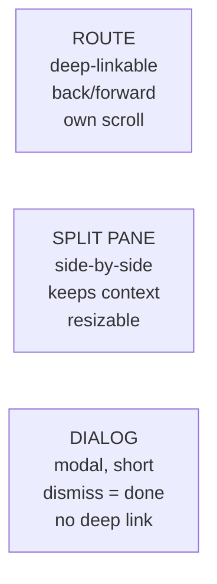
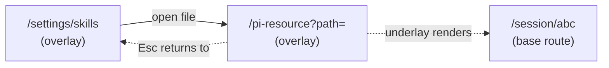

# Design — add-route-backed-overlay-dialogs

## Context

~35 addressable destinations, most rendered as full pages that replace the
session or folder underneath. The pain is not click count; it is **context
eviction** — you lose the thing you were working on to look at something about
it.

Three containers already exist in-tree and are used inconsistently:



The third column's "no deep link" is an assumption, not a constraint —
`OpenSpecArtifactDialog` already violates it productively.

## Goals / Non-Goals

**Goals**
- Stop context eviction on read-and-return surfaces.
- Preserve every URL, deep link, back button, spec assertion, and e2e `goto`.
- Make the plugin overlay container a *slot-level* decision, not a per-plugin one.
- Collapse duplicate destinations rather than duplicating their containers.

**Non-Goals**
- Changing the split-pane story. `/session/:id/diff` and `/session/:id/editor`
  belong in `SplitWorkspace`; that is a separate change.
- Redesigning any panel's internals. Containers move; contents do not.
- Touching `/pair` or any server-side pairing protocol.
- A command palette / jump-to. Different solution to a different complaint.

## Decisions

### D1 — Route-backed overlay: URL canonical, underlay from a frozen background

**Revised in cycle 2 (option C).** Cycle 1 corrected the original "dialog over
still-mounted work" claim and landed on *no underlay at all*. Cycle 2 keeps
cycle 1's diagnosis — which is correct — but rejects its conclusion, because the
blocker it rested on turned out to be answerable.

Cycle 1's reasoning, still valid as far as it goes:

```
App.tsx:2333  {!folderEditorCwd && !settingsMatch && !tunnelSetupMatch && ( … )}
App.tsx:461   selectedId derives from the /session/:id route match
```

A URL-backed dialog points the URL at the dialog. The launching route therefore
stops matching, `selectedId` is `undefined`, and the cascade is gated off — so
there is nothing left to render underneath. "Dialog over your still-mounted
work" is not implementable without a second, URL-independent rendering source.

The cited precedent was also misread. `OpenSpecArtifactDialog` is **local
state**, not a route:

```
App.tsx:529   const [artifactDialog, setArtifactDialog] = useState<… | null>(null)
OpenSpecArtifactDialog.tsx:16  "local-state Dialog … (URL unchanged)"
```

"URL unchanged" means the URL never moves at all. It works *because* it is not
route-backed — the opposite of what was claimed.

**Where cycle 1 went wrong.** It concluded the underlay is *"not implementable
without a second, URL-independent rendering source"* — and treated that as
disqualifying. The premise is right; the conclusion does not follow, because the
router ships exactly such a source.

The app uses **wouter 3.9** (`packages/client/package.json:78`), mounted once at
`main.tsx:177`. A wouter subtree reads its location from whatever `<Router hook>`
is above it, and `wouter/memory-location` supplies a hook pinned to a fixed path.
So a second, deliberately URL-independent tree is a library primitive:

```tsx
// underlay — reads a FROZEN path, never window.location
<Router hook={memoryLocation({ path: backgroundPath, static: true }).hook}>
  <SessionOrFolderCascade />
</Router>

// overlay — reads the real browser location, as today
<Dialog open>{overlayForCurrentLocation()}</Dialog>
```

**Decision: keep the URL AND keep the underlay, sourced from a frozen background
path.** On navigation to a converted surface the launching location is captured
and pinned. The underlay renders from that pinned path; the overlay renders from
`window.location`. Desktop shows a `Dialog` over a scrim over the pinned
underlay; mobile is unchanged (`MobileShell` depth slide); dismissal returns to
the launching route.

**Cold load** (`page.goto("/settings/security")`) has no captured background.
The background is then synthesized from `computeBackTarget(currentRoute)` — the
descriptor table group 2 just made correct for every nested claim. This makes
groups 1–2 *more* load-bearing, not less: the same `depth`/`parentPath`
declarations that fix the back action also choose what renders behind on a cold
load. If the computed target is `/`, the underlay is the card list.

**What this costs.** Two mounted trees. Specifically:

- Memory and render cost of keeping the launching surface mounted while an
  overlay is open. R4's "no retained subscriptions behind a *closed* overlay"
  still holds; an *open* overlay now deliberately retains them.
- **Live-vs-frozen skew.** The underlay keeps rendering a live component tree
  against a frozen path. A session that ends, or a folder deleted, while the
  overlay is open leaves the underlay showing stale or error state. It is behind
  a scrim and non-interactive, so the accepted behaviour is: let it go stale,
  and let the dismissal navigation resolve it — dismissal targets the launching
  route, which will then legitimately 404/redirect through the normal path.
- **Focus and a11y are now load-bearing.** Two trees means the underlay MUST be
  `aria-hidden` and outside the focus trap. With no underlay this was free.
- **Scroll retention.** The underlay's scroll position must survive the
  overlay's lifetime.

**What this costs in specs.** Four spec deltas assert the launching route is not
rendered behind (`shell-overlay-route:99,145`, `url-routing:5,7,38`,
`settings-panel:4,111`, `file-and-url-preview:7`). These narrow to forbid
rendering a lower-priority branch **derived from the current location** —
preserving the actual intent (no ambiguous double-match, no two competing
readers of the URL) while permitting a deliberately pinned, non-URL-derived
underlay. This is a real re-litigation of the requirements cycle 1 used to kill
the idea, and is stated explicitly rather than quietly.

**What this buys.** The change delivers the motivation in its own proposal —
stop context eviction on read-and-return surfaces — instead of narrowing to
"dismissal reliably returns you", which groups 1–2 already delivered. Under
cycle 1's decision the remaining value was consistent dismissal affordances plus
a scoped container: a real but modest win, and one that did not obviously
justify converting ten surfaces.

Rejected alternatives:
- **No underlay at all (cycle 1's decision, "option A")** — safest, zero routing
  risk, keeps all four spec deltas verbatim. Rejected because it is also the
  least valuable: by its own admission the headline benefit narrows to something
  groups 1–2 already shipped. Remains the fallback if the double-mount cost is
  judged unacceptable — but then the change should be re-cut and renamed.
- **URL-less local-state dialogs ("option B")** — the underlay comes free and
  routing risk is nil, but addressability dies for ten surfaces: deep links,
  refresh, and share stop working; ~13 e2e `goto`s break, which is precisely the
  falsification test task 8.2 / S-31 defines; browser Back and `MobileShell`
  depth (`mobile-depth.ts` keys off route matches — no match, no depth-2 panel,
  no swipe-back) both become undesigned. A defensible product direction, but a
  different change from this one.
- **Render the *live* nav-tracker predecessor underneath** — this is what cycle 1
  rejected, and rejecting it was right. Reading the tracker live means the
  underlay changes as the stack mutates, and the tracker is documented as "a
  hint" (`nav-tracker.ts`). The fix is to *freeze* the background at push time,
  which is what this decision does. The distinction is the whole of option C.
- **Nest the URLs** (`/session/abc/settings/general`) — underlay comes free, but
  URLs move: ~13 e2e `goto`s and 2 specs break. Defeats the reason for keeping
  URLs canonical.
- **URL-less dialogs** — cheapest code, but the URL is consumed by
  `landing-page-onboarding`, `mobile-resilience`, ~10 e2e specs, `back-target.ts`,
  and plugin claims.

### D1a — Dismissal is not the same operation as `history.back()`

**Resolved in cycle 2 (closes test-plan C2): dismissal is a single
`navigate(backgroundPath)` to the frozen background path.** Not a history
unwind, and not `history.back()`. The destination is therefore identical to what
the underlay is already rendering — the dialog dissolves onto the thing behind
it, which is the whole point of option C, and no `go(-n)` arithmetic over the
surface's own pushed entries is needed.

This subsumes the `isModalRoute` special case in `history-back.ts`: that branch
exists to send settings/tunnel-setup back to their launcher via `history.back()`
(change: fix-settings-back-to-launching-route) because no explicit target was
available. A frozen background path IS that explicit target. The branch stays
for the mobile back/swipe path, which is unchanged.

**Accepted cost: the forward entry does not survive dismissal.** Dismissing with
`navigate` pushes rather than pops, so the browser's forward button will not
return to the overlay. Scroll restoration on the underlay is handled separately
(D1: the underlay retains its scroll for the overlay's lifetime), so it is not
lost with the forward entry.

`SettingsPanel` PUSHES on internal navigation (`SettingsPanel.tsx:856`, `1133`,
`1666`); only init/legacy redirects use `replace`. After `/settings/general` →
rail → `/settings/plugins/x`, one history step lands on `/settings/general` —
with the dialog still open.

A dismissal gesture (`Esc`, backdrop, ✕) MUST therefore mean *"leave this
surface"*, not *"go back one history entry"*. The renderer SHALL unwind the
surface's own pushed entries, or navigate directly to the tracked launching
route. Specifying dismissal as "invoke the depth-aware back action" is wrong for
any surface with internal navigation.

### D1c — In-overlay navigation switches in place (R5 generalised, cycle 2)

The corollary of D1a. If dismissal means "leave this surface", then a navigation
that does *not* leave the surface must not be treated as one.

**Rule:** navigation to a route the open overlay already owns switches the
surface in place — same container mount, same frozen background. Only a target
outside the overlay's ownership dismisses it. Ownership is decided by the
overlay's own route pattern still matching the new location; nothing new is
declared for it.

Without this rule the container is keyed by location, so every in-overlay
navigation remounts it — resetting local state, refetching, and re-freezing the
background against a path that is itself already inside the overlay.

This was originally planned as a conditional pairing-specific patch (task 5.5,
gated on `collapse-pairing-into-gateway` landing). That change has not started
(0/62 tasks), so the task is mandatory; it is generalised rather than
special-cased because the hazard belongs to the container, not to the pairing
flow. `PairingView.tsx:168` is merely the one live instance today — its empty
state calls `navigate("/settings/gateway")`, and a remount there strands a live
one-time-code TTL. KB and Goals inherit the identical bug the moment they grow
internal navigation, and a pairing-shaped fix would have to be unwound to cover
them.

Note this also removes the only reason group 5 had to wait on
`collapse-pairing-into-gateway`.

### D1b — The dirty-state guard currently evicts to `/`

```
SettingsPanel.tsx:898-899
  window.history.pushState(null, "", window.location.href);
  setPendingNav("/");            ← hardcoded
```

While dirty, the popstate guard re-pushes and sets a hardcoded `/` target;
`confirmDiscardLeave` then navigates there. Adding backdrop/`Esc` dismissal
routes through that same guard, so confirming a discard would eject the user to
the card list — re-creating the exact defect this change exists to fix. The
confirm target MUST become the launching route.

The guard must also cover `DirectorySettings/InstructionsPage`, which owns its
own dirty state and does not thread through `SettingsPanel`.

### D2 — Plugin overlays convert at the slot, not per plugin

Automation / Goals / KB / the subagent popout are `shell-overlay-route` claims.
One edit to `ShellOverlayRouteSlot` converts all of them plus every future
claim. Rejected alternative: editing each plugin — 4 packages touched, drift
guaranteed on the next plugin.

(An earlier draft also listed a flows agent popout here. `flows-plugin` declares
no `shell-overlay-route` claim; that path exists only in stale packaged output
under `packages/electron/out/`.)

### D2a — The dialog container is injected, not imported — SUPERSEDED

**Superseded in cycle 2 by the underlay-positioning constraint.** The original
seam gave `ShellOverlayRouteSlot` an optional `dialogContainer` prop so it could
wrap a `presentation: "dialog"` claim per-claim, avoiding a package cycle
(`client-utils` already depends on `dashboard-plugin-runtime`, so importing the
dialog INTO the runtime would close a loop).

The seam worked and was unit-tested, but it was never injected, and wiring it up
showed why it could not be: the overlay's underlay has to cover the VIEWPORT.
Wrapping from inside the slot puts the underlay inside the content region, where
it covers a pane rather than the screen. The host must lift a dialog claim out
of the content region entirely, which is a decision only the host can make.

So `presentation` is consumed by the host through the exported
`useShellOverlayRoutePresentation` hook — no package cycle, because a hook
returning a string crosses the boundary where a component could not. The slot
renders the claim body plus its flex height wrapper; the `dialogContainer` prop
and the `OverlayContainerProps` / `OverlayContainerComponent` types are removed
rather than left as tested-but-unreachable code.

**The gap this hid is the point.** Group 4 marked the seam done and deferred the
injection to group 5; group 5's tasks covered only the six core surfaces, so the
injection fell between them. The seam's own unit tests passed a container
explicitly, so they stayed green while production rendered every plugin claim as
a full page — D2 was undelivered for the whole of groups 4 through 8 and no test
said so. Task 4.7's e2e canary now asserts the real container, which is the only
level that could have caught it.

### D3 — `presentation?: "page" | "dialog"`, default `"dialog"`

Dialog-ising the slot constrains every third-party overlay's layout. A
claim-level opt-out keeps the good default while leaving an escape hatch for
width-hungry surfaces. Default `"dialog"` rather than `"page"` so the ergonomic
win applies without every author opting in.

`blackhole-plugin` is the canary — it has an e2e spec (`blackhole-settings.spec.ts`)
that exercises a plugin surface end to end.

**An unknown `presentation` value is FATAL**, unlike `depth` (which warns and
defaults). A typo like `"modal"` would otherwise silently fall back to the
dialog default — handing the author precisely the behaviour they wrote the field
to opt out of. The `depth` precedent is the argument *for* this: a non-fatal
warning let four claims ship broken (see D4a).

### D3a — `presentation: "page"` opts out of mobile too

Resolves the prior open question. `"page"` means full viewport on **both**
desktop and mobile, outside the `MobileShell` depth panel.

Rationale: a surface that declares it needs the whole viewport needs it on a
phone most of all. Rendering a `"page"` claim inside a depth-1 detail panel
would reimpose exactly the width constraint the opt-out exists to escape, and
would leave authors with no way to express "this is genuinely a page".

`depth`/`parentPath` remain **required** for `"page"` claims — with no dialog to
dismiss, the descriptor table is the only thing driving their back action.

### D4 — Depth declarations stay load-bearing on BOTH paths

An earlier draft argued a dialog "closes onto whatever rendered it", making
`depth`/`parentPath` structurally moot on desktop. **That is wrong under D1 as
revised, for a sharper reason than cycle 1 gave.** The underlay is a *frozen
background path*, not a live parent that the dialog can close onto: dismissal
still has to navigate somewhere explicit. On the in-app path that target is the
tracked launching route; on a cold load (`page.goto`) there is no tracked
predecessor, so the descriptor table is the only source of a parent — and under
D1's cold-load rule it now also supplies the background the underlay renders.

So `depth` and `parentPath` remain load-bearing on desktop *and* mobile. The
missing declarations on the Goal, KB, and subagent claims were real defects on
every path, and the fixes in group 2 are not merely a mobile concession — they
are what makes a cold-loaded dismissal resolve at all.

### D4a — the defect is wider than the proposal first claimed

A full scan of `packages/*/package.json` found **6** `shell-overlay-route`
claims, not 8, and **4** missing `depth` — not 3:

```
  goal        /folder/:encodedCwd/goals                ✗ missing depth
  goal        /folder/:encodedCwd/goals/:goalId        ✗ missing depth
  kb          /folder/:encodedCwd/kb                   ✗ missing depth
  subagents   /session/:sessionId/subagent/:agentId    ✗ missing depth
  automation  /folder/:encodedCwd/automations          ✓ declared (but see D4c)
  automation  /automation/run/:sid                     ⚠ see D4b (re-parented)
```

**Superseded by D4c.** The first fix declared the goals + kb boards `depth: 1`
"for parity with the automations board". That was a regression — see D4c.

### D4b — RESOLVED: `automation` run monitor re-parented

`/automation/run/:sid` declares `parentPath: /folder/:encodedCwd/automations`.
That pattern requires `:encodedCwd`, which the run path never captures — so
`interpolateParentPath` returns `null` on every match and the back target
**always** degrades to `/`. The declaration is decorative.

The existing code documents this degradation as intended behaviour, so it was
not a regression — but a `parentPath` that can never resolve is misleading
config.

**Chosen: re-parent the URL.**

```
  OLD  /automation/run/:sid                      captures :sid
  NEW  /folder/:encodedCwd/automations/run/:sid  captures :encodedCwd + :sid
```

The cwd the parent needs is now carried by the child, so a cold-load back
reconstructs the exact board URL instead of degrading to the card list.

The usual objection to changing a URL — breaking existing links — does not
apply: a repo-wide scan found **no producer**. Nothing in the client, the
plugin, the server, or the e2e suite navigates to the run monitor. The board
opens run results in its own local modal (`run-result-panel`), never via the
route. The route is reachable only by typing the URL, which is also why the
dead `parentPath` went unnoticed.

Follow-up worth tracking separately: the run monitor is an **orphaned route**.
Re-parenting makes its back action correct, but nothing navigates to it, so the
surface is unreachable in normal use. Wiring a producer (board run row → run
monitor) is a UX change, not a container change, and is out of scope here.

### D5 — Tunnel setup does NOT stack — it replaces

**Corrected as a consequence of D1.** An earlier draft described a stack:

```
  settings dialog
      └── tunnel-setup dialog        ← "3 deep worst case"
```

That cannot happen. `/tunnel-setup` is its own URL, so at that URL `settingsMatch`
is false and the settings dialog is **not mounted at all**. There is no layer to
stack on. The two surfaces alternate; they never coexist:

```
  /settings/gateway   →  [settings dialog]
  /tunnel-setup       →  [tunnel dialog]      ← settings unmounted
  dismiss             →  back to /settings/gateway, settings remounts
```

The `/tunnel-setup` URL is preserved, so `zrok-v2-tunnel.spec.ts`
(`goto("/tunnel-setup")`) is unaffected. Rejected alternative: folding tunnel
setup in as a settings page — the URL dies and that e2e breaks.

**The stacking risk stays retired** — see R2. It is retired by the one-URL-one-
surface rule, not by the absence of an underlay, so restoring the underlay does
not bring it back.

### D1d — The underlay and the dismissal target are two different things

Found while wiring 5.3. `/pi-resource?path=` is reached from a settings page, and
`/tunnel-setup` from `/settings/gateway` (D5). Both are overlay-from-overlay
transitions, and they break the assumption that dismissal is just
`navigate(backgroundPath)`.

The two answers cannot be the same value:



The BACKGROUND must be a base route, because the underlay renders through
`ShellContent` and settings is not in that tree at all — pinning the underlay to
`/settings/skills` would render blank. The DISMISSAL TARGET must be the launching
overlay, or `Esc` drops the user out of the surface they were working in and D5's
"dismiss returns to `/settings/gateway`" is unsatisfiable.

So `overlay-background.ts` tracks both: `captured` (last non-overlay route) feeds
the underlay, `launcher` (immediate predecessor, overlay or not) feeds dismissal.
`recordLauncher` registers only a cross-SURFACE move, so `/settings/general` →
`/settings/security` leaves the dismissal target alone (S-10); surface identity
is the first path segment, or `folder:<cwd>:<segment>` under `/folder/:cwd`, so
two folders' settings are two surfaces.

Rejected: making the underlay render the launching overlay. It would need the
settings tree mounted twice, and D1's whole point is one frozen tree beneath one
overlay.

### D6 — The OpenSpec board stays a page; the artifact becomes a dialog

A kanban board wants horizontal width; a dialog fights it. So the board stays a
page and the deep-linked artifact route gets a dialog container.

**Corrected, cycle 2 — "the full-page path is a duplicate and is deleted" was
wrong.** There are two readers, and they differ in the one thing that matters:

| | `OpenSpecPreview` (route) | `OpenSpecArtifactDialog` (ephemeral) |
|---|---|---|
| URL | source of truth for the active artifact | unchanged; badge never navigates |
| tab change | `navigate(...)` | local `setState` |
| reload | restores the artifact | does not restore it |
| serves | the deep link, and mobile | a desktop badge click |

Deleting either one deletes a behaviour that tests pin. `E9` asserts that on
mobile the badge navigates to the full-page route and `openspec-artifact-dialog`
has count 0, so the dialog cannot be the only renderer. `F1`/`F2`/`F7` pin the
ephemeral dialog as deliberately URL-less. And `url-routing` lists
`/folder/:cwd/openspec/:changeName/:artifactId` among the converted surfaces
whose "path, deep link, browser back and depth SHALL be preserved exactly" — so
the route cannot go away either.

**Resolution:** the ROUTE gets a `RouteBackedOverlay` on desktop, keeping
`OpenSpecPreview` as its content precisely because a route-backed surface must
drive its tabs through the URL. Mobile keeps the full page. The ephemeral dialog
is untouched. This delivers D6's actual goal — the deep-linked artifact stops
being a full page on desktop — without deleting a pinned behaviour.

The duplication D6 objected to is real but narrower than stated: both readers
wrap `useOpenSpecReader` + `MarkdownPreviewView` with near-identical
waiting/not-found branches. Collapsing THAT shared body behind one inner
component is a safe follow-up; it was not done here because it is a refactor with
no user-visible effect and this change is already large.

### D7 — Resource surfaces dedupe as part of this change

The global and folder grids are one component differing in `scopes`,
`showScopeFilter`, `onViewFile`, and `globalPill`.

An earlier draft justified this as avoiding "two dialogs over one grid". That is
**false** — the two routes are never mounted simultaneously, so no such conflict
exists. The honest case is duplication cost alone: ten destinations maintaining
one grid's wiring at two call sites, both of which this change already edits.

Because the justification is weaker than claimed, this is the first item to cut
if the change needs narrowing. Nothing else in the plan depends on it.

**Implemented (cycle 2), with the survey correcting the task text again.**
`ResourceGridPanel` was ALREADY a shared component — the duplication was the
call-site wiring, not the component. `ScopedResourceGrid` now owns it and reads
the scope preset off the matched route.

The dedupe turned out to carry more than cosmetic value. Each call site kept its
own page→type map, byte-identical and mutually unchecked; a drifted entry would
render the wrong resource type under a correct-looking URL, and nothing would
type-error. There is now one `RESOURCE_PAGE_TYPE`.

It also surfaced a live trap: **two different `ResourceType` unions exist** —
`lib/api/resources-api.ts` (four types, no `"agent"`) and
`components/resource/ResourceCardGrid.tsx` (five, including it). Both former
call sites used the latter. Importing the former compiles everywhere except the
agents entry, so the mistake surfaces as one broken page rather than a type
error. Flagged, not unified — out of scope here.

### D8 — `/pair` is out of scope by construction

`main.tsx:167` branches on `window.location.pathname === "/pair"` *before*
`<App/>` mounts. `PairLanding` never enters the router, so no router or
container change can reach it. Recorded explicitly so a reviewer does not have
to re-derive it.

### D9 — The shared `Dialog` was squatting on the toast layer

Converting a page into a dialog exposed a latent defect in
`packages/client-utils/src/Dialog.tsx:77`: it painted at a raw `z-[60]` while
`--z-dialog` is 50 and `--z-toast` is 60. Every shared dialog therefore sat on
the *toast* layer, above the documented dialog layer.

That is invisible while dialogs are leaves. It is not once a dialog can *raise*
another: `UnsavedChangesDialog` and `ResourceTrustDialog` are both correctly
tokenised at `z-dialog`, so once their host became an overlay they rendered
UNDERNEATH the surface that raised them. Measured by hit-test — the cancel
button at z 50, the click landing on an element inside the z-60 overlay.

`Dialog` now uses the `z-dialog` utility. Nested dialogs tie at 50 and resolve
by portal/DOM order (later mount wins), which is already how this repo stacks
them. Toast (60) stays above dialog (50) — that intent never changed; only the
shared component stopped squatting on the toast value.

Two notes for whoever reads this next:

- `scripts/z-layer-lint.mjs` sets `SCAN_DIR = "packages/client/src"`, so
  `packages/client-utils` is outside the raw-z gate. That is *why* this
  survived. The gate reported a clean 42/42 throughout.
- `ResourceTrustDialog` was already unclickable inside the converted folder
  settings overlay, and its e2e did not catch it: the spec only asserts
  `toBeVisible()` and presses Escape, and a z-covered element is still
  "visible" to Playwright. Visibility is not clickability.

## Risks / Trade-offs

**R1 — Dirty-state loss (highest severity).** `SettingsPanel` tracks `isDirty`.
A dialog introduces two dismiss gestures a full page never had — backdrop click
and Esc. Without a guard, the Instructions editor silently eats an unsaved edit.
This is a functional regression, not polish. *Mitigation:* dirty-state guard on
dismiss, with a scenario covering backdrop and Esc independently.

**R2 — Stacking depth. RETIRED.** The earlier draft accepted up to three
layers. Route-backed surfaces cannot stack: each owns a URL, and only the
matching one is mounted. The pinned underlay does not stack either — it is one
frozen tree beneath one overlay, never a second overlay. The `useEscapeDismiss` escape-stack
remains relevant only for a genuinely nested, *local-state* dialog opened from
within a surface (e.g. a confirm prompt) — which is unchanged by this work.

**R3 — Plugin layout regressions.** D3's opt-out is only useful if authors know
it exists. *Mitigation:* the `blackhole-settings` e2e as canary; slot-contract
documentation in the same change.

**R4 — Mount/unmount lifecycle.** Route-mounted surfaces unmount on navigation.
Dialog-mounted ones may not. A live `AutomationRunMonitor` or a heavy
`ResourceGridPanel` left subscribed behind a dismissed dialog is a leak.
*Mitigation:* assert unmount-on-dismiss; this is why
`performance-optimization` is in the discipline list.

**R5 — Merge collision with `collapse-pairing-into-gateway`.** Both edit
`SettingsPanel.tsx`. *Mitigation:* sequence that change first; see the proposal's
dependency section for the fallback rule if it does not land first.

**R6 — the run monitor (`/folder/:encodedCwd/automations/run/:sid`) is a live,
session-scoped monitor.** Uniformity was chosen over carving it out, so an
accidental dismissal interrupts watching a running job. Accepted deliberately;
revisit if it bites. The run is not cancelled by dismissal — only the view is.

**R7 — the `depth` model cannot express a three-level hierarchy.** `depth` is
`1 | 2` only, so `folder → board → run` cannot be strictly increasing: the board
and the run monitor are both depth 2. The history fast-path requires a strictly
shallower predecessor, so back from the run resolves through `parentPath`
(explicit navigation) rather than `history.back()`. The destination is correct;
scroll position and the forward entry are not preserved. Pinned by a test in
`back-regression.test.ts`. Widening `depth` is out of scope.

## Migration Plan

Container swaps are independently shippable. Suggested order, each verifiable
alone:

1. Route-backed overlay renderer + the `presentation` field (no surface moves).
2. `ShellOverlayRouteSlot` conversion + Goal/KB depth fix (plugin half, one file
   plus two manifests).
3. Preview surfaces (`/view`, `/pi-view`, `/pi-resource`) — thinnest, since
   `PreviewOverlayView` is already a full-viewport overlay.
4. OpenSpec artifact — delete the duplicate full-page path.
5. Settings + folder settings + resource dedupe — largest, and the one gated on
   `collapse-pairing-into-gateway`.
6. Tunnel setup as its own route-backed overlay (replaces settings; no stacking).

## Open Questions

- ~~Dirty-state guard owner?~~ **RESOLVED: panel-level.** Only surfaces with a
  dirty concept opt in; the renderer exposes a dismissal hook they may intercept,
  and plugin claims are unaffected (no dirty contract imposed on a claim that has
  no such notion). Per D1b the opt-in must be taken by BOTH `SettingsPanel` and
  `DirectorySettings/InstructionsPage`, which holds its own dirty state and does
  not thread through `SettingsPanel`. Closes test-plan C3.
- ~~Resource scope switch shape?~~ **RESOLVED: two entry points into one panel
  with the scope preset.** The folder and global URLs stay distinct; scope,
  filter visibility, and file-view target are preset per entry point rather than
  toggled by a control inside the panel. Closes test-plan C4.
- ~~What renders behind the dialog on a **cold load**?~~ **RESOLVED by D1 as
  revised.** In-app: the frozen background captured at push time. Cold load: the
  background synthesized from `computeBackTarget(currentRoute)`. The visual
  treatment follows by construction — a scrim over the pinned underlay, in both
  cases. This closes test-plan clarification C1.
- **New, from D1's revision:** what does the underlay show when its frozen path
  becomes invalid mid-overlay (session ends, folder deleted)? D1 accepts "let it
  go stale behind the scrim, dismissal resolves it through the normal path", but
  this has not been observed in practice and deserves a scenario.

### Performance budgets (resolved, cycle 2)

No budget existed anywhere in proposal or design; test-plan C5 flagged the gap.
Set explicitly so S-29/S-30 gate on a number rather than a guess:

- **p95 open-to-rendered < 300 ms** for a converted overlay (S-29, L3).
- **RSS growth < 50 MB over 100 open/dismiss cycles** (S-30, L2).

The memory budget is load-bearing under D1 as revised: the pinned underlay means
two mounted trees, so a leak has twice the surface it would have had under the
no-underlay decision.

## Deferred findings (doubt-review cycle 1, accepted as trade-offs)

- **`presentation: "page"` + `parentPath` is internally inconsistent.** The spec
  says `"page"` claims MUST declare `depth` and `parentPath`, but `parentPath` is
  defined only for `depth: 2`. A `depth: 1` page claim cannot satisfy it, and the
  validator does not enforce the rule either way. Needs resolving before any
  third-party plugin declares `"page"`.
- **The `blackhole-plugin` "canary" tests nothing here.** It declares only a
  `settings-section` claim, so `blackhole-settings.spec.ts` never exercises
  `ShellOverlayRouteSlot`. The nearest real coverage is
  `tests/e2e/automation-fanout.spec.ts:94`, which does `goto(/folder/<cwd>/automations)`
  and drives the board — so one claim IS covered end to end, but only the
  automation board. R3's mitigation is weaker than stated.
- **z-layer ratchet.** `scripts/z-layer-lint.mjs` freezes raw z-index usage in
  `packages/client/src`. A new overlay layer in client source may trip the gate
  unless it uses an existing `--z-*` token.
- **External bookmarks to `/automation/run/:sid` break.** The "no producer" scan
  covered this repo only; the plugin is npm-published. Contract-wise this is the
  one URL the change does move, and it is an accepted exception rather than a
  preserved path.
- **`/tunnel-setup` has no in-app producer either** — same orphan status flagged
  for the run monitor; it is reached by URL or by the e2e spec.
