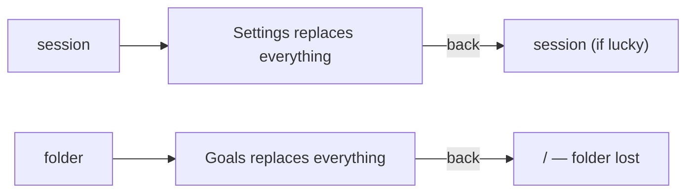
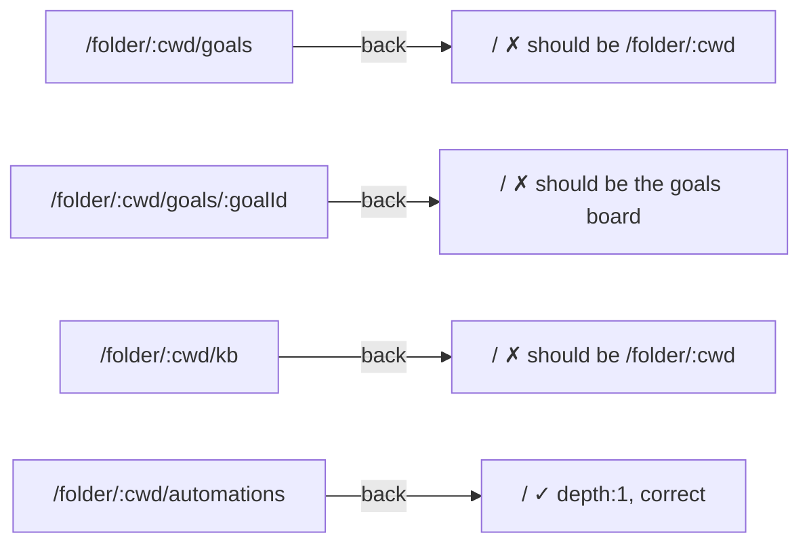

# add-route-backed-overlay-dialogs

## Why

The dashboard has ~35 addressable destinations. Most are full pages that
*replace* what you were looking at. Opening Settings, a file preview, an
OpenSpec artifact, Goals, the KB, or an Automation board evicts the session or
folder you were working in, and getting back is a navigation act rather than a
dismissal.



**Scope correction (doubt-review cycle 1).** An earlier draft of this proposal
claimed the converted surface would render *over a still-mounted* launching
route. That is not implementable **as stated**: a URL-backed dialog points the
URL at the dialog, so the launching route stops matching and cannot render from
the URL. Cycle 2 (design D1, option C) resolves this: the launching route is
captured and **frozen** at navigation time, and the underlay renders from that
pinned path through a location source independent of `window.location`. So the
surface renders in a dialog over a scrim over the still-visible launching route,
and dismissing it returns there. On a cold load, where nothing was captured, the
underlay is synthesized from the route's own back target.

The last row is not hyperbole. It is a live defect, and it is silent — see
*The depth defect* below.

### The container is the problem, not the URL

Two mechanisms already exist in-tree and disagree with each other:

| Surface | Container | URL |
|---|---|---|
| `/folder/:cwd/openspec/:change/:artifact` | full page | canonical |
| artifact reader opened from the board | `OpenSpecArtifactDialog` | **does not move** (local state) |
| `/folder/:cwd/view?path=` | `PreviewOverlayView` (full-viewport) | canonical |
| `/settings/:page` | full page | canonical |
| `/folder/:cwd/goals` | full page (plugin claim) | canonical |

There is **no existing route-backed dialog in the tree.** `OpenSpecArtifactDialog`
is local state, not a route:

```
App.tsx:529   const [artifactDialog, setArtifactDialog] = useState<… | null>(null)
App.tsx:2429  onClose={() => setArtifactDialog(null)}
OpenSpecArtifactDialog.tsx:16
  "rendered as a local-state Dialog over the current view (URL unchanged)"
                                                          ^^^^^^^^^^^^^^
  — the URL never moves AT ALL; it is not a canonical-URL dialog
```

So this change **introduces** the route-backed pattern rather than generalising
a shipped one. That is a larger step than the earlier draft claimed, and the
plan is sized accordingly.

The separable point still holds: the URL is the addressing contract and the
container is a rendering decision. Keeping the URL buys deep links, the browser
back button, and zero e2e `goto` churn; changing the container buys consistent
dismissal affordances.

### Keeping URLs canonical is not optional

`/settings/*` is load-bearing well beyond the UI:

| Consumer | Depends on |
|---|---|
| `landing-page-onboarding` spec | CTA **SHALL navigate to** `/settings?tab=providers` |
| `mobile-resilience` spec | `/settings` uses MobileShell navigation |
| e2e specs | `goto("/settings/security")`, `/settings/gateway` ×6, `/settings/providers`, `/settings/packages` |
| `skill-provenance` e2e | `goto("/folder/<cwd>/settings/skills")` |
| `back-target.ts` | `/settings/:page` depth-1 descriptor |
| plugin claims | `/settings/plugins/<id>` |

A URL-less dialog rewrites two specs and ~10 e2e specs for zero user benefit.
This change moves **containers only**. Every route in the table below keeps its
path, its deep link, and its browser back button.

### The plugin half is one slot, not N pages

Automation, Goals, and Knowledge Base are not bespoke pages. They are
`shell-overlay-route` claims — one slot, **6 claims, 4 plugins** (a full scan of
`packages/*/package.json`; an earlier draft said 8 and wrongly included a flows
popout — `flows-plugin` declares no `shell-overlay-route` claim):

```
  automation   /folder/:cwd/automations                  depth:1   AutomationBoard
               /folder/:cwd/automations/run/:sid         depth:2   AutomationRunMonitor
  goal         /folder/:cwd/goals                        depth:—   GoalsBoardClaim
               /folder/:cwd/goals/:goalId                depth:—   GoalDetailClaim
  kb           /folder/:cwd/kb                           depth:—   KbSettingsClaim
  subagents    /session/:sessionId/subagent/:agentId     depth:—   SubagentPopoutClaim
```

So the plugin half of this change is one edit to `ShellOverlayRouteSlot` in
`packages/dashboard-plugin-runtime/src/slot-consumers.tsx`. Every present and
future overlay claim inherits it.

### The depth defect

`manifest-types.ts` specifies: `depth` omitted → treated as `depth: 2` with a
**non-fatal warning**; `parentPath` omitted on a `depth: 2` route → back target
defaults to `/`.

Goal (both claims) and KB declare **neither**:



Open Goals from a folder, press back, and the folder is gone. Dialogs do NOT fix
this structurally — an earlier draft claimed "a dialog closes onto whatever
rendered it, so there is no depth to declare", and design D4 refutes it: the
underlay is a *frozen background path*, not a live parent, so dismissal still
has to navigate somewhere explicit. The depth table is the source of that target
on the cold-load path, and under design D1 it also supplies the cold-load
underlay. The mobile path walks the same table. So the missing declarations are
load-bearing on every path, and are corrected here.

### Ten resource routes are one component

```
  SettingsPanel (global)              DirectorySettings (folder)
  <ResourceGridPanel                  <ResourceGridPanel
    type={RESOURCE_TAB_TYPE[…]}         type={RESOURCE_PAGE_TYPE[…]}
    scopes={["global"]}                 scopes={["local","global"]}   ← only
    showScopeFilter={false}             showScopeFilter                  real
    onViewFile → /pi-resource           onViewFile → /folder/:cwd/view    diffs
```

`/settings/{skills,agents,extensions,prompts,themes}` and
`/folder/:cwd/settings/{same 5}` render the *same component*, differing only in
props (plus `globalPill`). The two routes are never mounted simultaneously, so
this is **not** a correctness bug — an earlier draft claimed converting both
would "ship two dialogs showing one grid", which is false. The case for the
dedupe is duplication cost alone: ten route destinations maintaining one grid's
wiring in two places. It is folded in here because this change already edits
both call sites; if it stops paying for itself, it can be dropped without
affecting the rest.

## What Changes

- **A route-backed overlay renderer is introduced.** URL canonical; desktop
  renders a `Dialog` over a scrim over a **pinned background underlay**, mobile
  falls through to the existing `MobileShell` depth slide. The launching route
  IS kept visible behind the dialog, rendered from a frozen path rather than
  from the current location (see design D1); dismissal returns to it. The
  underlay is `aria-hidden`, non-interactive, and retains its scroll position.

- **These surfaces move onto it** (paths unchanged):
  - `/settings/:page/:sub?`
  - `/folder/:cwd/settings/:page`
  - `/folder/:cwd/openspec/:changeName/:artifactId` — and the duplicate
    full-page path is **deleted**; `OpenSpecArtifactDialog` becomes the only
    renderer
  - `/folder/:cwd/view?path=`, `/pi-view?url=`, `/pi-resource?path=`
  - `/tunnel-setup` — its own route-backed overlay. It **replaces** settings
    rather than stacking on it: each owns a URL, so only the matching one is
    mounted (D5)

- **`ShellOverlayRouteSlot` renders overlay claims as dialogs.** Covers
  Automation (board + run monitor), Goals (board + detail), Knowledge Base, the
  the subagent popout, and every future claim. (`flows-plugin` declares no
  `shell-overlay-route` claim — an earlier draft wrongly listed one.)

- **`presentation?: "page" | "dialog"` is added to the claim contract**,
  defaulting to `"dialog"`. Third-party overlays that need full viewport width
  opt out explicitly instead of being silently constrained.

- **Goal and KB claims declare `depth` + `parentPath`.** Fixes the back-to-`/`
  defect on the mobile path, which dialogs do not cover.

- **Global and folder resource surfaces collapse into one scope-switched
  panel.** Ten route destinations become one.

- **`/folder/:cwd/openspec` (the kanban board) stays a full page.** A board
  wants horizontal width; constraining it to a dialog trades one problem for
  another.

- **`/session/:id/diff` and `/session/:id/editor` stay routes** and are *not*
  dialog-ised. These are read-while-working surfaces; the correct container is
  the existing `SplitWorkspace`, which is out of scope here.

- **`/pair` is untouched.** It branches in `main.tsx:167` *before* `<App/>`
  mounts and never enters the router. The QR deep-link target is immune to this
  change by construction.

## Impact

- Affected specs: `url-routing` (MODIFIED — container semantics per route),
  `mobile-resilience` (MODIFIED — desktop dialog / mobile depth split made
  explicit), `shell-overlay-route` (MODIFIED — `presentation` field; overlay
  claims render as dialogs), `pi-resources-view` (ADDED — one scope-switched
  surface), `settings-panel` (MODIFIED — no longer a "full-page panel"),
  `file-and-url-preview` (MODIFIED — `/pi-view` no longer "full-screen")
- **Spec churn is not zero.** An earlier draft claimed it was. Six specs are
  touched. What *is* preserved is every URL, so no e2e `goto(...)` target and no
  spec-referenced path changes — a narrower claim than the original one, and the
  one task 8.2 gates on.
- `shell-overlay-route` and `url-routing` each carry an existing requirement that
  a matched overlay SHALL NOT render lower-priority branches (session detail,
  landing). This change **amends both** to forbid a branch *derived from the
  current location*, which preserves their intent — no ambiguous double-match, no
  two competing readers of the URL — while permitting the pinned, non-URL-derived
  underlay. `settings-panel` and `file-and-url-preview` carry the same clause and
  are amended alongside. This is a deliberate re-litigation of the requirements
  that cycle 1 used to rule the underlay out.
- Affected code:
  - `packages/dashboard-plugin-runtime/src/slot-consumers.tsx` (`ShellOverlayRouteSlot`)
  - `packages/shared/src/dashboard-plugin/manifest-types.ts` (`presentation`)
  - `packages/client/src/App.tsx` (route → overlay renderer wiring)
  - `packages/client/src/components/settings/SettingsPanel.tsx`
  - `packages/client/src/components/DirectorySettings/DirectorySettings.tsx`
  - `packages/client/src/components/resource/ResourceGridPanel.tsx` (scope switch)
  - `packages/client/src/components/preview/PreviewOverlayView.tsx`
  - `packages/client/src/lib/nav/back-target.ts` (descriptor table)
  - `packages/goal-plugin/package.json`, `packages/kb-plugin/package.json` (depth/parentPath)
- **No server change.** This is a client container refactor.
- Behaviour lost: none intended. Every path, deep link, and back button is
  preserved by design; the change is verified against that claim.

### Dependency: `collapse-pairing-into-gateway`

That change is in-progress and **deletes `PairingView.tsx` and
`QrCodeDialog.tsx`**, collapsing operator pairing into `GatewayPairQR`. It
edits `SettingsPanel.tsx`, which this change also edits.

It should land **first**. Two consequences if it does:

- The `PairingView.tsx:168 navigate("/settings/gateway")` jump — which would
  otherwise close a settings dialog mid-pairing and strand a live one-time-code
  TTL — is deleted along with the file. The hazard is removed rather than
  mitigated.
- Pairing already lives in `GatewayDialog` (toolbar, one click from any screen),
  so the pairing surface is a dialog before this change begins.

If it does **not** land first, this change must carry the intra-dialog
navigation rule for `PairingView` explicitly: a `navigate("/settings/...")` from
inside the settings dialog switches the dialog's page and never closes it.

## Discipline Skills

- `doubt-driven-review` — the load-bearing claim is "containers change, URLs do
  not". If it is wrong anywhere, two specs and ~10 e2e specs break at once.
  Stress-test it against the route table before the renderer lands.
- `security-hardening` — the change reshapes the containers around pairing and
  gateway surfaces. Confirm no pairing affordance ends up on a path that skips
  `guardPairingUrls`, and that TLS-only `urls[]` handling is unaffected by the
  container swap.
- `review-code` — a cross-cutting refactor over the client, the plugin runtime,
  and the shared manifest contract.
- `code-simplification` — the change is net-negative by intent (ten resource
  routes to one, one duplicate OpenSpec path deleted). The pass confirms the
  overlay renderer did not absorb the complexity it removed elsewhere.
- `performance-optimization` — settings, previews, and boards move from
  route-mounted to dialog-mounted. Confirm they still mount lazily and are
  unmounted on dismiss, so a dialog does not keep a heavy grid or a live run
  monitor subscribed behind a closed overlay.
