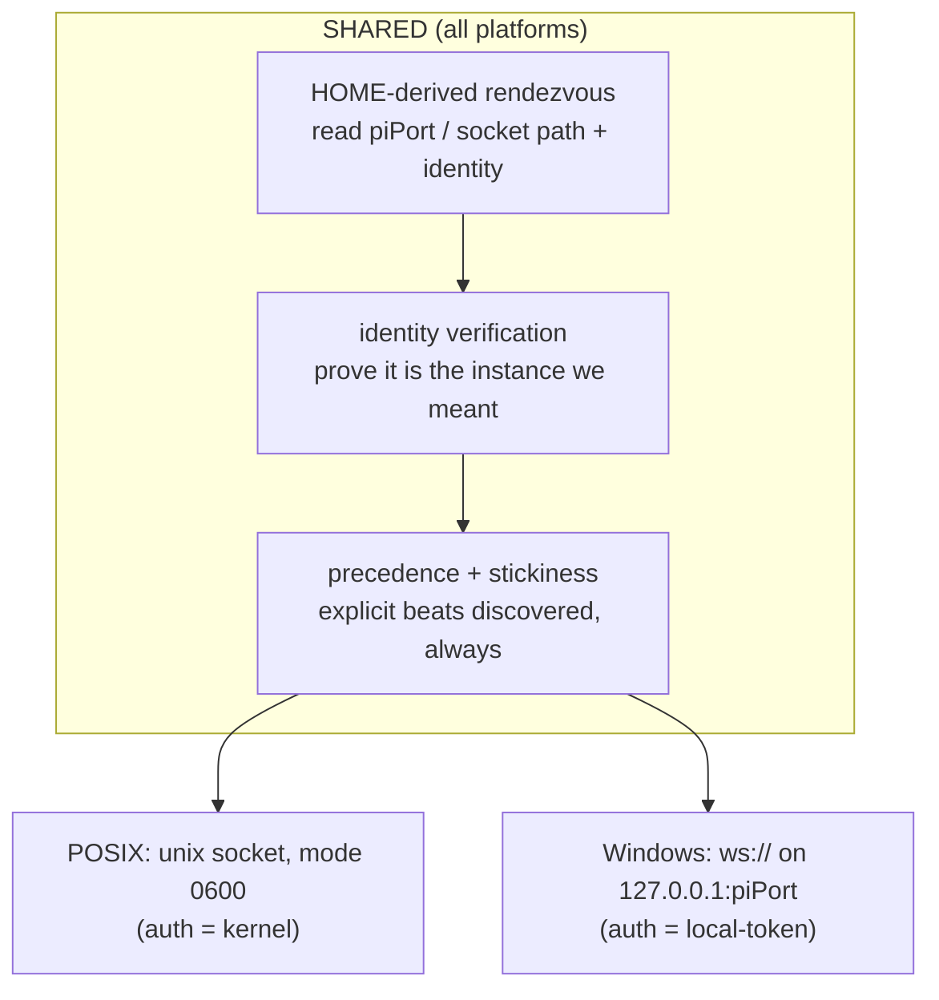
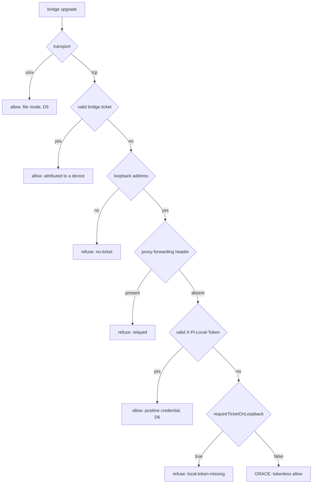

# Design — pi gateway transport and identity

## Problem shape

The churn on this connection sorts into four root causes. Only two are
transport/identity problems, and this change addresses exactly those.

| Class | Examples | Root cause | Addressed here |
|---|---|---|---|
| 1 — endpoint ambiguity | `fix-bridge-mdns-migration-hijack`, `fix-bridge-autostart-port-resolution`, `diagnose-empty-mdns-scan` | an unauthenticated name→endpoint indirection whose answer can be wrong | **yes** — the local case loses the indirection; the remote case gains verification |
| 2 — peer identity | `fix-duplicate-bridge-registration`, `spawn-correlation-token`, `fix-spawn-correlation-ttl-coupling`, `fix-tags-lost-on-bridge-reattach` | the transport supplies no identity, so the server reconstructs one from self-reported pid + cwd + token | **partly** — a remote bridge gains a real identity; the existing heuristics are not rewritten here |
| 3 — application protocol | `serialize-bridge-message-pump`, `fix-bridge-followup-image-drop`, `restore-ask-user-tool-state-on-reconnect` | message/state design | no — unaffected by transport |
| 4 — lifecycle races | `fix-restart-bridge-auto-start-race`, `fix-worktree-server-autostart-leak` | server process ownership | no |

## Decisions

### D0 — The HOME-derived rendezvous is the primitive; the socket is not

The local socket appears to be the mechanism, but it is doing two separable
jobs:

| Job | What it fixes | Needs a socket? |
|---|---|---|
| **Rendezvous** — a deterministic, HOME-derived address, never asked of the network | Class 1, endpoint ambiguity | **no** |
| **Authorisation** — only the owning OS user may connect | the unauthenticated gateway port | no, but a socket gives it for free |

Class 1 dies because the bridge stops *asking the network* for an address — not
because the bytes stop travelling over TCP.

**Corrected premise (doubt-review, cycle 1).** An earlier draft claimed
`home-lock.ts` "already writes" this record. It does not. `acquireOrAttach`
(`home-lock.ts:267`) has **no production caller** — only `__tests__` — and a
live dashboard has **no `~/.pi/dashboard/server.lock*` on disk**. The module
is implemented but unwired. Its `LockMetadata` shape (`piPort`, `httpPort`,
`identity`, `pid`, `url`, `hostname`) is the right record; **writing it is now
in scope for this change** rather than assumed to happen already.

That it is unwired is also an opportunity: nothing depends on its current path,
so it can be aligned with `dashboard-paths.ts` for free (see D2).

So the design is one shared layer over two transports:



This is what makes D6 cheap: Windows changes the transport, not the fix.

### D1 — Local transport is a unix socket / loopback WebSocket carrying the SAME protocol

Not a new wire protocol. `ws+unix:///path/to.sock:/` on the client, and
`WebSocketServer({ server })` over an `http.Server` listening on a socket path.

Verified experimentally on the **server** side, with the `ws` package on both
ends: over a unix socket the server still observes `ws.ping()` → `'pong'`,
`readyState === OPEN`, `wss.clients`, and `terminate()`. That matters because `bridge-contention.ts` uses **WebSocket
ping/pong frames as its liveness oracle** for the duplicate-registration probe.
A transport without frame-level ping (QUIC, raw stream) would have forced that
subsystem to be re-founded. This one does not.

Consequence for the **server**: the send ring, the serialized inbound pump, the
watchdog, the contention tracker, and every `ExtensionToServerMessage` stay as
they are.

**Corrected: the client is NOT unchanged (doubt-review, cycle 1).** The earlier
claim "the change is an address, not a protocol" was wrong, because the
experiment used the `ws` package while the bridge does not:

```
connection.ts:110   this.WS = options.WebSocketImpl ?? (globalThis as any).WebSocket
bridge.ts:737       new ConnectionManager({ url, onMessage })    ← no WebSocketImpl

$ new (globalThis.WebSocket)('ws+unix:///tmp/x.sock:/')
  → DOMException: expected a ws: or wss: url
```

The global WebSocket **rejects `ws+unix://` outright**. `ConnectionManager`
must therefore be constructed with the `ws` package as `WebSocketImpl` (already
a dependency — `packages/extension/package.json:41`). This swap is **forced
independently by Windows**: the local-token credential rides an
`X-Pi-Local-Token` upgrade header, and the global/undici WebSocket cannot set
custom headers. One swap satisfies both.

The swap is not free: `connection.ts` carries a workaround tuned to the current
implementation's `onerror`-without-`onclose` behaviour. Reconnect and
error-path behaviour must be re-tested against the `ws` client, not assumed.

### D2 — Per-instance socket path; the rendezvous record is the selector

**Reversed after doubt-review, cycle 1.** The earlier decision — one HOME-derived
`gateway.sock`, no selection logic — contradicted shipped reality:

```
process-manager.ts:67-70
  "a second dashboard instance on a non-default --pi-port (e.g. a git-worktree
   server) spawns sessions that connect to the FIRST dashboard instead"
```

N-dashboards-per-HOME is supported and documented, and **D11's headline move
case (worktree ↔ main) is itself same-HOME**. A single shared path would have
collided; combined with the old D9 (unlink before bind), the second instance
would have silently unlinked the live server's socket and captured every bridge
— the hijack class relocated, not removed.

So:

```
  socket path      <dashboardConfigDir>/gateway-<piPort>.sock     per instance
  rendezvous rec.  <dashboardConfigDir>/server.lock[.meta]        per HOME
                   written by the lock HOLDER only
```

- **Per-instance socket** — collisions are structurally impossible between
  instances that already differ by `piPort`.
- **The record is the selector, not a scan.** An unpinned bridge reads the
  record and dials the instance it names. No enumeration, no discovery, no
  heuristic — one deterministic read.
- **A non-lock-holding instance never writes the record.** It serves only
  bridges pinned to it, which is already how spawned sessions work: the
  spawning server sets `PI_DASHBOARD_URL` per spawn
  (`process-manager.ts:setSpawnDashboardPiPort`). Spawned → pinned by its
  spawner; hand-started → the record's default. Both cases are deterministic.

**One HOME root, not two.** `canonicalHomedir()` uses `os.userInfo().homedir`
and is deliberately **`$HOME`-immune** (`home-lock.ts:96-105`), while
`dashboard-paths.ts` resolves `env?.homedir ?? os.homedir()`, which **honours
`$HOME`**. Two different homes for the socket and the record would break the
temp-`HOME` isolated-verification workflow (isolated socket, shared lock). The
record and the socket SHALL share one root, and it SHALL be the `$HOME`-honouring
`dashboard-paths.ts` root. Because `home-lock` is currently unwired (D0),
re-rooting it costs nothing today and cannot be done cheaply later.

Rejected: enforcing true one-per-HOME by wiring `acquireOrAttach` as exclusive.
It would break the worktree-dashboard workflow the repo explicitly supports, and
the move command's own primary use case.

### D3 — Explicit configuration is pinned

Precedence, highest first:

| # | source | class |
|---|---|---|
| 1 | `PI_DASHBOARD_SOCKET` — explicit local socket path | **PINNED** |
| 2 | `PI_DASHBOARD_URL` — explicit remote endpoint | **PINNED** |
| 3 | config: pinned instance identity | **PINNED** |
| 4 | `$HOME`-derived local socket | default |
| 5 | paired remote dashboards | remote-join feature |
| 6 | mDNS / discovery | MAY SUGGEST — MAY NEVER OVERRIDE 1–5 |

A pinned endpoint that is unreachable produces a visible, retrying failure — not
a silent migration to something else. This is the inversion the hijack needs:
today an explicit `PI_DASHBOARD_URL` can be silently overridden, and the only
defence is remembering `PI_DASHBOARD_NO_MDNS`.

### D4 — Stickiness

Once registered with instance `X`, a bridge reconnects only to `X`. Migration
requires **all** of: the current endpoint is unpinned, the current endpoint has
failed, and the candidate's identity verifies. Otherwise the bridge keeps
retrying `X` and surfaces the failure.

### D5 — Local authorisation is socket ownership

Socket mode `0600` in a `0700` directory. The kernel enforces it; there is no
token to mint, leak, rotate, or replay, and the endpoint is unreachable from the
network by construction. This matches the `0600` convention already used for
`paired-devices.json` and `identity.key`.

### D6 — Windows keeps WebSocket over loopback, authorised by the local token

No named pipes. Windows binds `127.0.0.1:piPort` and the bridge authorises with
`local-token.ts`, which already ships exactly this mechanism: a 32-byte secret
at `~/.pi/dashboard/local/token`, presented as `X-Pi-Local-Token`, verified with
`crypto.timingSafeEqual`. Its own header comment states the intent — an
affirmative genuine-local credential that does not rely on the loopback address,
*"a remote attacker over a tunnel cannot read the file, so cannot forge the
header."*

Rejected: named pipes with an explicit ACL. `net`/`http` do accept
`\\.\pipe\<name>`, but the pipe namespace is flat and machine-global (the name
would have to encode a hash of `canonicalHomedir()`), and restricting it to the
current user needs a security descriptor rather than `chmod` — plausibly native
code. That is a large amount of new, platform-only, security-critical machinery
to reproduce a guarantee the local token already provides.

**Known gap this exposes, pre-existing and wider than this change.** `chmod` is
a no-op on Windows, and the repo already says so:

```ts
fs.chmodSync(dir, 0o700);   } catch { /* best-effort (e.g. Windows) */ }
fs.chmodSync(this.filePath, 0o600);
  } catch { /* best-effort; chmod is a no-op / may throw on some FS (e.g. Windows) */ }
```

So on Windows the owner-only property of `local/token` — and equally of
`identity.key` and `paired-devices.json` — rests on NTFS ACLs inherited from the
user profile directory, not on the mode bits. That is probably sufficient
(standard users cannot read another profile by default), but it is currently
*assumed*. It must be verified on a real Windows host, not reasoned about. This
change does not introduce the gap; it is the first to depend on it explicitly.

Consequence of the split: the `--host 0.0.0.0` exposure that motivated this
change is *unrepresentable* on POSIX (nothing listens) and *survivable* on
Windows (a listener exists; the token is the guard). Windows therefore keeps the
loopback bind pinned to `127.0.0.1` regardless of `--host`.

**Mixed-version rollout on Windows (task 5.4c), DECIDED cycle 5.** The
loopback listener is always bound, and a bridge predating this change cannot
present a token. Refusing those outright would break every un-upgraded session
on the host at the moment the server updates — a worse failure than the window
it closes, because the Windows listener is `127.0.0.1`-pinned and was already
reachable only locally. So: **tokenless loopback upgrades are ACCEPTED for one
deprecation window, logged loudly on every occurrence**, and refused after it.

Horizon: accepted through **0.8.x**; from **0.9.0** a tokenless loopback upgrade
is refused. The log line names the horizon so an operator sees it before the
refusal, not after.

### D7 — Remote bridges are paired devices

Reuse, do not rebuild:

- `pairing/pairing.ts` — one-time code, 8-digit confirm, versioned payload
- `pairing/paired-devices.ts` — hash-only bearer registry, revocable, `0600`
- `auth/bearer-auth.ts` — bearer verification
- `auth/ws-ticket.ts` — single-use, ~15s, scoped upgrade ticket; the durable
  bearer never rides the WebSocket

This change adds a `bridge` value to `WsRouteScope`, which today is
`"browser" | "terminal" | "live"` (`packages/server/src/auth/ws-ticket.ts:22`).
The gateway is a separate WebSocket server on a separate port and never joined
this scheme; that is the gap.

### D8 — The bridge pins the server's Ed25519 fingerprint

`server-identity-keypair` exists to let a client "pin the identity and detect an
impostor" across changing URLs. A remote bridge stores the fingerprint at
pairing time and refuses any endpoint that cannot answer the nonce challenge.

This is what makes the hijack class *unrepresentable* rather than *guarded*: a
stale or hostile server cannot impersonate a pinned identity, whatever it
advertises.

### D9 — Stale sockets fail closed — but a LIVE socket is never unlinked

**Amended after doubt-review, cycle 1.** "Bind unlinks any pre-existing socket
file" was unconditional, which turns stale-file cleanup into a live-socket
takeover whenever two instances share a path. Per-instance paths (D2) make that
rare; the guard makes it impossible.

Before unlinking, the server SHALL probe the path: attempt a connection, and
unlink **only** on `ECONNREFUSED`/`ENOENT` (no listener). A path with a live
listener SHALL abort startup with a clear conflict error — never a silent
capture.

**A bind-error guard does not work here (B3).** `bind()` raises `EADDRINUSE`
only when the path *exists*, so if another process binds during
`[probe → unlink]`, our `unlink` destroys its live socket file and our `bind`
then **succeeds** — silent capture with no error to catch. The probe is also not
a liveness oracle: a live listener with a full backlog returns `ECONNREFUSED`.

So the sequence is serialized rather than guarded. Probe, unlink and bind SHALL
run while holding an exclusive lock on a **companion file** —
`gateway-<piPort>.sock.lock`, since a socket cannot itself be locked — using
`proper-lockfile`, already a dependency. The lock covers only the
probe/unlink/bind sequence; it is not held for the listener's lifetime. A probe
that cannot distinguish stale from saturated SHALL fail closed — abort with a
conflict rather than unlink.

On mixed versions (cycle 4): a serializing lock only binds processes that take
it, but here the competitor set is empty by construction — a dashboard predating
this change binds a **TCP port**, never a socket path, so there is no
old-version writer to race with on this path.

**Amended after `@review`, cycle 5 — a stale path must stay reclaimable.** The
rules above are jointly unsatisfiable in practice: `probeSocket` answers
`no-listener` only on `ENOENT`, and the unlink branch runs only when the file
*exists*. Mutually exclusive — so under the real probe the unlink is
unreachable, and a `SIGKILL`ed dashboard wedges its own path until a human
deletes it. That contradicts the proposal's "a stale path is cleaned up".

The missing piece is a liveness discriminator that is not `connect()`. On a
successful bind the server SHALL record its pid in a companion
`<socketPath>.pid` (`0600`), removed on unbind. When the probe is
**indeterminate**, the recorded pid decides: unlink only when the pid is
recorded AND `isProcessAlive` reports it gone. A missing, empty or unparseable
pidfile proves nothing and still fails closed. A `live` probe is unambiguous and
always wins, so a recycled or hand-edited pidfile can never authorise unlinking
a path something is answering on. Both reads happen under the same companion
bind lock, so the decision cannot be raced.

A client connecting to a leftover path gets `ENOENT`/`ECONNREFUSED` immediately
and definitively.

This is the property the TCP+mDNS path lacks: a stale advertisement resolves to
a **real, live, wrong** server, and the bridge loops against it silently. A
stale socket cannot be mistaken for a working one.

### D10 — The server may listen on both transports

`WebSocketServer({ noServer: true })` with one upgrade handler shared by a UDS
listener and an optional TCP listener. The transport becomes a per-bridge
property, not a per-server mode, which is what allows local UDS and remote
authenticated TCP to coexist during and after rollout.

The TCP listener does not bind by default — outside the container image, which
is a counter-example this change must handle explicitly (D15).

`address()` needs adjusting: it returns `addr.port` only when `typeof addr ===
"object"` (`pi-gateway.ts:235-238`). A UDS listener's `address()` returns a
**string**, so it would yield `null` and blank the gateway port in the settings
UI. The accessor must report the active transport, not just a TCP port.

### D10b — Listener policy and the container default (tasks 8.1, 8.5, 8.6)

**DECIDED cycle 5.** The shipped container default is the hard case:
`docker/compose.yml` publishes `${PI_GATEWAY_BIND:-0.0.0.0}:${PI_GATEWAY_PORT:-9999}`
and `PI_DASHBOARD_HOST` defaults to `0.0.0.0`, so the default gateway is an
**unauthenticated TCP listener on every interface**. That must not survive this
change in any form.

Chosen: **keep the TCP listener in the container, and make bridge
authentication MANDATORY on it** (section 6 — bridge-scoped tickets, device
credentials, revocation). Moving the container to the socket was rejected:
bridges outside the container (the common `PI_WORKSPACES` layout) have no path
to a socket inside it, so the socket-only container would break the product's
own documented deployment.

Ordering consequence, explicit: **task 8.1 depends on section 6.** Dropping the
default TCP listener before bridge auth exists would leave the container
choosing between "unauthenticated" and "broken".

**Deprecation horizon for the unauthenticated TCP path (task 8.5).** The
fallback exists so an old bridge keeps working against a new server (8.4). It
is bounded: unauthenticated TCP bridge upgrades are accepted through **two
minor releases — 0.8.x and 0.9.x — and refused from 1.0.0**, after which the
TCP listener requires a bridge ticket. Recording the version here is the point:
an unbounded "temporary" fallback is how the unauthenticated default got here.

### D11 — An explicit move is the same mechanism with a human trigger

Stickiness (D4) deliberately makes automatic re-targeting hard. That leaves no
way to correct a bridge attached to the wrong instance — exactly the 23-hour
hijack, which today has no manual recovery at all. The move command is the
escape valve, and it reuses D3/D4 rather than adding a parallel path:

```
  /dashboard connect <instance>   instance = socket path | port | identity | "default"
  /dashboard connect --list       rendezvous records visible under this HOME
  /dashboard where                current endpoint, identity, pinned?
```

Order of operations matters: **register with the target before closing the
origin**, so the session is never orphaned mid-move. Then tell the origin with a
`session_moved` message — the only new protocol in this change — so its card
reads *moved*, not *crashed*. The move sets `pinned = true`, because an explicit
choice must survive the next reconnect.

**Corrected: the re-target primitive does NOT support this ordering
(doubt-review, cycle 1).**

```ts
updateUrl(newUrl: string): void {
  if (newUrl === this.url) return;
  this.url = newUrl;
  if (this.ws) { this.handleDisconnect(); }   // origin torn down FIRST
}
```

`ConnectionManager` holds exactly one `ws`, and `updateUrl` closes it before any
target connection exists — the opposite of register-before-close. Supporting the
move requires a genuine new capability: hold a second, provisional connection,
register on it, and only tear down the origin once the target acknowledges;
abort back to the origin if it does not.

**Send-ring ownership during the overlap is decided here, not deferred:** the
**origin owns the ring until the target acknowledges registration**. The
provisional connection carries the registration handshake and nothing else. On
acknowledgement, ownership transfers in one step and the origin closes; on
failure or timeout, the provisional connection is discarded and the origin never
stopped owning anything.

**That promise is not free — the server currently breaks it (B4).** A second
registration for one `sessionId` is not inert today:

- same pid → `bridge-contention.ts:81-84` accepts with no probe, and
  `pi-gateway.ts:532` `connections.set(sessionId, ws)` **takes over routing
  immediately**, after which the origin's sends are dropped by the ownership
  gate at `pi-gateway.ts:493`
- different pid → `register_rejected` (`pi-gateway.ts:347`), which
  `connection.ts:451-460` treats as **terminal for the session**, killing the
  origin

So the move needs a **provisional registration mode**: a registration that
announces intent, returns the target's `instanceId`, and **neither claims the
routing entry nor enters contention**. Routing transfers only on an explicit
commit. A refusal on a provisional registration SHALL be distinguishable from a
refusal on a live one, so it can never set `intentionalClose` on the origin.

This is the second new protocol element (with `session_moved`), and it is the
reason the move is not merely a client-side reconnect.

Three constraints on it, from cycle 4:

- **A provisional registration SHALL expire.** Without a TTL, a buggy or hostile
  bridge accumulates provisional state indefinitely. It is discarded on timeout
  exactly as on failure — the origin never stopped owning anything.
- **Its refusal SHALL NOT disclose whether the session exists.** If provisional
  mode refused specifically because a live bridge holds that `sessionId`, it
  becomes an oracle for enumerating live sessions. Refusal causes must be
  indistinguishable to the caller, or the mode must require proof of session
  ownership before answering.
- **The bypass sites are named, not implied:** a provisional registration must
  skip `connections.set()` (`pi-gateway.ts:532`) **and** the same-pid
  fast-accept in `bridge-contention.ts:82-83`. Symptom-level tasks are not
  enough to land this correctly.

`bridge.ts:1367` registering `pi.registerCommand("__dashboard_reload", …)`
remains a valid template for the command surface itself.

**Scope limit, from the two-source finding.** The dashboard learns about a
session from two places:

| Source | Mechanism | Travels with a move? |
|---|---|---|
| live events | bridge WebSocket | yes |
| history, card metadata, resume | `session-scanner.ts` reading `~/.pi/agent/sessions/**/*.jsonl` via `resolvePiSessionsDir()` | **only within one HOME** |

So a same-HOME move (worktree ↔ main, isolated ↔ live) is complete: both
instances scan the same files. A cross-host move carries live events only. The
command therefore targets same-HOME instances, and must say plainly what will
not follow when asked to do otherwise.

### D12 — Transcript access for remote-joined sessions — DECIDED: eager-forward + lazy-backfill, over server-side retention

**Gate answered (task 11.1), cycle 5; AMENDED cycle 6.** The options below stay
recorded for their trade-offs. The chosen shape is the **hybrid**:
live events forward eagerly, pre-attach history backfills lazily in the
background, and everything the dashboard has seen is retained server-side.

**Why the amendment is not a reversal.** B+retention and the hybrid share the
same two load-bearing halves — nothing large is shipped synchronously, and
retention is what lets an ended session stay readable (11.10, D13). They differ
in *when* the pre-attach backfill is triggered: on first view (B) versus in the
background after registration (hybrid). Eager-forwarding of *live* events is not
a new mechanism at all — it is what the bridge event protocol already does for
every session; naming it here only makes explicit that the backfill path must
not be on the critical path for it.

**What the amendment buys.** Under B, #F6 ("pre-attach history renders") is
satisfied only if the on-demand fetch completes while the user waits, which puts
a 44 MB tail transfer inside a page interaction. Backfilling in the background
moves that cost off the interaction entirely, and makes the retained copy the
steady-state answer rather than the fallback.

**What it costs.** Data almost never read is now shipped anyway, which is the
exact objection that ruled out option A. The bound on that cost is that the
backfill is *lazy and interruptible* — it must be safe to abandon mid-flight,
which is what #X18 (partial data is never presented as complete) tests. If the
backfill cannot be made abandonable cheaply, fall back to B: the retention half
is the part the spec actually requires.

Reasoning: the spec requires transcript data to **outlive the session**, and
D12's own table marks pull-on-demand (B) as failing exactly that — so B is
admissible only in combination with server-side retention. Retention alone (A)
pays a continuous streaming cost for data almost never read, and C pays a large
burst on every registration. B+retention keeps the steady state cheap (nothing
is shipped until someone looks) while the dashboard persists what it has
already seen, so an **ended** session is still readable — which is the property
D13 and the remote read-only view depend on.

Concretely: a live remote session's transcript is fetched on demand through its
bridge; every fetched and every streamed event is retained server-side; once
the bridge ends, reads are served from retention only, and are read-only (D13).

**Task 11.2 — append-only re-verified against the pinned pi (0.84.1), cycle 6.**
Over 3378 local `.jsonl` files: every file carrying a `"compaction"` marker
(8 of the last 400) still has entries *preceding* the marker — compaction adds a
record, it does not truncate the prefix. 373 files carry branch metadata,
consistent with branching writing a new file. The 44 MB tail file parses
cleanly (515 lines, 0 unparseable) with non-decreasing timestamps.

**What this does NOT prove, and the consequence for the cursor.** Sampling
existing files shows no *observed* rewrite; it cannot show a prefix is
byte-stable over time, and the format is pi's, not this repo's. So the backfill
cursor SHALL NOT be a bare byte offset that trusts the prefix. It carries the
offset plus a cheap check on the last consumed line (length + hash); a mismatch
means "re-read from the start", not "resume". That turns an unprovable
assumption into a detectable condition — which is also what #X18 needs, since a
partial transfer and a rewritten prefix are indistinguishable from the offset
alone.

### D12 (original options) — Transcript access for remote-joined sessions

**It is not "history" — it is six file-backed capabilities**, and they do not all
have the same answer:

```
  session-scanner.ts             list, card metadata, last-activity
  /api/session-file              the transcript
  /api/session-change/…          full untruncated Write/Edit payloads
  /api/sessions/…/tool-result/…  tool results
  /api/session-diff              diffs
  /api/session/:id/resume        respawn pi                    ← see D13
```

**The dependency is structural, not remote-specific.** `memory-event-store.ts`
is lossy *by design* — `maxEventsPerSession`, `maxCachedSessions`,
`DEFAULT_MAX_STRING_SIZE = 4000`, eviction, per-session trimming,
`[truncated: deep]`. `findSessionToolCallPayload` — which lives in
`session-file-reader.ts`, not in the event store — exists solely to escape it,
and documents why: it returns *"the FULL untruncated payload surviving the
in-memory ~4 KB cap / >20-op collapse."* So the `.jsonl` is the only complete
record, and the dashboard already reaches into it locally. Remote-join does not
create this dependency; it makes an existing one unsatisfiable.

**Measured on this machine (3332 sessions, 1440 MB):**

```
  p50    73 KB     median session is trivial to ship
  p90   1.1 MB
  p99   3.9 MB
  max    44 MB     the tail is what kills naive designs
```

**The transcript is append-only — measured here, re-verified in task 11.2 (B6).**
Provenance: one machine, one user's session store (3332 files), and the format
is pi's, not this repo's, so it can change under us. Treat the numbers as an
order-of-magnitude input to the choice, not as a guarantee. This session's own
file after a compaction: 179 entries, 1.43 MB, spanning first timestamp to last,
with all pre-compaction content still present (`iroh` ×58, `darwin-x64` ×21,
`ws+unix` ×26) alongside a `"compaction"` marker. Compaction shrinks the model's
context window, not the on-disk record. Branching writes a *new* file
(`createBranchedSessionFile`), leaving the original intact. This is the property
that makes cursor-based shipping viable and it must be re-verified if pi's
session-file format changes.

**The four shapes, none chosen:**

| | survives session end | works with no local dashboard | bandwidth | server storage | code churn |
|---|---|---|---|---|---|
| A. push all at register | yes | yes | 44 MB spikes, every reconnect | full | low |
| B. pull-on-demand RPC | **no** — bridge dies with session | yes | minimal, lazy | none | every file route forks local/remote |
| C. federate via origin dashboard | yes | **no** — requires one to exist | low | none | new server↔server trust |
| D. log-ship with a byte cursor | yes | yes | delta only | full | re-root the path, routes unchanged |

C is weaker than it appears: in the remote-join case a pi may attach to a remote
dashboard with no local dashboard running at all. D's appeal is that
`session-scanner`, `session-file-reader`, and `/api/session-diff` all take a
path, so pointing them at a mirror root avoids forking six call sites. A hybrid
— mirror forward eagerly, backfill lazily on first open — avoids paying for a
44 MB transcript nobody reads.

**Invariants that hold whichever shape wins:**

- **No filesystem path crosses the wire.** The server asks by `sessionId`; the
  bridge resolves the file itself. The opposite — a server naming a file — is an
  arbitrary-read primitive on the user's machine. This matches the posture
  already established for `session-file-reader` (*"no path input, no
  traversal"*).
- **A bridge serves only its own session.** A request naming any other
  `sessionId` is refused. Without this, the id becomes the traversal parameter
  that the path was not.
- **Registration is never blocked on transcript transfer.** A 44 MB session must
  not delay a bridge becoming usable.
- **Sessions carry an origin.** `/Users/robson/Project/x` can exist on two
  machines. The bridge's paired-device identity supplies the namespace for free,
  and the UI needs it anyway to say which machine a session is on.

### D13 — Remote sessions are read-only after their bridge ends

Read is solvable. Lifecycle is not.

`/api/session/:id/resume` must start a process on the pi host. Once a session
ends its bridge is gone, so a remote dashboard has no way to act there.

**Corrected premise (B5):** it is *not* true that nothing host-resident exists —
the RPC keeper sidecar (`process-manager.ts`, `spawnHeadlessViaKeeper`) already
outlives dashboard restarts. The barrier is **ownership, not absence**: a keeper
is spawned by, and belongs to, the dashboard that created the session, and a
remote dashboard has none on that host. So the conclusion stands, but the route
to lifting it is concrete — a host-resident agent a remote dashboard may address
is an extension of the keeper, not a new invention. Still a separate product
decision; no longer an unexamined one.

So: a remote session may be read after death, but not resumed or respawned. The
refusal is explicit and explained, rather than a button that fails obscurely.

### D14 — On Windows, the token authorises; the identity confirms rendezvous

Raised by doubt-review: `local-token.ts` resolves its path from `os.homedir()`,
so the token is **per-HOME, not per-instance**. Every same-HOME dashboard knows
the same secret. With N-per-HOME real (D2), a token alone cannot answer *"is
this the instance I meant?"* — and the auth spec requires a stale record naming
a port some other process now holds to be **rejected**.

Two distinct jobs, two mechanisms:

| Question | Mechanism |
|---|---|
| May this client connect at all? | local token (`X-Pi-Local-Token`) |
| Is this the instance the record named? | per-instance rendezvous id from the record |

**The repo has two different things called "identity". Do not conflate them.**
A cross-model reviewer did exactly that and concluded this decision was broken;
the conflation is the trap, so it is named here:

| Concept | Source | Scope | Used by |
|---|---|---|---|
| Ed25519 server identity (fingerprint) | `auth/identity.ts` → `~/.pi/dashboard/identity.key` | **per HOME**, stable across restarts | D8, remote pinning |
| Rendezvous instance id | **persisted key file** (below) | **per instance**, stable across restarts | D14, local rendezvous |

The `randomUUID()` default at `home-lock.ts:290` is **not** usable: it is minted
per acquisition, so it dies on every restart (B1). The specs demand an id that is
simultaneously stable across restarts — otherwise D4 stickiness refuses a bridge
its own restarted dashboard — and distinct across instances. So:

```
<dashboardConfigDir>/instances/<piPort>.id     mode 0600, dir 0700
  generated once, reused across restarts, passed as home-lock's config.identity
```

Keyed by `piPort` because that is what distinguishes instances under one HOME
(D2). A restart on the same port reads the same file and presents the same id —
benign.

**Corrected (cycle 4): the id is an IDENTIFIER, not a capability.** An earlier
draft claimed "knowing it proves you wrote the record, exactly like the local
token". That is false. `/api/health` is registered with **no preHandler**
(`system-routes.ts:479`, and `system-routes.ts:196` says so explicitly), so the
value is published on an unauthenticated endpoint — under the container's
`--host 0.0.0.0` default anyone on the network can read it. Unlike
`local-token.ts`'s secret, which never rides an endpoint at all.

So the two jobs stay strictly separated: **the local token (POSIX: socket
ownership) proves entitlement; the instance id only names which instance
answered.** The id must never be treated as proof of anything.

**Corrected (cycle 4): renaming the field breaks the existing check.**
`isLockHolderResponsive` compares `res.identity === meta.identity`
(`home-lock.ts:219-220`) and `defaultProbeHealth` reads `body.identity`
(`home-lock.ts:240`). Publishing the value as `instanceId` while leaving those
reads untouched makes the comparison silently fall through to the PID-match
branch (`home-lock.ts:222-226`) — the verification never runs. The earlier claim
that "the check exists, it needs wiring not inventing" was wrong: **both read
sites must change**. `instanceId` remains the right name, because
`server.ts:1600` already binds `identity` to the Ed25519 object.

**Port changes mint a new id, and that is accepted behaviour.** An instance that
restarts on a different port is a different rendezvous slot; a bridge pinned to
the old endpoint SHALL re-resolve from the record rather than refuse. Stated
because the id proves "current owner of this port slot", not "same process
lineage" — two temporal instances on one port do share an id, by design.

D14 SHALL use the **second**. Using the Ed25519 fingerprint here would be
silently wrong: it is shared by every same-HOME dashboard, so it cannot answer
"which instance" — precisely the property that makes the local token
insufficient. Since `home-lock` has no production caller, nothing passes
`config.identity` today and the `randomUUID()` default is what a straightforward
wiring produces; the design depends on that default being kept, not overridden
with the fingerprint.

`home-lock.ts:217-240` already compares a record's `identity` against the
`identity` field of `/api/health`, so the check exists — it needs wiring, not
inventing. That health field must expose the **same per-instance value** the
record carries; since the whole path is unwired, this must be verified rather
than assumed. This also closes the same gap on POSIX for a socket path rebound
by a different instance.

### D15 — Platform and filesystem failure modes have stated fallbacks

A unix socket is not universally available, and failing cryptically at bind time
is the failure mode this change exists to remove.

| Condition | Behaviour |
|---|---|
| Socket path exceeds `sun_path` (~104 B macOS / ~108 B Linux) | detect at path construction, not at `bind`; clear diagnostic, fall back to loopback + token |
| HOME on a filesystem without UDS support (NFS, some FUSE / bind mounts) | same fallback, named in the log |
| Path exists with a **live** listener | abort with a conflict error (D9) — never unlink |
| Partially-written rendezvous record | treated as absent; never partially trusted |

**The container is the explicit counter-example to D10.** The shipped default
*does* depend on the TCP gateway:

```yaml
# docker/compose.yml:28,38
- "${PI_GATEWAY_BIND:-0.0.0.0}:${PI_GATEWAY_PORT:-9999}:${PI_GATEWAY_PORT:-9999}"
PI_DASHBOARD_HOST: "${PI_DASHBOARD_HOST:-0.0.0.0}"
```

This answers the earlier open question with a *yes*. The container is a
remote-join deployment, so it must either keep the TCP listener with bridge
authentication mandatory (D7/D8), or move to the socket and update the compose
file. Either way the default cannot silently remain an unauthenticated
`0.0.0.0:9999`.

### D16 — Lock ownership is compare-and-swap, and an attach instance promotes

D2 asserts the record is written only by the lock holder. The current module
does not deliver that (B2), in three separate ways:

**Steals are unconditional, not compare-and-swap.** `home-lock.ts:354-368`
calls `properLockfile.unlock()` then `removeMetadata()` — removing whatever lock
is *present now*, not the dead one it observed. Two newcomers seeing the same
dead holder interleave, and the second deletes the first's **live** lock and
**fresh** record.

**Corrected (cycle 4): `proper-lockfile` does NOT close this.** Its stale path
is `stat → isLockStale → removeLock → acquireLock`
(`proper-lockfile/lib/lockfile.js:70-79`) with **no re-stat before
`removeLock`** — so a newcomer that observed a stale lock can still remove a
fresh one a peer acquired in the window. Delegating to the library relocates the
race rather than closing it; the earlier claim that it "does this atomically"
was wrong.

The takeover SHALL therefore be **acquire-then-verify**, which needs no atomic
primitive beyond the lock itself: acquire, then re-read the record and confirm
it still names the holder observed to be dead. If it names anyone else, release
immediately and take the attach path. A lost race becomes a no-op instead of a
deletion.

**An unreadable record is treated as an absent one.** `readMetadata` returns
`null` on *any* failure — permission, transient I/O, corruption
(`home-lock.ts:174-183`) — and `null` means stale, so a live holder with a slow
or unreadable sidecar can be stolen from. "Absent" and "unreadable" SHALL be
distinguished: absent permits takeover, unreadable fails loudly.

**Nothing recovers a crashed holder.** `releaseOnce` only runs on clean
shutdown, so after a crash the record keeps naming a dead instance and no
attach-mode instance ever rewrites it — unpinned bridges then dial a dead socket
indefinitely. An attach-mode instance SHALL detect a dead holder and **promote**
itself: acquire, and rewrite the record to name itself.

**Detection must be specified, not assumed (cycle 4).** `acquireOrAttach` is
one-shot — there is no polling anywhere in the module — so "detects a dead
owner" needs a mechanism: a periodic liveness re-check by attach-mode instances,
plus an on-demand check when a bridge reports the recorded endpoint unreachable.
Concurrent promotion is safe **only** because of acquire-then-verify above: two
attach instances may both try, exactly one wins the lock, and the loser's
verify-step sends it back to attach without touching the winner's record.

Promotion also covers the inverse case. Clean shutdown *deletes* the record,
which is correct (absence means "no local dashboard", D2) — but only if a
surviving attach instance takes over. Without promotion the HOME silently loses
its default while a perfectly good dashboard is still running.

## Defects found by doubt-review, and their resolutions

Three adversarial cycles (two cross-model) found these in decisions that were
written as settled. Each was verified in code before being accepted. They are
kept on the record because the fixes only make sense against the defect — and
because two of them were themselves defects in an earlier round of fixes.

### B1 — D14's per-instance id does not survive a restart

**RESOLVED — see D14.** The id is now a **persisted per-instance key file**,
generated once and reused across restarts, exposed under a name that does not
collide with the Ed25519 `identity`.

`home-lock.ts:290` mints `randomUUID()` inside `buildMeta()` on every
`tryAcquire()`, and `releaseOnce` deletes the sidecar (`home-lock.ts:313-316`).
So the id is per **process lifetime**, not per instance.

The specs need an id that is **stable across restarts** (so "a registered bridge
sticks to its instance" survives a benign restart) **and distinct across
instances** (so a foreign listener is rejected). A per-acquisition UUID is
neither. As written, every restart is indistinguishable from a capture: the
bridge either wrongly refuses its own restarted dashboard, or the check is
weakened until capture is allowed again. **D4 and D14 are in direct conflict and
the design does not acknowledge it.**

Likely resolution: derive the rendezvous id from `(home root, piPort)` — stable
across restarts, distinct per instance — and keep the Ed25519 fingerprint for
"is this one of my dashboards at all". Not yet decided.

Related: `/api/health` exposes no `identity` field today, while `server.ts:1600`
already binds the name `identity` to the **Ed25519** object. A naive wiring of
task 2.0e exposes the fingerprint, at which point every second instance throws
`InstanceLockMismatchError` instead of attaching.

### B2 — "the record is written only by the lock holder" is false

**RESOLVED — see D16.** Steals become compare-and-swap, an unreadable record is
no longer treated as absent, and an attach-mode instance promotes itself when
the holder dies.

`home-lock.ts:354-368` (dead-holder steal) calls `properLockfile.unlock()` then
`removeMetadata()` unconditionally — removing whatever lock is *currently*
present, not the dead one it observed. Two newcomers observing the same dead
holder can interleave so that the second deletes the first's **live** lock and
**fresh** record, leaving two instances believing they hold it.

`home-lock.ts:322-333` compounds it: `readMetadata` returns `null` on *any*
failure (permission, transient I/O, corruption) and that is treated as stale, so
a live holder with a slow or unreadable sidecar can be stolen from.

Also unhandled: if the holder **crashes**, `releaseOnce` never runs, the record
keeps naming a dead instance, and attach-mode instances never rewrite it — so
unpinned bridges dial a dead socket indefinitely. Clean shutdown has the inverse
problem: it *deletes* the record, leaving a window in which no instance owns it.

### B3 — D9's "two-sided guard" does not hold under unix-socket semantics

**RESOLVED — see D9.** The bind error is abandoned as a guard; probe/unlink/bind
is serialized under an exclusive lockfile instead.

`bind()` returns `EADDRINUSE` only when the path **exists**. If another process
binds inside the `[probe → unlink]` window, our `unlink` removes *its* live
socket file and our subsequent `bind` then finds no file and **succeeds**:

```
A: connect() → ECONNREFUSED   (concludes stale)
B: bind()                      (live listener)
A: unlink()                    (destroys B's path; B listens on an unlinked inode)
A: bind()                      (SUCCEEDS — no EADDRINUSE, silent capture)
```

The `EADDRINUSE` guard only covers the narrower `[unlink → bind]` sub-window.
The claim that capture is "impossible" is wrong. Additionally the probe is not a
liveness oracle: a live listener with a full backlog returns `ECONNREFUSED` on
Linux, so a saturated server can be misread as stale and unlinked with no race
at all.

Likely resolution: serialize probe/unlink/bind under an exclusive lockfile
(`proper-lockfile` is already a dependency) rather than relying on bind errors.

### B4 — The move collides with the duplicate-registration machinery

**RESOLVED — see D11.** A provisional registration mode is added that neither
claims routing nor enters contention.

D11 states the origin owns the send ring until the target acknowledges. The
server does not honour that, because a second registration for the same
`sessionId` is not inert:

- **same pid** — `bridge-contention.ts:81-84` accepts with no probe, then
  `pi-gateway.ts:532` runs `connections.set(sessionId, ws)`, so the provisional
  connection **displaces the incumbent's routing entry immediately**. The
  origin's sends are then dropped by the ownership gate at `pi-gateway.ts:493`.
  The promise breaks at registration, not at acknowledgement.
- **different pid** — the incumbent is probed and the newcomer gets
  `register_rejected` (`pi-gateway.ts:347`), which `connection.ts:451-460`
  treats as **terminal for the session** (`intentionalClose = true`, no retry).
  A refusal on the provisional connection is indistinguishable from one on the
  origin, so it would kill the origin.

A move therefore needs a registration mode that does **not** take over routing
until committed — a real protocol addition beyond `session_moved`. Tasks 9.3b
and 9.3c specify neither case.

### B5 — D13's premise is false (conclusion may still hold)

**RESOLVED — see D13.** The premise is corrected; the conclusion now rests on
ownership rather than absence.

D13 argues remote resume is impossible because nothing host-resident survives
the session. A host-resident daemon **already exists**: the RPC keeper sidecar
(`process-manager.ts`, `spawnHeadlessViaKeeper`), which outlives dashboard
restarts. The conclusion (remote resume is a separate product surface) may still
be right, but it cannot rest on "there is nothing there" — and the keeper is a
candidate vehicle that was never considered.

### B6 — D12's evidence is single-machine

**RESOLVED — see D12.** Provenance is stated; the claim is downgraded from
"verified" to "measured here, re-verify in task 11.2".

The append-only property and the size histogram were measured on one machine,
from one user's sessions, and are used to dismiss design options. Task 11.2
already re-verifies append-only, which contradicts calling it "verified" here.
Soften to a measurement with stated provenance, or widen the sample.

## Open questions

- **Rollout.** A new bridge against an old server, and an old bridge against a
  new server, must both work. Simplest path: server listens on both, bridge
  prefers the socket and falls back to TCP when absent. Needs an explicit
  deprecation horizon, otherwise the TCP path never goes away.
- **Docker.** The all-in-one container runs pi and the server under one HOME, so
  the socket works unchanged. A split deployment (pi outside, server inside)
  becomes a remote-join case and must pair. Worth confirming no compose topology
  silently depends on `:9999` being open.
- **The unexplained cwd asymmetry** noted in `fix-bridge-mdns-migration-hijack`
  (sessions in the dashboard's own repo never migrated) remains unexplained.
  This change removes the symptom for the local case, but the second factor is
  still unidentified.
- **Class 2 simplification.** Once a bridge has a cryptographic identity, how
  much of the pid/cwd/token correlation machinery can actually be deleted? Worth
  measuring after this lands rather than assuming.
- **Which transcript-access shape (D12)?** The four options are recorded with
  their tradeoffs and the decision is deliberately deferred to implementation,
  when the remote-join usage pattern is known. The invariants in D12 constrain
  every option, so the choice can be made late without re-litigating the design.
- **Does a host-resident daemon belong on the roadmap at all (D13)?** It would
  unlock remote resume and remote spawn, and it is the natural home for
  transcript serving after a session ends. It is also a substantially larger
  product surface. Not proposed here — only named, so the boundary is deliberate.

### D11a — A move's pin is process-lifetime only (cycle 7, DECIDED)

Task 9.2 requires a completed move to set `pinned` so the next reconnect
returns to the moved-to instance. Scope decided: **in-memory, for the life of
the pi process.** Nothing is written to disk; a restarted pi re-resolves through
the normal D3 ladder.

Rationale: a move is a **runtime act, not a config change**. Persisting it would
force the pin onto a D3 rung, and any rung above `PI_DASHBOARD_URL` would
resurrect precisely the silent-override class this change exists to remove — a
stored pin quietly beating explicit configuration is the same defect as mDNS
doing it, relocated.

Mechanism: `createMoveCoordinator().pinnedEndpoint()` feeds the EXISTING
`decideRetarget({ pinned })` stickiness gate (D4), rather than introducing a
second notion of pinning that would then have to be kept consistent with it.

Rejected:
- **Persisted at rung 3** (survives restart, env still wins) — defensible, but
  it makes a transient user action durable with no way to see or clear it.
- **Persisted and outranking everything** — "moved means moved", at the cost of
  an invisible on-disk pin overriding explicit configuration.

### D11b — Naming an instance, and the display-only scan (cycle 7, DECIDED)

Task 9.5 lets a user name a move target; task 9.6 lists the options. Two calls:

**1. What a user types.** Accepted, in this order: an exact `instanceId`, a
**port** (`connect 8002`), an unambiguous **id prefix** (`connect bbbb`,
git-short-sha style), an explicit socket path or `ws://` URL, or `default`.

The port is the humane primary name — it is already what the user sees, and the
socket is already `gateway-<piPort>.sock`. The id prefix exists because the id
is an opaque UUID nobody would type in full. An **ambiguous prefix is refused,
never resolved**: silently choosing between two dashboards moves the session to
the wrong one and still looks like it worked. An exact id beats a prefix, so an
instance whose id prefixes another's stays addressable.

Rejected: user-assigned labels. Nicest to type, but it introduces a second
naming authority plus persistent storage for what is currently derivable state.

**2. `--list` scans, and that is a deliberate carve-out from D2.** D2 forbids a
scan as the *selection* mechanism — an unpinned bridge does one deterministic
read of the record. That is untouched. But the record names exactly ONE instance
(the lock holder), so a record-only listing cannot answer "which dashboards
could I move this session to?" — and D11's headline case (worktree ↔ main) is
two instances under one HOME, where the *second* is the interesting one.

The distinction that keeps this honest: **scanning to show a human their options
is not scanning to pick an endpoint automatically.** Enforced by construction —
`instance-directory.ts` is display/resolve-only, ambiguity is an error rather
than a heuristic, and nothing on the bridge's automatic connect path imports it.
If that last property is ever violated, this has become discovery by the back
door.

## D16 — reconciliation with `fix-bridge-mdns-migration-hijack` (cycle 8, DECIDED)

Tasks 3.6 and 3.7 require this to be settled before archiving, not left implicit.

**3.6 — no delta was introduced on `mdns-discovery`.** This change's deltas are
`pi-gateway-transport`, `pi-gateway-auth` and `remote-session-history`. The
`mdns-discovery` capability is untouched.

**3.7 — but the two changes DO overlap, and the overlap needs declaring.**
`fix-bridge-mdns-migration-hijack` is unimplemented (0 of 31 tasks) and both
changes act on the same re-target path. The honest summary:

| Their requirement | Status under this change |
|---|---|
| Guarded migration away from an established bridge | **Subsumed and made stricter.** They gate migration on a `/api/health` reachability probe; `decideRetarget` (D4) additionally requires the current endpoint to be unpinned AND failed AND the candidate identity-verified. Their guard permits a migration this change still refuses. |
| Migration is reversible | **Largely vacuous here.** A discovered candidate can no longer displace a working endpoint, so the stranding it recovers from is mostly unreachable. Their bounded-backoff scenario still has value for the pinned-endpoint case. |
| Bridge re-targeting is observable | **Implemented here** (section 10). `bridge_diagnostic` carries `endpoint_resolved` and `retarget_refused` to the server log, which is precisely their "observable without enabling pi output capture". |
| Advertisement matches what the server serves | **NOT addressed here, and still needed.** This change hardens the *consumer*. A loopback-bound dashboard advertising a LAN hostname remains a defect on the *producer* side, and still misleads anything that trusts mDNS. |
| Localhost preference (MODIFIED) | Untouched. It governs discovery ranking, which this change removes from the authoritative path but does not delete. |

**The declared delta.** Their spec is written on the premise that migrating to a
discovered candidate is a legitimate operation to be *guarded*. This change
demotes discovery to a suggestion that is never authoritative (D0/D3). Both can
be true at once, but their scenario "Reachable candidate is adopted" becomes
practically unreachable, because `identityVerified` is only satisfiable for an
endpoint that the rendezvous record or a pin already named.

This is stated rather than resolved on purpose: collapsing their change into this
one would quietly drop the advertisement requirement, which is the half this
change does not fix. **Recommendation: keep both.** Their remaining value is the
producer-side fix and the bounded backoff; re-scope their "adopted" scenario to
the identity-verified path when it is implemented.

**Carried-forward gap, restated so archiving does not bury it.** `bridge.ts`
passes `identityVerified: false` at the mDNS re-target site, so an mDNS-triggered
re-target is currently refused *unconditionally* rather than conditionally. For a
bridge that started against a wrong default and has no record to re-resolve from,
self-correction is therefore not available. That is a deliberate fail-closed
posture, not an oversight, but it is the sharp edge of this design.

## D10c — reachability of the tokenless-loopback grace (cycle 9, RECORDED)

**Status: analysis recorded, horizon UNCHANGED.** An `@review` audit rated the
`requireTicketOnLoopback: false` grace (`server.ts`) a major risk. This section
records what is actually reachable, because the audit's severity assumed a TCP
listener that, since task 8.1, usually does not exist.

### Reaching it requires six conditions at once



### The dominant precondition is that TCP exists at all

Task 8.1 made the gateway socket-only by default; live verification (task 13.2)
confirmed a host dashboard binds **no** bridge TCP port. On a default host
install the grace is therefore **unreachable**. It becomes reachable four ways:

| # | How a TCP listener comes to exist | Intended |
|---|---|---|
| 1 | `PI_GATEWAY_TCP=1` — the **docker default** (`compose.yml`) | yes |
| 2 | **Windows**: no unix-socket transport, so loopback TCP always | yes |
| 3 | Socket bind refused, falling back to `127.0.0.1:<piPort>` | **no — silent** |
| 4 | Operator sets the opt-in deliberately | yes |

A legitimate bridge omits the token only when it cannot read it: an older
extension, or a different `$HOME` than the server's (`<configDir>/local/token`,
0600). That is the compat case the window was bought for.

### Two consequences worth naming

**L4 forwarders are invisible to the header check.** `hasProxyForwardingHeaders`
catches **L7** proxies (nginx, zrok/ngrok in HTTP mode) because they ADD
headers. An **L4** forwarder — `ssh -L`, `socat`, docker's userland proxy —
adds nothing, so a remote peer arriving through one is indistinguishable from a
genuinely local caller and the grace admits it.

**The grace downgrades a per-USER boundary to a per-HOST one.** D5's argument
is that socket file mode makes the KERNEL enforce same-user. Loopback TCP
carries no user identity, and the local token that would restore it is exactly
what the grace waives. So a second OS user — or any container co-tenant, e.g. a
code-server terminal in the all-in-one — is refused by the socket and admitted
by the graced TCP path. An admitted peer cannot hijack a live session (see the
commit guards) but can still claim UNHELD session ids and receive their traffic.

### Assessment and the open option

Severity is **major in the container and on Windows, negligible on a default
host install**, plus a latent path via (3) where a FAILURE silently moves an
operator onto the graced path with only a log line.

The narrowest change preserving the D10b compat promise would be to default
`requireTicketOnLoopback` to **true when the listener is non-loopback** (the
container's `0.0.0.0` case), where bridges can present a local token or a
ticket, while leaving the genuine legacy-loopback window open. **Not taken
here**: D10b's horizon is a recorded product decision, and narrowing it is a
product call rather than a review fix. Recorded so the choice is deliberate.

## D10d — measured transport profile: UDS vs TCP loopback (cycle 9, RECORDED)

**Status: evidence recorded; no behaviour changed, no threshold retuned.** The
question "is the socket faster?" kept recurring, and P4 asserts *parity* rather
than improvement without saying why. This records what was actually measured so
the next reader neither over-claims a win nor treats P4's wide bound as sloppy.

Framing first, because it is routinely muddled: the bridge did not move from
"websocket" to "socket". It speaks **WebSocket on both paths** — same `ws`
library, same framing. Only the transport beneath changed, TCP loopback → unix
domain socket.

### Method

Same `ws` library both arms, a bare echo server, samples **interleaved**
(TCP, UDS, TCP, UDS…) so ambient load hits both equally — the host was busy, and
an interleaved *ratio* survives that where absolute figures do not. Two runs,
reproducible. macOS/Darwin, node 24, 16 cores.

### Result

| payload | TCP p50 | UDS p50 | outcome |
|---|---|---|---|
| 64 B | 0.078 ms | 0.036 ms | UDS ~54% faster |
| 1–4 KB | 0.103 ms | 0.057 ms | UDS ~37–45% faster |
| 16 KB | 0.140 ms | 0.160 ms | TCP ~14% faster |
| 64 KB | 0.373 ms | 0.420 ms | TCP ~13% faster |
| 256 KB | 1.042 ms | 1.384 ms | TCP ~33% faster |

Sustained 20k x 256 B burst: **UDS 345k msg/s vs TCP 152–212k msg/s (+65–126%)**.

### The crossover is a kernel tunable, not a property of unix sockets

```
net.local.stream.sendspace / recvspace : 8192     (unix)
net.inet.tcp.sendspace     / recvspace : 131072   (tcp, 16x larger)
```

The sign flips at ~8 KB — exactly the unix buffer size. Above it a UDS write
fragments into far more syscalls while loopback TCP absorbs it whole.

**Do NOT generalise this to the container.** These are Darwin defaults; Linux
ships much larger unix-socket buffers and UDS commonly wins at every size there.
The container was not measured.

### What it means for this change

The dominant bridge workload is streaming token deltas — many small frames,
precisely where UDS wins ~2x. The one place it loses is transcript backfill,
which uses 256 KB chunks (task 11.5), the worst size for UDS on macOS.

**None of it is user-visible.** The whole spread is sub-millisecond; the
small-message win is ~42 microseconds per message against LLM round trips of
hundreds of milliseconds. Two caveats cut the same way: the benchmark used a
bare echo server, so real per-message work (JSON parse, ownership gate, session
lookup) shrinks the relative delta further; and Windows keeps loopback TCP
regardless, so it sees none of this.

**Rejected: shrinking the backfill chunk toward 8 KB.** It would trade 1.4 ms
for 1.0 ms on a rare path while multiplying message count — a worse deal than
it looks, and an optimisation aimed at a number nobody can perceive.

**Consequence for P4.** Parity, not improvement, is the correct assertion: the
transport was chosen for identity and authorisation (D2, D5), not throughput.
The wide median bound is justified by this profile, not by convenience — the
regression P4 guards (UDS falling onto a slow path) is order-of-magnitude,
while the honest transport delta is tens of microseconds and sign-flips with
payload size.

## D13a — measured backfill cost against real transcripts (task 13.7, RECORDED)

Measured through the **real** code path — the bounded resumable reader feeding
the retention store — against actual local transcripts rather than synthetic
data. 3471 transcripts on this machine: p50 73 KB, p90 1.1 MB, p99 3.9 MB,
observed maximum 44.1 MB.

| transcript | size | chunks | entries | transfer | throughput |
|---|---|---|---|---|---|
| p99 | 4.4 MB | 19 | 321 | 101 ms | 43 MB/s |
| observed max | 44.1 MB | 34 | 515 | 689 ms | 64 MB/s |

**Registration is unaffected**, which is the property that matters (11.x): the
backfill is pulled after attach, so none of this cost is on the register path.

### Two facts the numbers exposed

**A chunk is not bounded by the read budget.** 44.1 MB in 34 chunks is ~1.3 MB
per chunk, not the 256 KB budget, because `maxBytes` is a READ budget that a
single oversized line deliberately overshoots rather than stalling on. The
largest single chunk measured **2.84 MB**, driven by a single 2.81 MB line.
Verified safe: `ws` defaults `maxPayload` to 100 MB and neither the gateway nor
the bridge lowers it, so the real ceiling is ~35x the largest chunk observed.
Worth knowing that the biggest backfill messages land in exactly the size range
where UDS is slower than loopback TCP on Darwin (D10d) — still sub-second, but
the two facts meet here.

**The first retention cap was mis-sized.** 64 MB was chosen as "generous"
against the p99 of 3.9 MB (16x). Against the observed MAXIMUM of 44.1 MB it is
**1.45x**, which is not headroom: a legitimate transcript half again as large as
today's biggest would silently stop being retained. Losing a real user's history
is a worse failure than the disk-fill it guards against — an attack that already
requires an authenticated paired device. **Raised to 256 MB** and made
injectable, so the guard keeps its purpose (a hostile stream stays bounded)
without a plausible false positive.
