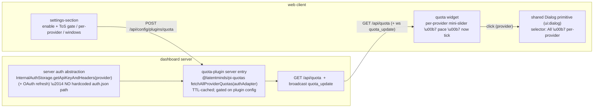

# Design — provider quota plugin (server-side)

## Shape: server fetches, client renders. No bridge.

Quota is an **account-level** fact (how much of a provider plan is left), not
per-session — so there is no reason to fetch it in the per-session bridge. The
dashboard **server** (local process) resolves credentials through its own auth
abstraction and fetches directly. This deletes the bridge, per-session
forwarding, and every server↔bridge concern.



## Key decisions

| Decision | Choice | Why |
|---|---|---|
| **Where it runs** | **server entry only** (no bridge) | quota is account-level, not per-session; the server can resolve creds + fetch directly |
| **Credential source** | **server auth abstraction** (`InternalAuthStorage` / `provider-auth-storage.ts`) \u2014 NEVER a hardcoded `~/.pi/agent/auth.json` path | that module already owns auth.json + does OAuth refresh; it's the same resolver the model-proxy uses. Alt in-session path = pi's `AuthStorage`/`CredentialStore` |
| **Dependency** | **depend on `@latentminds/pi-quotas`** (best pi quota-query core) | 8 providers, `fetchProviderQuotas`/`fetchAllProviderQuotas` \u2192 normalized `QuotaWindow[]`, TTL+dedup, spike-verified. Adapt the server auth resolver to its 2-method `AuthStorage` shape |
| **Enablement** | **plugin config** (`plugins.quota.*`), off by default, per-provider, one-time ToS ack | server-owned config is the normal, existing mechanism \u2014 no bridge gate, no server\u2192bridge push |
| **Distribution** | bundled, **disabled by default** (plugin activation UI) | server entry does nothing until enabled; no ToS-endpoint call while off |
| **Anthropic** | **excluded** | pi blocks Claude subscription inference server-side; API-key sessions return `not_applicable` |
| **Client surface** | quota widget (existing slot or a small `TokenStatsBar` segment) + `settings-section`; detail via shared `ui:dialog` | reuse the dialog primitive; placement is a thin client concern, not a data-path one |
| **Signal** | client-side **pace/burn-rate** + `now` tick; minimal `over by X%` tooltip | raw used% is not actionable |

## Credential resolution (the corrected path)

```ts
// server entry — resolve via the server's OWN abstraction, no file path:
import { InternalAuthStorage } from "../../server/src/model-proxy/internal-auth-storage.js"; // host-provided
import { readAuthJson } from "../../server/src/auth/provider-auth-storage.js";               // typed creds

// Adapt to the 2-method shape @latentminds/pi-quotas expects:
const authAdapter = {
  get: (provider: string) => readAuthJson()[provider],            // typed OAuth/api_key credential
  getApiKey: (provider: string) => internalAuth.getApiKeyAndHeaders(provider), // + refresh
};
const results = await fetchAllProviderQuotas(authAdapter); // TTL-cached in the lib
```

The plugin never opens `auth.json` itself; it asks the host abstraction. Tokens
stay server-side — only the derived `QuotaWindow[]` reaches the client.

## Data + endpoint

- `GET /api/quota` → `{ providers: [{ provider, windows[] }] }` (latest, TTL-cached).
- Optional live push: broadcast a `quota_update` browser message on refresh; the
  client can also just poll `/api/quota` on the lib's TTL cadence.
- **No persistence** to the event store; it's live provider state.

### QuotaWindow (as forwarded to the client)

```ts
{ provider: string;          // never "anthropic"
  windows: Array<{
    label: string;           // "5h" | "7d" | "Premium / month"
    usedPercent: number;     // 0..100
    resetsAt: string;        // ISO
    windowSeconds: number;   // REQUIRED for pace
    isCurrency?: boolean; usedValue?: number; limitValue?: number; // currency pace
  }> }
```

## Burn-rate / pace (client-side, safe math)

```
secondsToReset = (Date.parse(resetsAt) − now) / 1000
elapsedRaw     = (windowSeconds − secondsToReset) / windowSeconds
// Guards — return BEFORE dividing:
!Number.isFinite(windowSeconds) || windowSeconds <= 0 → pace UNAVAILABLE
!Number.isFinite(Date.parse(resetsAt))               → pace UNAVAILABLE
secondsToReset <= 0                                  → STALE (grey, no warn)
elapsedRaw <= EPS (≈0.01)                            → pace UNAVAILABLE (just reset)
projected = usedPercent / Math.min(elapsedRaw, 1)
overage   = max(0, projected − 100)
```

- Fill: `projected<100` green · `≥100` orange · `≫100` or `usedPercent≥90` red.
- `now` tick at `elapsed×100`. Tooltip: `over by {round(overage)}%` else `on pace`.
- Multi-window: the worst-severity window drives a provider's single slider.

## Enablement (plain plugin config — no bridge gate)

- `plugins.quota.enabled` (plugin activation) — off by default.
- `plugins.quota.acknowledgedToS` — one-time, hard gate.
- `plugins.quota.providers.<id>.enabled` — per authored provider, off by default.
- The server entry fetches a provider ONLY when acked AND that provider is enabled;
  none of these migrate on during upgrades. Turning off stops the fetch + clears
  its cached quota. This is ordinary server-side config — the existing mechanism.

## Dialog primitive (unchanged)

Click a slider → the shared `Dialog` primitive
(`useUiPrimitive(UI_PRIMITIVE_KEYS.dialog)`, `packages/client-utils/src/Dialog.tsx`),
centered/modal, pre-selected to that provider, with a selector (`All · per-provider`).
Only the dialog body (selector + provider cards) is ours.

## Packaging (Task 0)

`@latentminds/pi-quotas@0.4.0` exposes no `main`/`exports`. Depend on it and secure
a resolvable library entry (upstream `exports` map to `lib/quotas`+`lib/auth`+
`providers/fetch`, pinned). Server + client both consume via normal bundling; no
raw-TS-in-Vite concern for the client (client never imports the lib \u2014 it only
renders `/api/quota`).

## Terms of Service (unchanged)

Undocumented endpoints; opt-in, default-off, per-provider, ToS-ack-gated;
Anthropic excluded; personal/local use. Clauses + ban-evidence in proposal.md.

## Out of scope

Historical trends; threshold alerting/notifications; API-key spend dashboards.
