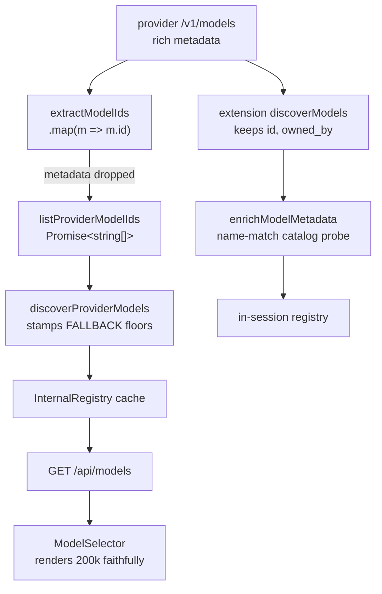

## Context

Custom-provider model metadata is discarded at ingestion. Two independent surfaces fetch a
custom provider's model list, and both reduce a metadata-rich response to ids:

- `packages/server/src/package/provider-probe.ts` — `extractModelIds` does
  `.map(m => m.id)`; `listProviderModelIds` types the loss as permanent (`Promise<string[]>`).
- `packages/extension/src/provider-register.ts` — `discoverModels` keeps `{ id, owned_by }`.

Each then stamps every discovered id with an api-typed floor (`FALLBACK` /
`FALLBACK_DEFAULTS`), which is why all models of a provider report identical capabilities.

The floors were correct when written — both files carry a comment asserting that custom
`/v1/models` endpoints do not advertise capability data. Metadata-rich proxies broke that
premise. `listProviderModelIds` was added later for registry discovery, reusing
`extractModelIds` (right helper name, wrong return type for the new job).

Live probe of the configured provider, which grounds every decision below:

```json
{ "id": "cc/claude-opus-5", "object": "model", "owned_by": "cc",
  "context_length": 1000000, "max_completion_tokens": 128000,
  "capabilities": { "vision": true, "pdf": false, "audioInput": false,
                    "videoInput": false, "imageOutput": false, "audioOutput": false,
                    "search": true, "tools": true, "reasoning": true,
                    "thinkingFormat": "claude-adaptive", "thinkingCanDisable": true,
                    "thinkingRange": null,
                    "contextWindow": 1000000, "maxOutput": 128000 } }
```

Four probe observations constrain the design:

1. The provider is configured `api: "anthropic-messages"` but returns an **OpenAI-shaped**
   `{ data: [...] }` body. Api-keyed mapping would miss it entirely.
2. Capacity is advertised **twice** (`context_length` and `capabilities.contextWindow`),
   currently equal. A precedence rule is needed before they diverge.
3. `thinkingRange: null` — thinking capability is advertised but **underdetermined**.
4. Two probes minutes apart returned **43 then 40** models; three bare-id hybrids appeared
   in one and not the other. The custom model set is dynamic.



## Goals / Non-Goals

**Goals:**

- Custom providers surface capability metadata faithfully queried from their model list:
  context window, max output tokens, reasoning, and input modality.
- Fill metadata at the earliest point — during discovery, before any cache is written — so
  no consumer ever reads a floor for a field the provider advertised.
- Per-field fallback: floors apply only where the provider was silent or malformed.
- Both discovery surfaces (server registry, in-session extension) satisfy the above.
- Built-in / hardcoded providers keep their current behaviour, bit for bit.
- Endpoint-sourced metadata is distinguishable from catalog-derived and floor values.

**Non-Goals:**

- Cache invalidation / refresh-on-open. Opening the selector already fires
  `request_models`, but that re-projects `discoveredCustomModels`, filled once by a
  fire-and-forget `discover()` at `registry-singleton.ts:108`. Observation 4 means a
  once-per-process discovery drifts regardless; this change makes values faithful *when
  read*, and freshness is a separable follow-up with its own cost (an HTTP round-trip per
  provider per popover open).
- Fixing the `anthropic-messages` double-`/v1` URL construction (see Risks).
- Writing `~/.pi/agent/models.json`. It stays read-only and top-priority.
- Cost metadata. No probed provider advertises pricing; inventing it is out of scope.
- Changing `probeProvider` / the provider settings "Test" button.

## Decisions

### D1 — Add a metadata-preserving function; leave the ids-only helpers alone

Add a new discovery function returning per-model records beside `listProviderModelIds`,
rather than widening the existing helper's return type.

*Why:* `probeProvider` (the Test button) genuinely needs only ids and a capped sample;
`string[]` is correct for it. Widening one shared helper would couple two consumers with
different needs — the original mistake. Both consumers keep the shape they actually want,
and the Test button carries zero regression risk.

*Alternative rejected:* change `listProviderModelIds` to return records and map to ids at
its two call sites. Fewer functions, but it re-creates the coupling and puts the Test
button back in the blast radius for no benefit.

### D2 — Key the mapper on response SHAPE, not the configured `api`

Detect OpenAI-ish (`body.data[]`) vs Google-ish (`body.models[]`) from the body, exactly as
`extractModelIds` already does.

*Why:* observation 1 — the working provider is configured `anthropic-messages` and returns
an OpenAI body. Api-keyed mapping would silently skip the only provider we can verify
against. Shape-keying also matches the existing precedent in the same file, so ids and
metadata can never disagree about which branch a response took.

*Alternative rejected:* key on `api` with a shape fallback. Strictly more code and the
fallback would be the only path ever exercised by the real provider.

### D3 — Per-field merge with a fixed precedence ladder

Resolve every capability field independently, first hit wins:

```text
native models.json  →  endpoint-advertised  →  catalog probe*  →  api-typed floor
                                               (*in-session surface only)
```

*Why native stays on top:* it is the user's explicit local override (constraint 4), and
silently outranking a hand-authored declaration with a proxy self-report would be a
regression of `honor-native-models-json-metadata`.

*Why endpoint beats the catalog probe:* the probe name-matches into pi's bundled catalog
and cannot resolve `cc/…`, `ag/…`, `glm/…` prefixes or hybrids like
`claude-opus-4-7-glm-5-1`. It is also not conservative — the probe would report
`ag/claude-opus-4-6-thinking` at 1M via the name-matched `claude-opus-4-6`, while the
provider advertises 200k. Only the endpoint knows what a given proxy route serves.

*Why per-field and not per-model:* observation 4 / the 3 bare-id hybrids advertise partial
metadata. A per-model "endpoint or floors" switch would throw away advertised `reasoning`
because `context_length` was missing.

### D4 — Top-level scalar wins over its `capabilities` twin

`context_length` over `capabilities.contextWindow`; `max_completion_tokens` over
`capabilities.maxOutput`.

*Why:* observation 2 — both are sent and currently agree, so the choice is free today and
becomes load-bearing the moment they diverge. Top-level fields are the OpenAI-documented
surface; `capabilities` is this proxy's extension. Picking the standard field keeps the
rule predictable across other providers. Deciding now avoids an implementation coin-flip.

### D5 — Adopt `reasoning`; synthesize `thinkingLevelMap` only when determined

Take `reasoning` from the endpoint. Leave `thinkingLevelMap` **absent** when
`thinkingFormat` is missing or `thinkingRange` is `null`.

*Why:* observation 3. `reasoning: false` is what erases thinking levels, so adopting
`reasoning: true` already restores availability — the user-visible fix — without inventing
a level table. Synthesizing a map from a null range would risk replacing "no thinking
levels" with "wrong thinking levels", a worse and much harder-to-notice failure. Absent
means downstream consumers apply their existing defaults, which is the current behaviour
for every native model that carries no map.

*Alternative rejected:* derive `{off, low, medium, high}` from `thinkingCanDisable`. Not
determined by the data; it is a guess wearing a spec's clothes.

### D6 — `metadataSource` gains `"endpoint"`

Widen `"catalog" | "fallback"` to include `"endpoint"`
(`packages/shared/src/types.ts:601`, `provider-register.ts:56`), and handle it in
`ModelSelector.tsx:109`. A mixed-tier model reports its **weakest** adopted tier.

*Why:* the selector renders `"fallback"` with deliberately uncertain capability icons.
Endpoint data is confirmed, so labelling it `"fallback"` would show confirmed values as
uncertain; labelling it `"catalog"` would erase the distinction between "pi's bundled
catalog said so" and "the provider itself said so" — which is exactly the provenance a
user debugging a proxy needs. Reporting the weakest tier keeps the uncertainty marker
honest: it never claims confirmation for a floor value.

*Cost, stated plainly:* this contradicts the first draft's claim that the shared type and
the selector were untouched. Two extra files change; the alternative is a misleading UI.

### D7 — Scope containment for built-ins

Both surfaces iterate only `providers.json#providers`. Built-in pi-ai models never enter
this code path (`registerBuiltInApiProviders` populates them separately), and the
built-in-wins collision rule in `internal-registry.ts` is not touched.

*Why:* constraint 2. The containment is structural rather than conditional — there is no
`if (isBuiltIn)` to get wrong — and it is asserted by tests rather than assumed.

## Risks / Trade-offs

- **A provider advertises implausible values (0, negative, strings, absurd numbers)** →
  per-field type + range validation; a field that is not a finite number > 0 is treated as
  not advertised and falls to the next tier. Malformed input degrades to today's
  behaviour, never to a throw.
- **A provider under-reports capacity and a user loses context window they had** →
  accepted deliberately. The endpoint is authoritative for what that route serves
  (`ag/claude-opus-4-6-thinking` really is 200k). Users who disagree have the native
  `models.json` override, which still outranks everything.
- **Trusting a third-party self-report at all** → scoped to display/sizing metadata; no
  routing, auth, or credential decision is derived from it. Nothing executes.
- **`metadataSource` widening reaches shared types + client** → additive union member;
  existing `"catalog"`/`"fallback"` branches keep their behaviour. The field is optional
  today, so consumers that ignore it are unaffected.
- **Pre-existing double-`/v1` URL** → for `anthropic-messages`, `buildProbeRequest` builds
  `${base}/v1/models` while this provider's `baseUrl` already ends in `/v1`, producing
  `…/v1/v1/models`. Verified: both that and the single-`/v1` form return HTTP 200 here
  because the proxy is lenient. New discovery reuses `buildProbeRequest` unchanged, so
  behaviour is identical to today — but a stricter provider would 404. Flagged, not fixed:
  changing it would alter Test-button behaviour for every existing
  `anthropic-messages` provider, which belongs in its own change.
- **Stale cache after the fix** → values correct on next discovery (process start /
  provider CRUD), not on selector open. Called out in Non-Goals so it is not mistaken for
  a defect of this change.

## Migration Plan

No data migration; no persisted format changes. `providers.json` and `models.json` are read
with the same readers. Rollback is a revert — floors return, and no state written under the
new code needs undoing (nothing is written).

Deploy order follows the repo's rebuild matrix: `packages/shared` + `packages/server`
changes need `/api/restart`; `packages/extension` needs `npm run reload`;
`packages/client` needs `npm run build` + restart. All three land together.

## Open Questions

- Should a synthesized `thinkingLevelMap` ever be produced for a `thinkingRange` that IS
  determined (a concrete numeric range)? D5 leaves it absent for the observed `null` case;
  no probed model exercises a non-null range, so the mapping is intentionally unspecified
  until one does.
- Should `capabilities.tools` be surfaced? It is read per the spec but has no field in the
  current model shape. Deferred — no consumer exists.
- Is `owned_by` worth retaining as provenance for grouping in the selector? Currently
  dropped; not required by any constraint.
