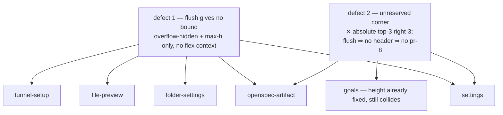

## Why

`add-route-backed-overlay-dialogs` moved six full-page surfaces into
`Dialog size="full" flush`. The routing contract it set out to build works —
its 10 e2e tests all pass. The *layout* contract it silently depended on does
not hold at a single one of those call sites.

Measured live against the production bundle at 1440×900:

| Surface | content clipped off | working scrollers | ✕ collides with |
|---|---|---|---|
| `/folder/<cwd>/view?path=README.md` | **18354 px** | 0 | — |
| `/folder/<cwd>/settings` | **11683 px** | 0 | — |
| `/folder/<cwd>/openspec/<change>/proposal` | **2134 px** | 0 | an `<input>` @1243,46 |
| `/settings/general` | 537 px | 0 | `Restart` @1293,41 |
| `/tunnel-setup` | 56 px | 0 | — |
| `/folder/<cwd>/automations` *(plugin)* | 2 px | n/a | — |
| `/folder/<cwd>/goals` *(plugin)* | 2 px | n/a | **`New Goal` @1307,45** |

Five of five non-plugin surfaces clip their content with **zero scrollable
elements anywhere inside the dialog**. The file preview is the extreme case:
it renders a title, a hero image, and then silently stops — 18 353 px of README
is unreachable by any gesture. There is no scrollbar, no affordance, and no
indication the document continues.

The two plugin routes scroll correctly. They are the only ones sitting behind
an `h-[92vh]` wrapper. That is a clean controlled comparison: **the known fix
works and was applied at exactly one of six call sites.**

### Two defects, not one

`goals` scrolls correctly *and still* has the ✕ painted on its `New Goal`
button. The height problem and the corner problem are independent:

`automations` escapes defect 2 only by luck: it has nothing in that corner
today. Any surface that later adds a top-right action inherits the bug.

### The API is the defect

The spec for `flush` says the child "renders its own header + scrollable body"
and "manages its own scroll". No child can satisfy that: the panel is not a
flex container and carries only `max-h`, so a child's `h-full` resolves against
an indefinite height, falls back to `auto`, and grows to content. The child's
own `overflow-y-auto` is never bounded, so it never becomes a scroller.

The tree already contains **five independent local workarounds** for these two
defects, with constants that have already drifted:

| Workaround | Location | For |
|---|---|---|
| `h-[92vh] flex flex-col min-h-0` | `App.tsx` plugin slot | defect 1 |
| `h-[85vh] flex flex-col` | `OpenSpecArtifactDialog.tsx` | defect 1 |
| `h-[70vh] overflow-hidden flex flex-col` | `AgentToolRenderer.tsx:238` | defect 1 |
| `h-[70vh] overflow-hidden flex flex-col` | `FlowAgentCard.tsx:384` | defect 1 |
| `closeInset` → `pr-12` | `MarkdownPreviewView.tsx` | defect 2 |

All four height wrappers carry comments diagnosing the trap correctly and
fixing it locally. None generalised. `70vh` ×2 / `85vh` / `92vh` against caps
of `80vh` (lg) and `92vh` (full) is the drift those comments were powerless to
prevent — two sites even reached the same constant independently, for the same
child (`MinimalChatView`), without either knowing of the other.

The root cause is one line in a shared component. `MinimalChatView` documents
its popout mode as "fills parent (`h-full`)" — the same `h-full`-against-an-
indefinite-parent assumption every broken surface makes. It is not a mistake
repeated five times; it is one reasonable assumption that `flush` invalidates
without saying so.

The `closeInset` prop is the sharpest evidence. `MarkdownPreviewView` collides
with the ✕ on the **route** path and not on the **ephemeral dialog** path —
same component, same content, different outcome — purely because one call site
remembered to pass `closeInset` and the other did not.

Counted precisely: **four** call sites pass `flush`. Three of them
(`OpenSpecArtifactDialog`, `AgentToolRenderer`, `FlowAgentCard`) independently
discovered the unstated precondition and each wrote its own private constant to
satisfy it. The fourth, `RouteBackedOverlay`, did not — and it is the one
multiplexing six surfaces.

When an API is usable only via a ritual that three of four authors had to
reinvent, and the fourth could not have known to, the API is what needs to
change.

### Why the suite stayed green

`tests/e2e/route-backed-overlay.spec.ts` has 10 tests. All 10 assert **routing
semantics** — which overlay mounts, dismissal, frozen underlay, inertness,
in-place navigation. None asserts anything about the rendered box.

The three `components/overlay/__tests__/` suites run in jsdom, which has no
layout engine and *structurally cannot* observe this class of defect.

The one time it was caught — the KB folder slot — it was caught by accident:
`expect(kb-settings-page).toBeVisible()` fails on a **zero-height** element and
passes happily on an 828 px element with 537 px clipped away. The existing test
vocabulary detects total collapse and is blind to partial clipping. KB
collapsed to zero; the other five merely clip. Same root cause, one tripwire.

## What Changes

- `Dialog` makes `flush` establish a **flex column context** (`flex flex-col`
  with `min-h-0`) instead of a bare `overflow-hidden` box. Short content still
  shrinks to fit; tall content is bounded by the existing `max-h` and a child's
  `flex-1 min-h-0 overflow-y-auto` becomes a real scroller.
- `Dialog` **suppresses its own ✕ when `flush` is set**, because a flush child
  is by definition self-framed and already ships its own back affordance. An
  opt-in prop restores it for a flush child that has no header of its own.
- The **three** children that actually carry `h-full` (`SettingsPanel`,
  `DirectorySettings`, `ZrokInstallGuide`) adopt `flex-1 min-h-0` so they size
  against the new flex context. `MarkdownPreviewView` and `PreviewOverlayView`
  already conform and are fixed by the primitive alone.
- `OpenSpecArtifactDialog` gains its own back affordance, so ✕ suppression is
  uniform across all **nine** flush surfaces (six `RouteBackedOverlay` routes
  plus `OpenSpecArtifactDialog`, `AgentToolRenderer` and `FlowAgentCard`).
- The workarounds this change genuinely orphans (`h-[85vh]`, `closeInset`) are
  removed. The definite-height pins (`h-[92vh]`, `h-[70vh]`×2) STAY — they
  solve a problem the container cannot solve for them.
- A generalised browser-level layout gate runs against **every** overlay route.
- `dialog-system` spec is amended to state the primitive's real close
  behaviour, which it currently omits entirely.

### Why flex context and not a definite height

The obvious fix — give `flush` a definite height per size variant — forces a
height the container cannot know is right. `AgentToolRenderer` renders
`size="lg" flush` and deliberately pins its own child at `h-[70vh]`, inside a
cap of `80vh`. A primitive that imposed `80vh` would override that intent, and
would impose the same on every future `lg` flush consumer.

A `max-h`-constrained flex column imposes nothing. Content shorter than the cap
leaves the panel shrink-to-fit; content taller clamps at the cap and the
`flex-1 min-h-0` child receives a bounded height without any element needing a
definite one. It fixes all six broken surfaces, keeps height a consumer
decision where a consumer has one, and preserves every current short-content
behaviour.

It does **not** help a child whose content is absolutely positioned and so has
zero intrinsic height — the plugin-slot case. Those consumers keep their
explicit height pin; see design D5.

### Why removing the ✕ is safe

Removing a dismissal gesture would be alarming if it were load-bearing for the
unsaved-edits guard. It is not. `SettingsPanel` and `InstructionsPage` route
their own back arrows through the same dirty prompt (`requestBack`), and the
overlay dismiss guard still covers backdrop and Escape. Dropping the ✕ removes
a *duplicate* affordance that visually collides with the child's real one; it
does not remove the only way out, and it does not weaken the guard.

**One consumer is not a duplicate case.** `OpenSpecArtifactDialog` is a seventh
`flush` consumer — an ephemeral dialog, not a route — and its comment states
outright: *"No back button: the host Dialog supplies the standard close."*
Suppressing the ✕ there removes its ONLY visible dismissal. It therefore gains
a back arrow of its own (like the six routes), after which suppression is
uniform and `closeInset` — the hand-rolled corner reservation that exists only
to stop the ✕ colliding with its search box — is deleted outright.

## Capabilities

### Modified Capabilities

- **`dialog-system`** — `flush` gains a layout contract (flex column, bounded
  child) and a close-affordance contract (no ✕ when flush, opt-in to restore).
  The always-on ✕ is written down for the first time.
- **`dialog-primitive`** — the same two requirements, because this capability
  independently specifies the same primitive (its `Flush Body Mode` and
  `Dismissal` requirements both describe behaviour this change alters). Both
  specs must move together or one is left asserting something false.
- **`shell-overlay-route`** — every route-backed overlay must present its
  content as reachable: bounded and scrollable, with no interactive element
  intersecting the close control.

### Adjudicated and dropped

- **Copy the `h-[92vh]` wrapper to the remaining call sites.** Rejected:
  leaves defect 2 untouched on three surfaces and re-encodes the magic number
  at more sites, which is the drift that produced `85` vs `92` already.
- **Delete the `h-[92vh]` plugin-slot wrapper as an orphan.** Rejected on
  review: it is NOT a duplicated flex context but a genuine definite-height
  pin. Plugin claim bodies render `absolute inset-0` (`slot-consumers.tsx`),
  contribute zero intrinsic height, and collapse the panel to 0 under a
  height-indefinite parent — the exact failure its own comment records
  ("the KB page disappears entirely. Caught by kb-folder-slot.spec.ts").
  It belongs with `h-[70vh]` in the keep-list, not the delete-list.
- **Definite height per size variant.** Rejected: regresses
  `AgentToolRenderer`'s `size="lg" flush` dialog into an always-80vh box.
- **Promote `closeInset` into the primitive.** Rejected in favour of
  suppression: reserving the corner keeps two competing dismissal affordances
  in one header, which is the underlying UX smell rather than the fix.

## Impact

- `packages/client-utils/src/Dialog.tsx` — `flush` layout + close suppression;
  new opt-in prop. Shared primitive, so every dialog consumer is in blast
  radius; the flex change is behaviour-preserving for non-flush.
- `packages/client/src/components/overlay/RouteBackedOverlay.tsx` — unchanged
  in contract, but is the path through which all six surfaces inherit the fix.
- `packages/shared/src/dashboard-plugin/ui-primitives.ts` — `UiDialogProps`
  gains `showClose`; the `flush` doc comment gains the layout contract. PUBLIC
  plugin API.
- `packages/client/src/App.tsx` — comment-only. The `h-[92vh]` plugin-slot
  wrapper STAYS (see Adjudicated and dropped); its comment gains the reason D1
  does not make it redundant. No behavioural edit.
- `packages/client/src/components/openspec/OpenSpecArtifactDialog.tsx` — remove
  the `h-[85vh]` wrapper; pass `onBack` so the child owns dismissal; drop the
  `closeInset` passes.
- `packages/client/src/components/preview/MarkdownPreviewView.tsx` — remove the
  `closeInset` prop (its only reason to exist was the ✕ collision). Root is
  ALREADY `flex-1 flex flex-col min-h-0` — no layout edit needed.
- `packages/client/src/components/preview/PreviewOverlayView.tsx` — **no edit.**
  Root is already `flex-1 flex flex-col min-h-0`; it is fixed by D1 alone.
- `SettingsPanel.tsx`, `DirectorySettings.tsx` — root `h-full` → `min-h-0`
  (both already carry `flex-1`).
- `ZrokInstallGuide.tsx` — root is `flex flex-col h-full` with NO `flex-1`;
  becomes `flex-1 flex flex-col min-h-0`. An addition, not a swap.
- `MobileShell.tsx` consumers — `SettingsPanel` and `ZrokInstallGuide` also
  mount directly in the mobile detail panel. Not edited, but in blast radius:
  their root class is shared across both shells.
- `packages/client/src/components/tool-renderers/AgentToolRenderer.tsx` — the
  `size="lg" flush` consumer; must be verified unchanged at short content.
- `tests/e2e/` — new generalised overlay layout gate.
- Desktop only. The mobile shell renders these surfaces as full pages
  (`useMobile` fires under 768 px wide **or** 600 px tall) and is unaffected.

### Verification note

This defect class is invisible to the existing tooling: jsdom has no layout
engine, and `toBeVisible()` passes on clipped-but-nonzero elements. The gate
must therefore assert, per overlay route, in a real browser:

- `scrollHeight <= clientHeight + ε` **or** a descendant with a working
  `overflow-y` scroller exists, and
- no interactive element's box intersects the close control's box.

Both assertions were prototyped during investigation and reproduce all seven
rows of the table above, including the two passing plugin controls.

## Discipline Skills

- **`review-code`** — a shared primitive with every dialog in its blast radius;
  the diff wants a critical pass before it stands.
- **`doubt-driven-review`** — the flex-context change alters a component used
  by every dialog in the app. The claim "behaviour-preserving for non-flush,
  shrink-to-fit preserved for short flush content" is exactly the kind of
  assertion that should be stress-tested before it lands rather than after.
- **`scenario-design`** — the failure was a test-coverage gap, not a coding
  mistake. The gate has to be derived from scenarios (short content, exactly-at
  cap, far over cap, corner occupied, corner empty) rather than written to
  match the five known-bad routes.
