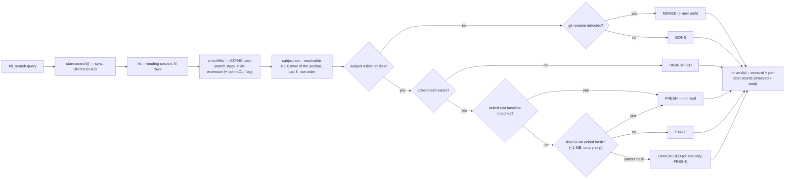

# Design

## Arm A — trust verdicts

### What is being verified

A hit is a markdown heading **section**, not a row. The chunker splits by
heading and paragraph, never by table row, so a `doc_type: agents` hit is
typically the entire `# DOX — <dir>` section — up to `ROW_CAP` (40) rows. The
decaying assertion is the **subject set**: the source files the rows in that
section describe, not one file.

Existence is checked FIRST: an absent subject is `GONE` (or `MOVED`) whether
or not it was ever acknowledged — `UNVERIFIED` means "exists, unproven", never
"missing, unrecorded". Rename detection is batched: one `git diff
--name-status -M` per repository per enrichment, not one subprocess per
subject.

### D1 — Verdicts label, never reorder

Heimdall sorts by daemon score and lets the verdict break ties only, with the
recorded reason that verdict-led ordering buried true hits under lexically
overlapping junk. Adopted verbatim as a constraint: with verdicts enabled, the
returned order SHALL be byte-identical to verdicts disabled. This is a testable
property, not a convention.

Corollary: my earlier instinct to *demote* `GONE` hits is rejected. A `GONE` row
still names the symbol the agent asked about and is the best available pointer;
the label is what makes it safe.

### D2 — Hash is truth; the stat baseline must be persisted first

The indexer's mtime→sha256 gate covers only files the indexer walks — markdown.
Subject source files are never indexed, so **no stat baseline for subjects
exists today**; the staleness sidecar stores sha256 only (`Record<string,
string>`). Correction over the first draft: acknowledgement (sidecar v2) SHALL
persist `{sha256, size, mtimeMs}` per documented file. At query time a matching
stat baseline skips the read; a missing or mismatched baseline falls back to
hashing; no baseline at all means the hash runs (capped, D13). The stat is an
optimization, never the verdict — mtime is unreliable across git checkouts, so
only the hash decides FRESH vs STALE (sole exception: where hashing is
impossible, D13's stat-only `FRESH`).

### D3 — `MOVED` uses git, not a basename search

Heimdall's `kb-rehome.sh` runs `find -name <basename>` over hardcoded roots
(`$HOME/Desktop`, `$HOME/projects`, …), accepts only an exactly-one-hit result,
and otherwise reports `AMBIGUOUS`. In a git repo that is strictly worse than
asking git. Rename detection is authoritative, bounded, and has no ambiguity
branch to hand-tune. Stated limitation: non-git sources, and renames git cannot
see (unstaged delete + untracked successor), degrade to `GONE` — accepted,
because a wrong `GONE` is recoverable by reading and a guessed path is not.

### D4 — Search is read-only

Heimdall's verify path **deletes** stale nodes and rewrites rehomed ones mid-
query (`handle_stale` → `graft delete`, `kb-rehome.sh` → delete + reinsert),
logging to a recovery file first. Rejected. A query that mutates the index is
unpredictable under concurrent sessions, and our equivalent repair already has a
home: `kb dox lint` / `dox triage`. Verdicts *report*; repair stays a separate,
explicit action.

### D5 — Content coverage is a separate, default-off field

Heimdall folds "does the file's content answer the query" into `STRONG` at an
uncalibrated 0.5 threshold. Split here: the freshness labels are facts (cheap,
deterministic, always on); content coverage is a confidence heuristic (reads
the subject file, needs a threshold) shipped default-OFF until the bundled
golden sets say it earns its latency — the same discipline that left
`coverageRerank` and `prf` default-off.

Bound: cap the subject read at 256 KB and skip binaries, as Heimdall does.

### D10 — The verdict stage lives outside the store

`SqliteFtsStore.search()` is synchronous, its constructor takes only a
`dbPath`, and source roots live in config — the store cannot resolve row
paths, read the staleness sidecar, or run git. Wiring FS/git I/O into it
would also silently change behavior for every other caller (CLI search,
kb-plugin server, dox internals). The verdict stage is therefore a
**post-search async enricher** (`enrichHits(hits, ctx)`) owned by
kb-extension, with an opt-in CLI flag — the shape Heimdall itself uses
(`kb_search_verify.py` post-processes retrieve output; it does not live
inside the daemon). The store stays untouched. The enricher resolves rows
with the running session's cwd — the same input lint and reindex use, so
lint and query time agree by construction at the same cwd.

### D11 — Subjects are a set, aggregated per hit

A hit's subject set is the resolvable DOX rows of its section, in row order,
capped at 8 per hit. The hit's verdict is the **worst-of** the per-subject
labels (`GONE` > `MOVED` > `STALE` > `UNVERIFIED` > `FRESH`) plus per-label
counts over the checked set, so a page renders "STALE (2 of 8 subjects
checked)" rather than pretending a 40-row section has one subject.
Sidecar `<File>.AGENTS.md` records resolve as their own single-row sections.

### D12 — `UNVERIFIED` is a label, not an error

Acks are written only when an `AGENTS.md` is edited or acked via
`kb dox triage` — most rows have none, so at first deployment most hits are
`UNVERIFIED`. That is the honest state: the subject exists but no acknowledged
hash exists to compare against. Distinct from `FRESH` (unverified trust is not
trust) and from `STALE` (absence of a hash is not a change — the kb-dox-tree
delta forbids that conflation). Ack-on-edit and `kb dox lint --fix` are the
ramp out of it.

### D13 — Freshness hashing is bounded

Subjects larger than 1048576 bytes (1 MiB — exact boundary, decided at
planning), or detected as binary, are never hashed: a
whole-file sha256 over an arbitrary source file is an unbounded read inside a
query. A capped-or-binary subject with a matching stat baseline reports
stat-only `FRESH`; without a baseline it reports `UNVERIFIED`. Binary
detection is the sniff of bytes already read for hashing or coverage (NUL /
non-text within the capped read); a subject never read (stat-match short
circuit) is never sniffed. Coverage scoring keeps its own 256 KB cap and
binary skip; freshness gets 1048576 bytes because its hash must match a
whole-file acked hash and cannot be truncated.

### D14 — The env override can weaken, never strengthen

`KB_GUARD_MODE` may select `off` or `warn` only. Enabling `block` requires a
config-file edit, so a stray inherited env var in CI can never make the guard
refuse tool calls.

## Arm B — search guard

### D6 — Pure core, thin hook

`guard.ts` exports a factory with `note(toolName, input)` → `null | string |
{block, reason}`, plus `suspend`/`tickTurn`. No pi imports, so it is testable
under plain vitest — the split `reindex.ts` already uses, and the split
Heimdall's own `kb-guard-core.mjs` uses for the same reason.

### D7 — Reset semantics: only knowledge access de-escalates

Edits and writes do **not** reset the chain. The counter measures "search
actions since the last time you consulted the index", and an interleaved edit
does not mean the agent consulted anything. Reset set: `kb_search`,
`kb_neighbors`, `kb_get`. Resets are clean-slate (chain *and* firings), so a
stale bad stretch cannot prime a later escalation.

### D8 — Bash is segment-parsed, and blocking is never default

Split the command on `| || && ;` and test whether any segment *leads* with a
search binary, so `cat f | grep x` counts and `npm test` never does. Known and
accepted gap (Heimdall documents the same): env prefixes (`FOO=1 rg`) and
wrappers (`timeout 60 rg`) evade it. This is a nudge, not a sandbox — hardening
the regex against an adversary is out of scope.

`block` mode is implemented and specified, but `warn` is the ceiling for any
default. A guard that can refuse the agent's tool call must be opted into.
Decided at planning: the shipped default is `warn`.

### D9 — The escape hatch is what makes the ladder shippable

`kb_guard_pause(turns: 1..20)` is agent self-service: no approval, no human.
`turn_start` decrements; expiry restores a clean slate. Without it, any ladder
mis-fires on legitimate bulk exploration (deep refactor, log triage, bulk
rename) and the correct agent response would be to ignore the guard — which
trains it to ignore the guard generally.

## Risks

| Risk | Mitigation |
|---|---|
| Stat + hash per subject breaks the 50 ms median budget | Verdict enrichment carries its own ADDITIVE budget (≤15 ms median at fixture scale), stat-gated by the acked baseline, subjects capped at 8/hit, hashing capped at 1 MB |
| Verdict labels get trusted as ranking | D1 no-reorder test asserts byte-identical order |
| Most hits read `UNVERIFIED` at first deployment and the feature looks empty | D12: ack-on-edit and `kb dox lint --fix` are the ramp; counts render honestly |
| Guard mis-fires and trains agents to ignore nudges | D9 pause tool; `warn` ceiling by default; clean-slate resets |
| Two arms in one change slow each other down | Tasks are ordered so arms A and B are separately landable; either can ship alone |
