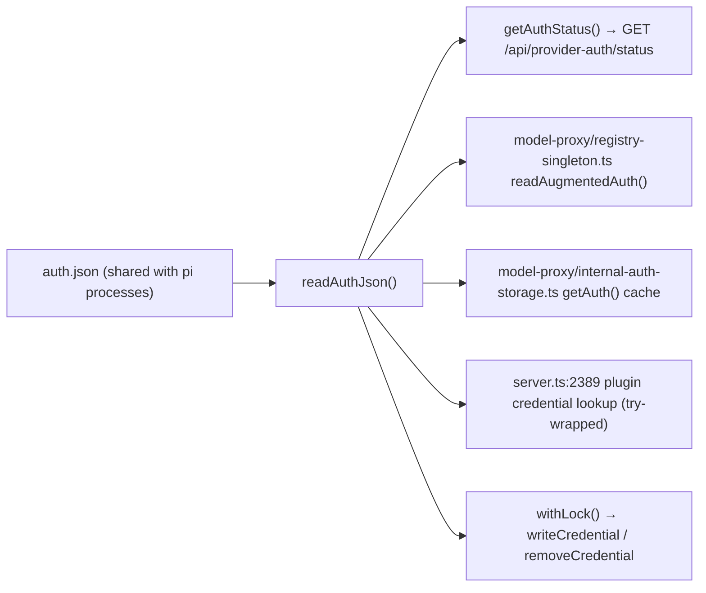

## Context

`readAuthJson()` in `packages/server/src/auth/provider-auth-storage.ts` is the single
parse site for `~/.pi/agent/auth.json`. It has four read consumers and two write
consumers, and it currently rethrows every non-`ENOENT` error:



A `SyntaxError` from a zero-byte file therefore becomes a `500` on the status
endpoint, which the unguarded `ProviderAuthSection.fetchStatus()` turns into a
`TypeError: t.filter is not a function` and an ErrorBoundary-killed Settings panel.

## Goals / Non-Goals

**Goals**
- Corrupt *content* never fails a read and never 500s the status endpoint.
- Corrupt bytes are never destroyed without a recoverable copy first.
- The Settings panel survives any status-endpoint failure, including ones this
  change does not eliminate (I/O faults).

**Non-Goals**
- Repairing or merging the corrupt content back into a valid `auth.json`.
- Cross-process coordination with pi's own writer beyond the existing lockfile.
- Changing the `auth.json` schema or the status API shape.

## Decisions

### D1 — Copy, never rename

Read paths hold no lock, and pi writes `auth.json` atomically (`tmp` + `rename`).
A `readFileSync` → `renameSync` sequence is TOCTOU: pi can replace the file between
the two calls, and the rename then moves a **valid** file to the quarantine name.
Copying is idempotent-safe in the same race — the worst case is a redundant backup
of a healthy file.

Rejected: rename (data loss under the race), in-place truncate-and-rewrite
(destroys the bytes), fixing only the write path (leaves the 500 in place).

### D2 — Split the read into a tolerant wrapper over a checked core

```ts
type CheckedRead = { data: AuthData; corrupt: boolean; quarantined: boolean };
function readAuthJsonChecked(): CheckedRead   // internal
export function readAuthJson(): AuthData      // = readAuthJsonChecked().data
```

The tolerant return type (`AuthData`) cannot express "corrupt but empty" versus
"legitimately empty" — and the write path must distinguish them to decide between
refusing and proceeding. A second function is the smallest carrier of that fact;
a module-level mutable flag would be shared state across interleaved calls.

`quarantined: true` means **a backup of these exact bytes exists on disk**, including
when this call skipped the copy on a dedup hit. Reading it as "this call copied"
deadlocks the repair flow (mount-time read backs up → every later write sees a dedup
skip → refuses forever).

### D3 — Content hash as the dedup key

`(size, mtimeMs)` collides on coarse-mtime filesystems and on same-millisecond
replacement, which would skip backing up genuinely different corrupt content — the
one case where the backup matters. A SHA-256 over the bytes cannot. The file is
credential-sized; the hash cost is irrelevant next to the `readFileSync` already done.

The dedup set is in-process and recorded **only after a successful copy**, so a
failed copy retries instead of latching the file into a permanently-refusing state.

### D4 — Refusal lives on the write path only

| | corrupt | backup exists | behaviour |
|---|---|---|---|
| read | yes | yes/no | `{}`, no throw |
| write | yes | yes | proceed on `{}` |
| write | yes | no | **throw**, persist nothing |

This is what makes contract 1 (never 500 on corrupt content) and contract 2 (never
destroy un-backed-up bytes) simultaneously satisfiable: the read tolerates, the write
refuses. Collapsing them into one rule forces a choice between a 500 and data loss.

### D5 — Backup file naming and mode

`auth.json.corrupt-<YYYYMMDDTHHMMSSsssZ>`, created `wx`, mode `0600`, with a
`-1`/`-2` suffix on `EEXIST`.

- No `:` — NTFS rejects it, and the repo ships Windows QA plus an Electron build.
- `wx` — two dashboards on one `$HOME`, or a crash-looping pi, can quarantine
  different bytes in the same millisecond; without `wx` the second copy silently
  destroys the first backup.
- `0600` — truncated credential files usually still contain intact secrets;
  `copyFileSync`'s default would leave a world-readable remnant.

### D6 — Client fails closed, with a retry budget on the poll

`fetchStatus()` gets `res.ok` + `Array.isArray` and an inline error state.
The `startAuthCode()` poll gets the same validation but a **consecutive-failure
budget**, because it currently survives transient failures via its `catch` and
dropping straight to fail-fast would newly kill in-flight logins across a server
restart. Bounded retry keeps that resilience without the silent-until-timeout
behaviour.

## Risks / Trade-offs

- **Merge loss.** After quarantine the next write produces a file with only the new
  credential. Mitigated only by the backup + log line; the bytes were unparseable,
  so no merge was ever possible.
- **Background-initiated wipe.** `InternalAuthStorage` serves `cachedAuth`
  unconditionally once populated, so an expiring OAuth token can drive
  `refreshOAuth → writeCredential` during the corrupt window with no operator
  present. The backup still protects the bytes; the timing is not controllable.
- **Shape rejection.** A future versioned-wrapper format from pi would be quarantined
  rather than read. Bytes survive; a format change needs a dashboard change anyway.
- **I/O faults still 500.** Deliberate — `EACCES` is a deployment bug, not corruption,
  and silently reporting "no credentials" would hide it. The hardened client keeps
  the panel usable regardless.

## Migration Plan

None. No schema, API, or config change. Behaviour on a healthy `auth.json` is
byte-identical; the new paths are reachable only when the file is already broken.
Existing `auth.json` files keep their permissions; only the lock helper's
placeholder create changes mode, and only when it creates the file.

## Open Questions

None outstanding — the three doubt-review cycles closed the contract ambiguities
(read/write split, dedup-hit semantics, quarantine failure handling).
