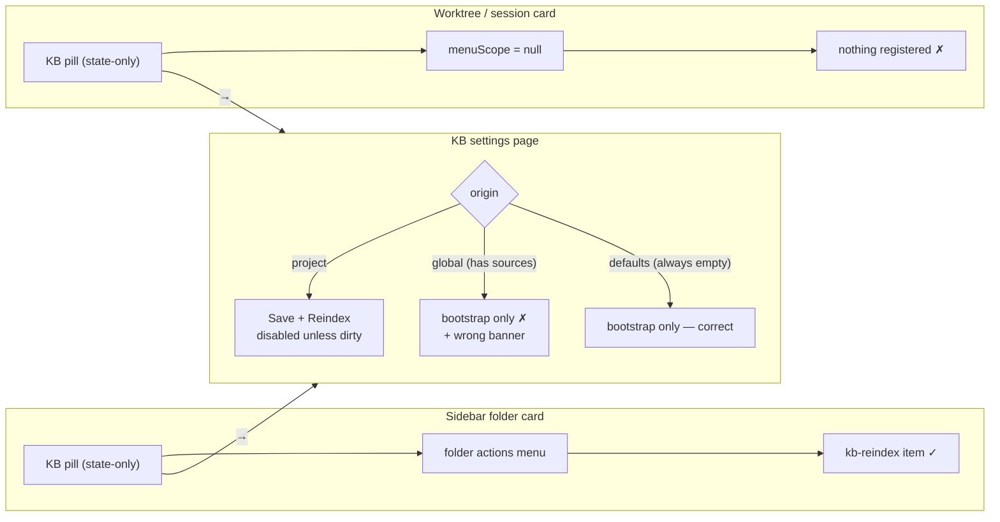

# Design — fix-kb-settings-reindex-gate

Follow-up to `openspec/changes/archive/2026-08-24-move-slot-actions-to-menu/design.md`,
specifically the "only sections in the folder placement register" rule — an unnumbered
bullet under **D-A** at `:43` (NOT D-B at `:47`, which is the unified-refresh fan-out
decision). That rule is correct and survives. This change repairs the consequence it
did not trace: the settings page it implicitly nominated as the fallback path cannot
actually trigger a reindex.

## Context

Reindex reachability today, by surface:



Both pills route to the panel. The panel is a dead end for a clean config.

## Goals / Non-Goals

**Goals**
- A user with a correct-but-stale KB config can rebuild it without editing the config.
- Every folder the server *would* actually index offers that control.
- A folder the server would index *nothing* for explains why, instead of hiding the control.
- The page stops asserting "indexes nothing" while displaying a live chunk count.

**Non-Goals**
- Restoring a one-click reindex on the worktree card (see proposal Non-Goals).
- Any change to `SlotPill`, the folder actions menu, or `directory-card-layout`.
- Any server *behaviour* change. The one shared-package edit is a type widening that
  describes a field the server already returns.

## Decisions

### D1 — Gate on the server's `resolvedSources`, not on `origin` and not on the form

Two candidate predicates were considered and both rejected before landing on this one.

**Rejected — gate on `isProject`.** The footer currently branches on
`isProject = origin === "project"` (`KbSettingsPanel.tsx:112`). That predicate answers
"is there a project config file?" but would be used to answer "can this folder be
indexed?". Those diverge for `origin === "global"`, which has real sources and no
reindex control. Smallest diff, but it preserves exactly the origin/sources conflation
that caused the bug.

**Rejected — gate on the form's `edit.sources.length`.** This was the first draft, and
it is wrong in *both* directions because the action and the gate would read different
state. `POST /api/kb/reindex` → `reindexAll` iterates `cfg.resolvedSources` loaded from
**disk** (`packages/kb-plugin/src/server/kb-routes.ts:151`):

- **False-enable.** Fresh worktree, `resolvedSources` empty, user types a source into
  the form (dirty, unsaved) → button enabled → job walks nothing → completes as a
  silent no-op the user reads as success. This re-creates the "perpetual no-op"
  `FolderKbSection`'s header comment warns about, inside the change meant to fix it.
- **False-disable.** Legacy `roots[]` folders (`config.ts:222` folds `roots[]` into
  `allSourceSpecs`) never appear in the panel's `edit.sources`, which is seeded from
  `merged.sources` only. The button would read "define sources first" for a folder the
  server indexes happily.
- **Kind mismatch.** `resolvedSources` is filesystem-only (`config.ts:225-226` filters
  `(s.kind ?? "filesystem") === "filesystem"`). A config whose `sources` are all
  `npm`/`git`/`https` has a non-empty `edit.sources` and an empty `resolvedSources` —
  enabled button, zero work.

**Chosen — gate on `resolvedSources.length > 0`.** This is the only predicate that
matches what the action does, so gate, action and spec all describe the same thing.
It also makes D2 self-consistent: the action rebuilds from disk, so the gate reads
from disk.

`resolvedSources` is already on the wire — `GET /api/kb/config` returns
`loadConfig(cwd)` (a `ResolvedConfig`, `packages/kb/src/config.ts:94-101`) cast
`as KbConfig` at `kb-routes.ts:271`. The client simply does not declare it. The change
retypes `KbConfigResponse.config` as `ResolvedConfig` in
`packages/kb-plugin/src/shared/kb-plugin-types.ts` to describe what is already sent.
**No server behaviour changes.**

**Retype, do not hand-declare the field.** The engine exports *two different*
`ResolvedSource` interfaces: `sources.ts:19` (`id, dir, priority, identity, revision?`)
is the one re-exported publicly at `index.ts:29`, while `cfg.resolvedSources` is
typed with the narrower `config.ts:89` (`id, dir, priority`) which is NOT exported.
Hand-writing `resolvedSources: ResolvedSource[]` would reach for the public name and
declare `identity`/`revision` that are not on the wire — replacing the existing lie
with a subtler one. `ResolvedConfig` (exported at `index.ts:26`) already composes the
correct narrow type, so retyping the response field is both smaller and truthful.

| origin | resolvedSources | before | after (subject to the busy/saving carve-out in D2) |
|---|---|---|---|
| `project` | non-empty | `Save + Reindex`, disabled unless dirty | + `Reindex now`, enabled |
| `project` | empty | same | + `Reindex now`, disabled + reason |
| `global` | non-empty | no reindex control at all | + `Reindex now`, enabled |
| `defaults` | always empty (see below) | bootstrap only | + `Reindex now`, disabled + reason |

**`origin === "defaults"` cannot have sources.** It means neither a project nor a
global file exists (`config.ts:218`), so the only merge layer is `DEFAULTS`, whose
`sources` is `[]` (`config.ts:104`). Any test asserting "defaults + non-empty sources" would be
asserting a state the server cannot produce and could only pass against a mock that
lies. `global` is the sole origin this defect strands.

**Rejected — hide when there is nothing to index.** Reproduces the original defect in
a new place: an invisible control is indistinguishable from a missing feature.
Disabled-with-a-reason is diagnosable; absent is not.

**The reason is VISIBLE inline text beside the disabled action, not a `title`
tooltip.** Resolved at the scenario-design gate (C1). A `title` on a disabled button
is the weakest option available: browsers suppress pointer events on disabled
controls so the tooltip is unreliable, screen readers treat it inconsistently, and an
assertion on an invisible attribute does not prove a user can read the reason. Inline
text is directly observable in both a unit render and a browser test, which is what
makes the "refused with a reason" scenario a real Triple rather than an attribute
check.

### D2 — `Reindex now` complements `Save + Reindex`; it does not replace it

Disabled condition is `saving || busy || resolvedSources.length === 0`, where
`busy = pending || stats?.indexing === true`. Deliberately **not** `!dirty`.

The two controls partition the form-state space:

- **dirty** → `Save + Reindex` persists then rebuilds. `Reindex now` stays enabled and
  rebuilds the config **on disk** — truthful, since that is what the server reads.
  Disabling it while dirty would re-introduce a state with no enabled rebuild path the
  moment a user types a character and reconsiders.
- **clean** → `Save + Reindex` is meaningless (nothing to save) and correctly stays
  disabled; `Reindex now` is the correct action.

The labels carry the distinction: `Save + Reindex` is apply-then-rebuild,
`Reindex now` is rebuild-what-is-saved. Because D1 gates on disk state, an enabled
`Reindex now` in a dirty form always rebuilds a config whose source *specs* resolve —
which is strictly better than gating on the form, though it is **not** a guarantee of
non-zero work: a `ref` pointing at a deleted or renamed directory still walks zero
files. `resolvedSources` proves the spec resolves, not that the path exists. Closing
that last gap would require the server to stat each dir, which is a behaviour change
and out of scope.

### D3 — Reuse the already-mounted `useKbStats`; the panel supplies the disabled wiring

`KbSettingsPanel.tsx:102` already calls `useKbStats(cwd)` and destructures only
`{ stats, refetch: refetchStats }`. The hook already returns
`{ stats, loading, error, reindexError, pending, reindex, refetch }`
(`useKbStats.ts:165`).

**The panel must rename the poll-outage channel.** `KbSettingsPanel.tsx:101` already
binds `error` from `useKbConfig`; destructuring `error` from `useKbStats` in the same
scope is a block-scoped redeclaration and does not compile. Bind it as `statsError`.

| capability | source | shipped by |
|---|---|---|
| optimistic `pending` set on click | `useKbStats.ts:146` | `add-kb-index-optimistic-pending` |
| `REINDEX_GUARD_MS` = 4000 wedge guard | `useKbStats.ts:27` | `add-kb-index-optimistic-pending` |
| `MAX_POLL_MISSES` = 3 blip tolerance | `useKbStats.ts:21` | `fix-kb-index-feedback` |
| `reindexError` (trigger reject) vs `error` (poll outage) | `useKbStats.ts:32-35` | `fix-kb-index-feedback` |
| reset on unmount / cwd change | `useKbStats.ts:76` | `add-kb-index-optimistic-pending` |

**Correction to an earlier draft: the double-submit guard is NOT inside the hook.**
`reindex()` (`useKbStats.ts:141-161`) has no `if (pending) return` — two synchronous
calls fire two POSTs. The guard is consumer-side: `FolderKbSection.tsx:68` derives
`busy = pending || stats?.indexing === true` and passes `disabled: busy`. The panel
must therefore build that wiring itself; it does not inherit it. What the panel *does*
inherit for free is the pending/guard/blip **state machine** the wiring reads.

The residual one-render window (two synchronous activations before React applies
`disabled`) is inherited unchanged from the shipped slot behaviour. It is not a
regression introduced here, and the server coalesces via `registry.isRunning`, so the
worst case is a redundant POST rather than a double walk.

Introducing a second, panel-local reindex path would fork that hardened state machine
and is rejected.

`doSave(true)` keeps its existing `setTimeout(() => refetchStats(), 300)` hand-off
(`:157`) — it goes through the config `PUT`, not through `reindex()`, and is
unchanged.

**Both error channels are wired, into the existing single region.** The panel already
renders one error area at `:328` (`data-testid="kb-settings-error"`) as
`bootstrapErr ?? error`. This change takes it to four channels; the precedence is
fixed (resolved at the scenario-design gate, C2):

```
bootstrapErr  ??  reindexError  ??  error  ??  statsError
└─ user-initiated failures first ─┘     └─ passive/background last ─┘
```

The ordering principle: a failure the user just caused by clicking something outranks
a failure that happened on its own. `bootstrapErr` (Create-config / Copy-from-parent)
and `reindexError` (the rebuild trigger) are both direct consequences of a click;
the config-load `error` and the stats-poll `statsError` are ambient. Surfacing an
ambient poll outage over the reason the user's click just failed would bury the
actionable message under the incidental one.

A single region with a defined precedence is preferred over a second error area: two
simultaneously-visible error strings in one small panel is worse UX than one correct
string, and the precedence makes the observable deterministic for a test.

**Known transient gap, accepted.** When the `REINDEX_GUARD_MS` timer fires it clears
`pending` and refetches; the effect body resets `error` and the miss counter before
the next poll can re-fail. That leaves a bounded window (~2 poll intervals) in which
the action is enabled with no explanation. Closing it needs either a change to
`useKbStats` — which would alter the shipped slot's behaviour too, outside this
change's scope — or panel-local latching that duplicates hook state, which D3 rejects
on principle. The spec scenario is therefore written against the settled observable,
not the transient one.

### D4 — Correct both false notices, do not just add a button beside them

`KbSettingsPanel.tsx:212` renders *"No project config — this folder indexes nothing
until you define sources."* for every `!isProject` origin. For `global` with real
sources that is false, and the same page already shows a live chunk count from
`countLabel`. Adding an enabled `Reindex now` next to it would produce a page making
three mutually contradictory statements.

The banner's condition becomes "no project config **and** nothing resolvable to
index", so it says a true thing in every state. This is the same predicate as D1's
gate, which keeps the page internally consistent by construction rather than by
coincidence.

The same defect exists a second time at `:221`, which renders *"(no sources — nothing
will be indexed)"* keyed on `edit.sources.length === 0`. For a legacy `roots[]` folder
that list is empty while the server indexes happily — D1's false-disable case seen
from the other side. The list is genuinely empty, so the notice may still say so; what
it may not do is predict the indexing outcome.

Resolved at the scenario-design gate (C3): the notice becomes **two variants keyed on
the same `resolvedSources` predicate as D1's gate**, rather than dropping the
prediction everywhere:

| `edit.sources` | `resolvedSources` | notice |
|---|---|---|
| empty | non-empty | *"(no sources defined)"* — states the list fact, predicts nothing |
| empty | empty | *"(no sources — nothing will be indexed)"* — unchanged, and true |
| non-empty | any | no notice (unchanged) |

Keeping the strong wording in the genuinely-empty case matters: that is the state
where the user most needs to be told indexing will do nothing, and flattening both
cases to "(no sources defined)" would drop a true, useful warning to fix a false one.

Fixing only `:212` would leave the requirement sentence "the page SHALL NOT predict
that a folder indexes nothing while that folder has resolvable sources" violated by
the very change that introduces it.

### D5 — This does not touch the retired pill clause

`move-slot-actions-to-menu` retired the *"each slot section SHALL keep its own …
secondary actions (refresh, create)"* clause of `directory-card-layout`, and asserts
tier 3 is state-only via archived tests `E1`/`E2`
(`packages/kb-plugin/src/client/__tests__/FolderKbSection.test.tsx:108`) and `F4`
(`:122`).

`KbSettingsPanel` renders on the `shell-overlay-route` `/folder/:encodedCwd/kb`. It is
not a pill, not inside the pill grid, and not a slot section. Those archived tests
render `FolderKbSection` in isolation, so a panel-only change cannot reach them. They
must stay green **untouched** — that is the objective evidence this change is
orthogonal to `move-slot-actions-to-menu` rather than a partial revert of it.

The glyph audit from that change still applies within the panel: `mdiRefresh` is
already used by `kb-save-reindex` (`:291`). Reusing it on a second button in the same
footer would give one glyph two meanings in one visual region. `Reindex now` therefore
takes `mdiDatabaseRefreshOutline` — the same glyph the folder menu item uses for the
same verb (`FolderKbSection.tsx:97`), making the two surfaces read as one action.

## Risks / Trade-offs

- **[Two rebuild-ish buttons in one footer could confuse]** → Mitigated by D2's
  partition and distinct labels. Accepted.
- **[Gating on disk state means the button ignores unsaved edits]** → Deliberate and
  now consistent (D1/D2). The label says `Reindex now`, not `Apply`. `Save + Reindex`
  is the apply-then-rebuild path and is enabled in exactly that state.
- **[A disabled button with a nothing-to-index reason is still a dead end for that
  folder]** → Correct, and the remedy is in the same footer: `Create project config` /
  `Copy from parent repo`. The disabled control points at them rather than pretending
  to work.
- **[`resolvedSources` is filesystem-only, so a remote-source-only config reads as
  "nothing to index"]** → Truthful for the synchronous reindex path this button
  triggers, which walks exactly that list. If remote sources later become
  reindexable from the UI, the gate follows `resolvedSources` automatically.
- **[Retyping the client response could drift from the server's cast]** → The server
  already returns `ResolvedConfig`; the retype removes an existing lie rather than
  adding a new coupling. A `ResolvedConfig` field rename would now break the client at
  compile time, which is the desired direction.
- **[The gate is a mount-time snapshot, not a live read]** → `useKbConfig` fetches on
  mount and refreshes from the `PUT` response on save; it does not poll. If another
  session rewrites the config on disk between snapshot and click, the button can be
  enabled for a job that now walks nothing. The window requires concurrent external
  mutation of the same folder's config, the failure is a no-op rather than corruption,
  and polling the config route to close it would add load for a rare race. Accepted
  and documented rather than fixed.
- **[Existing tests mock `GET /api/kb/config` without `resolvedSources`]** →
  `KbSettings.test.tsx:92`/`:99` passes today only because the omission reads as
  empty. Making the mocks faithful is part of this change's test work, not an
  incidental fixture edit — an unfaithful mock is exactly the "lying mock" D1 rejects.
- **[Reviewer may read this as re-adding a moved action]** → Addressed by D5 and the
  proposal's Non-Goals; archived `E1`/`E2`/`F4` staying green untouched is the
  evidence.

## Open Questions

None. D1 was re-decided during doubt-review cycle 1 — the initial `edit.sources` gate
was rejected in favour of `resolvedSources` after the false-enable / false-disable
cases above were surfaced. D4's scope expansion was confirmed with the user.
