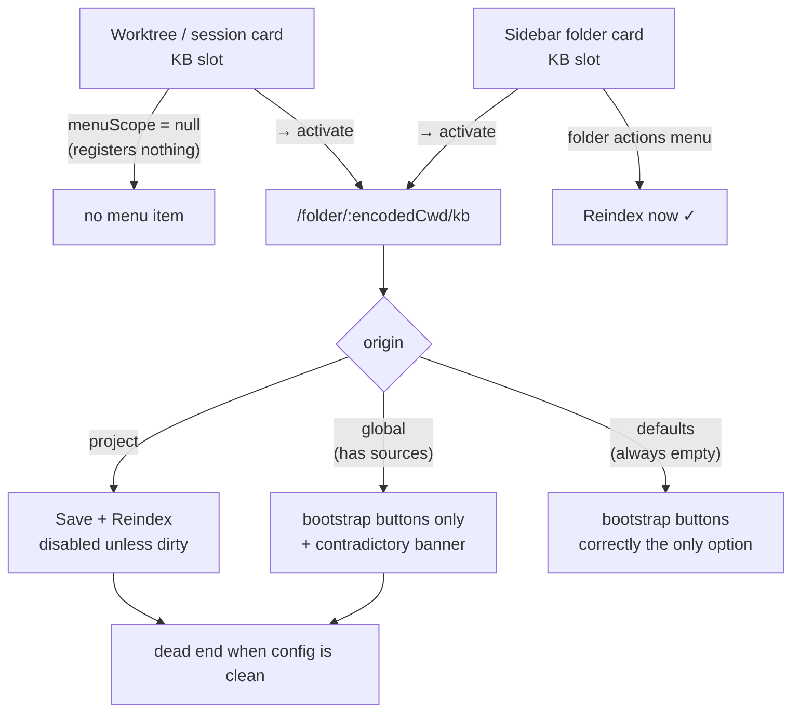

# Ungate reindex in the KB settings page — restore a reachable rebuild path

> A folder whose KB config is already correct cannot be reindexed from the
> settings page. The only enabled rebuild control is `Save + Reindex`, and it is
> disabled unless the form is dirty.

## Why

`move-slot-actions-to-menu` (archived `2026-08-24`, commit `680846f0b`) folded the
KB pill's three state-variant controls — `folder-kb-reindex` / `folder-kb-index-now`
/ `folder-kb-retry` — into one folder-actions-menu item. Its `design.md:43` correctly
observed that the worktree-card placement has no folder actions menu and therefore
must register nothing:

> A worktree card has no folder actions menu, so a card-placement section SHALL NOT
> register — otherwise its items land in a scope with nothing to render them.

`packages/kb-plugin/src/client/FolderKbSection.tsx:89` implements exactly that
(`const menuScope = placement === "card" ? null : cwd;`), and test `F4` locks it.

The reasoning is sound. The gap it leaves was never followed up: **the settings page
was assumed to be the escape hatch, and it is not one.**

`FolderKbSection.tsx`'s own header comment asserts the escape hatch exists:

> The `KB ·` label opens the per-folder settings page in EVERY state (via the `→`)
> — including `not-indexed` / `error` — so a fresh worktree can always reach
> Create-config / Copy-from-parent to define `sources[]`

It can reach *config bootstrap*. It cannot reach *reindex*. Three defects:

**1. The only reindex control is gated on `dirty`.**
`packages/kb-plugin/src/client/KbSettingsPanel.tsx:287` — `disabled={saving || !dirty}`
on `kb-save-reindex`. There is no standalone reindex button. A user whose config is
already correct — the common case for "my index went stale" — must dirty the form
with a throwaway edit (add an exclude chip, remove it, save) to trigger a rebuild.

**2. A `global`-origin folder gets no reindex control at all.**
The footer branches on `isProject = origin === "project"` (`:112`), but `loadConfig`
resolves three origins — `project`, `global`, `defaults`
(`packages/kb/src/config.ts:218`). A folder resolving its config from a **global**
file has usable sources and still renders only `Copy from parent repo` /
`Create project config`. `isProject` is being read as "has usable sources" when it
means "has a project file".

Scoping note: `origin === "defaults"` means neither a project nor a global file
exists, so the only merge layer is `DEFAULTS`, whose `sources` is `[]`
(`packages/kb/src/config.ts:104`). A `defaults` folder therefore always has
nothing to index. **`global` is the only origin this defect actually strands** — an
earlier draft of this proposal claimed two, which was wrong.

**3. Two notices contradict the page for folders that do have indexable sources.**
`KbSettingsPanel.tsx:212` renders *"No project config — this folder indexes nothing
until you define sources."* for **every** non-`project` origin. For a `global` folder
with real sources the page already shows a live chunk count from the mounted
`useKbStats`, so the banner asserts the opposite of what the same page displays.
Separately, `:221` renders *"(no sources — nothing will be indexed)"* whenever the
edited `sources[]` is empty — which is false for a legacy `roots[]` folder, whose
resolvable sources never appear in that list (see design D1's false-disable case).

Compounding all three: the worktree/session-card KB slot (`placement: "card"`) has no
reindex path of its own by design, so it routes users to precisely this page.

## What Changes

Add a standalone **`Reindex now`** action to the KB settings footer, present in both
footer branches, gated on **what the server would actually walk** — the resolved
filesystem sources — rather than on form dirtiness or config origin. Also correct the
bootstrap banner so it stops contradicting the page.

The two footer actions become complementary rather than overlapping:

| form state | `Save + Reindex` | `Reindex now` |
|---|---|---|
| dirty | enabled — persist edits, then rebuild | enabled — rebuilds the config **on disk** (see design D2) |
| clean | disabled | **enabled — rebuild from the saved config** |

`Reindex now` covers the cell `Save + Reindex` leaves empty, and stays available in
the dirty state because its contract is "rebuild what is on disk", which is well
defined regardless of unsaved form state.

**The gate reads `resolvedSources`, not the form.** `POST /api/kb/reindex` →
`reindexAll` iterates `cfg.resolvedSources` loaded **from disk**
(`packages/kb-plugin/src/server/kb-routes.ts:151`), which is filesystem-kind-only and
includes legacy `roots[]`. Gating on the form's `edit.sources` would enable the button
for unsaved sources the job cannot see — reproducing the silent no-op this change
exists to remove — and disable it for legacy `roots[]` folders the job *would* index.
`resolvedSources` is already returned by `GET /api/kb/config` (`kb-routes.ts:271`
returns a `ResolvedConfig` cast `as KbConfig`); it is simply absent from the client's
declared response type.

No new client state machine is introduced. `KbSettingsPanel` **already mounts**
`useKbStats(cwd)` (`:102`) and discards most of its return value; `useKbStats` already
exports `reindex`, `pending` and `reindexError` (`useKbStats.ts:165`) with the
optimistic-pending flag (`:146`), the `REINDEX_GUARD_MS` wedge guard (`:27`), the
`MAX_POLL_MISSES` blip tolerance (`:21`) and the cwd-change reset (`:76`) already
hardened by `add-kb-index-optimistic-pending` and `fix-kb-index-feedback`.

## Impact

- `packages/kb-plugin/src/shared/kb-plugin-types.ts` — type `KbConfigResponse.config`
  as `ResolvedConfig` (already exported from the engine at `packages/kb/src/index.ts:26`)
  instead of `KbConfig`, which is what the server already returns. Type-only.
  **Do NOT hand-declare a `resolvedSources` field using the publicly re-exported
  `ResolvedSource`** (`packages/kb/src/index.ts:29` re-exports the `sources.ts:19`
  shape carrying `identity`/`revision`); `cfg.resolvedSources` is the narrower
  `config.ts:89` shape, and declaring the wide one would put fields on the type that
  are not on the wire — replacing one lie with another.
- `packages/kb-plugin/src/client/KbSettingsPanel.tsx` — destructure `reindex` /
  `pending` / `reindexError` and the poll-outage channel from the already-mounted
  hook, **binding the latter as `statsError`**: `:101` already binds `error` from
  `useKbConfig`, so a bare `error` destructure is a block-scoped redeclaration and
  will not compile. Add the footer action outside the `isProject` ternary; surface the
  reindex error channels; correct the `:212` bootstrap banner and the `:221`
  no-sources notice.
- `packages/kb-plugin/src/client/__tests__/KbSettings.test.tsx` — **existing** test at
  `:92`/`:99` asserts `kb-bootstrap-note` is present for `origin: "global"`. It passes
  today only because the mock omits `resolvedSources` (undefined reads as empty). Once
  the mock is made faithful, that assertion inverts and must be updated — this is an
  edit to an existing test, not a new case.
- `packages/kb-plugin/src/client/__tests__/` — new cases for the enable/disable
  matrix across origin × dirty × resolved-sources-empty.
- `openspec/specs/kb-folder-slot/spec.md` — `KB source management UI` gains reindex
  reachability scenarios.
- `packages/kb-plugin/src/client/AGENTS.md`, `packages/kb-plugin/src/shared/AGENTS.md`
  — purpose rows.

## Non-Goals

- **The card placement stays unregistered.** `menuScope = placement === "card" ? null
  : cwd` and test `F4` are deliberately untouched. This change makes the card's
  reindex path *reachable* (card → `→` → `Reindex now`, two clicks), not *equal* to
  the sidebar's one click. Giving the worktree card its own actions menu re-opens the
  question `move-slot-actions-to-menu` closed and belongs in its own change.
- **The pill stays state-only.** `directory-card-layout`'s retired "secondary
  actions" clause governs *slot pills*. The settings page is neither a pill nor a
  slot, so this adds no interactive element to any pill and does not re-litigate
  `move-slot-actions-to-menu`.
- **No server behaviour change.** No route handler, no `reindexAll`, no job registry
  change. The only shared-package edit is the type widening above, which describes
  what the server already returns.

## Discipline Skills

- `review-code` — a non-trivial client change landing before commit; the
  enable/disable matrix is the kind of conditional that regresses silently.
- `doubt-driven-review` — applied during planning (cycle 1 found the form-vs-resolved
  gate contradiction below) and to be re-applied to D1 before implementation stands,
  since the `resolvedSources` gate changes behaviour for `origin=global` and for
  legacy `roots[]` folders, neither of which anyone filed a bug against.

Not applicable, stated explicitly rather than omitted: `security-hardening` (no
auth, untrusted input, secrets or PII — the underlying route already enforces cwd
admission), `performance-optimization` (no latency or throughput budget; the reindex
job is already non-blocking and server-owned), `observability-instrumentation` (no
new endpoint, job or external call — the existing job registry already reports state
through `/api/kb/stats`), `systematic-debugging` (root cause established by direct
source reading, not inference).
