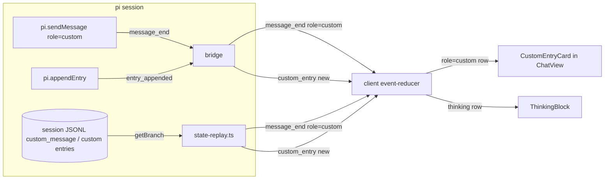

## Context

Issue #468: the dashboard chat drops information the native TUI shows. Two gaps, both cheap:

**Reasoning is trapped in a nested scrollbox.** `ThinkingBlock.tsx` hard-codes `max-h-[400px] overflow-y-auto` on its body, so long reasoning becomes a scroll region inside the scrolling transcript. The collapse machinery (auto-collapse timer, turn-scoped hold, manual toggle — see `reasoning-display` spec) is orthogonal to height; today there is no way to let the body flow.

**Custom entries vanish.** pi has two extension surfaces for custom chat content (verified against pi core `agent-session.js` / `session-manager.d.ts`):

| Surface | Persisted entry | pi events fired | Dashboard path today |
|---|---|---|---|
| `pi.sendMessage({customType, content, display, details})` | `CustomMessageEntry` (`type: "custom_message"`) | `message_start` + `message_end` with `message.role === "custom"` | Bridge forwards `message_end` (it is in `enrichedEventTypes`), but the client reducer only builds rows for `role === "assistant"` → **dropped** |
| `pi.appendEntry(customType, data)` | `CustomEntry` (`type: "custom"`) | `entry_appended` (with the full entry) | Bridge does NOT subscribe; `state-replay.ts` handles only `customType === "flow-event"` → **dropped** |

Replay ingestion is single-sourced: `replayEntriesAsEvents` in `packages/shared/src/state-replay.ts`, consumed by both `session-load-worker.ts` (server cold-load) and `session-sync.ts` (extension backfill). Fixing replay once fixes both.

Faithful re-rendering of a registered TUI `EntryRenderer`/`MessageRenderer` is impossible in the browser (pi-TUI components emitting ANSI lines) — that is `add-native-pi-tui-view`'s problem. This change ships an honest bounded fallback.

Existing reusable pieces:
- Truncation ceiling: last-200-lines with `«N earlier lines hidden»` marker (`MAX_DISPLAY_LINES` in `replay-truncate.ts`; idempotent `truncateOutputForDisplay` in the client reducer).
- Safe untrusted-text pattern: `RawEventCard` renders payload as plain text in a `<pre>` — no markdown interpretation.
- Settings: the View page already groups reasoning sub-controls in a `GatedGroup` that renders visible-but-disabled when `reasoning` is off (`settings-panel` spec, "Dependent control is indented").
- `flow-event` keeps a dedicated reducer and a dedicated state-replay arm (sorted by seq).

## Goals / Non-Goals

**Goals:**
- Reasoning body can render with no height cap, flowing down the transcript, behind a new `reasoningInlineFlow` pref (default off = today).
- Non-`flow-event` custom content (both surfaces) renders as a first-class chat row with a bounded generic fallback.
- `display: false` custom messages stay invisible.
- Two new prefs (`reasoningInlineFlow`, `customEntryFallback`) with full global + per-session override plumbing.
- Reasoning controls remain grouped and visible-but-disabled when `reasoning` is off.

**Non-Goals:**
- Faithful TUI entry-renderer emulation, ANSI interpretation, or interactivity in custom rows.
- Markdown/linkification of custom payloads (untrusted input renders as plain text).
- Server-side read surface or pre-truncation for custom payloads (they already transit the event stream).
- `flow-event` rendering changes.

## Decisions

**D1 — One chat row role, two ingestion surfaces.** `ChatMessage` gains `role: "custom"` with fields `{ customType, content (display body), entryId? }`. `sendMessage` custom messages arrive via the existing `message_end` (new reducer branch on `msg.role === "custom"`); `appendEntry` entries arrive via a new `custom_entry` protocol event. Both reduce into the same row shape, so rendering is single-sourced. Alternative (map everything to `custom_entry` at the bridge) was rejected: it would require the bridge to intercept and rewrite `message_end`, breaking the enriched-event contract for one consumer.

**D2 — New protocol event `custom_entry` for `appendEntry`.** The bridge adds a dedicated `pi.on("entry_appended")` subscription (same `sessionReady`/`isActive` guards as siblings) that forwards `{ eventType: "custom_entry", data: { customType, data, entryId } }`. `state-replay.ts` synthesizes the identical event for persisted `type: "custom"` entries. Alternative (add `entry_appended` to `passThroughEventTypes`) rejected: unrecognized eventTypes land in debug-gated `rawEvent` JSON cards — the exact "renders as nothing for normal users" bug this change fixes.

**D3 — `flow-event` precedence.** In `state-replay.ts` the existing `customType === "flow-event"` arm stays and is checked BEFORE the new generic arm; the reducer's flow handling is untouched. Generic fallback never claims `flow-event`.

**D4 — Bounded plain-text fallback card.** New `CustomEntryCard` (`packages/client/src/components/chat/`): customType label + body, mirroring `RawEventCard`'s plain-text `<pre>` treatment — deliberately NOT `MarkdownContent`, because the payload is untrusted extension-authored input and markdown rendering is an injection/ spoofing surface. Body extraction: string `content` → as-is; content array → text parts joined, image parts noted as `[image]` (a NEW convention local to this card — existing helpers produce text-only joins); `data`/`details` objects → `JSON.stringify(·, null, 2)` with `String()` fallback. The body is truncated to the last-200-lines display form via the client's idempotent `truncateOutputForDisplay` — extraction FIRST, truncation SECOND, at row creation — so live and replay render identically. This reuses the same ceiling (200 lines) and marker the tool-result display path enforces; the server-side `replay-truncate.ts` pre-truncation is NOT extended to custom entries (accepted: payloads transit the event stream unpre-truncated; display is bounded client-side). The body renders VISIBLE by default (the bug being fixed is invisibility) inside a modest bounded-height region. The card's row gets an explicit `baseRowSize` estimate in `chat-virtual-rows.ts` (its default arm is 120px — badly wrong for a 200-line JSON body and there is no compile-time forcing function), measured like the other row types.

**D5 — `display: false` exclusion contract.** The exclusion is an EXACT comparison: a custom message is dropped only when `message.display === false`. pi normalizes `content` (`?? []`) but NOT `display`, so an untyped extension omitting the flag yields `undefined` — which RENDERS (absent flag = meant to be seen; a truthiness check would silently drop it). `CustomMessage.display === false` means LLM-context-only; the reducer branch drops it (no row) and `state-replay.ts` skips it (no event) — otherwise every historical `display:false` message would flood the chat on reload. `CustomEntry` (`appendEntry`) has no display flag — always forwarded, rendering gated by pref only.

**D6 — `reasoningInlineFlow` pref.** New boolean on `DisplayPrefs`, default `false` in all three presets (default preserves today), merged as a plain top-level arm in `mergeDisplayPrefs`. `ThinkingBlock` gains `inlineFlow?: boolean`: when true the body swaps `max-h-[400px] overflow-y-auto` for an uncapped block (keeps `overflow-x-auto` for long lines); when false, byte-identical to today. The pref governs HEIGHT ONLY — open/closed state remains owned by the existing collapse machinery. Threaded from `prefs` at every `ThinkingBlock` mount site: ChatView message rows, the streaming-thinking tail, and `ToolBurstGroup`'s absorbed-thinking block.

**D7 — `customEntryFallback` pref.** New boolean, default `true`, top-level merge arm. Render-time gate only (like `rawEvent`'s `showDebugTools` gate): rows still exist in state so toggling does not replay anything.

**D8 — Settings placement.** The `reasoningInlineFlow` toggle joins the existing reasoning `GatedGroup` (inherits visible-but-disabled when `reasoning` is off; the grouping requirement is already met by the group — this change formalizes it in the spec and extends it to the new control). The `customEntryFallback` control sits in the View page next to the extension-notifications select (both are extension-row visibility controls). Both honor global + per-session override plumbing for free via the shared draft source.

**D9 — Turn-boundary classification.** `role: "custom"` is deliberately NOT added to `TURN_BOUNDARY_ROLES`: a custom row is side-channel content inside a turn, not a hard boundary; adding it would break thinking-reconstruction and turn-tail scans. The reducer's classification comment must be updated to record the decision (the file requires every new role to be classified).

## Risks / Trade-offs

- [Untrusted extension payload reaches the DOM] → Plain-text `<pre>` rendering, no markdown/linkification, 200-line ceiling, `customEntryFallback` kill switch. `security-hardening` skill applies; escape-by-framework (React text nodes) is the only sanctioned path.
- [Uncapped reasoning rows change virtualized-transcript row measurement] → Very long blocks make one tall row; measurement is dynamic already, but scroll cost must not regress → measure before/after against `chat-transcript-virtualization` / `chat-idle-render-cost` gates (`performance-optimization` skill).
- [`ChatMessage` union change ripples] → Exhaustive switch/comment in the reducer (`TURN_BOUNDARY_ROLES`) demands classification; a missed site is a type error, not silent behavior.
- [Huge `appendEntry` payloads on the wire] → Accepted: payloads already transit the event stream today (any size cap would be a separate event-store concern); display is bounded client-side.
- [Old sessions contain `display:false` custom messages] → Replay-side exclusion (D5) prevents a history flood; live path was already forwarding them harmlessly because the reducer dropped them.

## Migration Plan

Purely additive: two optional pref fields (legacy `preferences.json` / `.meta.json` backfill to defaults via preset defaults + existing backfill behavior), one protocol event, one row role. No API break; older clients ignore `custom_entry` (debug-gated raw card at worst). Rollout per the implement-skill rebuild matrix: shared+server → `/api/restart`; extension → `npm run reload`; client → build + restart. Rollback = revert; new pref fields are ignored by older code.

## Open Questions

None blocking. Custom-card default-visible body (D4) is a judgment call flagged for review: if real-world payloads prove noisy, demoting to collapsed-by-default is a one-line follow-up that does not change any spec scenario.
