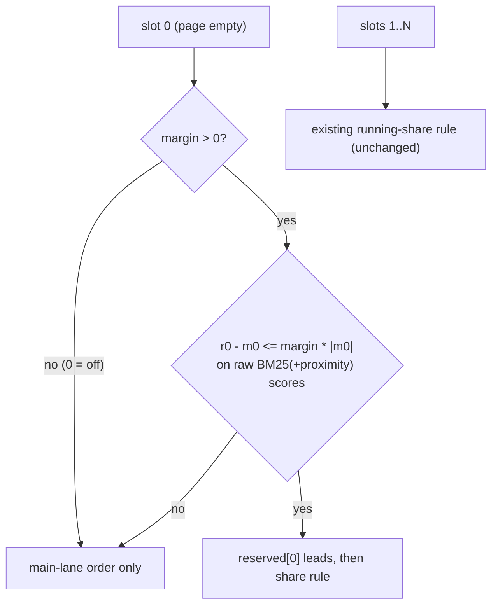

## Context

`kb_search` ranks two lanes: an unrestricted lane and a reserved `agents` lane
(`packages/kb/src/sqlite-store.ts`, design D3 of `fix-kb-search-retrieval-quality`).
`interleaveLanes` merges them with a page-share quota (`ranking.laneQuota`, default 0.5).

The quota is written as a *running share* test:

```ts
const wantReserved = rHas && (!mHas || (taken + 1) / (out.length + 1) <= share);
```

At the first slot `out.length === 0` and `taken === 0`, so the test is `1 <= share`.
For every configured share below 1 this is false: **the reserved lane is structurally
incapable of taking slot 1** whenever the main lane is non-empty. This is the primary
explanation for the proposal's measured shape — Recall@10 0.495 against P@1 0.041, with
rank 1 being docType `doc` 86% of the time. `agents` chunks can still reach slot 1
through the *unrestricted* lane (docType `agents` reached rank 1 on 14% of those
queries) — the inequality only bars the *reserved* lane — but the per-file record loses
that contest to verbose `doc` prose.

> Provenance: the proposal's numbers were taken at mining time on a 97-query snapshot
> with a hand-built harness (not committed). `golden.source-intent.json` has since been
> regenerated with 104 items; task 1.2 re-baselines both fixtures before any tuning.

The second half is discoverability. `doc_type` is declared as a bare
`Type.Optional(Type.Union([...]))` in `packages/kb-extension/src/extension.ts` with no
`description`, and neither `promptGuidelines` entry mentions it — the model is never
told the trade-off (deployed builds surface at most a bare filter hint). It is passed
on 12% of real calls despite yielding 5.5x P@1 on file-lookup queries — and it *hurts*
conceptual queries, so it cannot simply be defaulted on.

Constraint: `fix-kb-eval-measurement-integrity` must land first. Until the CLI/`dist`
and `kb eval` option-drop defects are fixed, no number produced by the repo's own tooling
is admissible evidence for a ranking default.

## Goals / Non-Goals

**Goals:**
- Let a competitive reserved-lane candidate occupy result slot 1, behind a config gate.
- Gate off ⇒ byte-identical *interleaving* (ordering, hits, scores). Render marks (D5)
  are an explicit, separate output-format change and are not gated by it.
- Make `doc_type` and its *conditional* trade-off legible from the tool schema alone.
- Make the record type of each hit visible in output so a wrong-lane page is
  self-diagnosing.
- Choose the shipped default from paired measurements on both golden sets.

**Non-Goals:**
- Changing `laneQuota` semantics for slots 2..N, the BM25 scoring, chunking, or indexing.
- Enabling `doxEnforcement`, adding a freshness gate, or touching `SNIPPET_MAX`.
- Making `doc_type: "agents"` a default or an automatic query-classification feature.
- Re-litigating corpus freshness or query formulation (both measured and rejected;
  re-verification after the instrument fix is out of scope — the sweep re-measures the
  headline metrics, which is what the default depends on).

## Decisions

### D1 — Fix rank 1 inside `interleaveLanes`, not by merging lanes on score

**Decision:** add a *lead-slot* rule to `interleaveLanes`: at `out.length === 0`, the
reserved lane takes the slot if its best candidate is score-competitive with the main
lane's best and the policy is enabled. The lead pick is a **reserved-lane take**: it
increments `taken` and populates `seen` exactly as the share rule would, so the running
share and cross-lane dedup continue consistently (slot 2 then reads `2/2 = 1 > share` and
yields to main). Slots 2..N keep the existing running-share rule. Out of scope, noted:
Tier-C `opts.rerank` (default off) re-sorts the *final* page and would overwrite a
lead-rule slot 1 if ever enabled.



Not in the diagram: an explicit `doc_type` (or `laneQuota: 0`) zeroes `laneShare` at the
*call site*, so `interleaveLanes` — and this whole rule — is never reached. That guard
lives outside the function and is pinned by its own test (task 2.6).

**Alternatives considered:**
- *Merge both lanes into one pool and sort by score.* Rejected: this is exactly what BM25
  already does, and the lane exists because length normalisation buries `agents` chunks
  ~30:1. Merging re-creates the defect the lane was built to work around.
- *Set `laneQuota: 1`.* Rejected: it would make the reserved lane take slot 1 by making it
  take *every* slot. The quota knob controls page share; rank 1 is a different question and
  needs its own knob.
- *Ratio test* `reserved[0].score <= main[0].score * FACTOR` (an earlier draft of this
  change). Rejected on sign grounds: with negative ascending-better scores and FACTOR ≥ 1
  the test demands the reserved candidate be *substantially better* than main, making the
  contest nearly inert precisely where the record is buried ~30:1.
- *Boost `agents` scores by a constant.* Rejected: an unprincipled global score hack whose
  effect varies with query length and corpus, and which is invisible in the output.

### D2 — Competitiveness: sign-safe relative margin, evaluated on raw BM25 scores

FTS5 BM25 scores here are **negative and ascending-better**. A ratio test inverts its
meaning across the sign boundary. Use the gap normalised by the incumbent's magnitude:

```
reserved leads slot 1  ⟺  margin > 0  AND  r0 - m0 <= margin * |m0|
```

- **Enabled state is `margin > 0`.** `margin = 0` means *disabled* and restores pre-change
  interleaving byte-for-byte — the contract's "disabled ⇒ exactly as before" scenario. The
  formula itself is only ever evaluated under `margin > 0`, which removes the
  ties-or-better-at-zero ambiguity an earlier draft carried.
- **Comparison point: raw scores.** Inside `lane()`, MMR (`diversity.enabled`) *reorders
  only* — it never mutates `score` — so it cannot corrupt the comparison. The real reorder
  hazard is `coverageRerank`, which **fully re-sorts** the lane, making the re-sorted head
  different from the raw best. The lead decision therefore reads each lane's best RAW
  BM25(+proximity) score, captured before `coverageRerank` re-sorting. Shipped default has
  `coverageRerank` off; the sweep adds an explicit `coverageRerank`/prf-on row (D6) rather
  than assuming the shipped-default sweep answers that interaction.
- Both tolerance corners, stated: the rule is **strict when main is weak** (`|m0| → 0` ⇒
  near-zero tolerance) and **lenient when main is strong** (`m0 = −20`, margin `0.5` ⇒ a
  reserved candidate trailing by 10 points may displace a strong `doc` answer — the
  operative markdown-regression path). Relative margins also vary absolute tolerance across
  queries (no query-length normalisation). All accepted for measurement: the D6 acceptance
  bar plus the smallest-clearing-margin rule are the hedge; the `suppressedSections`
  refinement (Open Questions) is the designated fix if a corner dominates.
- **Endpoint semantics:** all scores are strictly negative (BM25 negative, proximity delta
  ≤ 0), so at `margin = 1` the test reduces to `r0 ≤ 0` — always true: unconditional
  reserved lead, the slot-1 behaviour rejected for `laneQuota: 1`. That degenerate endpoint
  is treated as a misconfiguration: documented, validated as in-range, but excluded from
  the sweep grid.

### D3 — One numeric gate: `ranking.laneLeadMargin`

**Decision:** add `ranking.laneLeadMargin: number` to `RankingConfig`, default `0` (off),
validated in `validateConfig` exactly like `laneQuota` (finite, `[0, 1]`). Threaded
through `SearchOpts` and passed by both `extension.ts` and `cli.ts`. Rollback = an
explicit `ranking.laneLeadMargin: 0` in project config — *not* "remove the key", which
after task 5.4 falls back to the shipped default and that may be non-zero.

Rejected: a `boolean` + separate factor (two knobs to express one state) and a hardcoded
constant (no way to A/B, no rollback without a release).

`DEFAULTS` must contain *some* number, so "the design does not choose the default" means:
this document does not pick the shipped value; task 5.4 bakes the measured winner (or `0`)
into `DEFAULTS`. Note the knob is intentionally inert when `laneQuota = 0` or an explicit
`doc_type` is set (both reduce `laneShare` to 0, so `interleaveLanes` — and the lead rule
inside it — is never reached). That coupling is asserted by test, not left incidental.

**The shipped default is an output of task-stage measurement** over a swept margin against
*both* fixtures, not an input.

### D4 — `doc_type` gets a description that names the trade-off in both directions

The description and the new `promptGuidelines` entry must state the rule as a *lane
choice*: file/symbol lookup → `"agents"`; conceptual / how-does-X → leave unset. Wording
that recommends `"agents"` unconditionally is a regression — measured P@1 on
markdown-intent drops 0.150 → 0.067 under the filter. Root `AGENTS.md` already carries
this rule (commit `48d6b35a1`); the schema text should agree with it, and both must be
revisited together if D3's default changes the trade-off. Because a deployed build has
been observed carrying a `doc_type` hint that exists in no repo source, implementation
must verify the *reloaded* surface actually shows the new description (task 3.5).

### D5 — Surface the record type as a mark, only for non-`doc` hits

**Decision:** in `renderHits`, push `[agents]` / `[source-md]` into the existing `marks`
array; emit nothing for `doc`. `json` format already carries `docType`.

This marks the *record type*, not the lane origin — a main-lane `agents` hit and a
reserved-lane `agents` hit render identically, and "did slot 1 come from the lead rule?"
is visible only as *an agents hit occupying slot 1*. Making lane provenance explicit
would mean threading a flag from `interleaveLanes` through `KbHit`; the diagnostic goal
(wrong-lane pages become readable; the `doc_type` fallback self-suggests) is met without
it. Accepted trade-off.

The marks change CLI output too (`renderHits` is shared) and will fail the renderer's
exact-string tests; those expectations are updated as part of this change, and the tool
description's mark inventory (`(+N dup)`, `(+N more sections)`, …) gains the new mark.

### D6 — Every candidate margin is reported on both fixtures, in one table

`packages/kb/eval/run-fixtures.ts` already sweeps `laneQuota` under `--sweep`. Extend the
same sweep over `laneLeadMargin`, on a base that **mirrors the extension's option object**
— reuse the shared `searchOptsFromConfig` helper from `fix-kb-eval-measurement-integrity`
so `rootPriority`/`expandParent` are not silently dropped the way the current hardcoded
base drops them — and add an explicit `coverageRerank`/prf-on row (D2's unchecked
interaction). Record source-intent **and** markdown-intent metrics per row in a
`measurements.md` beside the change; a row missing one fixture is not evidence. Sweep grid: `{0.1, 0.2, 0.3, 0.5}`
(degenerate `1.0` excluded, D2), plus one `coverageRerank`/prf-on spot-check row (D2's
unchecked interaction — a spot-check, not full coverage).

Ceiling, roughly: the rule can only help when the agents lane's best chunk is the target
record; a generous union bound on source-intent P@1 is ≈ 0.041 + 0.227 ≈ 0.27 (mining-time
n=97 figures; the sweep re-measures on n=104). The oft-quoted +0.19 is the *always-fire*
approximation — scale, not bound. Acceptance bar for the shipped default: source-intent
P@1 gain ≥ +0.03 (≈ 3 queries at n≈104 — "material" is defined, not vibes) with
markdown-intent ΔP@1 ≥ −0.01 (itself only ~1 query of headroom — treat a bar-margin pass
as weak evidence and prefer the smallest clearing margin); otherwise ship `0`.

## Risks / Trade-offs

- **Promoting `agents` at rank 1 regresses conceptual queries.** → Paired reporting on both
  golden sets (D6) is a hard gate; the default may legitimately come out at `0` with only
  D4/D5 shipping.
- **`interleaveLanes` is shared ranking code; a rank-1 change affects every consumer** (tool,
  CLI, eval harness). → `margin = 0` is an exact-prior-behaviour path, covered by a test that
  asserts identical ordering to the pre-change function on existing fixtures (rendered text
  still differs via D5's ungated marks).
- **The dedup may mute part of the measured effect**: when the reserved lane's best hit is
  the same *source* the main lane would have led with, slot 1 keeps its path — but its
  content (agents chunk vs spec-prose chunk: headingPath, snippet) still changes. This is
  a composition change either way; the sweep measures the net effect.
- **The sweep base can silently drift from what the extension passes** (`rootPriority`,
  `expandParent` are exactly what the current harness base omits, and the eval harness has
  no resolved sources so even the shared helper yields `rootPriority: {}` there). → Reuse
  the dependency's `searchOptsFromConfig` helper (D6), accept the residual drift, and say
  so in `measurements.md`.
- **Measuring before the dependency lands produces invalid numbers.** → Blocked on
  `fix-kb-eval-measurement-integrity`; the first task re-verifies `dist`/`src` parity and
  ranking-option threading before any sweep is run.
- **Schema wording drifts from root `AGENTS.md`.** → D4 makes them a single decision; the
  tasks update both or neither.
- **A margin tuned on ~100 mined queries may overfit.** → Prefer the smallest margin that
  clears the D6 bar, over the argmax row.
- **Session-mined stats** (12% `doc_type` usage, 563-call corpus, rank-1 composition) have
  no committed reproduction script. → Recorded as provenance in the proposal; the sweep, not
  those stats, justifies the shipped default.

## Open Questions

- Should the lead rule also require `suppressedSections > 0` (the `agents` record matched in
  several sections) as a secondary competitiveness signal, especially to hedge either
  tolerance corner in D2? Deferred: measure the plain margin first; add only if the sweep
  shows the margin alone is too blunt.
- The `coverageRerank`/prf interaction is *measured* by a dedicated sweep row (D6), not
  assumed from the shipped-default sweep.
