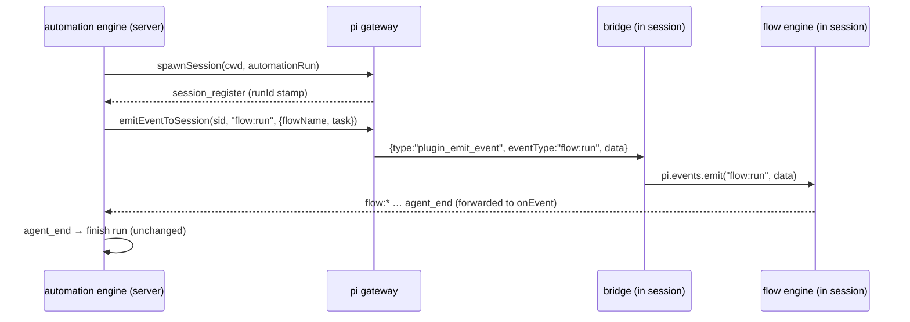

# Design

## Context

Two processes, one bridge. The automation plugin runs in the dashboard **server**; the flow engine (and any event consumer) runs **inside a spawned pi session** on that session's local `pi.events` bus. The only server→session channel is the bridge: `piGateway.sendToSession(sessionId, controlMsg)` → the in-session bridge dispatches on `controlMsg.type` and calls `pi.events.emit(...)`. Precedent: `abortSession` sends `{type:"abort"}`; the web UI sends `{type:"flow_management", action:"run"}` → `flow:run`.

Session→server: the bridge forwards all pi events, so completion events (e.g. `flow:complete`) reach the plugin's `ctx.onEvent`.

## Decisions

### Generic `plugin_emit_event` control, not per-feature
The bridge already has `flow_management`, `flow_control`, `role_*` — one handler per feature. Adding `flows.cancel` etc. that way re-couples the bridge to each capability. Instead add ONE generic control: `{type:"plugin_emit_event", eventType, data}` → `pi.events.emit(eventType, data)`. The bridge stays ignorant of which events exist; plugins register whatever event they want. Matches the event philosophy.

### `emitEventToSession` mirrors `abortSession`
Same trust gate (`manifest.priority <= 100`), same transport (`piGateway.sendToSession`). Untrusted plugins get a hook returning `false`. Empty/non-string `eventType` returns `false` without sending.

### Dispatch is a union, resolved at register time
`ActionRegistration` keeps `buildPrompt?` and adds `buildEvent?`. Engine resolves a `RunDispatch = {kind:"prompt", text} | {kind:"event", eventType, data}` when the run session registers. `core.*` → prompt (unchanged); `flows.*` → event. Exactly one applies per action; `buildEvent` wins when present. Backward compatible — existing prompt actions and legacy `prompt`/`skill` fallback keep working.

### Finalization stays `agent_end`
This change adds no new completion signal. Runs finalize on `agent_end` exactly as today. A flow that needs a different end condition handles it inside pi-flows (e.g. shutting down its session on `flow:complete`), which surfaces as `agent_end` to the dashboard. Keeping finalization unchanged keeps the change small and avoids a dashboard-side timeout/finalize mechanism.

## Flow of an event-dispatch run

## Out of scope
- Run finalization changes / per-action `finalizeOn` / `timeoutMinutes` watchdog — finalization stays `agent_end`; flow-specific end is pi-flows' concern.
- `flows.resume` / `flows.cancel` (no run-scoped resume/cancel reachable by the dispatch path on pi-flows).
- Capturing flow output into `result.md` beyond what `onEvent` already buffers.
