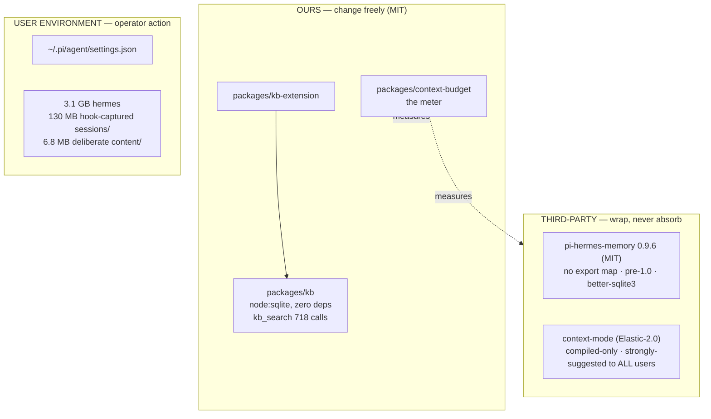

# Design — consolidate-retrieval-planes

## Context

Four retrieval planes accumulated independently. Each registers tools, each
injects doctrine, none share a lifecycle. The question is not "how do we merge
them" — that is mechanical — but **which merges are worth their maintenance
cost**, and **what evidence would tell us we were wrong**.

## Goals / Non-Goals

**Goals.** Cut per-turn wire cost where evidence supports it; give the operator a
visible handle on store growth; leave one retrieval plane a future change can
reason about.

**Non-Goals.** Importing, vendoring or forking context-mode. Migrating store
data. Changing `kb_search` ranking. Touching the `ctx_execute` family or the
`content/` index. Changing defaults for users we have not sampled.
"Architectural tidiness" as a justification in its own right.

## Decisions

### D1 — `packages/kb` is the engine; hermes is demoted to writer (Phase 2b only)

`packages/kb` exports raw TS (`exports: {".": "./src/index.ts"}`) with zero
runtime deps on `node:sqlite`. hermes ships `src/` but publishes **no export
map**, so every useful entry point is private API — and at **0.9.6 it is pre-1.0,
carrying no stability contract at all**. It also uses `better-sqlite3`, whose
native ABI forces rebuilds on Node bumps; inside Electron that is a recurring
tax, and two SQLite engines in one process is the thing to avoid.

**Therefore:** kb is the engine. hermes keeps writing via its own tools; we read
through an adapter that treats its files as data, never its modules as API.

### D2 — two context-mode stores, and only one is retired

| Store | Size | Written by | Retired? |
|---|---:|---|---|
| `sessions/` | 130 MB / 71 DBs | capture **hooks**, every turn, unattended | **yes, opt-in** |
| `content/` | 6.8 MB / 2 DBs | deliberate `ctx_index`, `ctx_fetch_and_index`, `ctx_execute --intent` | **no** |

Retiring the hook lane does **not** delete `ctx_search` (224 calls — it keeps
serving `content/`), does **not** change `ctx_execute`'s sandbox behaviour, and
does **not** touch the `intent` auto-index. What an opting-in operator loses is
recall over *auto-captured session events*. Citing "224 reads" as proof the hook
lane is unused was an error: those reads span both stores.

Not federating context-mode also dissolves the licensing question — Elastic-2.0
restricts providing the work as a managed service, which is close enough to what
a dashboard does that linking it into an MIT package is not a casual decision.

### D3 — third-party surfaces are replaced at pi's registration layer

`pi.setActiveTools()` removes tools from the active set after load. **Measured,
not assumed** — dropping `memory_replace`, `memory_remove`, `session_search`,
`recall`, `validate_mockup`, `list_design_systems` (a probe set chosen for
availability, **not** the set this change proposes to drop) cut the payload
8,705 B: 7,421 B from the tools block, exactly their summed schemas, plus
**1,284 B from the system prompt**, because pi also prunes those names from its
`Available tools` list. That second channel is a bonus the byte estimates in
`proposal.md` conservatively ignore.

**Cost, stated plainly.** This makes us the owner of a shim over someone else's
store. When hermes changes its format, our adapter breaks and the failure
surfaces as "memory search returns nothing", not as a build error. Phase 1
carries the same risk on the **write** side: if hermes adds or changes an action,
our collapsed `memory({action})` silently lacks it and the failure mode is "the
agent can no longer record something." At 0.9.6 there is no semver promise that
this won't happen on a patch release. This is the strongest argument against
Phases 1 and 2b, and it does not go away.

### D4 — the Phase 2 gate, split so it can actually fail

The first draft claimed Phase 1 would produce data deciding Phase 2. **It could
not**: Phase 1 removes three *write* tools, while the hypothesis concerns
ambiguity among six *retrieval* tools. An intervention that leaves the alleged
confound untouched cannot test it. That flaw is corrected by splitting the
facade:

- **Phase 2a manipulates the variable.** It collapses the six retrieval *names*
  into one dispatching tool while leaving every engine and ranking unchanged.
  Retrieval quality is constant by construction, so a usage change is
  attributable to surface ambiguity rather than to better results.
- **Phase 2b is the expensive part** and runs only if 2a earns it.

**Pre-registered decision rule** (fixed before Phase 2a ships, single direction,
single threshold):

| Item | Value |
|---|---|
| Metric | combined retrieval calls per conversation |
| Baseline | **1.94/conv** — 977 calls / 504 conversations, **excluding `ctx_search`**. The all-in figure is 2.38/conv; Phase 0 mechanically removes `ctx_search`'s 224 calls (0.44/conv, 19%), which would otherwise masquerade as a result, so the gate is computed ex-`ctx_search` on both sides |
| Sample | ≥100 post-Phase-2a conversations |
| **Proceed to 2b** | ≥ **2.9/conv** — a **+50%** lift over 1.94 |
| **Stop** | < 2.9/conv — routing friction is unsupported at an effect size worth a permanent shim |

**Why +50% and not something subtler.** Treating per-conversation call counts as
overdispersed count data (two-sample Poisson rate ratio, α=0.05 two-sided, 80%
power, variance inflation ×2 for overdispersion), the conversations needed per
arm are:

| Lift | n/arm (Poisson) | n/arm (overdispersed) |
|---|---:|---:|
| +15% | 388 | 776 |
| +25% | 147 | 293 |
| **+50%** | 42 | **83** |
| +100% | 13 | 26 |

At n≥100 the rule can detect a +50% effect and **cannot** detect +25% — that
would need ~293 conversations. This is deliberate, not a concession: a lift
smaller than +50% would not justify a permanent adapter over a pre-1.0 store, so
the gate is set where the decision actually changes. A result between +0% and
+50% reads as **stop**, and the honest description of that outcome is "no effect
large enough to matter was detected", not "no effect exists".

An earlier draft of this table stated the baseline as 2.38 while claiming to
exclude `ctx_search`, and labelled the threshold "+25%". Both were wrong: 2.38
includes `ctx_search`, and 2.9/1.94 is +50%. Corrected here.

"Unchanged" is a **stop**, not a confirmation. The first draft wrote it as both,
which made the gate unfalsifiable in the worst way: any outcome could be read as
support, and the decision would revert to whoever argued hardest.

Even on a stop, Phase 2a keeps its measured byte win and stays — it is
reversible by configuration and costs no adapter.

### D5 — the facade merges by Reciprocal Rank Fusion (Phase 2b)

Sources return incomparable scores (BM25 over different corpora). RRF ranks by
position, needs no calibration, degrades gracefully when a source is empty.
Scopes are `docs` (kb) | `lessons` (hermes memory) | `sessions` (**hermes
`session_search`, 29 calls — not context-mode's retired hook store**) | `all`.
Old tool names survive as scope aliases for one release.

### D6 — deletion is operator-initiated, dry-run first

Phase 0 removes user data: inventory + dry-run + explicit action + a record of
what was removed. No implicit background GC, no delete on startup. The 31 stray
`.MEMORY.md.recovery-*` files prove something already writes here unattended;
adding a second unattended writer that *deletes* is how a memory store is lost.

## Risks / Trade-offs

| Risk | Severity | Mitigation |
|---|---|---|
| Facade degrades `kb_search` (718 calls) | **High** | Phase 2a changes no engine; Phase 2b blocked on `kb-retrieval-eval` showing no P@1/MRR regression; old names stay as aliases |
| hermes format drift breaks the adapter **silently** | **High** | integration test that drives **hermes' own write tools** against a temp store, then reads it back through our adapter — run on every hermes bump; exact-version pin, not a range. A fixture we author and pin would pass forever regardless of upstream, so it cannot detect drift |
| Phase 1 shim lacks a new/changed hermes write action | **High** | same generate-then-read test, asserted over the action list hermes actually registers |
| Phase 0 deletes something wanted | **High** | dry-run + explicit action + removal record (D6); opt-in only |
| We build 2b and usage does not move | **Medium** | D4 pre-registered rule — decided before building |
| Byte win smaller than estimated | **Low** | `context-budget diff --expect-removed` fails the task rather than reporting a phantom win |
| Generalising n=1 evidence to all users | **Medium** | Phase 0 is opt-in; no default changes (proposal *Evidence scope*) |
| Prompt caching makes savings marginal | **Accepted** | argument is signal-to-noise, not dollars — stated, not hidden |
| **Concurrent agents in one working tree** | **High** | this change's own artifacts were destroyed once by a parallel agent running `git clean -fd` on shared `develop`; plan artifacts are committed immediately on creation, never left untracked |

## Alternatives Considered

1. **Do nothing.** Genuinely viable. The skills trim already landed a measured
   −9,505 B for zero maintenance cost, and the catalogue (43,849 B) still offers
   more than every remaining phase combined, with no shim to own. This is the
   baseline Phases 1–2b must beat.
2. **Skills catalogue only.** Pursue the 39.5% block via config
   (`disable-model-invocation`, package-entry exclusions) and stop. Highest
   bytes-per-unit-risk; no code, no shim, reversible.
3. **Phase 2a and stop there.** Most of the retrieval byte win, no adapter, no
   store coupling, reversible by config. If the D4 rule reads "stop", this is
   where the change ends — and that is a success, not a failure.
4. **Fork or vendor hermes.** Clean API, no drift risk, at the cost of owning a
   memory store and losing upstream fixes. Rejected: strictly more maintenance.
5. **Upstream a PR to hermes** collapsing its write surface. Best outcome — no
   shim at all — but not schedulable by us. Worth attempting *alongside* Phase 1.
6. **Federate everything including context-mode.** Rejected on licence +
   evidence (D2).

## Migration Plan

Phases 0 and 1 are independent; either may ship alone. Phase 2a requires Phase
0's baseline to be settled (or `ctx_search` excluded from the metric). Phase 2b
requires Phase 2a's reading.

Rollback for Phases 1–2 is deactivation, not restoration: nothing is deleted
from any store, so re-enabling originals is a settings change. Phase 0's
deletions are the only irreversible step — hence dry-run plus explicit action.

## Open Questions

- Does `hermes-memory-settings` host the hygiene UI, or does store inventory
  deserve its own panel?
- Project identity keys on directory basename (~200 dirs, most empty; worktrees
  never reach the parent repo's store). That is hermes' behaviour — is a
  workaround worth it, or is this an upstream issue to file?
- Is `skill_manage`'s 5,472 B earning its size? Its call count was never
  isolated in the census, so the Phase 1 trim of it is currently unjustified by
  data. **Measure before trimming it.**
- What is hermes' actual release cadence and format-change history? The drift
  risk is rated High on structural grounds (pre-1.0, no export map) rather than
  on observed incidents.
- Cross-model doubt-review could not be obtained: subagent spawns against
  `openai/gpt-5.4` and `google/gemini-3.1-pro-preview` returned empty while an
  `anthropic` probe succeeded. The D4 statistics were therefore derived
  first-party rather than adversarially checked.
