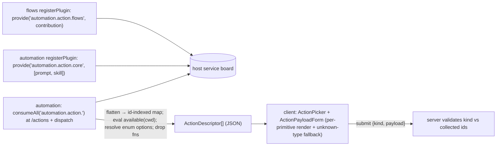

# Design

## Context

`automation-emit-configured-event` shipped a registry that automation `provide`s and flows `consume`s + pushes into. The dispatch semantics (prompt vs event emit) are correct and unchanged here. What changes is **who owns the registration surface and when contributions are read** — moving from push-into-shared-object to publish/collect.

The host already owns a passive service board: `pluginServiceRegistry = new Map<string, unknown>()` with `provide(name, value)` / `consume(name)` (server.ts:615/1462). It is in-process only (never crosses the bridge). We extend it with prefix enumeration.

## Decisions

### Publish/collect, not push-into-shared
Contributors `provide("automation.action.<source>", contribution)`. Automation `consumeAll("automation.action.")` at read time. Rationale:
- **Order-independent.** Automation reads at `/actions` request + at dispatch — after all plugins loaded. A publisher that loads after automation is still collected. No `dependsOn`, no timing trap.
- **Active-only for free.** A plugin only publishes inside its `registerPlugin`; a disabled/unloaded plugin publishes nothing, so its action never appears.
- **Ownership clarity.** Each plugin owns one immutable contribution; automation owns collection + descriptor-building + dispatch + dialog. No mutable object written by many.
- **flows is a pure publisher.** It consumes nothing, references nothing automation-owned.

### `consumeAll(prefix)` is generic host infra
Not automation-specific. Any feature can use publish/collect. Signature:
```ts
consumeAll<T = unknown>(prefix: string): Array<{ key: string; value: T }>;
```
Backed by iterating `pluginServiceRegistry` keys with `startsWith(prefix)`. In-process only, same as `provide`/`consume`.

### Contribution shape (server-side, carries functions)
```ts
interface ActionContribution {
  id: string;              // "<source>.<verb>"
  source: string;
  label: string;
  description?: string;
  available?: (cwd: string) => boolean;
  unavailableReason?: string;
  payloadSchema?: ActionFieldSpec[];       // enum options via options(cwd)
  buildPrompt?: (a) => string;             // exactly one of prompt/event
  buildEvent?: (a) => { eventType; data? } | null;
}
```
A plugin MAY publish an array of contributions under its key (multiple actions). Automation flattens all collected keys → id-indexed map, rejecting malformed/duplicate ids with a logged warning (same guards as the old registry).

### core.* are self-published by automation
Automation publishes `automation.action.core` = `[core.prompt, core.skill]` in its own `registerPlugin`. Built-ins are peers — if automation is disabled there is no dialog anyway, so nothing shows. No privileged host-seeded entries.

### Client contract: closed, versioned primitive set + fallback
The wire type stays `ActionDescriptor` (serializable; functions dropped, `available` evaluated, enum `options` resolved per-cwd at collect time). `ActionPayloadField.type` is a CLOSED union — currently `string | multiline | text | enum`. The client renders one control per primitive and MUST fall back to a plain text input for an unrecognized `type` (older client vs newer publisher). Adding a control type = one versioned extension to the shared union + one client renderer; old clients degrade, never crash. Validation is server-authoritative at `/create` (client does declarative light-validation only).

## Flow



## Migration from automation-emit-configured-event
- Remove automation's `createActionRegistryWithBuiltins` + `provide("automation.action-registry", …)`; replace held `actionRegistryRef` reads with collect-on-read helpers.
- flows: replace `wireFlowAutomationActions(consume, …)` with a single `provide("automation.action.flows", contribution)`; delete the duplicated `ACTION_REGISTRY_SERVICE` string.
- Keep `emitEventToSession`, `buildRunDispatch`, and the prompt/event dispatch semantics exactly as shipped.

## Out of scope
- Cross-bridge contribution (pi extensions publishing actions) — in-process only.
- Per-plugin custom React controls — plugins compose forms from the closed primitive set; no client code ships from contributors.
- Changes to what an action does at dispatch (unchanged from `automation-emit-configured-event`).
