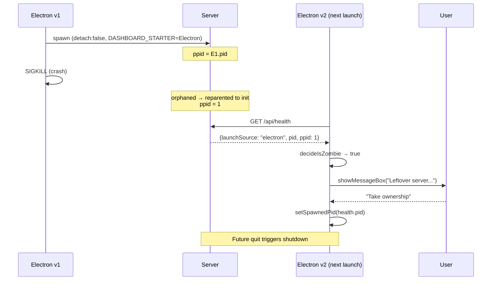

# Design — Electron attach-mode ownership hardening

## Context

Four loosely-related issues all stem from one observation: **`launchSource` is a static label set from `DASHBOARD_STARTER` at spawn time, and ownership decisions made outside `decideShutdownOnQuit` either don't consult it or trust it past its useful lifetime.** This change adds two cheap dynamic signals to `/api/health` (`ppid`, `activeBridgeCount`) and uses them to fix the tray ownership bug, detect zombies, surface version skew, and label orphaned bridge-spawned servers honestly.

## Goals / Non-Goals

**Goals**
- Tray must never offer a "Restart" action that could nuke a server Electron doesn't own.
- After an Electron crash on POSIX, the user has an in-app affordance to clean up or adopt the leftover server.
- The Electron app surfaces (via Doctor, at minimum) when its bundled shell version doesn't match the server it's attached to.
- `launchSource` consumers can distinguish a bridge-started server with a live pi session from one whose pi session has long since quit.

**Non-Goals**
- Auto-killing zombies without user consent.
- Title-bar pill or startup modal for version skew (Doctor-only first).
- Changing the existing `decideShutdownOnQuit` invariant.
- Refactoring `launchSource` to a fully dynamic field. The static label remains meaningful for the original `decideShutdownOnQuit` rule, which is scoped to "did *this* Electron lifetime spawn it".

## Ownership classifier — single rule, three consumers

The classifier lives in `server-lifecycle.ts` as a pure helper, alongside the existing `decideShutdownOnQuit`. Same module, same testing pattern.

```ts
export function decideOwnership(params: {
  healthLaunchSource: LaunchSourceEffective | null; // null = server unreachable
  healthPid: number | undefined;
  storedSpawnedPid: number | null;
}): "electron" | "foreign" | "none" {
  if (params.healthLaunchSource === null) return "none";
  if (params.storedSpawnedPid === null) return "foreign";
  if (params.healthLaunchSource !== "electron") return "foreign";
  if (params.healthPid !== params.storedSpawnedPid) return "foreign";
  return "electron";
}
```

**Why use `launchSourceEffective` not `launchSource` here:** an orphaned bridge server reports `launchSource: "bridge"` and `launchSourceEffective: "bridge-orphaned"`. Either string falls into the `!== "electron"` clause, so both classify as foreign — same outcome. But future surfaces (e.g. "your bridge session ended" pill) need the orphan distinction, so the effective field is the right input throughout.

**Three consumers, one classifier:**

```mermaid
flowchart LR
  A[/api/health<br/>launchSourceEffective, pid] --> B[decideOwnership]
  C[storedSpawnedPid] --> B
  B --> D[Tray: render menu]
  B --> E[Zombie modal: gate]
  B --> F[Doctor row: choose suggestion text]
```

## Zombie detection — POSIX-only, opt-in adoption

Windows is a non-issue: `spawnDetached({ detach: false })` puts the server in Electron's Job Object, which the OS terminates with the parent. On macOS/Linux, `detach: false` only means "don't `child.unref()`" — the OS-level process tree relationship doesn't protect against an abnormal Electron exit. The detached child gets reparented (POSIX rule: orphaned processes adopt PID 1, i.e. init/launchd).

**Detection signal:** `health.ppid === 1` on POSIX. This is unambiguous — it means "my original parent is gone." We could also probe "is there any live Electron process whose PID matches my known parent PID at boot" but ppid is simpler and equally reliable.



**Why the modal, not silent adoption:**
- A user might *want* the leftover server (e.g. running another Electron instance via dev script, or about to launch a `pi` session against it). Silent adoption races with that.
- "Stop now" gives a clean reset path: kill it, spawn fresh.
- "Leave running" preserves the current zero-action behaviour for users who don't care.
- The in-memory `askedThisSession` flag prevents re-prompting if the user cancels via Esc/close-button on the dialog (which Electron returns as the "default cancel index").

**Why opt-out via `--no-zombie-prompt`:** QA tests need to attach to known-state servers without modal interference. Same pattern as other Electron debug switches in this codebase.

## `launchSourceEffective` — why a derived field, not a mutated label

Two reasons to keep `launchSource` static and derive `launchSourceEffective`:

1. **`decideShutdownOnQuit` semantics.** Its rule is *"did this Electron lifetime spawn the server?"* The original `launchSource === "Electron"` check is correct as-is. Promoting a stale `"bridge"` to `"bridge-orphaned"` doesn't change the answer (still not Electron) but introducing label mutation invites bugs where the original spawner identity is lost.
2. **Race window.** During a server restart (the bridge `server_restarting` flow), the server reboots and the bridge reconnects within 1–5 s. If we promoted `bridge → bridge-orphaned` instantly on bridge disconnect, we'd flap the field during every restart. The 30 s grace window on the derived field avoids this without complicating the persistent label.

**Why 30 s, not 5 or 60:** the longest observed bridge reconnect after `server_restarting` in the test suite is ~8 s on a cold-cache JIT path. 30 s gives 3× headroom. Shorter risks flap; longer delays the "this is orphaned" signal to the point of uselessness.

## Tray contract — the `"foreign"` row decision

`buildTrayMenuTemplate`'s current contract is binary (run/not-run). The fix introduces a third state but the menu shape stays simple:

| ownership | First item |
|-----------|------------|
| `"electron"` | `Restart server` (enabled, click → `onLaunch(true)`) |
| `"none"` | `Start server` (enabled, click → `onLaunch(false)`) |
| `"foreign"` | `Server managed externally` (disabled, no click handler) |
| `"unknown"` | *(item omitted)* |

**Alternative considered:** show `"Server managed externally"` as the menu's *title* row (no separator) plus the existing Start/Restart actions disabled. Rejected — Electron tray menus don't have a native "title" concept on macOS/Linux, and rendering a disabled "Restart server (managed externally)" is more confusing than a single informational line.

**Alternative considered:** offer a "Stop external server" action under `foreign`. Rejected for v1 — this would let the tray nuke a user's `pi-dashboard start` terminal session or a peer pi session's bridge-started server with one misclick. Can revisit with a confirmation modal in a follow-up.

## Doctor row — why versioned suggestions

The version-skew row's `suggestion` field varies by `launchSource` because the fix path is different in each case:

- `standalone`: the user installed pi-dashboard via npm; the upgrade path is `npm i -g`.
- `bridge` / `bridge-orphaned`: the server was spawned by a (possibly defunct) pi session; upgrading the Electron app doesn't help until that server stops and Electron can launch its own bundled one.
- `electron`: another Electron instance is the owner; either quit it, or use the zombie modal if applicable.

Single hard-coded suggestion would mislead at least two of the three cases.

## Trade-offs & risks

- **Adding fields to `/api/health` is a forever-supported contract.** We're adding three. Mitigation: each one has a clear, narrow consumer; `launchSourceEffective` is the only derived value and its derivation rule is small and pure. Health tests assert presence.
- **Modal-on-launch is intrusive.** Mitigated by `askedThisSession`, by the `--no-zombie-prompt` switch for QA, and by the fact that real users rarely hit Electron crashes. If telemetry showed the modal firing more than a few percent of launches, we'd revisit.
- **`storedSpawnedPid` is module-private.** Adding a read-only accessor (`getStoredSpawnedPid`) for the tray probe widens the module's surface slightly. Acceptable: it's still pure-read, and the alternative (passing the pid through every callsite) is worse.

## Open questions

- Should the zombie modal's "Stop now" path re-enter `selectLaunchSource()` or just `app.quit()` + restart-message? The proposal commits to re-enter — gives the user immediate recovery without an app restart. If that introduces edge cases (e.g. BrowserWindow already created pointing at the soon-to-die server), we might switch to a soft-restart flow.
- Should `launchSourceEffective` also promote stale `electron` (other-Electron-leftover) to a new value like `"electron-orphaned"`? Currently the zombie modal handles this case, so a separate label seems redundant. Could revisit if non-Electron consumers (e.g. server-side update strategy) need to distinguish.
