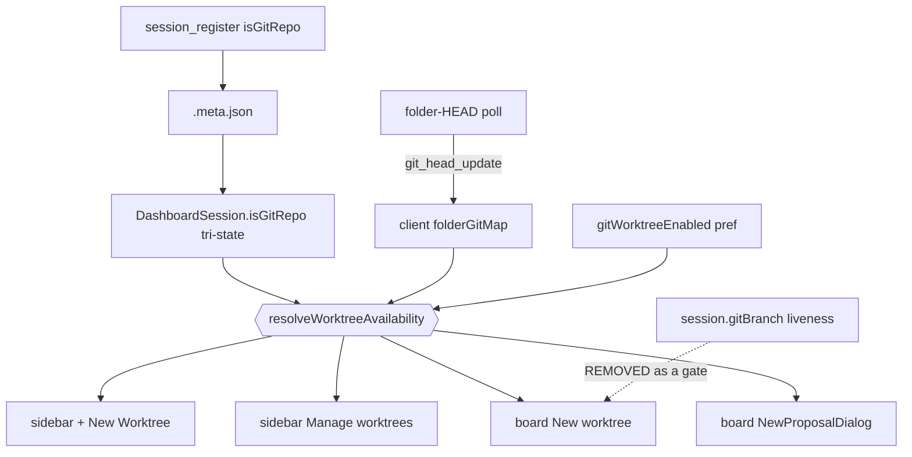

## Context

See `proposal.md` — Why. Design-relevant current state (all verified against source):

- **`DashboardSession.isGitRepo?: boolean`** — tri-state (`true` / `false` / `undefined`), stamped on `session_register` (`event-wiring.ts:1284`), persisted to `.meta.json` (`session-meta.ts`), restored on cold start (`session-scanner.ts:119`). `session_removed` sets `status: "ended"` but keeps the session in the client map (`useMessageHandler.ts:426`), so the flag survives session end client-side. This is the static, server-owned answer.
- **`folderGitMap: Map<string, string | null>`** — client state (`App.tsx:558`) fed by `git_head_update` broadcasts from the folder-HEAD poll; replayed per-socket on connect (`browser-gateway.ts:598`). Keys are `pathKey(resolveSessionGroupPath(...))` (`folder-head-poll.ts:13`). Covers folders with **no** sessions (pinned dirs). Currently passed only to `SessionList` (`App.tsx:1590`).
- **`session.gitBranch`** — populated only for the poll work-set (`pinned dirs ∪ non-ended session cwds`). Liveness-coupled. This is what the board wrongly uses.
- **Three divergent gates** — see the table in `proposal.md`. Critically, `folderIsGitRepo` (`SessionList.tsx:274`) is **not** the sidebar `+ New Worktree` rule; it gates only the `Manage worktrees` menu item (`:1205`). The button gate is inlined at `:1550` and fails *closed* on zero sessions, while `folderIsGitRepo` fails *open*.

## Goals / Non-Goals

**Goals:**
- One exported helper resolving worktree availability, consumed by every folder-level surface that asks the question.
- Board availability is stable across session end/start and correct for folders with zero sessions.
- Unavailability is visible and explained on the board.

**Non-Goals:**
- No new protocol field, server route, poll, or persisted state — every signal already reaches the client.
- No change to how `isGitRepo` or the folder HEAD is produced or persisted.
- No change to the worktree spawn flow itself (`WorktreeSpawnDialog`, `onSpawnAttachedWorktree`).
- Not touching the sidebar's *per-session card-level* `+Worktree` gate (`session.isGitRepo !== false`), which is per-session by design.
- **Presentation parity is not a goal.** The invariant is agreement on *availability*, not on how unavailability is rendered: the board disables-with-reason, the sidebar keeps hiding. Unifying the sidebar's presentation is a separate change.

## Decisions

### D1. Reuse existing client-side signals rather than adding a server folder-level `isGitRepo`

**Chosen:** derive from `folderGitMap` ∪ persisted session `isGitRepo`.
**Alternative rejected:** add a folder-level `isGitRepo` to the folder-HEAD broadcast or a new `/api/git/is-repo?cwd=` call. Both add protocol surface and a round-trip for a fact the client already holds.

### D2. `folderGitMap` is positive evidence only; `null` means unknown

**Chosen precedence for git state:**
1. `folderGitMap` value is a **non-null** branch string ⇒ **git**;
2. else any session of the folder has `isGitRepo === false` ⇒ **not git**;
3. else ⇒ **git** (fail-open).

`null` is deliberately *not* a negative. `folder-head-poll.ts:162-168` maps a throw to `null` ("could not determine → treat as non-git"), and `deriveDisplayBranch` returns `null` for an unborn/empty repo. So `null` conflates non-git ∪ commitless repo ∪ read error. Worse, the poll work-set is `pinned ∪ non-ended sessions` and the cache is never evicted on set-leave — an unpinned folder with no live sessions is never re-polled, so a stale `null` would pin the button disabled forever, including after a later `git init`. Treating `null` as unknown removes both failure modes; "confirmed non-git" then comes only from a session's own probe, which is refreshed on every register.

Fail-open remains the right default: the cost of a wrongly-shown button is a legible spawn error; the cost of a wrongly-hidden button is the invisible bug this change fixes.

### D3. Preference gate wins the reason; unloaded preference reads as enabled

`gitWorktreeEnabled === false` ⇒ `{ available: false, reason: "worktrees-disabled" }` **before** git state is consulted, so a folder that is both non-git and preference-disabled reports the actionable cause. `gitWorktreeEnabled` is loaded asynchronously from `/api/config`; an unresolved value is treated as enabled (matching `SessionList`'s existing `?? true`), so switching the board from hidden to disabled-with-reason cannot flash a wrong "Worktrees are disabled in Settings" during cold load.

### D4. Return a reason, not a boolean

Helper returns `{ available: boolean; reason?: "not-a-git-repo" | "worktrees-disabled" }`. A bare boolean cannot distinguish "not git" from "preference off", which is why the current UI can only vanish. Consumers that only need a boolean (`showWorktree`, `Manage worktrees`, `NewProposalDialog`) read `.available`.

### D5. Helper location, shape, and key normalization

New module `packages/client/src/lib/git/folder-worktree-availability.ts` (pure, no React) — `lib/git/` is the established home for client git logic (`git-api.ts`, `git-status-cache.ts`, `auto-init-worktree.ts`); `packages/client/src/utils/` does not exist in this repo. Needs an `AGENTS.md` row per the Documentation Update Protocol.

Signature takes the folder cwd, the `folderGitMap`, the folder's sessions, and the preference. Both the map lookup and the session-cwd match go through the shared `pathKey` (`packages/shared/src/session-group-path.ts:40`) that the server used to build the map keys — the board passes a raw decoded route param while the sidebar passes a resolved `group.cwd`, so without normalization the "shared" helper would silently re-create the drift it exists to remove.

`folderIsGitRepo` in `SessionList.tsx` is re-implemented as a thin call into the helper and keeps its export so existing tests/imports stay valid. Its observable rule is unchanged except that a positive HEAD now also counts as evidence of git.

### D6. Rewire the sidebar `+ New Worktree` button too

`SessionList.tsx:1550`'s inlined `some(s => s.isGitRepo !== false)` fails closed on zero sessions, so leaving it alone would make the "board and sidebar agree" invariant unsatisfiable for exactly the pinned-git-folder-with-no-sessions case. It adopts the helper.

**Accepted behaviour change:** the sidebar `+ New Worktree` button now appears for a pinned git folder that has zero sessions. This is the correct behaviour (the folder *is* a git repo and a worktree can be spawned there) and matches the `Manage worktrees` item, which is already deliberately independent of live sessions.

### D7. Disabled instead of hidden (board only)

The board card renders the `New worktree` button always; `disabled` + reduced opacity + `title` when unavailable. Keeps `data-testid="card-new-worktree-<name>"` in the DOM, which makes the unavailable state directly assertable (today it can only be asserted by absence, which is indistinguishable from a render bug).

## Risks / Trade-offs

- **Fail-open shows the button on a genuinely non-git folder that reported nothing** → the spawn attempt fails server-side with the existing worktree error path; already the shipped behaviour for `Manage worktrees` and session cards, so no new class of failure. Widened slightly by D2 (a `null` HEAD no longer hides it) — accepted as the price of killing the stale-negative trap.
- **`folderGitMap` may lag on a freshly-opened board** → precedence falls through to the session tri-state, then fail-open; never to "hidden".
- **Sidebar behaviour change (D6)** is user-visible on zero-session pinned folders. Deliberate, spec-backed, and covered by a scenario.
- **Existing tests assert absence** (`SessionList.worktree-per-change.test.tsx:93,97`) → rewritten to assert `disabled` + reason. Deliberate, spec-backed behaviour change, not a regression.
- **Two more strings to translate** → follow the existing `i18nT(key, undefined, fallback)` pattern; untranslated locales fall back to English.
- **Board vs sidebar presentation still differs** (disabled vs hidden) → explicitly a non-goal; the spec constrains availability only.

## Migration Plan

Client-only change; no data or protocol migration. Ships with `npm run build` + `/api/restart`. Rollback is a revert of the client diff.
