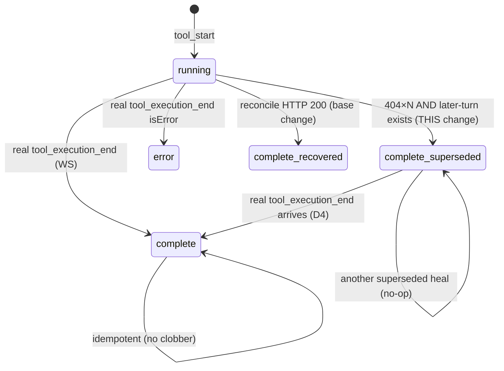

# Design

## Context

`fix-stuck-tool-card-on-dropped-event` established the transport model
(`pi → bridge → server (MemoryEventStore) → WS fanout → browser`) and a client HTTP
reconcile keyed by `toolCallId`. Its reconcile is intentionally recovery-only: HTTP 200
flips the row, HTTP 404 leaves it running and never fabricates a completion. This change
adds the missing **last-resort** heal for the case the base change documents as a known
limitation: the result is gone from the store, so no HTTP recovery is possible, yet the
transcript proves the tool finished.

## Decision D1 — Proof of completion = a later *turn*, not a later *event*

The safe, false-positive-free signal is "a later assistant turn exists after the tool
call's own turn." Rationale (same as the base change's Why): the model cannot start a new
turn until all prior tool results — including parallel ones — have returned.

Rejected weaker signals:
- **A later `tool_start` in the same turn** — parallel tools coexist in one turn; a
  sibling starting proves nothing about *this* tool. False-positive risk. Rejected.
- **Wall-clock age alone** — a genuinely slow tool (long build) would be falsely
  completed. That's why the base change already refuses to synthesize on timeout.
  Rejected.

So the client must locate the tool call's turn index and confirm at least one strictly
later assistant turn (or explicit turn-boundary event) has been applied for the session.
If the tool's turn is still the newest turn (active/in-flight), the fallback does NOT
fire — the tool may legitimately still be running.

## Decision D2 — Fire only after recovery is exhausted

The fallback must never preempt the base reconcile; the real result body is always
preferable. Gate the fallback on the base reconcile having returned HTTP 404 at least
`SUPERSEDE_MIN_404` times (default 2), i.e. the store demonstrably lacks the result.
This reuses the reconcile's existing per-row attempt bookkeeping (`lastAttemptRef` /
404 handling) rather than a second timer racing the first.

Timing: base `STALE_TOOL_MS` ≈ 25 s, re-arm ≈ 15 s ⇒ two 404s ≈ 40 s before the fallback
can fire. Conservative by construction; a slow tool that eventually returns 200 heals
via the base path first and never reaches the fallback.

## Decision D3 — Terminal representation: reuse `complete` + a detail flag, no new enum

`ToolCallStep` status is `"running" | "complete" | "error"`. Adding a fourth enum value
ripples through every renderer and status map. Instead the synthesized
`tool_execution_end` reduces to `status: "complete"` with `details.healedBy:
"superseded"` and a sentinel result string. The card renders the normal complete glyph
plus a muted "result not captured (recovered)" note — surgical, and no renderer needs a
new case beyond the optional badge.

`isError` is `false`: the tool succeeded; only its *output display* was lost. Marking it
`error` would misreport a healthy run as failed.

## Decision D4 — A real result may overwrite a superseded placeholder

The reducer is otherwise idempotent and does not re-reduce a terminal row. Carve one
exception: a genuine `tool_execution_end` (no `healedBy`, or `healedBy` absent) MAY
replace a row whose current terminal state is `healedBy: "superseded"`. This lets a late
reconcile 200, an in-app full replay, or a bridge reconnect re-sync restore the real
body. A superseded placeholder never overwrites another superseded placeholder (no-op)
and never downgrades a real completion.

## Decision D5 — Observability: every synthetic heal is counted and badged

A supersede heal masks a real result loss as a (bodyless) success. To keep that from
being silent: increment a client-side `supersedeHealCount`, and render a distinguishable
badge (mirror the existing `RetriedErrorBadge` pattern). This makes "we are losing tool
results" visible rather than cosmetically hidden.

## Reducer state machine (row status transitions)

## Deferred

- Server-side backstop (never-evict the most recent `tool_execution_end` per live tool
  call, or a bounded "terminal-event keepalive" ring). Would shrink the unrecoverable
  window at the source, but it's a store-lifecycle change with its own memory-bound
  design; gate on whether the client fallback proves insufficient in practice.
