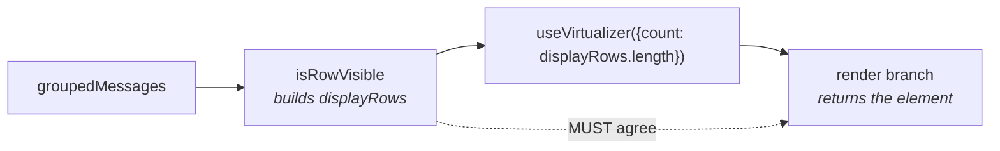

# Design — gate-notify-rows-by-level

## D1. `success` is its own rung, not a demotion to `info`

**Decision.** The severity ladder is `info < success < warning < error`, and the
pref exposes four stops:

| `notifyMinLevel` | renders | reads as |
|---|---|---|
| `all` (default) | info · success · warning · error | today's behavior |
| `success` | success · warning · error | outcomes and problems, no chatter |
| `warnings` | warning · error | problems only |
| `errors` | error | failures only — the floor |

**Rejected: `success` rides the bottom rung with `info`.** This was the first
proposal (3 stops) on the reading that both mean "everything is fine, FYI". It
was rejected by the requester. A `success` notify reports that a *thing
completed* — a real outcome the user may want even when routine info chatter is
muted. Folding it into `info` makes the useful middle position unreachable.

**Rejected: a second orthogonal pref (`notifyMinLevel` + `showSuccessNotifies`).**
Honest modeling — `success` genuinely is a tone, not a severity — but it costs a
second field, a second Settings control, a second popover row, and a 2×N state
space where several combinations are meaningless (`errors` + success-on`?`).
A single linear axis matches every other display pref and is one control.

**Consequence.** `success` sitting above `info` is a deliberate ordering choice,
not an inherent property of the level. Record it in the type's doc comment so a
later reader does not "fix" the ladder into alphabetical or emission order.

## D2. The gate keys on the notify discriminator, never on the role

A notify row and a **blocking ask** share `role: "interactiveUi"`. Hiding an
unanswered `select` / `confirm` / `input` / `ask_user` deadlocks the session with
no visible cause — the single worst failure this change can produce, and it is
silent.

`addNotify` stamps two independent markers:

```
{ role: "interactiveUi", content: "notify",
  args: { requestId, method: "notify", params: { message, level? }, status: "pending" } }
```

**Decision.** The predicate lives in ONE exported helper in `shared`, consumed by
both gate sites (D3). It returns "visible" for anything it does not positively
identify as a notify — **fail-open**. A row it cannot classify is rendered, never
hidden. An ask misclassified as a notify is a deadlock; a notify misclassified
as an ask is a cosmetic miss.

Do NOT gate on `role === "interactiveUi"`. Do NOT gate on the presence of
`params.level` — a notify may omit it (`addNotify` spreads `level` conditionally)
and a future prompt kind could carry one.

## D3. The two gate sites are one invariant, not two edits

Since `virtualize-chat-transcript-tanstack`, `ChatView` filters `groupedMessages`
through `isRowVisible` to build `displayRows`, and the virtualizer's `count` is
`displayRows.length`. The render branch then independently returns the element.



A gate added to only `isRowVisible` leaves a mounted row rendering nothing (a
measured blank of `estimateVirtualRowSize` height). A gate added to only the
render branch leaves `count` counting rows that produce `null` — measurement
drift and a dropped tail.

`rawEvent` is the existing correct precedent: gated on `showDebugTools` in
`isRowVisible` (~line 497) **and** in the render branch (~line 1183). Follow it
exactly. A test asserting `displayRows.length` against rendered row count is the
cheapest way to pin the invariant.

## D4. Hide, not relocate

**Rejected for now: route sub-floor notifies to a transient toast / status bar.**
A notify is fire-and-forget, so it has no structural need to occupy permanent
transcript space, and the repo already has the relocation primitive
(`isWidgetBarPrompt` moves prompts out of chat into a widget-bar slot).

But relocation needs a new UI surface — a toast host, a queue, a dismissal
policy, mobile placement — for a problem that a 4-value enum solves. Cost is
not close. Revisit only if losing info-level notifies entirely turns out to
hurt; the pref added here is forward-compatible with a later `"toast"`
placement value.

## D5. Display-only, no server-side drop

The gate is client render-time. The row stays in `SessionState.messages`, so
raising the floor back re-reveals history immediately with no reload and no
refetch — matching how every other `DisplayPrefs` axis behaves. The server never
filters, and `NotifyMessage` is unchanged, which keeps this change protocol-free
and leaves the door open for D6.

## D6. Per-extension muting is blocked on provenance, not on this design

The natural user ask is "mute *this* extension". It is not buildable today:

- `NotifyMessage` = `{ type, sessionId, notifyId, message, level }` — no emitter.
- `notify-proxy.ts` wraps `ctx.ui.notify` once, globally; the wrapper has no
  handle on which extension's `ctx` is calling.

Attribution requires capturing identity at proxy-install time per extension,
which may not be reachable depending on how pi hands out `ctx`. That is a
separate change with a protocol delta. The `notifyMinLevel` axis composes with a
future per-extension mute (floor first, then per-source), so nothing here
forecloses it.

## D8. The renderer re-tone is folded in, not split out

**Decision.** `NotifyRenderer` migrates onto `InlineMessage` inside this change.

Splitting it into `fix-notify-renderer-severity-tokens` was considered. The
split is defensible on paper — it is a pre-existing bug on a different axis, and
the gate change is otherwise protocol-free and small. It was rejected because
the two are **one functional unit**: `notifyMinLevel` promotes `level` from
decoration to the filter's input. A filter whose input the user cannot perceive
is not a styling defect *near* the feature, it is a defect *in* the feature.
Landing the gate first would knowingly ship that state.

**What changes.** `InlineMessage` already supplies every needed part — accent
bar, mandatory icon, `--severity-*` tone maps, compact variant. Two edits:

1. `Severity` union `"error" | "warning" | "info"` gains `"success"`, with its
   `TONE` entry pointing at the existing `--severity-success-*` triple. Those
   tokens ship in `index.css` today with **zero consumers**; notify is the first.
2. `NotifyRenderer` maps `NotifyLevel → Severity` 1:1 and renders a level word
   alongside the icon, so level is carried by bar + icon + text + colour
   (WCAG 2.2 §1.4.1 — not colour alone).

**Contrast claim, stated precisely.** The measured figures
(5.45–8.25:1 light, 6.94–8.25:1 dark) are **base theme only**. The repo's own
gate for these tokens is deliberately *relative*, not absolute: per
`message-severity-tokens`, each tier clears a **3:1 legibility floor** across 9
themes × 2 modes with AA on the majority of cells, because 5 of 18 theme·mode
combos already ship sub-AA base body text and a derived tint can never beat the
tokens it derives from. This change therefore inherits that gate rather than
asserting a new absolute one — do NOT write an "AA 4.5:1 in every theme"
assertion into the tests; it is unsatisfiable by construction and the existing
spec says so.

**Scope discipline.** The UX pass logged three other pre-existing defects —
`ChatViewMenu` rows at ~26px with a 13×13px checkbox as the only hit area,
`ToggleField`'s 40×20px switch, and `FieldShell`'s 4.29:1 hint text. All are
out of scope. They are recorded in `mockups/ux-review.md` for separate changes.
The one obligation this change carries forward is that the NEW popover row must
not copy the 26px sibling pattern — it lands at `min-h-[44px]`, matching
`ThinkingLevelSelector`.

## D7. Defaults preserve today exactly

All three presets default `notifyMinLevel: "all"`, and `backfillDisplayPrefs`
fills `"all"` for legacy files. Rejected alternative: opinionated preset
defaults (`simple: "warnings"`), on the argument that `simple` already strips
reasoning, tool results and turn metadata. Rejected because it changes what
existing users see on upgrade for a preference they never expressed — the
change should be strictly additive until someone asks for the opinion.
