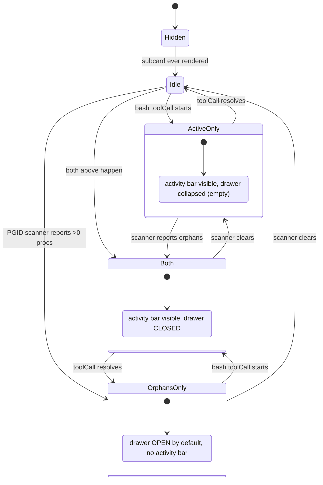

## Context

Explored 2026-05-29 in an explore-mode session. The conversation worked through three candidate shapes for redesigning the PROCESS subcard:

- **Shape A** — replace ProcessList entirely with an activity bar. Lose orphan-process safety net.
- **Shape B** — activity bar on top + collapsible orphan drawer below. Selected.
- **Shape C** — keep one list, just mark which row is the active toolCall. Cheapest, doesn't actually fix the semantic conflation.

Shape B was picked because it keeps the runaway-dev-server safety net while elevating the "stop what the agent is doing" verb to its own surface with the right backing action (`abortToolCall`, not `killProcess(pgid)`).

## Decisions

### Decision 1: Activity bar shows `bash` only (not all tool types)

Other tool types (`read`, `write`, `interactiveUi`) either complete fast enough that an indicator would flash, or they're already represented elsewhere (interactiveUi has its own card). `bash` is the only tool type with sustained, abortable wall-clock duration.

**Tradeoff:** if pi later adds long-running non-bash tools (e.g. agent-run, file-watcher), they're invisible to the activity bar. Acceptable; revisit when that's a real tool type.

### Decision 2: Stop button calls `abortToolCall`, NOT `killProcess(pgid)`

These are two different verbs with two different downstream effects:

| Verb | Target | Side effect |
|---|---|---|
| `killProcess(pgid)` | OS process tree | Agent's tool call hangs waiting → eventually returns failure → next turn sees "process killed" |
| `abortToolCall(toolCallId)` | Agent's pending tool | Tool returns "aborted" cleanly → agent's next turn proceeds normally |

The activity bar's `[⏹]` calls the abort path. The drawer's per-row `✕` stays as PGID kill. They are intentionally not the same button.

**Caveat:** if the abort path doesn't actually kill the child process (open question #1), aborting leaks an orphan into the drawer. Phase 1 documents this as a known issue; Phase 2 closes it.

### Decision 3: No skeleton-row padding on the drawer

Today's `ProcessList` pads to `MIN_SLOTS=5` invisible rows when non-empty, to prevent card-footer bounce. With the activity bar always present as the stable surface (or stably absent when no tools running), the drawer's height bouncing 0→3 rows is acceptable. Remove `MIN_SLOTS`.

Stable surface argument: the activity bar's appearance/disappearance correlates with user attention (you started a bash → row appears; bash finished → row goes away). Card-height changes that track user-initiated state are not disorienting in the way that PGID-scanner churn was.

### Decision 4: Drawer default state is contextual

```
   activity bar empty + drawer non-empty   →  drawer OPEN     (only signal in the card)
   activity bar non-empty                  →  drawer CLOSED   (focus on active tool)
   user toggle                             →  remembered per-session in client state
```

Per-session memory because closing the drawer once shouldn't reopen it every time a bash finishes.

### Decision 5: Mobile uses count chip, not full drawer

Mobile vertical budget is tight. Activity bar rows render full-width (same as desktop). Drawer becomes a tap target: `⚠2` chip next to the activity bar, opens a sheet with the full background list. Sheet content reuses the drawer's row template.

### Decision 6: Multi-bash cap = 2 visible rows

Recent session traces (informal — to verify during task 0) suggest concurrent bash tools in pi are rare (≤2 in 95% of cases). N=2 visible, then `+N more ⏵` chip. Chip taps to open a sheet showing the rest.

If task-0 trace inspection shows ≥3 is common, raise to 3.

### Decision 7: Phase-split the PGID-dedup work

Honest dedup between activity-bar rows and drawer rows requires the bridge to tag each `bash` toolCall with the PGID it spawned. That touches the wire protocol and the extension. Splitting it off Phase 1 keeps this change tight and unblockable:

- **Phase 1 (this change):** all UI work. Drawer may show a row that's also in the activity bar. Documented.
- **Phase 2 (separate change):** bridge tags toolCalls with PGIDs; drawer filters them out.

Linking the two via a follow-up note in this proposal's archive.

## Open Threads (resolved)

**Status:** resolved during task 0 of the implementation pass.

- **Q1 — `abortToolCall` reaps child PGID?** Inconclusive — no live pi session available in the implementation context for the spike. Implementation proceeds; the proposal already documents the known cosmetic issue (active bash may appear in both rows). Phase 2 closes it with PGID-on-toolCall wiring.
- **Q2 — per-toolCall abort wire?** **(b) Only session-level abort exists.** `packages/shared/src/browser-protocol.ts` defines `AbortToBrowserMessage { type: "abort"; sessionId }` — no `toolCallId` discriminator. Activity bar's `[⏹]` invokes `handleAbort()` (session-level), wired from `useSessionActions.handleAbort` already plumbed through `App.tsx`. Heavier hammer than the design's ideal, but still semantically correct: stops the agent's current activity rather than killing an OS process tree. Documented as a known limitation; Phase 2 may add a per-toolCall abort message.
- **Q3 — concurrent-bash cap?** No dashboard-event jsonl traces available in this environment (`~/.pi/dashboard/sessions/*.jsonl` empty). Default N=2 kept per Decision 6.

## Open Threads (original)

### Q1 — Does `abortToolCall` reap the child PGID?

Spike: in a running pi session, fire a long bash (`sleep 60`), then abort the toolCall via whatever channel currently exists. Observe with `ps`: does the `sleep` process disappear, or does it sit there until the bridge's scanner reports it?

If reaped → Phase 2's dedup work removes the row automatically once the PGID stops appearing in `ps`.
If not reaped → the activity bar's stop button is a half-measure that always leaks an orphan. Phase 1 still ships (correct verb wins UX), but the proposal needs a known-issue note.

### Q2 — Per-toolCall abort wire

Audit `packages/shared/src/browser-protocol.ts` for an existing per-toolCall abort message. Three possible findings:

- **(a) Exists.** Reuse, done.
- **(b) Only session-level abort exists.** The `[⏹]` becomes a heavy hammer (kills the whole agent run). Possibly still better than today's PGID kill — but design.md should weigh this explicitly before code.
- **(c) Neither exists.** This proposal grows to include a new protocol message. Re-scope.

### Q3 — Real concurrent-bash count

Grep `~/.pi/dashboard/sessions/*.jsonl` for sessions with overlapping bash `toolCall` / `toolResult` windows. If the 95th percentile is 1, N=2 is conservative-enough. If it's 3, raise.

## Mermaid: state machine for the PROCESS subcard



## Risks

- **Visual regression on the PROCESS subcard.** Existing screenshots and tests in `SessionCard.test.tsx` likely snapshot the old layout. Update snapshots explicitly; reviewer can confirm the diff matches Shape B.
- **Abort path discoverability.** Users used to clicking ✕ to kill PGIDs may not realize `[⏹]` does something different. Tooltip on `[⏹]`: `"Stop this tool (lets the agent continue)"`. Tooltip on drawer `✕`: `"Force-kill process tree"`.
- **Phase 1 known issue (active bash appears in both rows) leaking into reviewer expectations.** Document prominently in proposal.md (done) and in the activity bar component's docstring.
